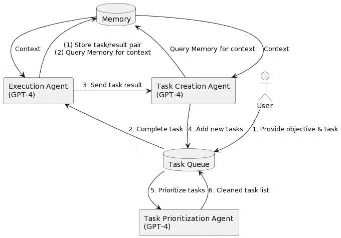

# 为什么你需要了解自主 AI 代理

> 原文：[`www.kdnuggets.com/2023/06/need-know-autonomous-ai-agents.html`](https://www.kdnuggets.com/2023/06/need-know-autonomous-ai-agents.html)

图片由 Bing 图像生成器提供

让我们从显而易见的开始——AI。人工智能是计算机使用数据、机器学习等来执行通常由人类完成的任务的能力。你可以使用 AI 创建内容、回答问题和生成逼真的艺术作品。

* * *

## 我们的三大课程推荐

 1\. [谷歌网络安全证书](https://www.kdnuggets.com/google-cybersecurity) - 快速进入网络安全职业的快车道。

 2\. [谷歌数据分析专业证书](https://www.kdnuggets.com/google-data-analytics) - 提升你的数据分析技能

 3\. [谷歌 IT 支持专业证书](https://www.kdnuggets.com/google-itsupport) - 支持你的组织 IT 工作

* * *

但对于很多这些 AI 系统，你需要指示它们该做什么。但是，如果你不想提出指示，而希望你的 AI 系统能够基本上自行思考呢？

好吧，你可以使用自主 AI 代理。

# 什么是自主 AI 代理？

自主代理由 AI 驱动，当给出一个目标时，它们可以自行创建、优先排序和完成任务。这是通过自我指导的指令在每次迭代中循环运行来实现的。

你可以使用自主 AI 代理来管理你的社交媒体账户，创建工作待办事项列表，甚至写书。它们现在是最热门的话题，人们想了解更多。它们正在迅速发展，我们应该期待更多的新发布。

听起来很疯狂，对吧？但只要给出一个目标，自主 AI 代理就能为你做剩下的事情。它是另一个员工、队友甚至朋友。

我们已经见过一些自主 AI 代理，如 AutoGPT 和 BabyAGI。

这是否是人工通用智能（AGI）的开始，即计算机程序可以以与人类相同的能力执行任何智力任务？

## 自主 AI 代理能做些什么？

只要给出一个目标，自主 AI 代理就可以完成任何数字任务，例如：

+   内容创作

+   个人助理

+   个人财务管理

+   研究和数据分析

+   访问大型语言模型（LLM）工具，如 GPT

+   访问网络，

+   以及更多。

## 自主 AI 代理如何工作？

自主 AI 代理正在变得越来越受欢迎，越来越多的人对理解这些 AI 代理是如何构建的框架产生兴趣。那么，成功的自主 AI 代理需要哪些主要元素？

### 知识

AI 系统的知识库非常重要。它们不仅需要对训练数据有黄金标准般的知识，还必须能够从各种来源收集和解释数据。

### 记忆

像我们人类一样，拥有资源并了解它们是很好的——但你能记住吗？一个自主 AI 代理不仅需要学习新数据的能力，还需要能够回忆过去的经历。

### 学习

所以你有知识和记忆，但你真的在学习你需要学习的东西吗？

自主 AI 代理使用强化学习等技术——这是一种涉及模型训练及其产生决策序列以最大化累积奖励概念的机器学习类型。使用强化学习使模型能够通过反馈来改进，优化策略，并通过试错法产生成功的输出。

改善自主 AI 代理学习的另一种方法是与其他系统和用户进行沟通，以提供信息交流和协作。浏览外部来源，如数据库，也通过提供知识资源来增强学习过程，以帮助自主 AI 代理在决策过程中。

### 决策制定

当你拥有良好的知识库和记忆时，这有助于你的决策过程。对于自主 AI 代理来说，决策需要系统分析数据，回顾记忆，权衡不同选项，并选择最适合用户目标的行动。

另一个需要考虑的因素是，自主 AI 代理可能会被促使制定详细的行动计划，这需要大量的规划——这是在执行决策过程之前至关重要的。

为了更好地理解自主 AI 代理的框架，让我们分解下面的图像：

图片由[Yohei](https://twitter.com/yoheinakajima/status/1640934493489070080/photo/1)提供（Baby AGI 的创建者）

上面的系统图分为 6 个步骤，这些步骤在一个无限循环中运行：

1.  用户提供**目标/任务**。

1.  这接着进入任务队列，然后传递到‘**执行代理**’中储存于‘**内存**’中。目标/任务现在已储存在内存中。

1.  目标/任务接着添加**上下文**（回忆过去的经验和知识库），然后发送到‘**执行代理**’，该代理将任务结果发送到‘**任务创建代理**’。

1.  任务现在已创建并添加到‘**任务队列**’中。

1.  任务将必须通过‘**任务优先级代理**’来在其他任务中获得优先级。

1.  最后一步是在‘**任务优先级代理**’阶段，代理清理任务列表。

# 为什么自主代理很重要？

几个月前，ChatGPT 发布了，我们看到很多人开始使用它。企业正在采纳它，并寻找将其整合到操作中的新方法。开发者们对插件着迷。这表明 AI 系统正在成为生态系统的重要组成部分。

对一些人来说，这可能看起来像是一个短暂的事情。然而，科技界正在获得大量投资，并以快速的速度增长以保持势头。人工智能在我们日常生活中的进步和应用比我们想象的要近得多。

我们生活在一个快节奏的数字环境中，自主 AI 代理有潜力提高不同产业的生产力和运营。这将使企业能够更高效地运作，同时仍能保持竞争力。

自主 AI 代理不像人类。它们不需要睡眠、午休等。它们可以全天候编程，以确保有效的生产、更快的结果，并减少当前员工的繁重任务工作量。

企业将开始看到劳动力成本的削减、员工生产力的提升以及效率策略的增强。然而，我们理解，自主 AI 代理的增加将导致涉及繁重重复任务的行业，如制造业的工作流失。

你会自然地看到涉及创造力、先进问题解决和创新思维的工作需求增加。还有数据分析、数据伦理和 AI 系统监控等角色，这些角色将被要求监控基于 AI 的系统。

# 总结

现在不再是自主 AI 代理是否会被组织采纳的问题，它正在发生。这是一个了解何时全面生效的问题。

那么你将要做什么？

1.  想要创建其他人可以雇用的自主代理吗？

1.  或者雇佣自主代理来提升生产力和个人生活？

我希望这篇文章已经教会你一些关于你对自主 AI 代理的期望以及它们将如何塑造我们未来的知识。如果你发现了任何关于自主 AI 代理的有趣新闻，请在下面留下评论！

**[尼莎·阿雅](https://www.linkedin.com/in/nisha-arya-ahmed/)** 是一名数据科学家、自由技术作家和 KDnuggets 的社区经理。她特别感兴趣于提供数据科学职业建议或教程以及数据科学的理论知识。她还希望探索人工智能如何/可以有利于人类生命的长寿。作为一个热衷学习者，她寻求拓宽她的技术知识和写作技能，同时帮助指导他人。

### 更多关于这个话题

+   [AgentGPT: 浏览器中的自主 AI 代理](https://www.kdnuggets.com/2023/06/agentgpt-autonomous-ai-agents-browser.html)

+   [LLM 基础的自主代理背后的增长](https://www.kdnuggets.com/the-growth-behind-llmbased-autonomous-agents)

+   [你需要知道的关于数据管理的 6 件事及其重要性…](https://www.kdnuggets.com/2022/05/6-things-need-know-data-management-matters-computer-vision.html)

+   [KDnuggets 新闻，4 月 13 日：数据科学家应关注的 Python 库…](https://www.kdnuggets.com/2022/n15.html)

+   [Baby AGI: 完全自主 AI 的诞生](https://www.kdnuggets.com/2023/04/baby-agi-birth-fully-autonomous-ai.html)

+   [将人类和 AI 代理结合起来，提升客户体验](https://www.kdnuggets.com/2024/06/softweb/bringing-human-and-ai-agents-together-for-enhanced-customer-experience)
