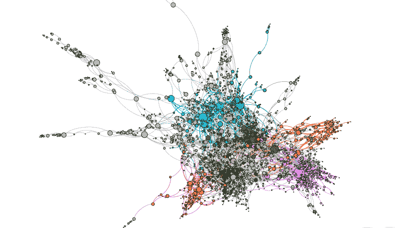
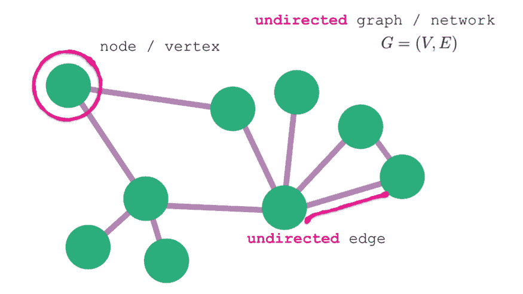
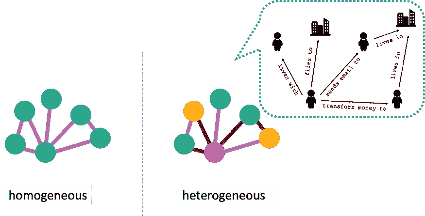
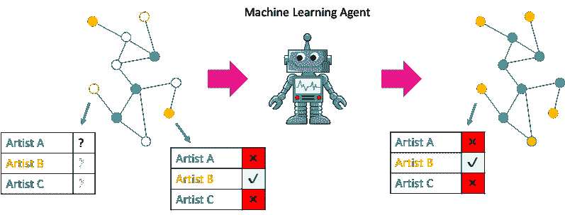
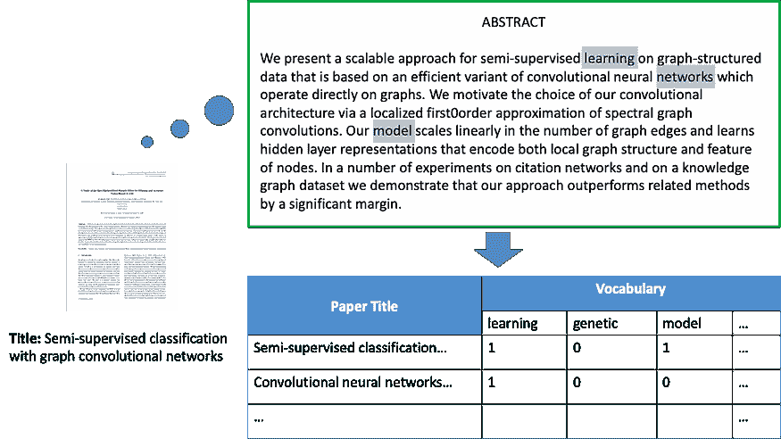
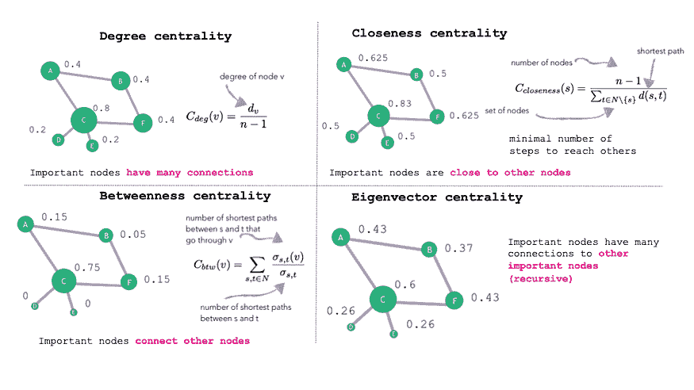
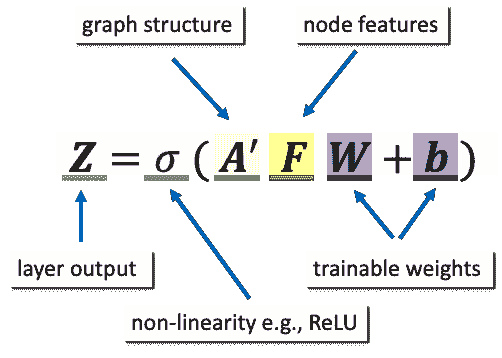

# 了解你的邻居：图上的机器学习

> 原文：[`www.kdnuggets.com/2019/08/neighbours-machine-learning-graphs.html`](https://www.kdnuggets.com/2019/08/neighbours-machine-learning-graphs.html)

评论

**作者：[Pantelis Elinas](https://medium.com/@pantelis.elinas)，高级机器学习研究工程师。**

我们生活在一个互联的世界中，生成大量的连接数据。社交网络、金融交易系统、生物网络、交通系统和电信网络都是例子。图 1 所示的论文引用网络是连接数据的另一个例子。

*图 1：论文引用网络的可视化。节点代表研究论文，而边表示论文之间的引用，各种颜色表示报告的主题，七种颜色编码七个主题。*

表示连接数据可以使用计算机科学中常用的[图数据结构](https://en.wikipedia.org/wiki/Graph_(abstract_data_type))。

在本文中，我们将介绍各种类型的连接数据，它们表示什么，以及我们可以解决的挑战。我们还介绍图卷积网络（GCNs）。以 GCN 为例，本文还将解释现代机器学习方法如何构建连接数据的预测模型。

### 网络的定义和类型

图数据结构有两个基本元素：节点和边（见下图 2）。节点表示数据中的实体，例如在线社交网络的成员，而边表示这些实体之间的关系，例如社交网络成员之间的友谊。节点和边的网络构成了一个图——数据网络结构的数学表示。

*图 2：图的基本组件（在此情况下为无向图）是节点和边。*

图中的节点和边可以选择性地具有类型。具有单一类型的节点和单一类型的边的图称为同质图。一个同质图的例子是一个在线社交网络，其中节点代表人，边代表友谊，节点和边的类型始终相同。另一方面，具有两种或更多类型的节点和/或两种或更多类型的边的图称为异质图。一个例子是在线社交网络，其中的边有不同的类型，比如‘友谊’和‘同事’，节点的类型是‘人’（见下图 3）。

*图 3：两种类型图的图示表示，同质图（左）和异质图（右）。异质图（黑白图）具有两种不同类型的节点，人和城市，通过四种不同类型的边连接。*

图的节点和边还可以包含称为属性或特征的属性。以在线社交网络为例，表示一个人的节点，即人节点，可能具有年龄、薪水、爱好和位置等属性。类似地，两个人人节点之间的边缘可能具有一个日期属性，用于确定在线关系开始的时间，或一个权重属性，反映关系的强度。

我们还可以根据图是静态还是动态来对图进行分类。顾名思义，静态图不会随着时间变化，而动态图会随时间改变其结构，添加和删除节点和边，或改变属性和特征（例如，节点属性可以是时间序列），或两者兼有。

### 我们可以从图中学到什么？

给定一个连通数据集，我们可以解决什么类型的问题，或者换句话说，我们可以回答什么类型的查询？我们可以将连通数据可以解决的问题大致分为四类：

+   节点分类

+   链接预测

+   社区检测

+   图分类

还有其他图问题不一定适合这四类，例如旅行推销员问题。然而，对于本文，我们将专注于上述四类，因为图机器学习是解决这些问题的绝佳工具。

**节点分类**，也称为**节点属性推断**，是根据网络中其他节点的属性值来推断某些节点的缺失或不完整属性值的问题。与其他机器学习方法相比，其优势在于节点属性推断使你能够将上下文和邻域信息纳入你的预测。例如，在在线社交网络中，我们可能会对预测用户朋友网络的音乐偏好感兴趣（见下图 4）。*

*图 4：一个节点分类问题的示例，推断在线社交网络成员的音乐偏好。*

**链接预测**，*另一个对网络结构数据集非常重要的问题，是推断缺失或寻找实体之间隐藏关系的问题。我们可能会对预测缺失的关系感兴趣，因为在数据收集期间某些关系对我们是隐藏的。或者，我们可能会对预测网络结构在未来如何通过插入或删除链接而演变感兴趣，给定其当前时刻的快照。链接预测是我们每天使用的算法，因为它通常是推荐系统背后的算法。例如，在在线社交网络中，我们可以使用链接预测向成员推荐新朋友。另一个例子是为内容提供商或电子商务网站进行产品推荐。*

**社区检测** 推断基于图结构、节点属性的相似性或两者的节点社区或簇。社区检测有许多应用，[1]。一个例子是将社交网络的用户根据他们的爱好划分为社区，而无需明确询问每个用户是否对该主题感兴趣。相反，算法使用来自个人频繁互动的人的数据来回答例如“你喜欢虚构还是非虚构？”这样的话题问题。这种分段可以用来根据社区成员的共同特征提供定向广告。

**图分类** 是区分不同类别图的问题。举例来说，考虑将化学化合物表示为图；在这种情况下，节点是原子，边是原子之间的键。给定一组每个都表示为图的化学化合物，我们想预测一个化合物是否具有抗癌性。这是一个图分类问题，[2]。

### 使用图卷积网络的节点分类示例

在本文的其余部分，我们将演示如何将图机器学习应用于解决同质图中的节点分类问题。在后续的文章中，我们将考虑最先进的链接预测和社区检测方法。

我们的数据集是被称为 [Cora](https://relational.fit.cvut.cz/dataset/CORA) 的论文引文网络，其中图节点代表研究论文，边代表论文之间的引文关系。如果一篇论文引用了另一篇论文，那么这两篇论文之间就有一条边。尽管引文是有向的，但为了本教程的目的，我们将对应的边视为无向。

每篇论文都有一个相关的特征向量，用于编码论文中使用的词汇信息。每篇论文的特征向量包含 1433 个二进制元素，编码了从整个语料库中提取的 1433 个关键词的存在（编码为 1）或不存在（编码为 0）。

图 5 演示了用于 Cora 中两篇论文的 [词袋模型 (BoW)](https://en.wikipedia.org/wiki/Bag-of-words_model)。每篇论文还有一个表示论文*主题*的属性。每篇论文有七种主题之一，如神经网络、概率论、理论等。数据集包含 2708 篇论文（节点）和 5429 个引文（边）。

*图 5: 词袋模型 (BoW) 与 Cora 引文数据集中一个节点相关的特征。*

我们的目标是训练一个预测模型，以推断在训练过程中对机器学习算法隐藏的论文主题。由于*主题*是七个类别的分类问题，因此这是一个多类别节点分类问题。

作为基线方法，我们可以使用传统的机器学习方法来解决这个问题，忽略论文之间的关系。我们可以将节点的特征向量堆叠成一个二维数组**F**，即*设计矩阵*，其维度为 2708x1433，然后在数据的子集上训练分类器，如逻辑回归、神经网络或随机森林。我们可以使用剩余的数据来评估分类器作为验证集和测试集。

这种方法，通过捕捉论文中使用的词汇与其*主题*之间的关系，效果相当不错。训练仅 140 个样本（每类 20 个训练样本）的 2 层[多层感知器](https://en.wikipedia.org/wiki/Multilayer_perceptron)（MLP）据报道在测试中达到了约 55%的准确率，[3]。

然而，上述方法忽略了论文之间的引用关系。我们可能会认为这些关系提供了有关论文*主题*的额外信息，因为我们可以预期一篇论文会引用其他具有相同主题的论文。我们如何利用这些信息？

一种方法是使用手动特征工程，通过图相关的节点特征来增强基于词汇的特征向量。例如，有大量文献讨论如何计算图中节点结构位置的定量值。一个直接的结构性节点特征是节点在图中的邻居数量（节点的度）。其他有用的结构性节点特征包括 PageRank，[4]和各种中心性度量。有关中心性度量的示例，请参见图 6。

*图 6：可以用于图机器学习中的手动特征工程的常见中心性度量示例。*

手动特征工程被认为是成功的，并且多年来被广泛应用。然而，从深度学习和卷积神经网络的成功经验中，我们了解到，这些算法擅长*自动*学习能够最大化下游任务性能的基本特征。不幸的是，“传统”的神经网络和卷积神经网络算法不能直接利用关系数据。

尽管如此，研究人员最近提出了图神经网络算法，这些算法可以在训练图上的神经网络模型时利用关系信息。在这些图神经网络算法中，图卷积网络（GCN）[3]是最成功且易于理解的之一。在这篇文章中，我们将应用 GCN 模型到我们预测引用网络中论文主题的工作示例中。我们从简要描述 GCN 架构开始。

GCN 作者引入了一种新的神经网络层类型，称为图卷积层。GCN 层的结构如图 7 所示。该层具有可训练参数：权重矩阵**W**和偏置向量**b**；其输入是节点特征矩阵**F**和归一化的图邻接矩阵**A'**。

*图 7：图卷积神经网络（GCN）层的基本定义。*

归一化的邻接矩阵编码了图结构，通过与设计矩阵相乘，有效地平滑了节点的特征向量，基于其在图中的直接邻居。**A'**被归一化，以使每个邻接节点的贡献与该节点在图中的连接程度成正比。

该层的定义通过对**A'FW+b**应用逐元素非线性函数（如 ReLu）来完成。该层的输出矩阵**Z**可以用作另一个 GCN 层或任何其他类型神经网络层的输入，从而允许创建深度神经网络架构，能够学习用于下游节点分类任务的复杂节点特征层次结构。

在 Cora 数据集上训练一个 2 层 GCN 模型（通过[this script](https://github.com/stellargraph/stellargraph/blob/develop/demos/node-classification/gcn/gcn-cora-example.py)使用我们开源的 Python 库[StellarGraph](https://github.com/stellargraph/stellargraph)），每层 32 个输出单元，并且模型只见到 140 个训练节点标签，相较于基线 2 层 MLP，分类准确率显著提高。在对一组留出的论文测试集进行预测时，准确率提高至大约 81%——比仅使用 BoW 节点特征并忽略论文之间引用关系的 MLP 提高了 21%。这清楚地表明，至少对于某些数据集，利用数据中的关系信息可以显著提升预测任务的性能。

节点分类只是图机器学习的一小部分，但它是一种非常强大的方法，可以帮助处理连接的数据。如果你想了解更多关于图机器学习的信息，请通过[这里](https://www.stellargraph.io/about-us)联系我们，如果你想尝试节点分类或其他图机器学习算法，可以下载我们开源的 Python 库[StellarGraph](https://github.com/stellargraph/stellargraph)。你可以通过学习[StellarGraph 演示](https://github.com/stellargraph/stellargraph/tree/develop/demos)来深入了解图机器学习，并在我们的[论坛](https://community.stellargraph.io/)上提出任何问题！

*此项工作得到了[*CSIRO 的 Data61*](https://www.data61.csiro.au/)的支持，这是澳大利亚领先的数字研究网络。*

**参考文献：**

1.  Fortunato, S. (2010). “[图中的社区检测](https://arxiv.org/pdf/0906.0612.pdf)”，《物理学报告》，486(3–5)，75–174。

1.  Wale, I. A. Watson 和 G. Karypis，“[化学化合物检索和分类的描述符空间比较](https://link.springer.com/content/pdf/10.1007/s10115-007-0103-5.pdf)”，《知识与信息系统》，第 14 卷，第 3 期，第 347–375 页，2008 年。

1.  Kipf, T. N., & Welling, M. (2016). “[图卷积网络的半监督分类](https://arxiv.org/pdf/1609.02907.pdf)”，arXiv 预印本 arXiv:1609.02907。

1.  Brin, S., & Page, L. (1998). “[大规模超文本 Web 搜索引擎的构造](https://storage.googleapis.com/pub-tools-public-publication-data/pdf/334.pdf)”，《计算机网络与 ISDN 系统》，30(1–7)，107–117。

**个人简介：[Pantelis Elinas](https://medium.com/@pantelis.elinas)** 是高级机器学习研究工程师。他喜欢解决有趣的问题、分享知识以及开发有用的软件工具。

[原文](https://medium.com/stellargraph/knowing-your-neighbours-machine-learning-on-graphs-9b7c3d0d5896)。已获授权转载。

**相关：**

+   [图是数据科学的下一前沿](https://www.kdnuggets.com/2018/10/graphs-next-frontier-data-science.html)

+   [机器学习与深度链接图分析：强大的组合](https://www.kdnuggets.com/2019/04/machine-learning-graph-analytics.html)

+   [使用大数据进行图分析](https://www.kdnuggets.com/2017/12/graph-analytics-using-big-data.html)

* * *

## 我们的前三个课程推荐

 1\. [谷歌网络安全证书](https://www.kdnuggets.com/google-cybersecurity) - 快速进入网络安全职业生涯。

 2\. [谷歌数据分析专业证书](https://www.kdnuggets.com/google-data-analytics) - 提升您的数据分析技能

 3\. [谷歌 IT 支持专业证书](https://www.kdnuggets.com/google-itsupport) - 支持您的组织在 IT 领域

* * *

### 更多相关主题

+   [停止学习数据科学以寻找目标，并寻找目标以…](https://www.kdnuggets.com/2021/12/stop-learning-data-science-find-purpose.html)

+   [数据科学学习统计学的最佳资源](https://www.kdnuggets.com/2021/12/springboard-top-resources-learn-data-science-statistics.html)

+   [2021 年最佳 ETL 工具](https://www.kdnuggets.com/2021/12/mozart-best-etl-tools-2021.html)

+   [成为优秀数据科学家所需的 5 项关键技能](https://www.kdnuggets.com/2021/12/5-key-skills-needed-become-great-data-scientist.html)

+   [每位初学者数据科学家应掌握的 6 种预测模型](https://www.kdnuggets.com/2021/12/6-predictive-models-every-beginner-data-scientist-master.html)

+   [一个 90 亿美元的 AI 失败，深度分析](https://www.kdnuggets.com/2021/12/9b-ai-failure-examined.html)
