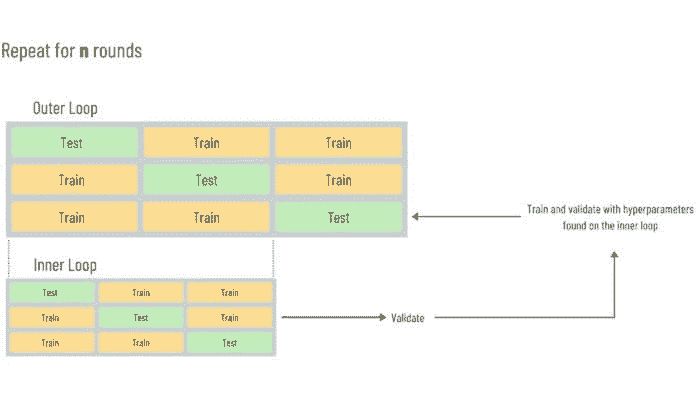
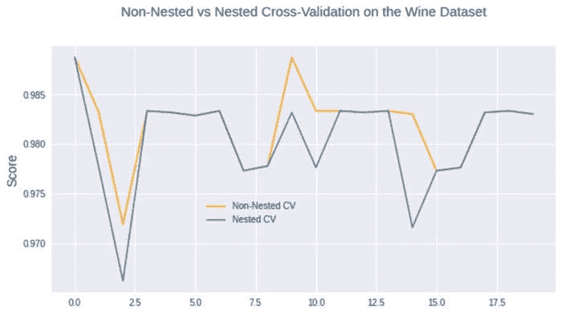

# 关键机器学习技术：嵌套交叉验证，为什么以及如何使用 Python 代码

> 原文：[`www.kdnuggets.com/2020/10/nested-cross-validation-python.html`](https://www.kdnuggets.com/2020/10/nested-cross-validation-python.html)

评论

**由 [奥马尔·马丁内斯](https://www.linkedin.com/in/omarmartinez182/)，Arcalea**。

在这篇文章中，我们将简要讨论并实施一种技术，从宏观角度来看，这种技术可能没有得到应有的关注。前述陈述源于观察到某些模型在生产中的表现往往低于模型构建阶段的表现。尽管这种问题有许多潜在的罪魁祸首，但一个常见的原因可能在于模型选择过程。

* * *

## 我们的三大推荐课程

 1\. [Google 网络安全证书](https://www.kdnuggets.com/google-cybersecurity) - 快速进入网络安全职业生涯。

 2\. [Google 数据分析专业证书](https://www.kdnuggets.com/google-data-analytics) - 提升你的数据分析能力

 3\. [Google IT 支持专业证书](https://www.kdnuggets.com/google-itsupport) - 支持你的组织的 IT。

* * *

标准模型选择过程通常包括一个超参数优化阶段，在此阶段，通过使用验证技术，如 k 折交叉验证（CV），将根据验证测试结果选择一个“最佳”模型。然而，这一过程容易受到一种选择偏差的影响，使其在许多应用中不可靠。Gavin Cawley 和 Nicola Talbot 的论文中详细讨论了这一点，其中包含以下重要信息：

> *“在机器学习研究中，偶尔会观察到一种偏差的评估协议，即使用所有可用数据进行初步模型选择步骤，这通常作为“初步研究”的一部分进行互动操作。然后，这些数据被反复重新划分，形成一个或多个随机、互不重叠的设计和测试集。这些集随后用于使用相同的固定超参数值进行性能评估。这个做法乍看似乎无害，但测试数据不再是统计上的纯净数据，因为它们已经被模型在调整超参数时“看到过”。”*
> 
> - [关于模型选择中的过拟合及其在性能评估中的后续选择偏差](https://jmlr.csail.mit.edu/papers/volume11/cawley10a/cawley10a.pdf)，2010 年。

为了说明为什么会发生这种情况，让我们用一个例子。假设我们正在进行一个机器学习任务，在其中我们基于*n*轮超参数优化选择一个模型，我们通过使用网格搜索和交叉验证来完成这项工作。现在，如果我们在每次*n*次迭代中使用相同的训练和测试数据，这意味着测试集上的性能信息通过超参数的选择被纳入训练数据。在每次迭代中，这些信息可以被过程利用以找到性能最佳的超参数，这会导致测试数据集不再纯净，无法用于性能评估。如果*n*很大，那么我们可能会将测试集视为一个次级训练集（宽泛地说）。

好消息是，有一些技巧可以帮助我们解决这个问题。其中一种方法是拥有一个训练集、一个测试集，以及一个验证集，然后根据验证集上的表现调整超参数。

另一种策略，也是本文的重点，是**嵌套交叉验证**，它与上文所提论文中的一种解决方案相吻合，通过将超参数优化视为模型拟合的一部分，并用不同的验证集来评估它，这个验证集是外层交叉验证的一部分。

简而言之，拟合，包括超参数的拟合，这本身包括一个内部交叉验证过程，就像模型过程中的其他部分一样，并不是用于评估特定拟合方法的模型性能的工具。要评估性能，你需要使用外部交叉验证过程。实际上，你可以让网格搜索（或任何其他优化工具）处理内部交叉验证，然后使用 cross_val_score 来估计外部循环中的泛化误差。因此，最终分数将通过对多个拆分的测试集分数进行平均，作为常规的交叉验证过程。

这是该方法的简化概述。这个示例在技术上并不严格，但旨在提供整个过程的直观理解。



*嵌套交叉验证过程的简化示意图。*

### Python 中的嵌套交叉验证

在 python 中实现嵌套交叉验证，多亏了[scikit-learn](https://scikit-learn.org/)，相对来说比较简单。

让我们来看一个例子。我们将从加载[葡萄酒数据集](https://scikit-learn.org/stable/modules/generated/sklearn.datasets.load_wine.html#sklearn.datasets.load_wine)开始，使用来自 sklearn.datasets 的所有必要模块。

现在，我们开始实例化分类器，然后指定我们希望运行的轮数/试验次数，换句话说，就是我们将进行多少次完整的内外循环过程。由于这是计算上昂贵的，我们仅仅为了演示目的，所以选择 20 轮。请记住，轮数表示你将如何在每个交叉验证过程中以不同的方式拆分数据集。

下一步是创建一个字典，以建立我们在每轮中将要探索的超参数空间，同时创建两个空数组以存储来自嵌套和非嵌套过程的结果。

下一步非常重要，我们将创建一个循环，该循环将迭代我们指定的轮数，并且包含两个不同的交叉验证对象。

对于这个例子，我们将对外部和内部循环都使用 5 折交叉验证，并且使用每轮（i）的值作为两个交叉验证对象的`random_state`。

然后，我们开始创建和配置对象以进行超参数优化。在这个例子中，我们将使用网格搜索。请注意，我们将`'inner_cv'`对象作为交叉验证方法传递给网格搜索。

随后，请注意，对于“嵌套”交叉验证过程的最终得分，我们使用`cross_val_score`函数，并将分类器对象`'clf'`（包括其自己的交叉验证过程）传递给它，这个对象就是我们用于进行超参数优化的对象，同时也传递`'outer_cv'`交叉验证对象。在此过程中，我们还会拟合数据，然后将每个过程的结果存储在我们之前创建的空数组中。

我们现在可以计算“简单”交叉验证和嵌套交叉验证过程中的准确率得分差异，以查看它们之间的平均不一致程度。

在这种情况下，嵌套交叉验证得分指的是嵌套过程的得分（不要与内部交叉验证过程混淆），我们将其与常规过程（非嵌套）的得分进行比较。

**输出：**

```py
Avg. difference of 0.001698 with std. dev. of 0.003162.

```

如我们所见，非嵌套得分的平均值更为乐观。因此，单纯依赖该过程的信息可能会导致模型选择的偏差。

我们还可以绘制每次迭代的得分，并创建一个图表以获取两种过程表现的可视化比较。

**输出：**



最后，我们还可以绘制每一轮两个交叉验证过程的差异。

**输出：**


### 最后的思考

虽然交叉验证是评估泛化能力的行业标准，但重要的是要考虑手头的问题，并可能实施更严格的过程，以避免在选择最终模型时出现选择偏差。从个人经验来看，当处理小数据集且系统用于支持非平凡决策时，这一点尤为重要。

嵌套交叉验证并不是一个完美的过程，它是**计算上昂贵**的，并且绝对不是生产中模型表现差的灵丹妙药。然而，在大多数情况下，这个过程将使你对每个模型的泛化能力有一个更现实的了解。

你可以在[GitHub](https://github.com/omartinez182/data-science-notebooks/blob/master/Nested_Cross_Validation_in_Python.ipynb)上找到包含本文所有代码的笔记本。

**简介：** [爱德华多·马丁内斯](https://www.linkedin.com/in/omarmartinez182/)是一个拥有商业分析学研究生学位的市场营销人员。目前在[Arcalea](https://arcalea.com/)工作，爱德华多将数据科学框架与营销流程整合在一起。

**相关：**

+   [如何（以及为什么）创建一个好的验证集](https://www.kdnuggets.com/2017/11/create-good-validation-set.html)

+   [你应该在数据科学项目中使用交叉验证的 5 个理由](https://www.kdnuggets.com/2018/10/5-reasons-cross-validation-data-science-projects.html)

+   [使用交叉验证构建可靠的机器学习模型](https://www.kdnuggets.com/2018/08/building-reliable-machine-learning-models-cross-validation.html)

### 相关阅读

+   [在 Prompt 工程中的并行处理：思维骨架...](https://www.kdnuggets.com/parallel-processing-in-prompt-engineering-the-skeleton-of-thought-technique)

+   [AI、分析、机器学习、数据科学、深度学习等](https://www.kdnuggets.com/2021/12/developments-predictions-ai-machine-learning-data-science-research.html)

+   [宣布 PyCaret 3.0：开源、低代码 Python 机器学习](https://www.kdnuggets.com/2023/03/announcing-pycaret-30-opensource-lowcode-machine-learning-python.html)

+   [优化 Python 代码性能：深入了解 Python 分析工具](https://www.kdnuggets.com/2023/02/optimizing-python-code-performance-deep-dive-python-profilers.html)

+   [2021 年主要进展和 2022 年 AI、数据科学等关键趋势](https://www.kdnuggets.com/2021/12/trends-ai-data-science-ml-technology.html)

+   [2022 年数据科学、机器学习、AI 和分析的关键进展](https://www.kdnuggets.com/2022/12/key-data-science-machine-learning-ai-analytics-developments-2022.html)
