# 神经网络——一种直观理解

> 原文：[`www.kdnuggets.com/2019/02/neural-networks-intuition.html`](https://www.kdnuggets.com/2019/02/neural-networks-intuition.html)

 评论

**由[Prateek Karkare](https://www.linkedin.com/in/prateek-karkare-09622a27/)，南洋理工大学研究助理**。

人类一直对自然充满了好奇。鸟类的飞行促使我们发明了飞机；鲨鱼皮肤启发我们制作了更快的泳衣以及许多其他从自然中汲取灵感的机器。今天我们正处于构建智能机器的时代，而大脑无疑是最好的灵感来源。人类特别被进化赋予了一个能够执行最复杂任务的大脑。

自 1940 年代初以来，科学家们一直在尝试构建数学模型和算法，以模拟大脑内部的计算。尽管我们仍然离大脑所能实现的壮举有很长的距离，但我们正在逐步接近。

在追求制造智能机器的过程中，提出了几个简化的学习模型，其中最流行的是人工神经网络（ANN），或简称神经网络。神经网络是当前机器学习和人工智能领域中最强大的算法之一。顾名思义，它汲取了我们大脑中神经元及其连接方式的灵感。让我们快速窥视一下我们的脑袋。

**来源：[`biomedicalengineering.yolasite.com/neurons.php`](http://biomedicalengineering.yolasite.com/neurons.php)**

神经元在我们大脑中连接，如上图所示。此图仅显示了两个彼此连接的神经元。实际上，成千上万的神经元通过树突与单个神经元的细胞体连接，平均而言，一个神经元连接到 10,000 个其他神经元。让我们简化这个图像，以建立一个人工神经网络模型。

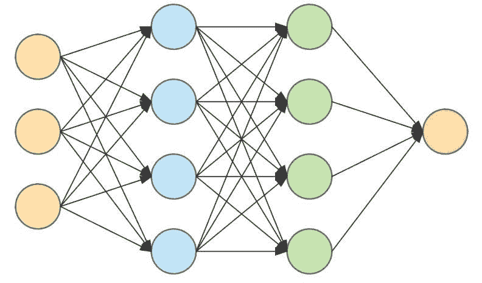

**多层神经网络**

现在，假设细胞体仅仅存储一个数字，而连接箭头描述了数据流的方向以及**每个神经元连接其他神经元的强度**。不用担心这里的*强度*是什么意思，我们稍后会看到。我们从神经元及其连接性的生物学中获取了一些灵感。让我们看看这如何帮助我们完成大脑所做的一些任务。

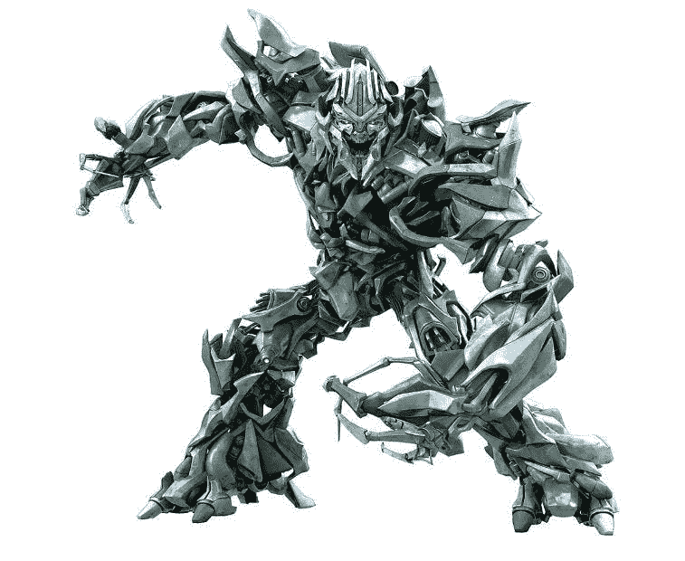

#### 感知器

**来源：[`www.javascripttuts.com`](https://www.javascripttuts.com/)**

好的，那就是 Megatron。

感知器是一种由 Frank Rosenblatt 于 1957 年发明的机器学习算法。感知器是一种线性分类器，你可以阅读有关线性分类器及分类算法的内容 [**这里**](https://medium.com/x8-the-ai-community/practical-aspects-logistic-regression-in-layman-terms-73fbcae58625)。让我们看看一个非常小的分类示例。让我们尝试构建一个机器来识别一个对象是否是板球。

让我们任意选择一些这个球的属性。

1.  它是红色的，我们将称这个属性为**R**。

1.  它是球形的，我们将称这个属性为**S**。

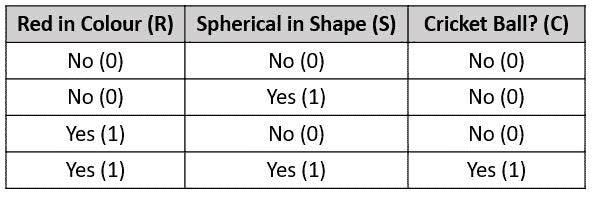

根据任意选择的属性，也称为**特征**，我们将对象分类为板球或非板球。上表告诉我们，如果一个球是红色的且是球形的，它就是一个板球，否则就不是。让我们看看如何用神经网络来实现这一点。

为了构建我们超级小的*大脑*，它可以识别板球，我们将使用一个神经元，该神经元仅加总输入并输出总和 —

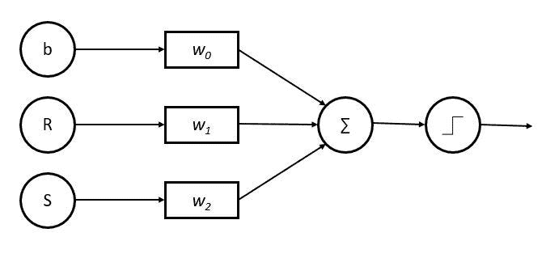

解析上述图；*b, R* *和* *S* 是输入神经元或简单来说是网络的输入，*w0, w1 和 w2* 是连接到中间神经元的**权重**，它将输入值加总。*b* 在这里是一个常量，称为 *偏置*。最后一步是最右侧的神经元，它是一个称为**激活函数**的函数，如果输入为正则输出 1，如果输入为负则输出 0。数学上它看起来像 —

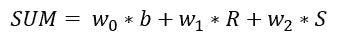

如果这个 SUM > 0，则输出 = 1 或 *是*；如果 SUM < 0，则输出 = 0 或 *否*。

让我们看看这如何帮助我们分类板球。我们为我们的连接强度 *w* 和常量 *b* 选择了一些任意的数字。如何获得这些值，即通过*训练*神经网络来学习这些权重，是本系列第二部分的主题。现在我们只需假设我们从某处获得了这些数字 —

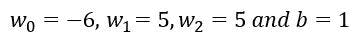

让我们拟合这些值

案例 1：当对象既不是球体 (S=0) 也不是红色 (R=0) 时

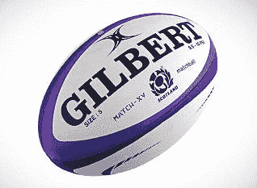

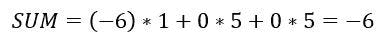

SUM < 0 这意味着输出为 0 或 *否*。我们的感知器表示这不是一个板球。

案例 2：当对象是球体 (S=1) 但不是红色 (R=0) 时

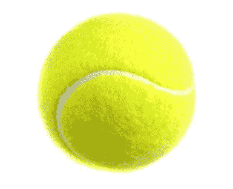

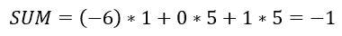

SUM < 0 这意味着输出为 0 或 否，不是一个板球。

案例 3：当对象不是球体 (S=0) 但红色 (R=1) 时

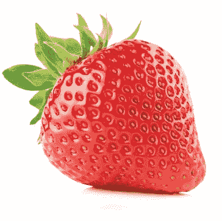

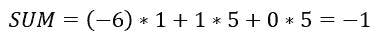

SUM < 0 这意味着输出为 0 或 否，不是一个板球。

情况 4：当对象是一个球体（S=1）并且是红色（R=1）

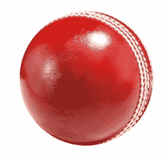

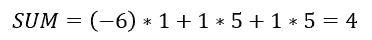

SUM>0，这意味着输出是 1。Et Voila! 我们的感知器说这是一个板球。

这是神经网络的最基本思想。我们以特定的方式连接这些感知器，最终得到一个神经网络。我已经将这个思想简化了一些，但它仍然捕捉到了感知器的本质。

#### 多层感知器

我们将感知器的这一思想堆叠在一起，创建*层*的这些神经元，这就是所谓的**多层感知器**（MLP）或**神经网络**。

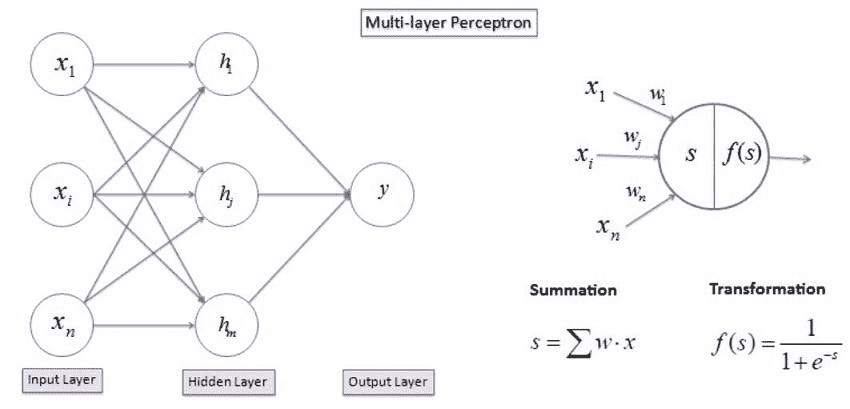

在我们简化的感知器模型中，我们仅使用了一个阶跃函数作为输出。在实际应用中，使用了许多不同的变换或**激活函数**。

我们手动且随意选择了红色和球形特征，但对于许多其他复杂任务，这种特征选择并不总是实际的。MLP 在某种程度上解决了这个问题。MLP 的输入可以直接是图像的像素值，隐藏层然后结合和转换这些像素值以在隐藏层中创建特征。本质上，单层感知器将数据转换并发送到下一层。

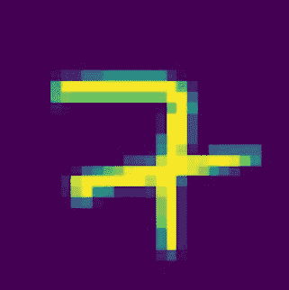

**28 像素 x 28 像素的手写数字图像**

假设我们的 MLP 试图通过查看类似上面手写数字的图像来识别一个数字。使用 MLP，我们可以直接将这个图像的像素值传递到输入层，而无需提取任何特征。然后，隐藏层会*结合和转换*这些像素来创建一些特征。隐藏层中的每个神经元都在训练过程中尝试*学习*一些特征。例如，隐藏层中的神经元 1 可能学习响应图像中的水平边缘，神经元 2 可能响应图像中的垂直边缘，以此类推。如果输入图像同时具有水平边缘和垂直边缘，隐藏层中的神经元 1 和 2 将响应，输出神经元将结合这两个特征，并可能说这是一个 7，因为 7 大致有一个垂直边缘和一个水平边缘。

当然，MLPs 并不总是学习到具有实际意义的特征，但它本质上是对输入数据的转换。例如，对于一个接收手写数字图像作为输入、隐藏层有 16 个神经元的 MLP，它会学习到类似以下的特征—

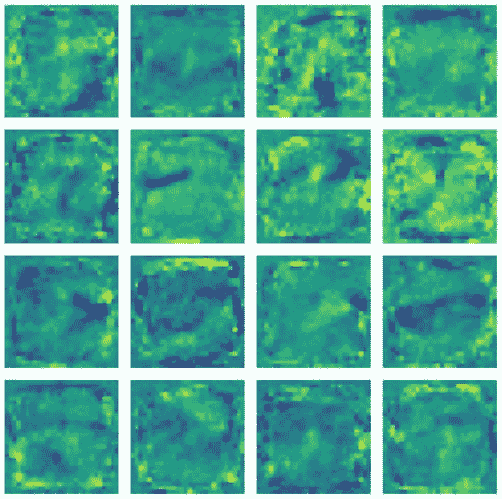

**每个方块代表隐藏层中一个神经元学习到的特征**

正如你可以清楚看到的，模式或多或少是随机的，没有意义。这一推断过程和 MLP 的变换在 3Blue1Brown 的精彩 YouTube 系列中得到了最佳解释——[**什么是神经网络**](https://www.youtube.com/watch?v=aircAruvnKk)。我强烈建议你去这个频道观看视频，以获得对神经网络的直观了解。一个很好的工具来可视化神经网络做的一些事情是 [**Tensorflow Playground**](https://playground.tensorflow.org/)，如果你有一些线性代数的背景，这个 [博客](http://colah.github.io/)中的可视化也很不错。

#### 神经网络的今天与明天

那么，神经网络除了识别板球或手写数字之外还能完成什么任务呢？如今，神经网络被部署用于广泛的任务。**图像识别、语音识别、自然语言处理、**[**时间序列数据**](https://medium.com/x8-the-ai-community/time-series-what-is-all-the-hype-about-e1ffd8957f1a)和许多其他应用。图像分类是神经网络成为事实上的算法的一个特定领域。神经网络在准确识别图像方面已经超越了人类。当然，构建这样高保真度的神经网络有很多复杂的技术和数学。

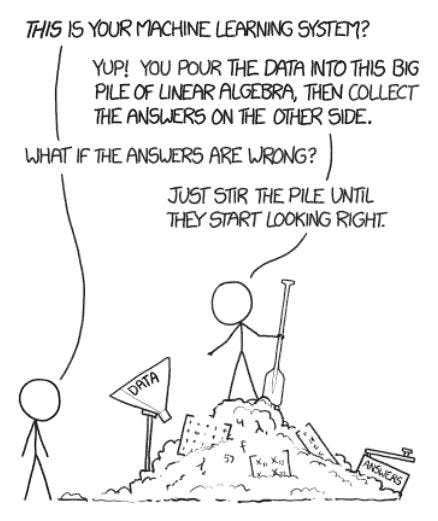

**来源: xkcd.com**

神经网络无处不在。公司利用它们来推荐你可能喜欢在 YouTube 上观看的视频，识别你对 Siri、Google Now 或 Alexa 说话时的声音和指令。神经网络现在也在生成自己的绘画和音乐作品。然而，仍然存在很多挑战。神经网络可以非常庞大，具有数百层，每层有数百个神经元，这使得在当前硬件技术下计算成为一个大挑战。训练神经网络是另一个巨大的挑战。为了训练这些神经网络，通常需要多个 GPU 一起工作，这个过程可能需要几个小时到几天。

但它们是我们在追求构建具有与人脑一样复杂智能和能力的机器过程中的现在与未来。我们离制造一个可以有一天“下载”你所有意识并创造你自身机器副本的人工大脑还有很长的路要走。但目前，这仅仅是科幻小说！

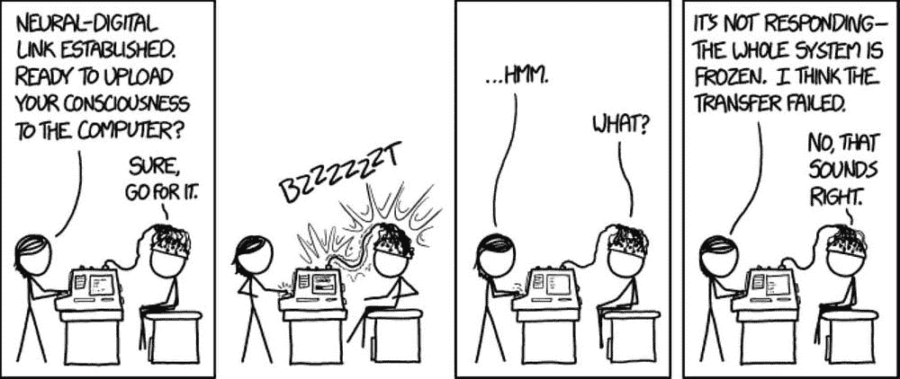

**来源: xkcd.com**

神经网络是一个广阔的主题，本文的目的是引发足够的好奇心，让你有一些小动力去探索这个话题。所以，去点击文章中的那些 YouTube 和 TensorFlow 链接，享受学习的乐趣吧！

注意本系列的第二部分，关于如何训练你的 D̶r̶a̶g̶o̶n NN。

**简介**: [Prateek Karkare](https://www.linkedin.com/in/prateek-karkare-09622a27/) 是一名电气工程师学员，对物理学、计算机科学和生物学充满浓厚兴趣。

[原文](https://medium.com/datadriveninvestor/neural-networks-an-intuition-640821d5bd83)。经许可转载。

**资源：**

+   [在线和基于网络的：分析、数据挖掘、数据科学、机器学习教育](https://www.kdnuggets.com/education/online.html)

+   [用于分析、数据科学、数据挖掘和机器学习的软件](https://www.kdnuggets.com/software/index.html)

**相关：**

+   [自然语言处理概述：现代深度学习技术应用于自然语言处理](https://www.kdnuggets.com/2019/01/nlp-overview-modern-deep-learning-techniques.html)

+   [揭秘反向传播算法](https://www.kdnuggets.com/2019/01/backpropagation-algorithm-demystified.html)

+   [监督学习：模型从过去到现在的流行度](https://www.kdnuggets.com/2018/12/supervised-learning-model-popularity-from-past-present.html)

* * *

## 我们的前三大课程推荐

 1\. [谷歌网络安全证书](https://www.kdnuggets.com/google-cybersecurity) - 快速进入网络安全职业生涯。

 2\. [谷歌数据分析专业证书](https://www.kdnuggets.com/google-data-analytics) - 提升你的数据分析技能

 3\. [谷歌 IT 支持专业证书](https://www.kdnuggets.com/google-itsupport) - 支持你所在的组织进行 IT 支持

* * *

### 更多相关主题

+   [稳定扩散：生成 AI 背后的基本直觉](https://www.kdnuggets.com/2023/06/stable-diffusion-basic-intuition-behind-generative-ai.html)

+   [用 PyTorch 解释性神经网络](https://www.kdnuggets.com/2022/01/interpretable-neural-networks-pytorch.html)

+   [深度神经网络不会引导我们走向 AGI](https://www.kdnuggets.com/2021/12/deep-neural-networks-not-toward-agi.html)

+   [在神经网络之前尝试的 10 个简单方法](https://www.kdnuggets.com/2021/12/10-simple-things-try-neural-networks.html)

+   [解释性预测和实时预测：最先进的深度学习技术](https://www.kdnuggets.com/2021/12/sota-explainable-forecasting-and-nowcasting.html)

+   [卷积神经网络（CNNs）的图像分类](https://www.kdnuggets.com/2022/05/image-classification-convolutional-neural-networks-cnns.html)
