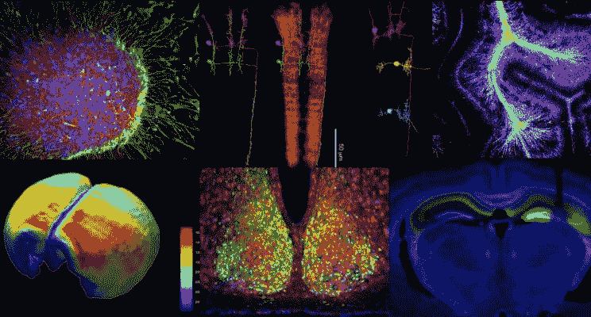

# 神经科学数据科学：理解人类行为

> 原文：[`www.kdnuggets.com/2017/03/neuroscience-data-science-human-behaviour.html`](https://www.kdnuggets.com/2017/03/neuroscience-data-science-human-behaviour.html)

> *编辑注：* 以下是市场营销和分析领域领先专家凯文·格雷与统计学和神经科学领域领先专家妮可·拉扎尔之间的讨论。

* * *

## 我们的前三大课程推荐

 1\. [谷歌网络安全证书](https://www.kdnuggets.com/google-cybersecurity) - 快速入门网络安全职业

 2\. [谷歌数据分析专业证书](https://www.kdnuggets.com/google-data-analytics) - 提升你的数据分析技能

 3\. [谷歌 IT 支持专业证书](https://www.kdnuggets.com/google-itsupport) - 支持你的组织的 IT

* * *

***凯文·格雷：*** *营销人员经常将“神经科学”一词使用得非常随意，并且在某些情况下可能在技术上是不正确的。例如，我曾听到在“心理学”足够的情况下使用“神经科学”。你能用普通人的话告诉我们这对你意味着什么吗？*

**妮可·拉扎尔：** 对我来说，神经科学大致指的是对大脑的研究。这可以通过多种方式实现，从“单个神经元记录”——在简单生物的神经元中放置电极——到通过功能性磁共振成像（fMRI）、正电子发射断层扫描（PET）、脑电图（EEG）等方法对人类进行认知神经影像学。这些单个神经元记录提供了非常直接的活动测量——你实际上可以测量神经元活动随时间的变化（例如，响应某种刺激）。显然，我们通常不能在人体上进行这种记录；fMRI、PET 等提供的是间接的大脑激活和活动测量。这些也许是神经科学光谱的两个极端。“神经科学”和“心理学”之间存在重叠，但并不是所有参与神经科学的人都是心理学家——还有工程师、物理学家、应用数学家，当然，还有统计学家。

***KG:*** *许多营销人员认为，无意识过程或情感通常主导消费者决策。因此，如果营销假设消费者是完全理性的经济行为者，那么效果将会减弱。由丹尼尔·卡尼曼、丹·艾瑞里等人普及的系统 1（“快速思维”）被营销人员广泛用于描述这种非理性的决策方面。维基百科引用的说法是：“系统 1 思维是直观的、无意识的、毫不费力的、快速的和情感驱动的。相比之下，由系统 2 驱动的决策则是深思熟虑的、有意识的、缓慢且费力的。”* *“隐含的”有时也用作系统 1 思维的同义词。现在神经科学家们是否就人们的决策过程达成了共识？还是说这仍然是一个有争议的问题？*

**NL:** 我认为神经科学家们对人们如何处理信息、做决策等问题没有达成共识！“有争议”这个词可能太过强烈，但这些事情确实非常复杂。卡尼曼的框架很吸引人，它为理解世界上许多可观察现象提供了一个视角。不过，我不认为这就是全部故事。尽管我没有跟进过，但我相信最近的一些研究也打破了系统 1/系统 2 的二分法。显然，我们在更深刻的理解之前还有很长的路要走。

***KG:*** *神经营销对不同的人来说可能意味着不同的东西，但广义上，它试图测量对营销刺激的无意识反应，即快速思维/隐含反应。* *fMRI、EEG、MEG*、*监测心率和呼吸率的变化、面部编码、皮肤电反应、拼贴以及隐性联想测试可能是最常用的工具。基于你在神经科学方面的专业知识，这些工具中是否有不合适的，或者它们都以某种方式有效地测量隐含/快速思维？*

**NL:** 首先，我不认为所有这些测量方法本质上都是“神经科学”的，至少不是我理解的那个定义。心跳和呼吸的变化，皮肤电反应——这些肯定是生理反应，但比 EEG 和 fMRI 更间接地反映了大脑的激活状态。这并不是说它们与个体如何对特定市场刺激做出反应完全没有关系。但我认为在基于这些不完美、不精确且间接的工具得出结论时应该谨慎。其次，至于 fMRI、EEG 和其他神经影像技术，这些显然更接近源头。然而，我对其中一些技术捕捉“快速思维”的能力持怀疑态度。例如，功能性磁共振成像的时间分辨率较低：图像获取的时间是以秒为单位的，而神经活动，包括我们对广告等刺激的反应，发生得要快得多——以毫秒为单位。EEG 的时间分辨率更好，但空间分辨率较差。要对我们的大脑如何、何时以及在哪里对市场刺激作出反应得出具体结论，需要时间分辨率和空间分辨率都很高。

***KG:*** *一些大型市场研究公司和广告机构已经在神经营销方面投入了大量资金。特别是功能性磁共振成像（fMRI）和脑电图（EEG）近年来吸引了许多营销人员的注意。首先，从 fMRI 开始，你认为这两种方法作为神经营销技术的优缺点是什么？*

**NL:** 我已经提到了一些：分辨率是关键。fMRI 具有良好的空间分辨率，这意味着我们可以以毫米级精度定位大脑中的哪些区域对刺激做出了反应。通过非常基本的统计分析，我们可以定位激活区域。这是 fMRI 作为影像技术受欢迎的一个优点和重要部分。从统计建模的角度来看，更难理解的是，例如，大脑区域激活的顺序，或者一个区域的激活是否引发了另一个区域的激活，这些往往是科学家（以及可能从事神经营销的人）真正关心的问题。许多统计学家、应用数学家和计算机科学家正在开发方法来回答这些更复杂的问题，但我们还没有真正解决这些问题。

fMRI 作为神经影像研究工具的主要缺点仍然是其相对较差的时间分辨率。当我们告诉人们我们可以在两到三秒内扫描整个三维大脑时，这听起来很令人印象深刻——如果你想想，其实这真的很了不起——但与大脑处理信息的速度相比，这种速度太慢了，不能允许研究人员回答他们感兴趣的许多问题。

我认为，fMRI 在神经营销中的另一个缺点是成像环境本身。我的意思是，你需要将受试者带到一个有 MRI 机器的地方，这是一台非常强大的大磁铁。它们的获取、安装和运行成本都很高，这对许多研究机构来说都是一个限制。你必须将受试者放入扫描仪中。有些人有幽闭恐惧症，无法忍受这种环境。如果你曾经做过 MR 扫描，你会知道机器非常吵，这也会令人不安和分心。这也意味着研究（在这种情况下是市场营销研究，但任何 fMRI 研究都是如此）是在高度人工的条件下进行的；我们通常不会在磁共振成像扫描仪中观看广告。

***KG:*** *那么 EEG 呢？*

**NL:** EEG 和 fMRI 的分辨率问题是相反的。EEG 具有非常好的时间分辨率，因此有可能更实时地记录神经活动的变化。对于那些试图精确测定微妙的时间变化的人来说，这可能是一个优势。在成像环境方面，EEG 一般比 fMRI 更友好和更容易。个人只需佩戴一个带电极的帽子，这并不太繁琐或不自然。帽子本身也不贵，这对研究人员来说也是一个好处。

另一方面，EEG 的空间分辨率较差有两个原因。一个是帽子上的电极数量通常不多——覆盖在头皮表面的电极有几百个。乍看之下可能觉得很多，但当你考虑到每个电极覆盖的区域，尤其是与 fMRI 的毫米级精度相比时，激活的定位非常模糊。此外，电极在头皮上，距离大脑产生的信号还很远。这一切意味着，通过 EEG，我们对大脑激活发生的位置了解非常不准确。

***KG:*** *作为一名从事神经科学的统计学家，你认为神经科学面临的最大测量挑战是什么？*

**NL:** 数据通常很嘈杂，而且在统计学家能看到之前，还会经历许多预处理阶段。这意味着一种已经间接的测量在分析之前会经过不确定数量的数据处理。这是一个巨大的挑战，许多人已经为此苦苦挣扎多年。关于噪声，来源有很多，有些来自技术，有些来自受试者。更复杂的是，受试者产生的噪声可能与实验刺激有关。例如，在眼动 fMRI 研究中，受试者可能会在看向刺激的方向时，稍微转动整个头部，这会污染数据。同样，在 EEG 研究中，有证据表明测量信号可能会与面部表情混淆。这两者都会对神经市场营销和其他热门应用的成像使用产生影响。此外，数据量很大；虽然在许多现代应用的规模中不算“巨大的”，但绝对足够大，以至于在存储和分析上会带来挑战。最后，当然，我们无法直接测量大脑活动和激活，并且可能永远无法做到这一点，这是我们面临的最大测量挑战。当测量的数据与源信号有些偏离、嘈杂且高度处理时，很难得出可靠的结论。

***KG:*** *考虑到未来 10 到 15 年，你是否预测到那时我们会最终破解人类大脑的秘密，完全理解我们的大脑及其运作机制？还是说这将需要更长的时间？*

**NL:** 我承认我对在 10 到 15 年内完全理解人类大脑持怀疑态度。那是一个很短的时间范围，而我们大脑的运作非常复杂。此外，“破解代码”是什么意思？在神经元及其相互连接的层面，我难以相信我们很快（如果有的话）就能达到那个程度。那是一个非常细微的尺度；人脑中有数十亿个神经元，连接太多了难以建模。即使我们能够做到这一点，我也不认为这个过程会真正揭示什么使我们成为人类，是什么让我们运转。所以，我不认为我们会建造出完全模仿人脑的人工智能或计算机——我也不确定我们为什么会想这样做，从中具体能学到什么。也许如果我们考虑神经元的集合——我们称之为“兴趣区域”（ROIs）以及这些区域之间的连接，可能会取得进展。例如，涉及语言处理的不同 ROIs 如何相互作用，使我们能够理解和生成语言？这些问题我们可能更接近回答，尽管我仍然不确定 10 到 15 年是否是合适的时间框架。不过，统计学家本来就天生怀疑！

***KG:*** *谢谢你，Nicole！*

[原文](https://www.linkedin.com/pulse/neuroscience-marketing-kevin-gray). 经许可转载。

**简介： [凯文·格雷](https://www.linkedin.com/in/cannongray)** 是 [坎农·格雷](http://cannongray.com/home) 的总裁，这是一家市场科学与分析咨询公司。 **[尼科尔·拉扎](http://www.stat.uga.edu/people/faculty/nicole-lazar)** 是乔治亚大学的统计学教授，并且是《*功能性磁共振成像数据的统计分析*》一书的作者。她是美国统计协会的选举会员，也是 [*美国统计学家*](http://www.tandfonline.com/toc/utas20/current) 的主编。

**相关内容：**

+   你害怕问的人工智能问题（二）：神经科学

+   克服追寻市场“圣杯”过程中的最后障碍

+   一种美味的数据科学方法

### 该主题的更多信息

+   [缩小人类理解与机器学习之间的差距：…](https://www.kdnuggets.com/2023/06/closing-gap-human-understanding-machine-learning-explainable-ai-solution.html)

+   [R 与 Python（再次）：人因视角](https://www.kdnuggets.com/2022/01/r-python-human-factor-perspective.html)

+   [深度学习与人类认知能力之间的差距](https://www.kdnuggets.com/2022/10/gap-deep-learning-human-cognitive-abilities.html)

+   [超越人类界限：超级智能的崛起](https://www.kdnuggets.com/beyond-human-boundaries-the-rise-of-superintelligence)

+   [自然语言处理：将人类沟通与人工智能连接起来](https://www.kdnuggets.com/natural-language-processing-bridging-human-communication-with-ai)

+   [超越编码：为何人性化的触感至关重要](https://www.kdnuggets.com/beyond-coding-why-the-human-touch-matters)
