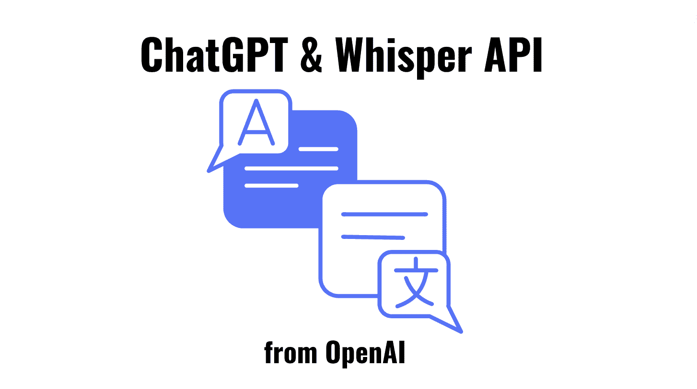
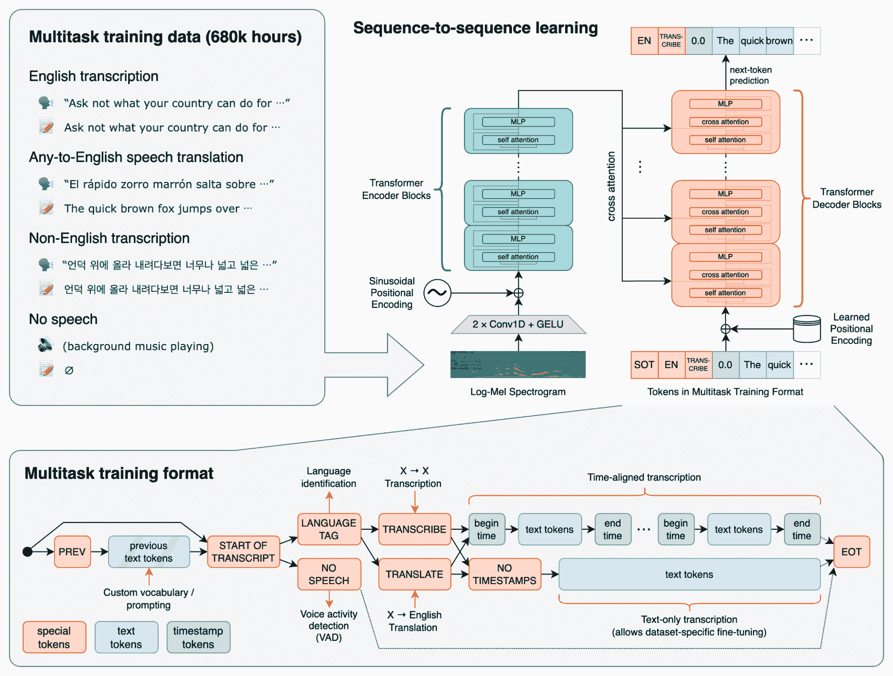

# 来自 OpenAI 的新 ChatGPT 和 Whisper API

> 原文：[`www.kdnuggets.com/2023/03/new-chatgpt-whisper-apis-openai.html`](https://www.kdnuggets.com/2023/03/new-chatgpt-whisper-apis-openai.html)

作者提供的图片

如果你认为你已经听到关于 ChatGPT 的所有信息，那你错了。OpenAI 已将其 ChatGPT 和 Whisper 模型开放给 API，使开发者可以访问 AI 驱动的语言和语音转文本功能。

让我们先退一步。有些人可能不知道什么是 ChatGPT 或 Whisper。所以让我给你一个简单的说明。

# 什么是 ChatGPT？

ChatGPT 是由 [OpenAI](https://openai.com/) 于 2022 年 11 月推出的基于 AI 的聊天系统。它使用生成预训练变换器 3（GPT-3）和一个自回归语言模型来生成类人文本。它是一个语言处理 AI 模型，经过训练可以预测下一个标记是什么。

ChatGPT 可以做的示例包括

+   从文章到论文，撰写长篇内容。

+   撰写短篇诗歌和打油诗

+   将复杂话题简化为通俗易懂的术语

+   帮助你规划和组织会议、假期等。

+   个性化交流

如果你想了解更多关于 ChatGPT 的信息，请查看以下文章：

+   ChatGPT：你需要知道的一切

+   ChatGPT 作为 Python 编程助手

+   ChatGPT 备忘单

## ChatGPT API

ChatGPT 模型系列已经扩展，因为 OpenAI 发布了：gpt-3.5-turbo。这个新模型的价格为每 1k 标记 $0.002，比现有的 GPT-3.5 模型便宜 10 倍。

GPT 模型传统上使用非结构化文本，然后将其表示为一系列“标记”。然而，使用 ChatGPT 时，模型使用消息序列及其元数据。

# 什么是 Whisper？

2022 年 9 月，[OpenAI](https://openai.com/research/whisper) 推出了 Whisper —— 一个自动语音识别（ASR）系统。这个语音转文本模型是开源的，并且获得了开发者社区的广泛赞誉。

它已经在包含多种语言的多样化音频的大型数据集上进行了 680,000 小时的训练。该模型还具有多任务处理能力，可以执行多语言语音识别、语音翻译和语言识别。这些大型数据集是从网上收集的监督数据。

上述任务作为一系列标记一起表示，以便解码器可以对其进行预测。这些任务的结合自然消除了传统语音处理管道中通常发生的几个阶段。它可以处理不同格式的文件，如 M4A、MP3、MP4、MPEG、MPGA、WAV 和 WEBM。

以下是 OpenAI 的 Whisper 方法的图片：

来自 [OpenAI GitHub](https://github.com/openai/whisper) 的图片

## Whisper API

OpenAI 听取了消费者的需求，并考虑到 Whisper 运行的难度。因此，他们现在有一个大型 v2 模型，通过 API 提供便捷的按需访问。其定价为每分钟 $0.006。

用户还将受益于 OpenAI 高度优化的服务堆栈，该堆栈提供快速的性能。

# ChatGPT 和 Whisper

OpenAI 能够将 ChatGPT 的成本降低了 90%，看起来这一节省的成本现在为 API 用户开辟了更多机会。他们希望让开发者接触到尖端的语言和语音转文本能力。

开发者现在可以使用 OpenAI 的开源 Whisper 大型 v2 模型，该模型提供了更快和更具成本效益的结果。至于 ChatGPT，该模型将不断进行改进，API 用户将受益于此，同时对其模型有更深入的控制。

在收到开发者反馈后，OpenAI 做出了一些具体的改动，以帮助开发者体验：

+   开发者文档的改进

+   通过 API 提交的数据不会用于服务改进，除非你选择加入。

+   30 天的保留策略，并可根据需要选择更严格的保留选项。

开发者不必再使用 OpenAI 当前的语言方法，ChatGPT 和 Whisper API 将允许第三方开发者轻松集成到他们的平台中。

## 专用实例

OpenAI 还为需要更深入控制模型版本和系统性能的用户提供专用实例。开发者将按时间段付费，并分配符合他们需求的计算基础设施。这对计划每天运行 450M 个标记的开发者来说非常有经济意义。

他们将完全控制实例的负载，有启用功能和固定模型快照的选项。这不仅能减少开发者的成本，还能使他们的流程更高效。

# 总结

ChatGPT 和 Whisper API 的推出预计将对开发者社区产生深远的影响。它为开发者提供了新的最先进工具和能力，使他们能够构建更好、更先进的基于语言的应用程序。

**[尼莎·阿亚](https://www.linkedin.com/in/nisha-arya-ahmed/)** 是 KDnuggets 的数据科学家、自由技术写作人和社区经理。她特别关注提供数据科学职业建议或教程，以及数据科学的理论知识。她还希望探索人工智能如何/能够促进人类生命的延续。她是一个热衷学习的人，寻求拓宽技术知识和写作技能，同时帮助指导他人。

* * *

## 我们的前三个课程推荐

 1\. [谷歌网络安全证书](https://www.kdnuggets.com/google-cybersecurity) - 快速进入网络安全职业道路

 2\. [谷歌数据分析专业证书](https://www.kdnuggets.com/google-data-analytics) - 提升你的数据分析技能

 3\. [谷歌 IT 支持专业证书](https://www.kdnuggets.com/google-itsupport) - 支持你的组织的 IT 部门

* * *

### 更多相关主题

+   [OpenAI 的 Whisper API 用于转录和翻译](https://www.kdnuggets.com/2023/06/openai-whisper-api-transcription-translation.html)

+   [免费 ChatGPT 课程：使用 OpenAI API 编码 5 个项目](https://www.kdnuggets.com/2023/05/free-chatgpt-course-openai-api-code-5-projects.html)

+   [使用 OpenAI 构建 AI 产品：CoRise 提供的免费课程](https://www.kdnuggets.com/2023/07/corise-building-ai-products-openai-free-course-corise.html)

+   [OpenAI 推出的 Superalignment](https://www.kdnuggets.com/2023/08/introducing-superalignment-openai.html)

+   [使用 OpenAI GPT 模型的最佳实践](https://www.kdnuggets.com/2023/08/best-practices-openai-gpt-model.html)

+   [OpenAI API 入门：你的易于跟随的启动指南](https://www.kdnuggets.com/openai-api-for-beginners-your-easy-to-follow-starter-guide)
