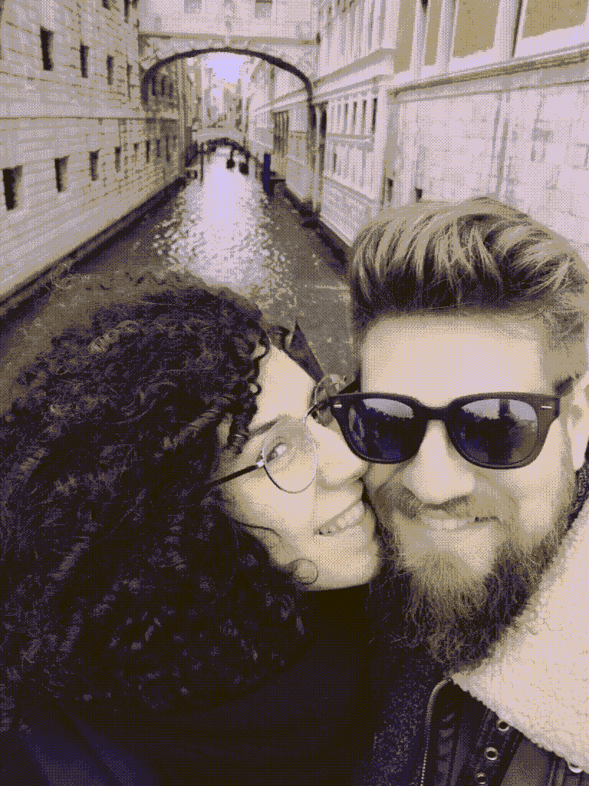
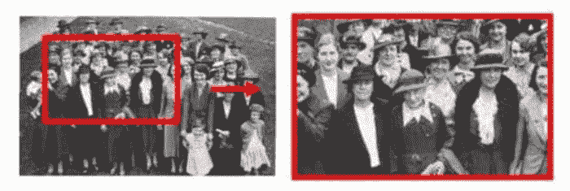

# 使用 Python 为你的照片添加新的维度

> 原文：[`www.kdnuggets.com/2021/06/new-dimension-photos-python.html`](https://www.kdnuggets.com/2021/06/new-dimension-photos-python.html)

评论

**作者 [Dylan Roy](https://www.linkedin.com/in/dylan-roy/)，工程师兼副项目爱好者**



作者提供的图片

### 背景故事

在查看了几周前的一次露营旅行中的一些照片后，我决定拿出我以前的假期照片，用 Python 将它们制作成幻灯片。不要担心，我是在理解 Google Photos 和 Apple 等效工具已经非常擅长这方面的情况下进行的。这纯粹是为了满足我对构建副项目的瘾。

在查看可用选项时，我偶然发现了一篇带有代码的论文，该代码可以为你的照片添加一个应用 3D Ken Burns 效果的过渡。Ken Burns 效果在视频中自然地获得了 3D 效果，但在照片中则因为缺少那个维度而显得不那么吸引人。因此，在接下来的介绍中，我希望能帮你尝试并为你的照片添加这个额外的维度，就像我做到的那样。

### 概念

这里有一些概念是值得了解的，因为它们与我们希望实现的目标相关。尽管我们不需要了解这些，AI 模型通过估算照片中物体的深度来正确缩放物体的大小，从而为我们的 Ken Burns 效果应用了 3D 维度。随着效果在照片中的移动，模型需要通过修补来重建缺失的物体和纹理，这些在 2D 图像中并未出现。

[**Ken Burns 效果**](https://en.wikipedia.org/wiki/Ken_Burns_effect)—对照片进行缩放和平移会产生运动的感觉。它以一位美国纪录片制作者的名字命名，他经常使用这种效果。该论文的作者为这种效果添加了通常在照片中缺失的第三维度。



[CC BY-SA 3.0](http://creativecommons.org/licenses/by-sa/3.0/)，通过 Wikimedia Commons

**深度估计** — 描述了获取场景中物体距离测量的方法。有效地进行这项工作将导致令人信服的过渡，并且会随着视差缩放每个物体。

[**修补**](https://en.wikipedia.org/wiki/Inpainting) — 这描述了由于过渡的视角变化而重建图像中不存在的部分的方法。在图像和视频中，这种技术也指修复受损、恶化或缺失的艺术品部分，以呈现完整的图像。

### 自己动手做

幸运的是，这篇论文的作者，[Simon Niklaus](https://arxiv.org/search/cs?searchtype=author&query=Niklaus%2C+S)、[Long Mai](https://arxiv.org/search/cs?searchtype=author&query=Mai%2C+L)、[Jimei Yang](https://arxiv.org/search/cs?searchtype=author&query=Yang%2C+J)、[Feng Liu](https://arxiv.org/search/cs?searchtype=author&query=Liu%2C+F) 提供了一个[代码库](https://github.com/sniklaus/3d-ken-burns)，允许我们使用一些预训练模型将这种效果应用于我们的照片。我注意到这些模型对前景中有许多锐利边缘的照片效果不好，但对我测试过的一些照片却产生了相当令人印象深刻的结果。

我不会详细讲解如何实现这些功能，因为作者们已经在他们的论文、Github 仓库和 YouTube 视频中介绍了这些内容，这些资源都在最后的资源部分提供了。

我将引导你完成创建这些 3D 场景的方法，但如果你想在本节末尾直接尝试，我已经将我们将要讲解的所有代码添加到一个 Google Colab 中，你可以立即复制和使用。

在自己操作之前，我建议打开一个新的 Google Colab，因为在我讲解的代码示例中，我使用了一些 Colab 特定的功能以提高使用的便捷性。

### 设置环境和安装要求

使其正常工作的第一步是导入包含该实现和预训练模型的仓库。下面发生的操作是我们克隆了仓库，导航到它，创建输出目录，并安装所需的库。Google Colab 在启动新运行时时已经预加载了许多要求，所以只有两个是缺失的。

```py
!git clone https://github.com/sniklaus/3d-ken-burns.git# Move into the downloaded repository
%cd 3d-ken-burns# Make a directory for the videos
!mkdir videos
video_dir = "./videos/"# Install dependencies
!pip install moviepy gevent
```

### 上传照片

在这个阶段，你只需要一个简单的方法来将照片上传到你的源/图像目录。你不必将其包含在你的笔记本中，只需通过 Colab 界面将文件拖放到相应的文件夹中即可，但这确实是一个相当不错的便利单元。

```py
from google.colab import filesuploads = files.upload()for filename in uploads.keys():
    !mv ./$filename ./images/$filename
```

### 转换你的照片

如果我们不想转换所有提供给两个目录的照片，可以使用以下简单的一行命令，这只需利用`autozoom.py`接口转换一张照片。

```py
python autozoom.py --in {input_image}.jpg --out {output_video}.mp4
```

尽管我们希望自动化可自动化的部分，但我们可以利用 bash，遍历目录并对每张照片执行操作。

```py
!for image in ./images/*; do python autozoom.py --in $image --out ./videos/$(basename $image | cut -f1 -d '.').mp4; done
```

### 查看你的视频

一旦你的照片转换完成，你可能想先查看输出，我们使用 IPython 的功能来构建查看视频的函数，然后提供一个选择器，供我们在目录中选择要查看的视频。

```py
import os
from base64 import b64encodefrom IPython.display import HTML
import ipywidgets as widgetsdef video(path):
    mp4 = open(path,'rb').read()
    data_url = "data:video/mp4;base64," + b64encode(mp4).decode()
    return HTML(f'<video width=600 controls loop> <source src="{data_url}" type="video/mp4"></video>')files_list = os.listdir(video_dir)
video_list = widgets.Dropdown(
    options=files_list,
    value="" if not files_list else files_list[0],
    description='Video:',
    disabled=False,
)
display(video_list)
```

### 将 Mp4 转换为动画 GIF

我添加了这一步骤是为了将应用效果的输出上传并嵌入到这篇帖子中，因此和我的所有努力一样，请利用这些知识，随意将你的 mp4 文件转换为动图。作为额外奖励，我们已经将 `imageio` 作为依赖项导入，所以无需安装。下面我们将使用此函数，并遍历目标目录查找要转换的 mp4 文件。

```py
import imageio
import os, sysclass TargetFormat(object):
    GIF = ".gif"
    MP4 = ".mp4"
    AVI = ".avi"def convertFile(inputpath, targetFormat):
    """Reference: [`gist.github.com/michaelosthege/cd3e0c3c556b70a79deba6855deb2cc8`](https://gist.github.com/michaelosthege/cd3e0c3c556b70a79deba6855deb2cc8)"""
    outputpath = os.path.splitext(inputpath)[0] + targetFormat
    print("converting\r\n\t{0}\r\nto\r\n\t{1}".format(inputpath, outputpath))reader = imageio.get_reader(inputpath)
    fps = reader.get_meta_data()['fps']writer = imageio.get_writer(outputpath, fps=fps)
    for i,im in enumerate(reader):
        sys.stdout.write("\rframe {0}".format(i))
        sys.stdout.flush()
        writer.append_data(im)
    print("\r\nFinalizing...")
    writer.close()
    print("Done.")for file in [x for x in os.listdir(video_dir) if x.endswith(".mp4")]:
    convertFile(f"{video_dir}{file}", TargetFormat.GIF)
```

### 下载所有视频

如果你不想使用文件浏览器下载输出文件。最后一步是遍历目标文件夹，并下载每个视频。这也可以像之前使用 bash 遍历和应用效果时一样完成。

```py
for file in os.listdir(video_dir):
    files.download(f"{video_dir}{file}")
```

如果一切顺利，你的照片应该已经正确转换，就像我在享受博洛尼亚时拍的其中一张照片一样。


图片由作者提供

对于那些希望跳过自己制作 Colab 笔记本的人，**[这里是完整的实现，你可以复制并开始转换你的照片集](https://colab.research.google.com/drive/1UE_rOouFODxoxQbrm9Ms_OTHhSfyKe89)**。

### 关键要点

站在巨人的肩膀上，我们生活在一个可以利用前沿 AI 技术的时代，这些技术帮助我们完成通常需要特定知识的人才能做的事情。在这种情况下，我们可以使用 Simon Niklaus 和团队开发的 AI 技术，而无需学习复杂的编辑技能。

### 其他 Dylan 的帖子

[**使用 Python 创建美丽的架构图**](https://towardsdatascience.com/create-beautiful-architecture-diagrams-with-python-7792a1485f97)

不再花时间手动调整对齐的箭头

[**使用 Github Actions 部署到 Google Cloud Run**](https://towardsdatascience.com/deploy-to-google-cloud-run-using-github-actions-590ecf957af0)

一个可扩展的 CI/CD 解决方案，使用 Actions 和 Cloud Run 实现零扩展

[**使用 Python 自动更新你的 Github 个人资料**](https://towardsdatascience.com/auto-updating-your-github-profile-with-python-cde87b638168)

通过自动化你的 Readme 个人资料展示你的技能

### 资源

+   [视频描述](https://www.youtube.com/watch?v=WrajxHHfRBA)

+   [研究论文](https://arxiv.org/abs/1909.05483)

+   [Github 仓库](https://github.com/sniklaus/3d-ken-burns)

+   [MP4 到 GIF 转换的 Gist](https://gist.github.com/michaelosthege/cd3e0c3c556b70a79deba6855deb2cc8)

+   其他利用 [Arnaldo Gabriel](https://colab.research.google.com/github/agmm/colab-3d-ken-burns/blob/master/automatic-3d-ken-burns.ipynb) 的论文的 Google Colabs，一个来自 [Vlad Alex](https://colab.research.google.com/drive/1hxx4iSuAOyeI2gCL54vQkpEuBVrIv1hY)，还有一个来自 [Ahmed Harmouche](https://github.com/wpmed92/3d-ken-burns-colab)。

**个人简介: [迪伦·罗伊](https://www.linkedin.com/in/dylan-roy/)** 是一名工程师和副项目狂热者，分享他正在进行的工作，以便像你这样的读者可以从他的经验中受益。点击此处订阅更多内容 ([**dylanroy.com**](http://dylanroy.com))

[原文](https://medium.com/robotacademy/add-a-new-dimension-to-your-photos-using-python-4baf7a0a607a)。已获得许可转载。

**相关:**

+   使用 5 行代码提取图像和视频中的对象

+   用 Python 自动化的 5 项任务

+   哪个面孔是真的？应用 StyleGAN 创建虚假人物

* * *

## 我们的三大课程推荐

 1\. [谷歌网络安全证书](https://www.kdnuggets.com/google-cybersecurity) - 快速进入网络安全职业轨道。

 2\. [谷歌数据分析专业证书](https://www.kdnuggets.com/google-data-analytics) - 提升你的数据分析技能

 3\. [谷歌 IT 支持专业证书](https://www.kdnuggets.com/google-itsupport) - 支持你所在组织的 IT 需求

* * *

### 更多相关话题

+   [每位数据科学家都应该知道的三个 R 库（即使你使用 Python）](https://www.kdnuggets.com/2021/12/three-r-libraries-every-data-scientist-know-even-python.html)

+   [是什么让 Python 成为初创公司的理想编程语言](https://www.kdnuggets.com/2021/12/makes-python-ideal-programming-language-startups.html)

+   [停止学习数据科学以寻找目标，并找到目标来…](https://www.kdnuggets.com/2021/12/stop-learning-data-science-find-purpose.html)

+   [分析一桩 90 亿美元的 AI 失败](https://www.kdnuggets.com/2021/12/9b-ai-failure-examined.html)

+   [学习数据科学的顶级统计资源](https://www.kdnuggets.com/2021/12/springboard-top-resources-learn-data-science-statistics.html)

+   [成功的数据科学家具有的 5 个特征](https://www.kdnuggets.com/2021/12/5-characteristics-successful-data-scientist.html)
