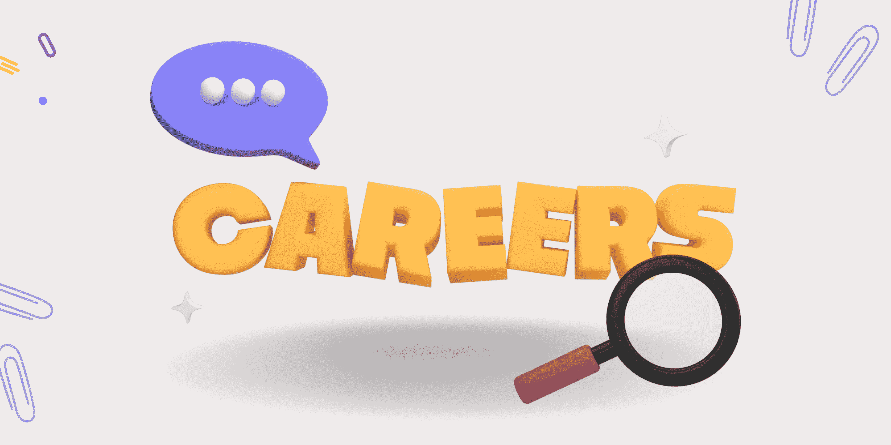

# 刚刚推出的新技术课程

> 原文：[`www.kdnuggets.com/new-tech-courses-that-have-just-landed`](https://www.kdnuggets.com/new-tech-courses-that-have-just-landed)

图片来源：作者

* * *

## 我们的前三个课程推荐

 1\. [Google 网络安全证书](https://www.kdnuggets.com/google-cybersecurity) - 快速开启网络安全职业生涯。

 2\. [Google 数据分析专业证书](https://www.kdnuggets.com/google-data-analytics) - 提升你的数据分析技能

 3\. [Google IT 支持专业证书](https://www.kdnuggets.com/google-itsupport) - 支持你所在组织的 IT

* * *

我们知道科技领域正在日新月异地发展。鉴于此，对科技专业人士的需求也在增加，为满足这种需求，越来越多的科技课程正在推出。

在科技行业中，你可以探索许多不同的方向。然而，选择哪条路可能会很困难。我应该选择课程，还是回到大学？

在这篇博客中，我将深入探讨最近推出的 3 个技术专业认证和学位。

## 前端网页开发

链接：[前端网页开发](https://edx.sjv.io/9gor73)

这是由 edX 和 Skills for Life 提供的全额资助项目，让你可以免费启动职业生涯。

在本课程中，你将学习成为前端网页开发者所需的硬技能和软技能。你将深入了解 HTML5、CSS3、Javascript、jQuery、React.js、ES6 和 Node 等编程语言。

课程有三个方面：

+   前端基础

+   使用 APIs 开发

+   现代前端框架

该课程为学生提供了应用程序编程接口（APIs）、用户体验设计以及构建和部署现代 Web 应用程序的速成课程。

除了获得以结果为导向的课程内容外，你还将获得个性化的职业资源，以支持你下一步的职业发展。

## 数据分析师

链接：[Meta 数据分析师专业证书](https://imp.i384100.net/vNdOKe)

该课程面向希望从数据分析师角度进入科技行业的初学者。你可以在自己的时间和节奏下完成这门课程。如果每周投入 10 小时，整个课程需要 5 个月完成，但如果你能投入更多时间，完成得会更快！

认证由 5 门课程组成：

+   数据分析简介

+   使用电子表格和 SQL 进行数据分析

+   Python 数据分析

+   营销统计

+   数据管理简介

## AI 产品经理

链接：[AI 产品经理](https://imp.i384100.net/VmX0ER)

你可能在其他行业担任产品经理或产品负责人，并且可能正在考虑转向科技行业。

这门由 IBM 提供的课程将教你如何：

+   应用关键的产品管理技能、工具和技术

+   了解敏捷及其他方法论的工作知识

+   学习如何将产品解决方案推向市场

+   评估有关 AI 和现有产品管理系统的真实案例研究

+   熟练掌握各种技能和工具

## 总结一下

当人们考虑进入科技行业时，他们总是认为自己需要成为高度熟练的软件开发人员才能取得成功。科技领域还有许多其他方面等待你去探索！

[**尼莎·阿利亚**](https://www.linkedin.com/in/nisha-arya-ahmed/) 是一名数据科学家，自由职业技术作家，同时也是 KDnuggets 的编辑和社区经理。她特别感兴趣于提供数据科学职业建议、教程以及数据科学的理论知识。尼莎涉及广泛的主题，并希望探索人工智能如何有利于人类生命的持久性。作为一个热衷学习者，尼莎希望拓宽她的技术知识和写作技能，同时帮助指导他人。

### 更多相关主题

+   [谷歌刚刚推出了一个新课程：AI 基础知识](https://www.kdnuggets.com/google-have-just-dropped-a-new-course-ai-essentials)

+   [ChatGPT 是否有潜力成为新的国际象棋超级大师？](https://www.kdnuggets.com/does-chatgpt-have-the-potential-to-become-a-new-chess-super-grandmaster)

+   [AI for Ukraine 是 AI HOUSE 推出的新教育项目，旨在…](https://www.kdnuggets.com/2022/08/ai-house-ai-ukraine-new-educational-project-support-ukrainian-tech-community.html)

+   [从 Dot com 到 Dot AI：新的科技泡沫？](https://www.kdnuggets.com/dot-com-to-dot-ai-new-tech-bubble)

+   [了解如何在几步内在你的设备上运行 Alpaca-LoRA](https://www.kdnuggets.com/2023/05/learn-run-alpacalora-device-steps.html)

+   [如何开始使用刚刚摧毁 GPT-4 和 Gemini 的 Claude 3 Opus](https://www.kdnuggets.com/getting-started-with-claude-3-opus-that-just-destroyed-gpt-4-and-gemini)
