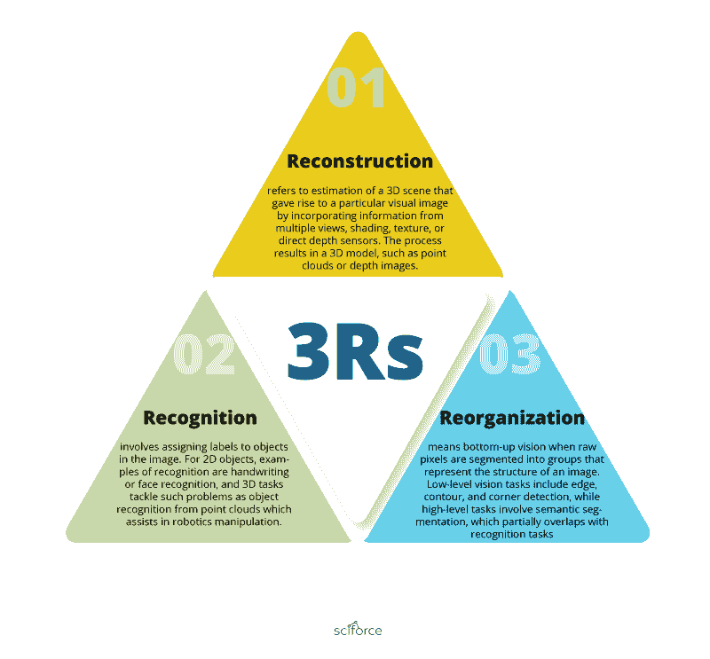
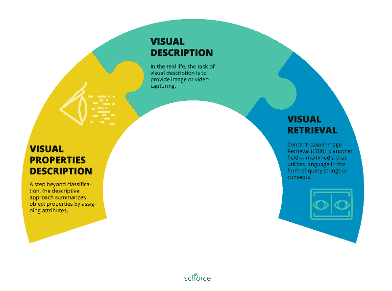
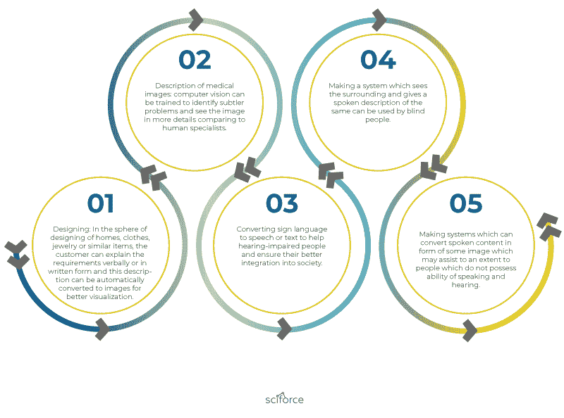

# NLP 与计算机视觉的整合

> 原文：[`www.kdnuggets.com/2019/06/nlp-computer-vision-integrated.html`](https://www.kdnuggets.com/2019/06/nlp-computer-vision-integrated.html)

 评论

**由[Sciforce](https://sciforce.solutions)提供**。

* * *

## 我们的三大课程推荐

 1\. [谷歌网络安全证书](https://www.kdnuggets.com/google-cybersecurity) - 快速进入网络安全职业轨道。

 2\. [谷歌数据分析专业证书](https://www.kdnuggets.com/google-data-analytics) - 提升你的数据分析能力

 3\. [谷歌 IT 支持专业证书](https://www.kdnuggets.com/google-itsupport) - 支持你的组织的 IT 工作

* * *

整合与跨学科性是现代科学和工业的基石。最近尝试将一切结合在一起的一个例子是计算机视觉与自然语言处理（NLP）的整合。这两个领域都是机器学习研究中最活跃的发展领域之一。然而，直到最近，它们一直被视为独立领域，彼此之间几乎没有相互受益的方式。现在，随着多媒体的扩展，研究人员开始探索将这两种方法应用于实现单一结果的可能性。

### **多模态世界与符号学**

人类最自然的方式是从不同来源提取和分析信息。这符合符号学理论（Greenlee 1978）——研究符号及其在不同层次上意义的关系。符号学研究符号与意义之间的关系，符号之间的形式关系（大致相当于语法）以及人类根据上下文解读符号的方式（语言学理论中的语用学）。如果我们仅考虑视觉符号，那么这会得出结论，符号学也可以通过计算机视觉来处理，从中提取有趣的符号以供自然语言处理实现相应的意义。

### **计算机视觉及其与 NLP 的关系**

Malik 将计算机视觉任务总结为 3Rs（Malik 等，2016）：重建、识别和重组。

**重建** 指通过结合来自多个视角、阴影、纹理或直接深度传感器的信息，估计产生特定视觉图像的 3D 场景。该过程结果是一个 3D 模型，例如点云或深度图像。

**识别** 涉及为图像中的对象分配标签。对于 2D 对象，识别的例子包括手写识别或人脸识别，而 3D 任务则解决从点云中识别对象等问题，这有助于机器人操作。

**重组** 指的是从底层到顶层的视觉过程，当原始像素被分割成表示图像结构的组时。低层次视觉任务包括边缘、轮廓和角点检测，而高层次任务涉及语义分割，这与识别任务部分重叠。

识别与语言的联系最为紧密，因为它的输出可以被解释为词语。例如，物体可以用名词表示，活动用动词表示，物体属性用形容词表示。从这个意义上说，视觉和语言通过语义表示相互连接（Gardenfors 2014；Gupta 2009）。

### **自然语言处理及其与计算机视觉的关系**

与计算机视觉相比，NLP 任务更为多样化，包括语法（如形态学和组合性）、语义（作为意义的研究，包括词语、短语、句子和话语之间的关系）以及语用学（作为自然交流中意义的细微差别的研究）。

一些复杂的 NLP 任务包括机器翻译、对话接口、信息提取和摘要。

换句话说，从图像到词语的转换被认为是最接近机器翻译的。然而，这种在低层像素或图像轮廓与高层次词语或句子描述之间的“翻译”——即桥接语义差距（Zhao 和 Grosky 2002）——依然是一个广泛的鸿沟。

### **计算机视觉与 NLP 的整合范围**

视觉和语言的融合并不是通过自上而下的方式顺利进行的，研究人员提出了一系列原则。集成技术主要是自下而上的发展，一些先驱者识别出一些较为具体和狭窄的问题，尝试了多种解决方案，找到了令人满意的结果。

新的轨迹开始于对当前文件大多数都是多媒体的理解，即它们包含互相关联的图像、视频和自然语言文本。例如，一篇典型的新闻文章包含记者的文字和与新闻内容相关的照片。此外，可能还会有一个包含记者的剪辑视频或事件发生现场的快照。语言和视觉数据提供了两组信息，这些信息结合成一个完整的故事，为适当且明确的沟通奠定了基础。

这种理解催生了将综合方法应用于视觉和文本内容的多个领域，不仅在处理多媒体文件时，而且在机器人技术、视觉翻译和分布式语义学领域也有应用。

### **多媒体文件**

与多媒体相关的 NLP 和计算机视觉任务主要分为三个类别：视觉属性描述、视觉描述和视觉检索。

**视觉属性描述**：相比于分类，描述性方法通过分配属性来总结对象属性。这些属性可以是易于识别的二进制值，或通过学习排序框架描述的相对属性。关键在于，这些属性将提供一组上下文，作为识别特定对象属性的知识源。属性词成为一种中间表示，有助于弥合视觉空间和标签空间之间的语义差距。

**视觉描述**：在现实生活中，视觉描述的任务是提供图像或视频捕捉。人们认为，句子能比一堆无序的词汇提供更具信息量的图像描述。为了生成描述图像的句子，应提取一定量的低级视觉信息，这些信息提供了基本的“谁对谁做了什么，在哪里以及如何做的”的信息。从词性角度来看，“名词、动词、场景、介词”四元组可以代表从视觉检测器提取的含义。视觉模块提取的对象可以是句子中的主语或宾语。然后使用隐马尔可夫模型从有限的四元组集合中解码出最可能的句子，并结合一些语料库指导的动词和场景（介词）预测的先验信息。含义通过对象（名词）、视觉属性（形容词）和空间关系（介词）来表示。然后，通过使用网页规模的 n-grams 来确定概率，借助短语融合技术生成句子。

**视觉检索**：基于内容的图像检索（CBIR）是多媒体领域的另一个应用，它利用以查询字符串或概念形式的语言。通常，图像通过低级视觉特征如颜色、形状和纹理进行索引。CBIR 系统尝试用词语标注图像区域，类似于语义分割，因此关键词标签接近人类的解释。CBIR 系统使用关键词来描述图像以进行图像检索，而视觉属性则描述图像以进行图像理解。然而，视觉属性为 CBIR 提供了一个适合的中间层，并适应目标领域。

### **机器人技术**

**机器人视觉**：机器人需要通过多种交互方式感知其周围环境。类似于人类通过使用关于事物的知识（如单词、短语和句子）来处理感知输入，机器人也需要将感知到的图像与语言结合，以获得有关现实世界中物体、场景、动作或事件的相关知识，对其进行理解并执行相应的动作。例如，如果一个物体很远，人类操作员可能会口头请求采取行动以获得更清晰的视角。机器人视觉任务涉及如何让机器人通过对物体执行一系列操作来操控现实世界环境，使用硬件传感器（如深度摄像头或运动摄像头），并拥有周围环境的语言化图像，以响应口头指令。

**情境语言**：机器人使用语言来描述物理世界并理解其环境。此外，口语和自然手势是与机器人互动的更便捷方式，前提是机器人接受了理解这种互动模式的训练。从人的角度来看，这是一种更自然的互动方式。因此，机器人应该能够感知并将其环境感知的信息转化为使用语义结构的语言。最著名的表示意义的方法是语义解析（SP），它将单词转换为逻辑谓词。SP 尝试将自然语言句子映射到对应的意义表示，这可以是类似λ-演算的逻辑形式，使用组合类别语法（CCG）作为规则来组合构建解析树。

### **分布式语义**

**早期多模态分布式语义模型**：分布式语义模型（DSM）背后的思想是相似上下文中的单词应具有相似的意义。因此，单词意义可以从单词与出现的上下文之间的共现统计中恢复。这种方法被认为对计算机视觉和自然语言处理有益，例如图像嵌入和词嵌入。DSM 被应用于联合建模基于视觉特征（如颜色、形状或纹理）和文本特征（如单词）的语义。常见的流程是将视觉数据映射到单词上，并在其上应用分布式语义模型，如 LSA 或主题模型。视觉属性可以近似于分布式语义模型的语言特征。

**神经** **多模态分布式语义模型**：神经模型通过从数据中学习更好的分布表示，已经在视觉和语言方面超越了许多传统方法。例如，多模态深度玻尔兹曼机可以比主题模型更好地建模联合视觉和文本特征。此外，神经模型可以建模一些认知上合理的现象，如注意力和记忆。对于注意力，图像可以使用 CNNs 和 RNNs 最初给出图像嵌入表示。可以在其上放置一个 LSTM 网络，像状态机一样同时生成输出，例如图像标题或一次查看图像中的相关区域。对于记忆，常识知识被集成到视觉问答中。

### **自然语言处理与计算机视觉的未来整合**

如果结合起来，这两个任务可以解决多个领域中的许多长期存在的问题，包括：

1.  设计：在设计住宅、衣物、珠宝或类似物品时，客户可以口头或书面描述需求，这些描述可以自动转换为图像以便更好地可视化。

1.  描述医学图像：计算机视觉可以被训练识别更细微的问题，并比人类专家更详细地观察图像。

1.  将手语转换为语音或文本，以帮助听力障碍人士，并确保他们更好地融入社会。

1.  制作一个可以看到周围环境并给出口头描述的系统，可以供盲人使用。

1.  制作可以将口语内容转换为图像的系统，这可能在一定程度上帮助那些不能说话和听力障碍的人。

然而，由于视觉和语言的整合是一个根本的认知问题，因此该领域的研究应考虑认知科学，这可能提供有关人类如何整体处理视觉和文本内容并基于此创建故事的见解。

### **参考文献：**

Gärdenfors, P. 2014\. 意义的几何：基于概念空间的语义学。MIT 出版社。

Greenlee, D. 1978\. 符号学与符号学研究。国际哲学研究。10 (1978)，251–254。

Gupta, A. 2009\. 超越名词和动词。 (2009)。

Malik, J., Arbeláez, P., Carreira, J., Fragkiadaki, K., Girshick, R., Gkioxari, G., Gupta, S., Hariharan, B., Kar, A. 和 Tulsiani, S. 2016\. 计算机视觉的三大 R：识别、重建和重组。模式识别。

Shukla, D., Desai A.A. 整合计算机视觉与自然语言处理：问题与挑战。VNSGU 科学与技术期刊，第 4 卷，第 1 期，第 190–196 页。

Wiriyathammabhum, P., Stay, D.S., Fermüller C., Aloimonos, Y. 计算机视觉与自然语言处理：多媒体和机器人领域的最新方法。ACM 计算机调查。49(4):1–44

[原文](https://medium.com/sciforce/nlp-and-computer-vision-integrated-843558143e01)。经许可转载。

**相关：**

+   [构建计算机视觉模型：方法与数据集](https://www.kdnuggets.com/2019/05/computer-vision-model-approaches-datasets.html)

+   [如何在计算机视觉中完成一切](https://www.kdnuggets.com/2019/02/everything-computer-vision.html)

+   [自然语言处理（NLP）指南](https://www.kdnuggets.com/2019/05/guide-natural-language-processing-nlp.html)

### 更多相关主题

+   [停止学习数据科学以寻找目标，并通过寻找目标…](https://www.kdnuggets.com/2021/12/stop-learning-data-science-find-purpose.html)

+   [一个 90 亿美元的 AI 失败案例分析](https://www.kdnuggets.com/2021/12/9b-ai-failure-examined.html)

+   [学习数据科学统计学的最佳资源](https://www.kdnuggets.com/2021/12/springboard-top-resources-learn-data-science-statistics.html)

+   [成功数据科学家的 5 个特征](https://www.kdnuggets.com/2021/12/5-characteristics-successful-data-scientist.html)

+   [是什么让 Python 成为初创公司的理想编程语言](https://www.kdnuggets.com/2021/12/makes-python-ideal-programming-language-startups.html)

+   [每个数据科学家都应该了解的三个 R 语言库（即使你使用 Python）](https://www.kdnuggets.com/2021/12/three-r-libraries-every-data-scientist-know-even-python.html)
