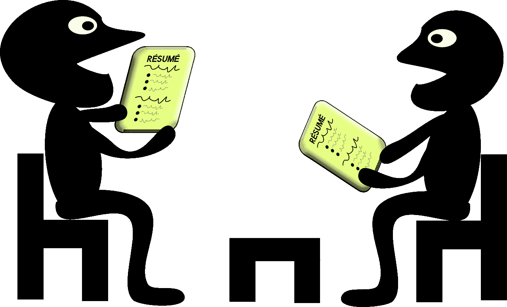
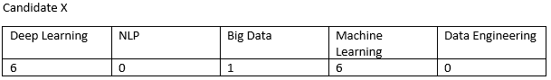
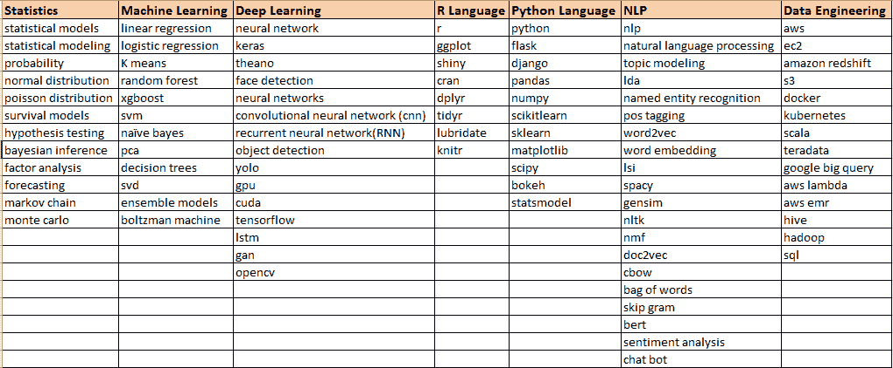
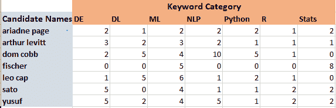
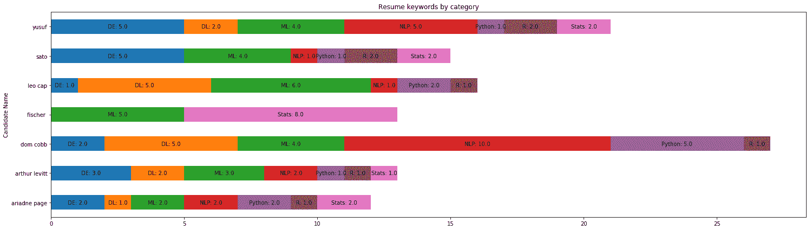

# 我是如何使用 NLP（Spacy）筛选数据科学简历的

> 原文：[`www.kdnuggets.com/2019/02/nlp-spacy-data-science-resumes.html`](https://www.kdnuggets.com/2019/02/nlp-spacy-data-science-resumes.html)

评论

**由 [Venkat Raman](https://twitter.com/venksaiyan)，数据科学家**。

* * *

## 我们的前 3 名课程推荐

 1\. [谷歌网络安全证书](https://www.kdnuggets.com/google-cybersecurity) - 快速进入网络安全职业

 2\. [谷歌数据分析专业证书](https://www.kdnuggets.com/google-data-analytics) - 提升你的数据分析水平

 3\. [谷歌 IT 支持专业证书](https://www.kdnuggets.com/google-itsupport) - 支持你的组织在 IT 领域

* * *

**图片来源：pixabay**

简历制作非常棘手。候选人面临许多困境，

+   *是否详细描述一个项目，还是只提及最基本的信息*

+   *是否提及许多技能，还是仅提及他的核心能力技能*

+   *是否提及许多编程语言，还是仅列出几种*

+   *是否将简历限制为 2 页还是 1 页*

这些困境对于寻找转行机会的数据科学家，甚至对于有志成为数据科学家的人员来说同样困难。

现在，在你还在想这篇文章的方向时，让我告诉你写这篇文章的原因。

#### **背景**

我有一个朋友经营自己的数据科学咨询公司。他最近获得了一个好的项目，需要他雇佣 2 名数据科学家。他在 LinkedIn 上发布了一个职位，并且令他惊讶的是，他收到了近 200 份简历。当我亲自见到他时，他感叹道，“*如果有一种比逐一手动筛选所有简历更快的方式来选择最佳简历就好了*”。

我过去两年一直在进行一些 NLP 项目，既作为工作的一部分，也作为爱好。我决定尝试解决我朋友的问题。我告诉我的朋友，也许我们可以解决这个问题，或者至少通过一些 NLP 技术来减少手动扫描的时间。

#### **确切需求**

我的朋友希望找一个以深度学习为核心能力的候选人，并且要具备其他机器学习算法的知识。另一位候选人需要拥有更多的大数据或数据工程技能，如 Scala、AWS、Docker、Kubernetes 等经验。

#### **方法**

一旦我理解了我的朋友理想中候选人的要求，我制定了一种解决方案。以下是我列出的解决方法

+   *拥有一个字典或表格，将各种技能集分类。例如，如果有像 keras、tensorflow、CNN、RNN 这样的词语，那么将它们放在标题为“深度学习”的一栏下。*

+   *拥有一个 NLP 算法来解析整个简历，并基本上搜索字典或表中提到的单词*

+   *下一步是计算每个类别下单词的出现次数，即每个候选人类似如下的内容*

**上述候选人与我朋友正在寻找的“深度学习数据科学家”匹配良好。**

+   *以可视化方式表示上述信息，以便我们更容易选择候选人*

#### **研究**

现在我已经确定了我的方法，接下来面临的重大挑战是如何实现我刚刚描述的内容。

**NLP 部分 — Spacy**

我一直在寻找一种可以进行“短语/单词匹配”的库。我的搜索需求由 Spacy 满足。Spacy 具有一个名为“Phrase Matcher”的功能。你可以在[这里](https://spacy.io/api/phrasematcher)阅读更多内容。

**阅读简历**

有许多现成的软件包可以帮助读取简历。幸运的是，我朋友得到的所有简历都是 PDF 格式。因此，我决定探索像 PDFminer 或 PyPDF2 的 PDF 包。我选择了 PyPDF2。

**语言**: Python

**数据可视化**: Matplotlib

#### **代码和解释**

**完整代码**

这是完整代码的 Gist 链接。

现在我们有了完整的代码，我想强调两点。

**关键词 csv**

关键词 csv 在代码第 44 行被称为 ‘template_new.csv’

你可以将其替换为你选择的数据库（并在代码中进行必要的更改），但为了简单起见，我选择了传统的 Excel 表（csv）。

每个类别下的单词可以是定制的，以下是我用来进行短语匹配的单词列表。

**候选人****—****关键词表**

在代码的第 114 行，执行该行会生成一个 csv 文件，此 csv 文件显示了候选人的关键词类别计数（候选人的真实姓名已被掩盖）。它的样子如下。

这可能不直观，因此我 resorted 到通过 matplotlib 进行数据可视化，如下所示：

**这里 DE 代表数据工程，其他的都是自解释的**

从图表来看，Dom Cobb 和 Fischer 更像是专家，而其他人则更像是通才！！

#### **整个过程是否有益？**

我的朋友对取得的结果感到非常惊讶，这节省了他大量的时间。更不用说，仅通过运行代码，他就从近 200 份简历中筛选出了大约 15 份。

这整个过程的用处如下

**自动读取简历**

代码自动打开简历并解析内容，而不是手动打开每份简历。如果手动完成这项工作，将耗费大量时间。

**短语匹配和分类**

如果我们手动阅读所有的简历，将很难说一个人是否在机器学习或数据工程方面有专长，因为我们在阅读时没有对短语进行计数。另一方面，这段代码只需寻找关键词，记录出现次数，并对其进行分类。

**数据可视化**

数据可视化在这里是一个非常重要的方面。它通过以下方式加快了决策过程

> *我们可以知道哪个候选人在某个特定类别下的关键词更多，从而推断他/她可能在该类别中有广泛的经验，或者他/她可能是全能型的。*
> 
> *我们可以对候选人进行相对比较，从而帮助我们筛选出那些不符合要求的候选人。*

#### 如何使用这段代码

**求职中的数据科学家/有志成为数据科学家的：**

很多公司可能已经在使用类似的代码来进行初步筛选。因此，建议根据特定的工作需求定制简历，包含必要的关键词。

一个典型的数据科学家有两个选择，要么将自己定位为全能型，要么在某一领域表现为专家，比如“自然语言处理”。根据工作需求，数据科学家可以运行这段代码来分析自己的简历，了解哪些关键词出现得更多，自己是否看起来像“全能型”或“专家”。根据结果，你可以进一步调整简历，以便更好地定位自己。

**招聘人员**

如果你像我的朋友一样是招聘人员并且被大量简历淹没，那么你可以运行这段代码来筛选候选人。

**个人简介**：[Venkat Raman](https://twitter.com/venksaiyan)是一位具有商业头脑的数据科学家。希望在一生中积累知识并与他人分享。

[原文](https://towardsdatascience.com/do-the-keywords-in-your-resume-aptly-represent-what-type-of-data-scientist-you-are-59134105ba0d)。转载已获许可。

**资源：**

+   [在线和基于网络的：分析、数据挖掘、数据科学、机器学习教育](https://www.kdnuggets.com/education/online.html)

+   [分析、数据科学、数据挖掘和机器学习的软件](https://www.kdnuggets.com/software/index.html)

**相关：**

+   [ELMo：上下文语言嵌入](https://www.kdnuggets.com/2019/01/elmo-contextual-language-embedding.html)

+   [2018 年最重要的机器学习/人工智能进展是什么？](https://www.kdnuggets.com/2019/01/machine-learning-ai-advances-2018.html)

+   [2018 年自然语言处理的 10 个激动人心的创意](https://www.kdnuggets.com/2019/01/10-exciting-ideas-2018-nlp.html)

### 更多相关话题

+   [使用 spaCy 进行自然语言处理入门](https://www.kdnuggets.com/2022/11/getting-started-spacy-nlp.html)

+   [使用 spaCy 进行自然语言处理](https://www.kdnuggets.com/2023/01/natural-language-processing-spacy.html)

+   [Python 如何用于数据可视化？](https://www.kdnuggets.com/2022/12/python-used-data-visualization.html)

+   [KDnuggets 新闻，6 月 22 日：主要监督学习算法…](https://www.kdnuggets.com/2022/n25.html)

+   [机器学习中使用的主要监督学习算法](https://www.kdnuggets.com/2022/06/primary-supervised-learning-algorithms-used-machine-learning.html)

+   [最常用的 10 个 Tableau 函数](https://www.kdnuggets.com/2022/08/10-used-tableau-functions.html)
