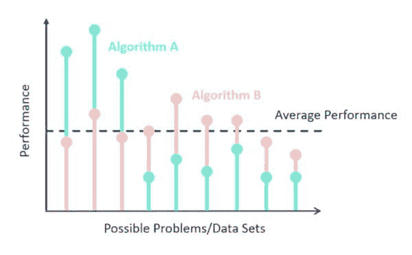
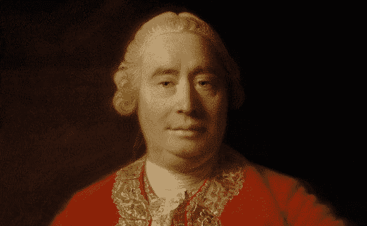
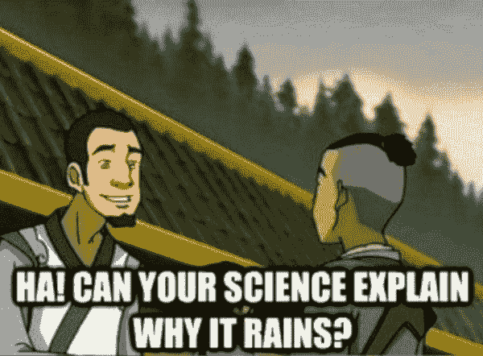

# 数据科学中没有免费的午餐

> 原文：[`www.kdnuggets.com/2019/09/no-free-lunch-data-science.html`](https://www.kdnuggets.com/2019/09/no-free-lunch-data-science.html)

评论

**由 [Sydney Firmin](https://www.linkedin.com/in/sydney-firmin-4369a65b/)，Alteryx**。

在你进行机器学习探索的过程中，你可能已经遇到过“没有免费午餐”定理。借用其名称自俗语"[没有免费的午餐](https://en.wikipedia.org/wiki/There_ain%27t_no_such_thing_as_a_free_lunch)"，[数学民间定理](https://en.wikipedia.org/wiki/Mathematical_folklore)描述了这样一种现象：没有单一算法能够适用于所有可能的场景和数据集。

### 没有免费午餐定理

* * *

## 我们的前三大课程推荐

 1\. [谷歌网络安全证书](https://www.kdnuggets.com/google-cybersecurity) - 快速进入网络安全职业生涯。

 2\. [谷歌数据分析专业证书](https://www.kdnuggets.com/google-data-analytics) - 提升你的数据分析技能

 3\. [谷歌 IT 支持专业证书](https://www.kdnuggets.com/google-itsupport) - 支持你的组织的 IT

* * *

一般来说，有两个没有免费午餐（NFL）定理：一个是针对机器学习的，一个是针对搜索和优化的。这两个定理是相关的，往往被归纳为一个通用的公理（民间定理）。

尽管许多不同的研究人员为关于没有免费午餐定理的集体出版物做出了贡献，但与这些研究最相关的名字是大卫·沃尔珀特。

**监督学习没有免费的午餐**

在他的 1996 年论文[学习算法之间缺乏先验区别](http://citeseerx.ist.psu.edu/viewdoc/download?doi=10.1.1.390.9412&rep=rep1&type=pdf)中，大卫·沃尔珀特探讨了是否可以在没有对目标变量做出任何假设的情况下，从训练数据集和学习算法中获得有用的理论结果。

Wolpert 在其 1996 年的论文中（通过一系列数学证明）证明了，给定一个无噪声的数据集（即没有随机变化，只有趋势）和一个以错误率为成本函数的机器学习算法时，所有机器学习算法在评估时都是等效的，使用的是[泛化误差率](https://en.wikipedia.org/wiki/Generalization_error)（模型在验证数据集上的错误率）。

扩展这一逻辑（Wolpert 用数学方程进行），他展示了对于任何两个算法 A 和 B，A 比 B 表现差的情况与 A 超过 B 的情况数量相同。这甚至适用于其中一个算法是随机猜测的情况。Wolpert 证明了，对于所有可能的领域（从均匀概率分布中抽取的所有可能问题实例），算法 A 和 B 的平均性能是相同的。

这是因为几乎所有的 ([非死记硬背](https://en.wikipedia.org/wiki/Rote_learning#In_computer_science)) 机器学习算法都对预测变量和目标变量之间的关系做出一些假设（称为 [归纳或学习偏差](https://en.wikipedia.org/wiki/Inductive_bias)），将 [偏差](https://en.wikipedia.org/wiki/Bias) 引入模型中。机器学习算法所做的假设意味着某些算法会比其他算法更好地拟合特定的数据集。这也（按定义）意味着存在许多数据集，给定的算法将无法有效建模。模型的有效性直接依赖于模型所做的假设与数据的真实性质的契合程度。

回到午餐的主题，你不能“免费”获得好的机器学习。你必须利用关于你的数据和我们生活的世界（或你的数据所在的世界）的知识来选择一个合适的机器学习模型。没有一种单一的、普遍最佳的机器学习算法，也没有独立于背景或用途的 ([a priori](https://en.wikipedia.org/wiki/A_priori_and_a_posteriori)) 理由来偏好某个算法而不是其他所有算法。

有趣的是，这篇 1996 年的论文是对哲学家 [大卫·休谟](https://en.wikipedia.org/wiki/David_Hume) 工作的数学形式化。我保证稍后会回到这个话题。

**搜索和优化也没有免费午餐**

Wolpert 和 Macready 在 1997 年发表的论文 [优化的无免费午餐定理](https://ti.arc.nasa.gov/m/profile/dhw/papers/78.pdf) 展示了类似“无免费午餐”逻辑在数学领域的搜索和优化中的应用。

搜索和优化的无免费午餐定理表明，对于有限搜索空间中的搜索/优化问题，当被搜索的点*没有*被重新抽样时，任何两个给定搜索算法在所有可能问题上的性能都是相同的。

例如，假设你在徒步旅行，寻找地球上的最高点（极值）。为了找到它，你可能会总是选择朝着海拔升高的方向前进，像一个“爬山者”一样行动。

这在地球上是有效的，因为最高点是非常高的山脉的一部分。

现在，想象一下这样一个世界：地球上的最高点被地球上的最低点所包围。

*这个家伙注定要失望。*

在这种情况下，始终向下搜索的策略会表现得更好。

无论是爬山还是下坡，在两个星球上的表现都没有更好，这意味着随机搜索的效果（平均而言）也一样。在无法假设星球上的最高点会出现在其他高点附近（即平滑的表面）的情况下，我们无法知道爬山是否会比下坡表现得更好。

所有这些归结为：如果无法对优化程序做出任何先验假设，则不能期望任何优化策略比其他策略（包括随机搜索）表现得更好。通用的、万能的优化策略在理论上是不可能的，只有当一种策略专门针对特定问题时，它才能优于另一种策略。听起来很熟悉吧？没有免费的高效搜索优化。

在他 2012 年的论文[《无免费午餐定理的真正含义；如何改进搜索算法》](https://sfi-edu.s3.amazonaws.com/sfi-edu/production/uploads/sfi-com/dev/uploads/filer/33/44/33440e97-fe46-4827-a1eb-a27196e1c49a/12-10-017.pdf)中，Wolpert 讨论了搜索与监督学习之间的紧密关系及其对“无免费午餐”定理的影响。他证明了在“无免费午餐”定理的背景下，监督学习与搜索/优化高度类似。对于这两个定理而言，“搜索算法”似乎可以与“学习算法”互换，“目标函数”也可以与“目标函数”互换。

如果你对每个“无免费午餐”定理感兴趣，可以访问[`www.no-free-lunch.org/`](http://www.no-free-lunch.org/)获取一个很好的总结资源，其中包括 David Wolpert 关于“无免费午餐”定理概述的[PowerPoint 演示文稿](http://www.no-free-lunch.org/coev.pdf)。有关“无免费午餐”定理的更多哲学解释，可以阅读[通知：无人免费午餐，包括贝叶斯方法](http://www.no-free-lunch.org/Fors99.pdf)。

### 我们对“无免费午餐”确定吗？

“无免费午餐”定理引发了大量的研究和学术出版物。这些出版物并不总是支持“无免费午餐”（因为谁不想要免费的午餐呢？）。

“所有可能的问题”这一“无免费午餐”定理的组成部分是第一个难点。所有可能的问题并不反映现实世界的条件。事实上，许多人会争辩说，机器学习和优化所涉及的问题，即“现实世界”问题，与所有问题中的许多领域完全不同。现实世界往往表现出模式和结构，而“所有可能的问题”空间包括完全随机或混乱的场景。

研究人员也在[哲学基础上反对取均值](https://pdfs.semanticscholar.org/83cd/86c2c7e507e8ebba9563a9efaba7c966a1b3.pdf)。如果你一只手放在开水中，另一只手冻在冰块里，那么你的手的平均温度是正常的。算法性能的平均可能会带来麻烦，因为某些算法在大多数问题上表现良好，但在一些边缘案例中表现极差。

在实证研究中，已经证明一些算法的表现始终优于其他算法。在 2014 年的论文[我们是否需要数百种分类器来解决现实世界的分类问题](http://jmlr.org/papers/volume15/delgado14a/delgado14a.pdf)中，研究人员发现，在[UCI 机器学习库](https://archive.ics.uci.edu/ml/datasets.html?format=&task=&att=&area=life&numAtt=&numIns=&type=&sort=nameUp&view=table)（121 个数据集）的所有数据集中，表现最好的分类器包括随机森林、支持向量机（SVM）、神经网络和提升集成。

这是一个重要的考虑因素，因为有些算法似乎在 Kaggle 排行榜上始终名列前茅，或者比其他算法更频繁地被应用于生产环境。然而，“没有免费午餐”定理提醒我们每个模型的假设，以及我们对数据和收集数据的环境（常常是潜意识中的假设）。

### **没有免费午餐与大卫·休谟**

还记得我在（大约 800 字前）承诺会回到那位古老的死去哲学家吗？这就是那一部分。

*这个家伙……*

[大卫·休谟](https://en.wikipedia.org/wiki/David_Hume)是 18 世纪来自爱丁堡的哲学家，特别关注怀疑主义和经验主义。他对[归纳问题](https://en.wikipedia.org/wiki/Problem_of_induction)进行了大量思考，这属于认识论（知识研究领域）。

为了探讨归纳问题，我们首先将世界分为两种不同的知识类型：先验和后验（这种划分可以追溯到[伊曼努尔·康德](https://en.wikipedia.org/wiki/Immanuel_Kant)的工作）。

先验知识是指独立于经验存在的知识。这种知识基于观念之间的关系，例如，2 + 2 = 4，或八边形有八个边。这种知识无论世界外部是什么样子都是真实的。

后验知识或“事实问题”是需要经验或实证证据的知识类型。这种知识构成了大部分个人和科学知识。后验知识需要观察。

[归纳推理](https://en.wikipedia.org/wiki/Inductive_reasoning)是一种用于后验知识的推理方法，我们将观察到的规律性模式应用于我们没有直接观察过的实例；例如，我观察到的所有雨都是湿的，因此，我没有观察到的所有雨也必须是湿的。

通过归纳法，我们隐含地假设了[自然的一致性](https://en.wikipedia.org/wiki/Uniformitarianism)（有时称为一致性原则或相似性原则），并且未来将始终类似于过去。

科学完全基于归纳推理。如果没有像自然的一致性这样的假设，没有任何算法（包括像[科学方法](https://en.wikipedia.org/wiki/Scientific_method)或[交叉验证程序](https://en.wikipedia.org/wiki/Cross-validation_(statistics))这样的高级算法）可以被*证明*优于随机猜测。

休谟认为，归纳推理和因果关系的信念*无法*被理性地证明。假设一致性没有任何理由。根据休谟的观点，归纳对人类来说是本能的，就像狗似乎本能地追逐兔子和松鼠一样。休谟并没有真正提出归纳的解决方案或证明——他只是有点耸肩地说，我们不能改变我们自身的本性，所以不必为此担忧。（我在想象他耸肩的样子。）

大卫·沃尔珀特关于有监督机器学习的无免费午餐定理的工作是对休谟的形式化。沃尔珀特甚至在他 1996 年的论文开头引用了这句休谟的话：

> *即使在观察到物体频繁联结后，我们也没有理由对那些我们没有经验的物体做出任何推断。*
> 
> - 大卫·休谟，在《人性论》第一卷，第三部分，第十二节。

科学（以及机器学习模型）本质上相信在相同条件下，一切总是以相同的方式发生。没有理由假设因为一个模型在一个数据集上表现良好，它也会在其他数据集上表现良好。此外，科学、统计学和机器学习模型不能基于以前实验的结果对未来实验做出保证。没有任何系统可以对任何环境中的预测、控制或观察做出保证。

如果你喜欢这段哲学的绕行，想要了解更多关于休谟和归纳问题的信息，Khan Academy 上有一个很棒的视频，叫做[休谟：怀疑主义与归纳，第二部分](https://www.khanacademy.org/partner-content/wi-phi/wiphi-history/wiphi-hume/v/humes-skepticism-and-induction-part-2)（[第一部分](https://www.khanacademy.org/partner-content/wi-phi/wiphi-history/wiphi-hume/v/humes-skepticism-part-1)讲的是先验知识与后验知识）。

### 无免费午餐定理与您

如果你已经坚持到现在，你可能在寻找这些内容对你的意义。来自“没有免费午餐”定理的两个最重要的结论是：

+   **在依赖模型或搜索算法之前，始终检查你的假设。**

+   **没有“超级算法”能够完美适用于所有数据集。**

“没有免费午餐”定理并不是为了告诉你在不同场景下该怎么做。“没有免费午餐”定理专门写来反驳类似于以下的主张：

我的机器学习算法/优化策略是*最优秀的，永远如此*，适用于所有场景。

模型是现实特定组件的简化（通过数据观察得出）。为了简化现实，机器学习算法或统计模型需要做出假设并引入偏差（特别称为[归纳或学习偏差](https://en.wikipedia.org/wiki/Inductive_bias)）。无偏学习是徒劳的，因为一个没有先验假设的学习者在面对新的、未见过的输入数据时将没有合理的基础来创建估计。算法的假设对于某些数据集有效，但对其他数据集无效。理解这些现象对理解[欠拟合](https://en.wikipedia.org/wiki/Overfitting#Underfitting)和[偏差/方差权衡](https://en.wikipedia.org/wiki/Bias%E2%80%93variance_tradeoff)非常重要。

数据和随机选择的机器学习模型的组合不足以对未来或未知结果做出准确或有意义的预测。你，人类，需要对你的数据和我们所生活的世界的性质做出假设。积极参与假设的制定只会增强你的模型，使其更有用，[即使它们是错误的](https://community.alteryx.com/t5/Data-Science-Blog/All-Models-Are-Wrong/ba-p/348080)。

[原文](https://community.alteryx.com/t5/Data-Science-Blog/There-is-No-Free-Lunch-in-Data-Science/ba-p/347402)。经许可转载。

**简介：**一名训练有素的地理学家和数据爱好者，[Sydney Firmin](https://www.linkedin.com/in/sydney-firmin-4369a65b/)坚信数据和知识在被清晰传达和理解时才最有价值。作为高级数据科学内容工程师，她的工作就是将技术知识和研究转化为引人入胜、富有创意和有趣的内容，服务于 Alteryx 社区。

**相关：**

+   [10 种梯度下降优化算法 + 备忘单](https://www.kdnuggets.com/2019/06/gradient-descent-algorithms-cheat-sheet.html)

+   [优化工作原理](https://www.kdnuggets.com/2019/04/how-optimization-works.html)

+   [有监督学习与无监督学习](https://www.kdnuggets.com/2018/04/supervised-vs-unsupervised-learning.html)

### 更多相关话题

+   [停止学习数据科学以寻找目标，并以寻找目标为目的…](https://www.kdnuggets.com/2021/12/stop-learning-data-science-find-purpose.html)

+   [学习数据科学统计的最佳资源](https://www.kdnuggets.com/2021/12/springboard-top-resources-learn-data-science-statistics.html)

+   [成功数据科学家的 5 个特征](https://www.kdnuggets.com/2021/12/5-characteristics-successful-data-scientist.html)

+   [每个数据科学家都应该了解的三大 R 库（即使你使用 Python）](https://www.kdnuggets.com/2021/12/three-r-libraries-every-data-scientist-know-even-python.html)

+   [一个 90 亿美元的 AI 失败，分析探讨](https://www.kdnuggets.com/2021/12/9b-ai-failure-examined.html)

+   [为什么 Python 是初创公司的理想编程语言](https://www.kdnuggets.com/2021/12/makes-python-ideal-programming-language-startups.html)
