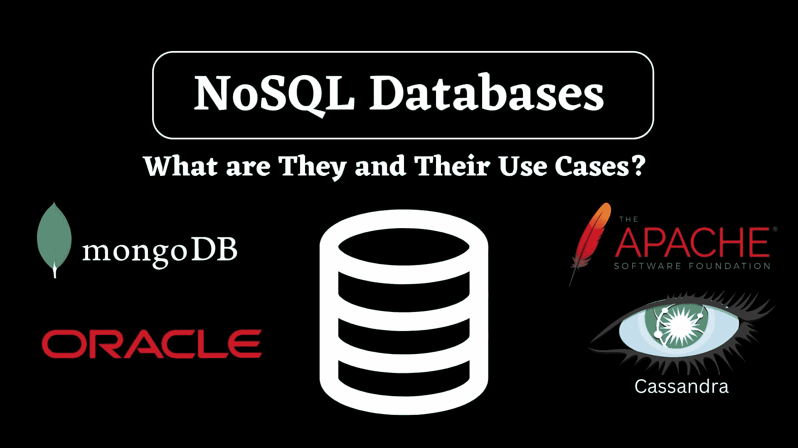
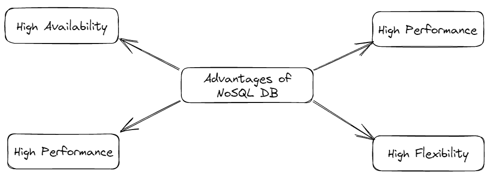
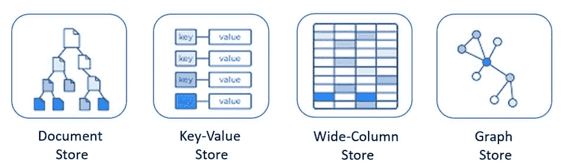

# NoSQL 数据库及其应用场景

> 原文：[`www.kdnuggets.com/2023/03/nosql-databases-cases.html`](https://www.kdnuggets.com/2023/03/nosql-databases-cases.html)

作者图片

在 1970 年代，**埃德加·F·科德** 提出了关系数据库模型，通常称为 SQL 数据库。这些数据库主要设计用于处理具有关系模型的结构化数据。它们可以处理事务数据，即在具有预定义模式的表中存储和操作数据。著名的 SQL 数据库例子有 MySQL、PostgreSQL 和 Oracle Server。

* * *

## 我们的三大课程推荐

 1\. [Google 网络安全证书](https://www.kdnuggets.com/google-cybersecurity) - 快速进入网络安全职业生涯。

 2\. [Google 数据分析专业证书](https://www.kdnuggets.com/google-data-analytics) - 提升你的数据分析技能

 3\. [Google IT 支持专业证书](https://www.kdnuggets.com/google-itsupport) - 支持你的组织 IT

* * *

在 1980 年代，它们获得了巨大的流行，但之后数据需求和数据量增加，数据类型的需求变得更加多样化，以至于 SQL 数据库感到吃力。此外，它们在横向扩展方面复杂，这使得它们不适合处理大量数据。

为了应对 SQL 数据库的这些局限性，在 2000 年代初期，NoSQL 数据库出现了。它们是面向文档的数据库，使用快速的键值对存储数据。它们能够从文档中解析数据，并将数据存储在键下，而不是像 SQL 数据库那样定义严格的信息表。

NoSQL 数据库现在已成为主流，并提供了相对于 SQL 数据库的各种优势。但这并不一定意味着 NoSQL 数据库比 SQL 更好。SQL 和 NoSQL 数据库服务于不同的目的，采用不同的数据管理方法。一个用于关系数据，另一个用于非关系数据。SQL 数据库仍在使用中，当需要运行复杂查询且数据库模式已明确定义时。著名的例子有 MongoDB、Cassandra、Neo4J 和 Redis。

但在下文讨论的某些领域，NoSQL 数据库优于 SQL 数据库。

# NoSQL 数据库的优势

以下是 NoSQL 数据库在某些方面表现优于 SQL 数据库的关键特性。

1.  **灵活性：**

这意味着数据可以动态地添加或移除，而不需要更改原始数据库的结构。与 SQL 数据库不同，它们不需要严格的模式。它们被设计用来处理任何数据格式，包括结构化、半结构化或非结构化数据。这使得开发人员可以专注于应用程序开发，而不必担心数据库模式。

1.  **可扩展性：**

NoSQL 数据库支持水平扩展，这意味着我们可以通过添加更多服务器来扩展系统，而不是增加单个服务器的容量。这使得它在处理大量请求时更强大。

1.  **高可用性：**

由于其将数据库复制到多个服务器的特性，它为用户提供了非常低的延迟和几乎零停机时间。此外，它们还将流量分配到各个服务器，以减少单个服务器的负担。

1.  **性能：**

它们被设计用于优化读写性能，使其适用于实时数据处理应用程序，其中每天生成数 TB 的数据。它们具有更快的查询响应时间，并支持数据库分片，从而提升整体性能。

图片由作者提供

这些是 NoSQL 数据库在某些方面比 SQL 数据库表现更好的地方。以下部分将讨论 NoSQL 数据库的类型及其使用案例。

# NoSQL 数据库类型

有多种类型的 NoSQL 数据库，每种都有其自身的优点和限制。以下是一些流行的数据库类型：

## 键值

这是最灵活的 NoSQL 数据库。它需要键值对来存储数据。键可以是一个唯一属性，如 id，对应特定的值。应用程序可以在值字段中存储任何类型的数据。这些数据库适合实时应用、缓存或会话管理。Redis 和 Riak 是著名的键值数据库示例。

**使用案例：**

这个数据库最适合电子商务平台，在这些平台上，像订单、用户档案和产品目录等大量客户相关数据每天都会生成。由于其低延迟和快速处理能力，它适合实时库存管理和处理高流量。

## 面向文档

这些数据库以文档形式存储数据，主要是 JSON 对象。这最适合存储半结构化或非结构化数据，无需明确指定文档的字段。MongoDB 是一个著名的面向文档的数据库示例。

**使用案例：**

这最适合用于内容管理系统，例如博客网站。以文章、评论、分类和标签的形式存储和快速检索数据。基于文档的数据适合存储非结构化数据，如文本、图像、链接等。此外，其灵活的模式行为允许对数据模型进行轻松更改。

## 图数据库

这种类型的 NoSQL 数据库最适合存储彼此紧密相关的数据。它们以节点和边的形式存储数据，用于表示对象之间的复杂关系。最适合用于社交媒体应用和创建推荐引擎。著名的例子有 Neo4J 和 InfoGrid。

**使用案例：**

它们最适合用于创建推荐引擎。例如，Youtube 会根据用户的观看历史推荐视频。图数据库可以存储和处理互联的数据，并快速提供相关内容。

## 列式数据库

在这种类型的 NoSQL 数据库中，数据存储在列族中。类似类型的数据被分组到单元格中，并存储在数据列中而不是行中。一个列甚至可以包含多个行和列，这些行和列都有自己唯一的 ID。

在传统的 SQL 数据库中，查询是逐行执行的。但在列式数据库中，查询只针对我们想要的特定列执行。这节省了时间，并使其适合处理大规模数据集。它们可能看起来像 SQL 数据库，因为它们涉及某种形式的模式管理，并且与关系表的工作方式相同。但它们比 SQL 数据库更灵活和高效，因此被归类为 NoSQL 数据库。

列式数据库的流行例子包括 Apache HBase 和 Apache Cassandra。你可以阅读这篇由 Alex Williams 撰写的文章，以获取更多关于这个主题的信息。

**使用案例：**

列族数据库最适合用于数据仓储应用。这些应用需要分析大量数据以获得商业智能，并且具有高写入吞吐量，而列族数据库完全可以承担这些任务。

不同类型的 NoSQL 数据库 | 作者图片

# 结论

在本文中，我们了解了什么是 NoSQL 数据库，并初步了解了 SQL 与 NoSQL 数据库之间的根本区别。接着，我们讨论了几种流行的 NoSQL 数据库类型及其使用场景。

在 SQL 和 NoSQL 数据库之间总是存在一个***选择什么？*** 的问题。要做出正确的选择，首先必须了解应用程序的使用案例、数据模型、可扩展性和性能，然后再决定。

希望你喜欢阅读这篇文章。如果你有任何评论或建议，请通过[Linkedin](https://www.linkedin.com/in/aryan-garg-1bbb791a3/)与我联系。

**[Aryan Garg](https://www.linkedin.com/in/aryan-garg-1bbb791a3/)** 是一名 B.Tech. 电气工程学生，目前在本科最后一年。他对 Web 开发和机器学习领域充满兴趣。他已经追求了这个兴趣，并渴望在这些方向上进一步工作。

### 更多相关内容

+   [AI 和 LLM 用例中的向量数据库](https://www.kdnuggets.com/vector-databases-in-ai-and-llm-use-cases)

+   [企业中的机器学习：用例与挑战](https://www.kdnuggets.com/2022/08/dss-machine-learning-enterprise-cases-challenges.html)

+   [DALLE-3 的 5 个用例](https://www.kdnuggets.com/5-use-cases-of-dalle-3)

+   [SQL 与 NoSQL：7 个关键要点](https://www.kdnuggets.com/2020/12/sql-vs-nosql-7-key-takeaways.html)

+   [为什么 TinyML 用例越来越受欢迎？](https://www.kdnuggets.com/2022/10/tinyml-cases-becoming-popular.html)

+   [KDnuggets™ 新闻 22:n04，1 月 26 日：高薪副业…](https://www.kdnuggets.com/2022/n04.html)
