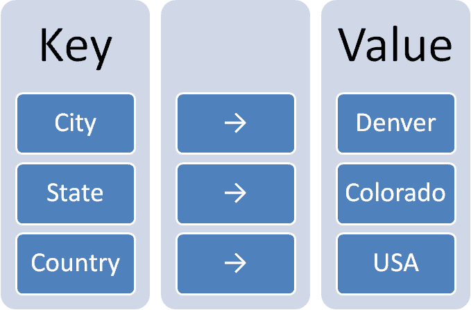
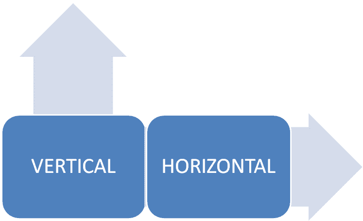

# 键值数据库解释

> 原文：[`www.kdnuggets.com/2021/04/nosql-explained-understanding-key-value-databases.html`](https://www.kdnuggets.com/2021/04/nosql-explained-understanding-key-value-databases.html)

NoSQL 在我们日常生活中变得越来越重要，一些最受欢迎的平台和服务依赖它们以闪电般的速度提供内容。当然，NoSQL 涵盖了多种数据库类型，但最受欢迎的无疑是键值存储。

这种数据模型的极简设计使得它与关系数据库相比表现得极其迅速。不仅如此，由于它遵循可扩展的 NoSQL 设计理念，键值存储允许灵活性和快速启动。

* * *

## 我们的前三大课程推荐

 1\. [Google Cybersecurity Certificate](https://www.kdnuggets.com/google-cybersecurity) - 快速进入网络安全职业轨道。

 2\. [Google Data Analytics Professional Certificate](https://www.kdnuggets.com/google-data-analytics) - 提升你的数据分析技能

 3\. [Google IT Support Professional Certificate](https://www.kdnuggets.com/google-itsupport) - 支持你的组织的 IT 需求

* * *

# 键值存储是如何工作的？

键值存储实际上非常简单。一个值（基本上可以是任何数据或信息）与一个标识其位置的键一起存储。事实上，这是几乎每种编程语言中存在的一种设计概念，如数组或映射对象。不同之处在于，它是持久化存储在数据库管理系统中的。

键值存储之所以如此受欢迎，是因为信息的存储方式类似于一种不透明的块，而不是离散的数据。因此，实际上不需要对数据库进行索引来提高性能。相反，它由于其结构方式而自行提高性能。类似地，它没有自己的语言，而是依赖简单的 get、put 和 delete 命令。

当然，这也带来了一个缺点，即从请求中获取的信息没有经过过滤。这种对数据的控制缺失在某些情况下可能会成为问题，但大多数情况下，这种交换是值得的。由于键值存储速度快且可靠，大多数程序员会解决可能遇到的任何过滤/控制问题。

# 键值存储的好处

作为 NoSQL [数据模型](https://hostingdata.co.uk/nosql-database/)中更受欢迎的形式之一，键值存储在构建数据库时有很多好处：

**可扩展性**：与关系数据库相比，键值存储（如 NoSQL 一般）在水平扩展方面具有无限的可扩展性。与扩展是垂直和有限的关系数据库相比，这对于复杂和大型数据库来说是一个很大的优势。

更具体地说，它通过分区和复制来管理这方面的工作。它还通过绕过低开销的服务器调用来最小化 ACID 保证。

**无/简化查询**：一般来说，键值存储几乎无法进行查询，除了在特定情况下查询键，即便如此也不总是可能。因此，在会话、用户配置文件、购物车等情况下，键值存储使处理变得更便宜，因为只需一次读取请求和一次写入请求（由于数据存储的 blob 样式）。

同样，处理并发问题也更为容易，因为你只需解决一个键。

**移动性**：由于没有查询语言，键值存储在从一个系统迁移到另一个系统时非常容易，无需新的架构或更改代码。因此，从旧的操作系统迁移到新的操作系统不会像关系数据库那样造成严重中断。

# 何时使用键值存储

传统关系数据库并不适合处理大量读写操作，这正是键值存储的优势所在。由于其易于扩展，键值存储可以处理成千上万的用户。此外，凭借内置的冗余，它可以在存储或数据丢失的情况下正常工作。

因此，键值存储在以下几种情况中表现出色：

+   用户偏好和配置文件存储

+   大规模用户会话管理

+   产品推荐（例如在 [电子商务平台](https://zyro.com/blog/make-first-sale-guide-ecommerce-beginner/) 上）

+   根据用户的数据配置文件定制广告投放

+   仅更新数据的数据缓存

键值存储还在其他各种情况下表现良好。例如，由于其可扩展性，它通常用于大数据研究。同样，键值存储在会话管理中表现良好，无论是 Web 应用程序还是 MMO 游戏，以及管理单个玩家的会话。

另一个很好的用途是在平台上的临时和季节性购买激增。例如，在圣诞节、感恩节、国定假日等情况中。与其在全年的使用不多的基础设施上投入大量资金，不如利用键值存储的快速和简便的扩展性，商店可以购买一个或多个临时分片来帮助处理这些季节性的激增。

# 流行键值数据库的示例

有几种不同类型的键值数据库模型可以选择，例如，有些将数据存储在 SSD 上，而其他则存储在 RAM 上。事实上，一些最受欢迎和广泛使用的数据库是键值存储，我们在日常生活中每天都依赖它们。

[Amazon DynamoDB](https://aws.amazon.com/dynamodb/): 可能是*最*广泛使用的键值存储数据库，实际上，正是对 DynamoDB 的研究真正使 NoSQL 变得非常流行。

[Aerospike](https://www.aerospike.com/): 开源数据库，优化了内存存储。

[Berkeley DB](https://www.oracle.com/database/technologies/related/berkeleydb.html): 另一个开源数据库，是一个高性能的数据库存储库，尽管它相对基础。

[Couchbase](https://www.couchbase.com/): 有趣的是，它允许进行文本搜索和类似 SQL 的查询。

[Memcached](https://memcached.org/): 通过将缓存数据存储在 RAM 中来加速网站，而且它是免费和开源的。

[Riak](https://riak.com/products/): 为开发应用程序而设计，它与其他数据库和应用程序兼容良好。

[Redis](https://redis.io/): 一个多用途的数据库，同时也充当内存缓存和消息代理。

# 结论

键值存储的真正优势在于它的简单性。虽然这可能是一把双刃剑，特别是在处理金融交易等更复杂的事务时，但它的目的就是弥补关系数据库的不足。通过结合关系型和非关系型数据库，我们可以创建一个更高效的管道，无论是用于数据分析还是处理用户。

**[亚历克斯·威廉姆斯](https://hostingdata.co.uk/author/alex-williams/)** 是一位经验丰富的全栈开发者，也是 [Hosting Data UK](https://hostingdata.co.uk/) 的拥有者。亚历克斯从伦敦大学毕业，主修 IT，之后在全球各地为客户领导了各种项目，工作了近 10 年。最近，亚历克斯转为独立 IT 顾问，并开设了自己的博客。在那里，他探讨了网页开发、数据管理、数字营销以及刚刚起步的在线企业主的解决方案。

### 更多相关话题

+   [从 Oracle 到 AI 数据库：数据存储的演变](https://www.kdnuggets.com/2022/02/oracle-databases-ai-evolution-data-storage.html)

+   [NoSQL 数据库及其使用案例](https://www.kdnuggets.com/2023/03/nosql-databases-cases.html)

+   [AI 和 LLM 使用案例中的向量数据库](https://www.kdnuggets.com/vector-databases-in-ai-and-llm-use-cases)

+   [使用向量数据库的语义搜索](https://www.kdnuggets.com/semantic-search-with-vector-databases)

+   [使用 SQLite 数据库的 Python 指南](https://www.kdnuggets.com/a-guide-to-working-with-sqlite-databases-in-python)

+   [什么是向量数据库，它们为何对 LLMs 重要？](https://www.kdnuggets.com/2023/06/vector-databases-important-llms.html)
