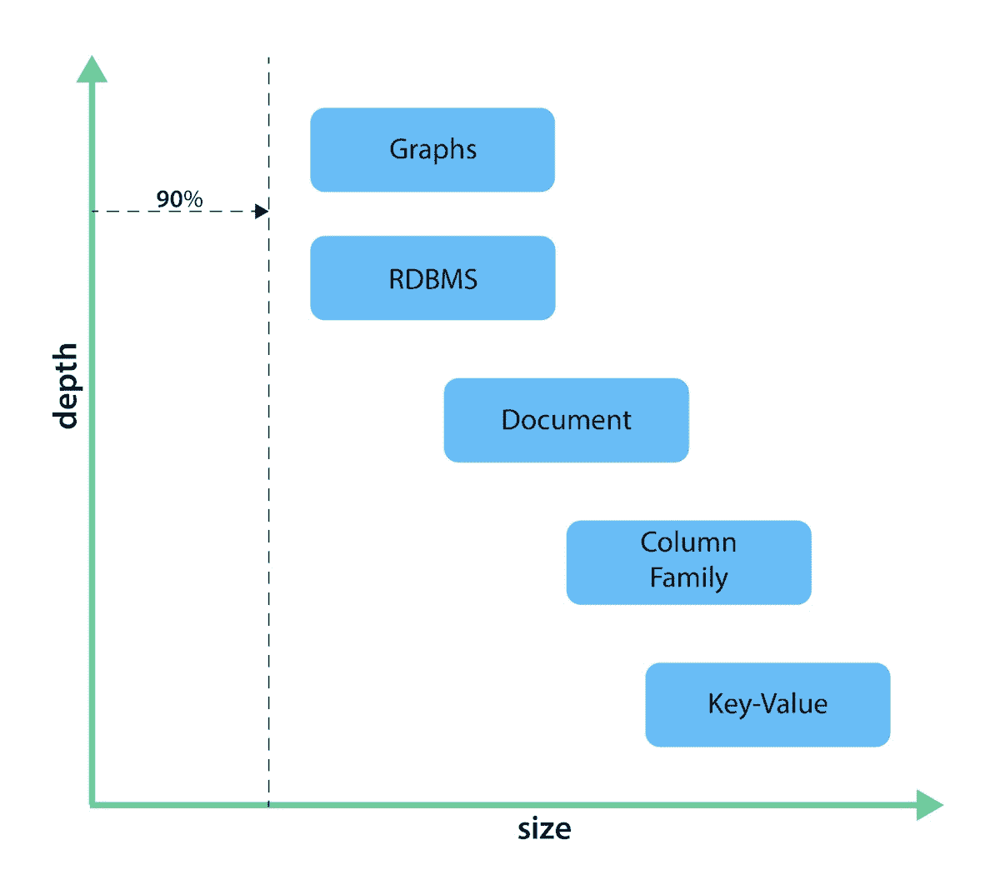
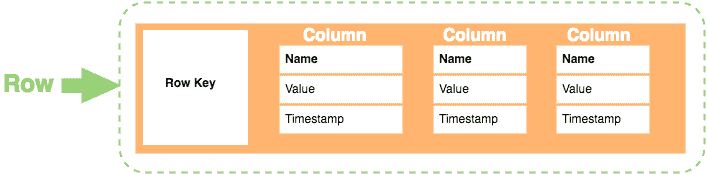
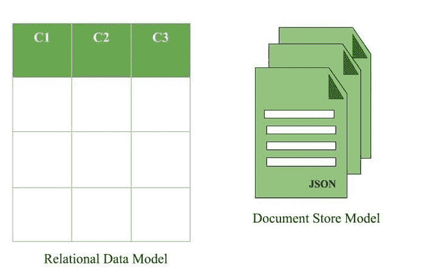

# NoSQL 全知道大全

> 原文：[`www.kdnuggets.com/2021/05/nosql-know-it-all-compendium.html`](https://www.kdnuggets.com/2021/05/nosql-know-it-all-compendium.html)

评论

> **编辑备注：** 这是从 KDnuggets 文章中摘录的合集，由作者 [Alex Williams](https://www.kdnuggets.com/author/alex-williams) 编写，涵盖了针对初学者的 NoSQL 主题和概念，附有进一步阅读的完整文章链接。

### 什么是 NoSQL？

NoSQL 本质上是对 SQL 刚性结构的回应。虽然 NoSQL 在 1970 年代初期首次创建，但直到 2000 年代末，亚马逊和谷歌都投入了大量的研究和开发，NoSQL 才真正起飞。从那时起，它已经成为现代世界的重要组成部分，许多全球大网站都使用某种形式的 NoSQL。

那么 NoSQL 到底是什么呢？本质上，它是一种创建数据库的理念，不需要模式，也不将数据存储在关系模型中。实际上，NoSQL 提供了各种 NoSQL 数据库，每种数据库都有自己的专业化和使用案例。因此，NoSQL 在填补特定需求时非常多样化，你几乎可以找到符合你需求的 NoSQL 数据模型。

虽然 SQL 是特定的数据库和语言，但 NoSQL 并不是，但这并不意味着我们不能看看两者之间的通用理念和差异。

继续阅读**NoSQL 入门指南**。

### SQL 与 NoSQL

开发者们都非常清楚持续教育的必要性。无论是学习新的框架还是新的服务，创新和适应都是开发的基础。今天的一个热点话题是选择标准的 SQL 数据库还是转向 NoSQL 数据库。

NoSQL 数据库已经存在了几十年，感谢 Carlo Strozzi 的创新。然而，这些数据库直到 2000 年代初期才开始受到关注。当时，谷歌和亚马逊等公司开始更加努力地开发 NoSQL 数据库。尽管它们近年来变得非常流行，许多开发者、架构师和设计师可能仍未完全了解 NoSQL 数据库所提供的功能。

因此，了解这两种数据库之间的差异，可以参考以下每个开发者都应该知道的 7 个关键要点。

继续阅读**SQL 与 NoSQL: 7 个关键要点**。

NoSQL 已越来越受欢迎，作为传统 SQL 数据库和数据库管理方法的补充工具。正如我们所知，NoSQL 不遵循 SQL 的关系模型，这使得它能够做许多强大的事情。更重要的是，它非常灵活和可扩展，这对那些没有时间或预算来设计 SQL 数据库的新项目来说非常有利。

因此，我们将深入探讨不同的 [数据模型](https://hostingdata.co.uk/nosql-database/) 是如何工作的。

### 列导向数据库

从表面上看，列存储数据库确实做了它所宣传的事情：即，它不是按行组织信息，而是按列组织。这使得它们的功能与关系数据库中的表类似。当然，由于这是一个 NoSQL 数据库，这种数据模型使它们更加灵活。

更具体地说，列数据库使用密钥空间的概念，这有点像关系模型中的模式。这个密钥空间包含所有的列族，列族中包含行，行中包含列。一开始可能有点难以理解，但相对来说还是比较简单的。

通过快速查看，我们可以看到一个列族包含几行。在每一行中，可以有几列不同的列，具有不同的名称、链接，甚至大小（这意味着它们不需要遵循标准）。此外，这些列仅存在于它们自己的行中，并且可以包含值对、名称和时间戳。

继续阅读 **列导向数据库解析**。

### 图数据库

具有讽刺意味的是，尽管是一个非关系数据库，图形主要基于多关系数据“路径”的概念。

图数据库的结构一般比较直接。它们主要由两个组成部分构成：

+   节点：这实际上是数据本身。它可以是一个 YouTube 视频的观看次数，阅读推文的人数，甚至是基本信息，如人的名字、地址等。

+   边：这解释了两个节点之间的实际关系。有趣的是，边还可以包含自身的信息，例如两个节点之间关系的性质。类似地，边也可能具有描述数据流向的方向。

继续阅读 **图数据库解析**。

### 文档数据库

表面上看，文档数据库的理念是你可以在文档中存储任何类型的信息。这意味着你可以混合和匹配任何你想要的数据，而不必担心数据库无法解析它。当然，在实际操作中，大多数文档数据库仍然倾向于使用某种形式的模式、文件格式和预定结构。

与既是表格型又是关系型的 SQL 数据库相比，文档存储没有 SQL 的那些缺陷和限制。这意味着处理手头信息要容易得多，查询也可以更简单。具有讽刺意味的是，你在 SQL 数据库中可以执行的操作，如删除、添加和查询，也可以在文档存储中执行。

如前所述，每个文档需要某种键，该键通过唯一 ID 提供。当在任何过程中提供唯一 ID 时，文档中的信息会被直接读取和处理，而不是逐列提取。

继续阅读 **文档数据库解析**。

### 键值数据库

键值存储实际上相当简单。一个值，可以是任何数据或信息，存储在一个标识其位置的键下。事实上，这是一种几乎存在于每个编程中的设计概念，如数组或映射对象。不同之处在于，它是持久存储在数据库管理系统中的。

键值存储之所以如此受欢迎，是因为信息的存储方式是一种不透明的二进制大对象，而不是离散的数据。因此，实际上无需为数据库建立索引以提高其性能。相反，由于其结构的方式，数据库本身的性能更快。类似地，它实际上没有自己特定的语言，而是依赖于简单的 get、put 和 delete 命令。

当然，这也带来了一个缺点，即你从请求中获取的信息没有经过过滤。在某些情况下，这种数据控制的缺失可能会带来问题，但大多数情况下，这种交换是值得的。由于键值存储快速且可靠，大多数程序员会绕过可能出现的任何过滤/控制问题。

继续阅读 **键值数据库解析**。

**简介：[亚历克斯·威廉姆斯](https://hostingdata.co.uk/author/alex-williams/)** 是一名经验丰富的全栈开发人员，同时也是 [Hosting Data UK](https://hostingdata.co.uk/) 的拥有者。在伦敦大学 IT 专业毕业后，亚历克斯作为开发人员为来自世界各地的客户领导了各种项目近 10 年。最近，亚历克斯转为独立 IT 顾问，并开设了自己的博客。在博客中，他探索了网络开发、数据管理、数字营销和针对刚起步的在线商业主的解决方案。

**相关**：

+   NoSQL 入门

+   SQL 与 NoSQL：7 个关键要点

+   是否使用 SQL：这是个问题！

* * *

## 我们的前三大课程推荐

 1\. [谷歌网络安全证书](https://www.kdnuggets.com/google-cybersecurity) - 快速入门网络安全职业生涯

 2\. [谷歌数据分析专业证书](https://www.kdnuggets.com/google-data-analytics) - 提升你的数据分析能力

 3\. [谷歌 IT 支持专业证书](https://www.kdnuggets.com/google-itsupport) - 支持你所在组织的 IT 工作

* * *

### 更多相关主题

+   [SQL 与 NoSQL：7 个关键要点](https://www.kdnuggets.com/2020/12/sql-vs-nosql-7-key-takeaways.html)

+   [NoSQL 数据库及其应用场景](https://www.kdnuggets.com/2023/03/nosql-databases-cases.html)

+   [Python 中的所有集合](https://www.kdnuggets.com/2022/09/collections-python.html)

+   [科技领域的裁员潮怎么回事？](https://www.kdnuggets.com/2023/02/layoffs-tech.html)

+   [超级巴德：能做一切且更优秀的 AI](https://www.kdnuggets.com/2023/05/super-bard-ai-better.html)

+   [如果你想掌握生成性 AI，忽略所有（除了两个）工具](https://www.kdnuggets.com/if-you-want-to-master-generative-ai-ignore-all-but-two-tools)
