# Noteable 插件：自动化数据分析的 ChatGPT 插件

> 原文：[`www.kdnuggets.com/2023/06/noteable-plugin-chatgpt-plugin-automates-data-analysis.html`](https://www.kdnuggets.com/2023/06/noteable-plugin-chatgpt-plugin-automates-data-analysis.html)

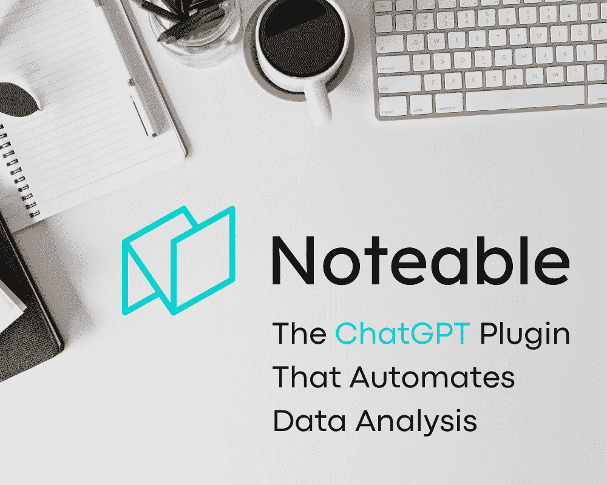

图片来源：编辑

生成式 AI 文本工具如 ChatGPT 使我们的生活变得更加轻松。从内容规划、回答问题到代码生成，这些现在都变得可能。这在几年前是无法想象的。

* * *

## 我们的前三大课程推荐

 1\. [Google 网络安全证书](https://www.kdnuggets.com/google-cybersecurity) - 快速进入网络安全职业生涯。

 2\. [Google 数据分析专业证书](https://www.kdnuggets.com/google-data-analytics) - 提升你的数据分析水平

 3\. [Google IT 支持专业证书](https://www.kdnuggets.com/google-itsupport) - 支持您的组织的 IT

* * *

ChatGPT 的能力通过[ChatGPT 插件](https://openai.com/blog/chatgpt-plugins)进一步扩展。ChatGPT 可以通过插件连接到第三方应用程序，并增强工具以执行额外的操作。其中之一是进行数据分析，我们将在本文中进一步探讨。

它是如何工作的？让我们深入了解一下。

# Noteable 插件

[Noteable](https://noteable.io/) 是一家初创公司，提供用于任何数据活动的协作笔记本，例如数据准备、EDA 和机器学习开发。这意味着我们可以与多个用户共享一个笔记本。该笔记本还可以根据需要使用 Python、R 和 SQL 编程语言。

Noteable 的一个增强功能是[ChatGPT Noteable 插件](https://noteable.io/chatgpt-plugin-for-notebook/)。使用此插件，用户可以通过将提示输入平台来加快数据处理。这款插件非常适合需要熟悉笔记本的非技术用户和需要帮助的技术用户。

# 如何使用 Noteable 插件

要使用 Noteable 插件，你需要访问 ChatGPT 插件。这意味着你需要成为 ChatGPT Plus 用户。目前，这是访问第三方插件到 ChatGPT 平台的唯一途径。

成为 Plus 用户后，前往设置并激活插件选择。目前，插件处于 Beta 阶段，因此它会在 Beta 功能部分中。

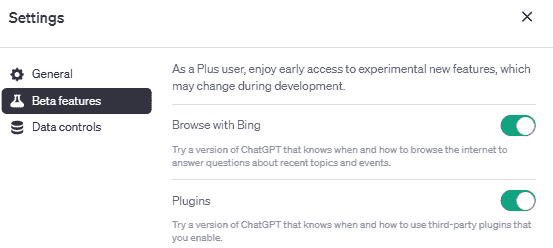

图片来源：作者

一旦激活插件，你将在 ChatGPT 平台的 GPT-4 模型下看到插件选择。

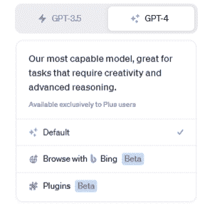

图片由作者提供

选择插件并找到插件商店。搜索 Noteable 并安装插件。

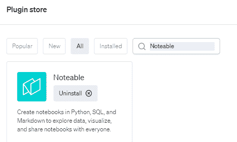

图片由作者提供

安装完成后，从所有已安装的 Noteable 插件中找到 Noteable 插件并启用它们。现在我们可以使用插件了。

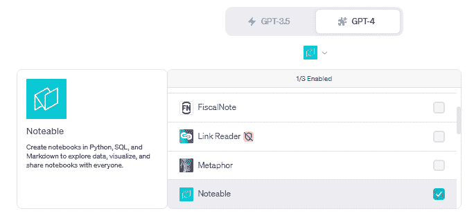

图片由作者提供

首先，我会提供提示：“你能给我一个用于 Titanic 数据集的简单 EDA 吗？”

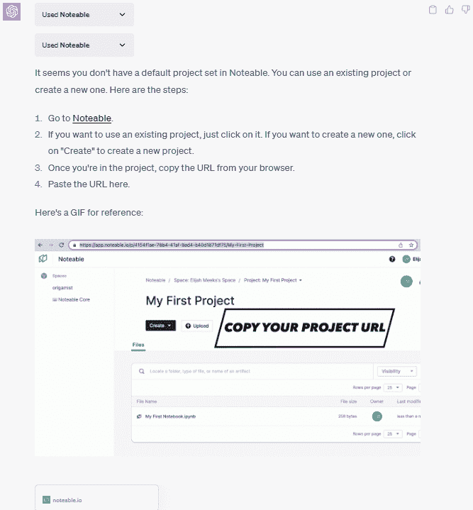

图片由作者提供

ChatGPT 会提示我们在 Noteable 中没有设置默认项目。这意味着我们需要在使用此插件之前设置 Noteable 项目。为此，我们必须登录到[Noteable](https://app.noteable.io/)并创建项目。它是免费的，因此我们不需要设置信用卡或其他东西。

登录 Noteable 后，选择“创建”按钮和“项目”。之后，为你的项目命名并复制 URL 链接。

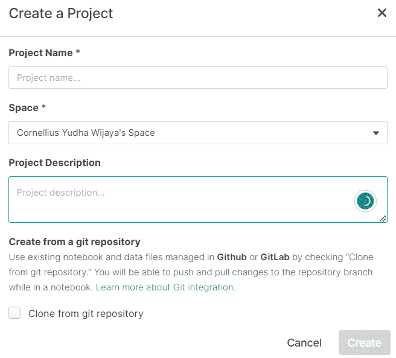

图片由作者提供

有了项目 URL，将其传递给 ChatGPT，并使用类似于下面图片的提示。

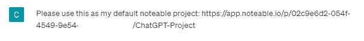

图片由作者提供

现在我们准备好让 ChatGPT 自动执行分析。一旦你输入上述提示，Noteable 插件将尝试找到数据并提供 EDA。结果会显示在你的 ChatGPT 中。

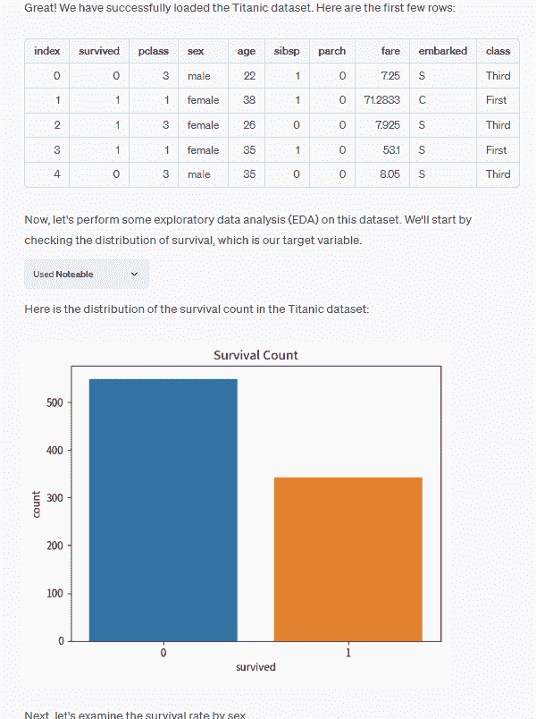

图片由作者提供

不仅限于 ChatGPT 的结果，包含数据分析代码的笔记本也将在你的 Noteable 项目中准备好。

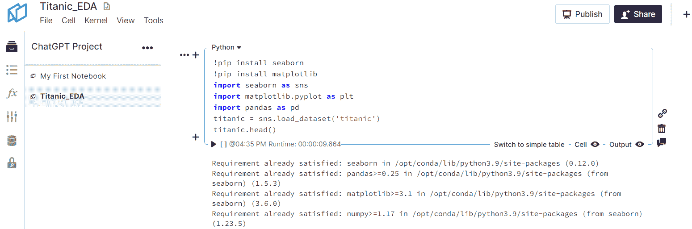

图片由作者提供

如果你愿意，可以在 ChatGPT 中继续分析；例如，我要求 ChatGPT 提供一个试图预测幸存者的机器学习模型，

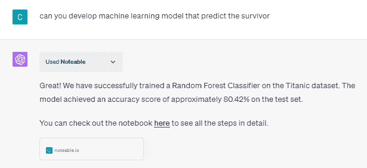

图片由作者提供

我还要求 ChatGPT 将模型保存为 pickle 对象。输出还展示了如果需要如何部署模型。

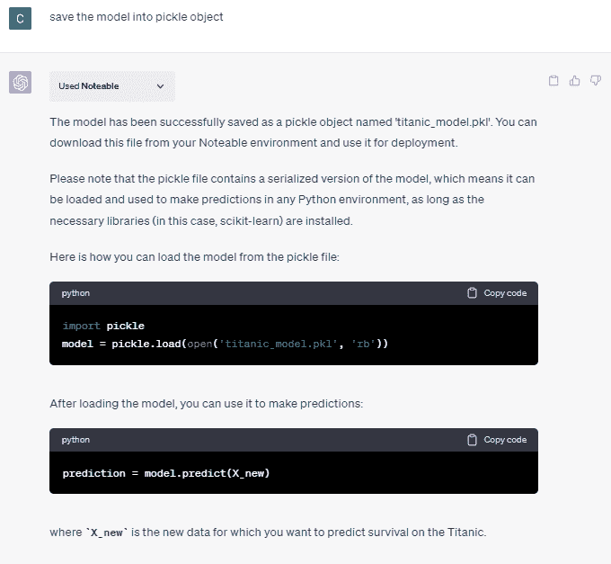

图片由作者提供

如果我们查看 Noteable 项目，其中包含了由 ChatGPT 生成的分析模型对象。

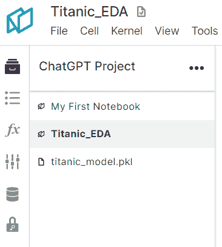

作者提供的图片

我们可以通过提供更多的提示或更改数据集（通过提供数据集链接给 ChatGPT）来进一步探索。利用这个 Noteable 插件，我们可以做很多事情。

# 结论

ChatGPT 插件改变了工具的使用方式，其中之一就是数据分析过程。使用 Noteable 插件，我们现在可以通过几行文本加速许多数据工作，如数据准备、探索性数据分析（EDA）和机器学习开发。

**[Cornellius Yudha Wijaya](https://www.linkedin.com/in/cornellius-yudha-wijaya/)** 是一位数据科学助理经理和数据撰稿人。在全职工作于 Allianz Indonesia 的同时，他喜欢通过社交媒体和写作媒体分享 Python 和数据技巧。

### 更多相关内容

+   [使用 ChatGPT Canva 插件自动化图形设计活动](https://www.kdnuggets.com/automate-graphic-design-activity-with-chatgpt-canva-plugin)

+   [Visual ChatGPT：微软将 ChatGPT 与 VFMs 结合](https://www.kdnuggets.com/2023/03/visual-chatgpt-microsoft-combine-chatgpt-vfms.html)

+   [ChatGPT CLI：将你的命令行界面转变为 ChatGPT](https://www.kdnuggets.com/2023/07/chatgpt-cli-transform-commandline-interface-chatgpt.html)

+   [5 种方式使用 ChatGPT Vision 进行数据分析](https://www.kdnuggets.com/5-ways-you-can-use-chatgpt-vision-for-data-analysis)

+   [通过 ChatGPT 最大化数据分析效率](https://www.kdnuggets.com/maximizing-efficiency-in-data-analysis-with-chatgpt)

+   [从数据到诗句：KDnuggets 和 ChatGPT 的对话](https://www.kdnuggets.com/2022/12/kdnuggets-chatgpt-conversation.html)
