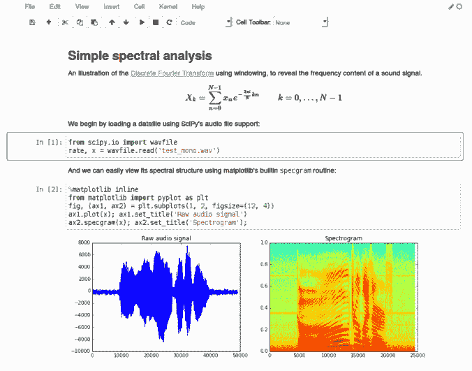

# 笔记本反模式

> 原文：[`www.kdnuggets.com/2019/11/notebook-anti-pattern.html`](https://www.kdnuggets.com/2019/11/notebook-anti-pattern.html)

评论

**作者：[Kristina Young](https://www.linkedin.com/in/kristina-georgieva/)，高级数据科学家**

在过去几年中，许多工具尝试解决将机器学习模型投入生产的挑战。这些工具似乎都有一个共同点，那就是将笔记本集成到生产流程中。本文旨在解释为什么这种推动将笔记本用于生产的趋势是一种反模式，并给出一些建议。

* * *

## 我们的三大课程推荐

 1\. [Google 网络安全证书](https://www.kdnuggets.com/google-cybersecurity) - 快速进入网络安全职业生涯的快车道

 2\. [Google 数据分析专业证书](https://www.kdnuggets.com/google-data-analytics) - 提升你的数据分析技能

 3\. [Google IT 支持专业证书](https://www.kdnuggets.com/google-itsupport) - 支持你的组织的 IT

* * *

### 什么是笔记本？

让我们首先定义一下这些是什么，特别是对于那些没有接触过笔记本的读者，或者称其为其他名称的读者。

笔记本是允许用户创建包含代码、可视化和文本的文档的 web 界面。它们如下所示：

图片来源：[`arogozhnikov.github.io/2016/09/10/jupyter-features.html`](http://arogozhnikov.github.io/2016/09/10/jupyter-features.html)

### 笔记本适合做什么？

与你从引言中得到的印象相反，笔记本并非全然不好。在某些场景中，它们可能非常有用，这将在下面的子节中描述。

**数据分析**

这可能是它们最常见的用途。当遇到新的数据集时，需要深入挖掘数据并进行某些可视化以便理解。笔记本适合这种情况，因为它们允许我们：

+   快速开始

+   在一个地方查看原始数据和可视化

+   可以使用许多现有的清理和可视化工具

+   记录我们的进展和发现（可以提取为 HTML）

**实验**

在机器学习方面，通常需要进行大量实验，才能选择最终的解决方案。笔记本在玩弄数据和各种模型时很有用，以便了解什么对给定的数据有效，什么无效。

**一次性任务**

笔记本也是一个很好的试验场。有时需要执行一次自动化任务，但可能不熟悉或不愿意编写 bash 脚本或使用其他类似工具。

**教学或技术演示**

在教授 Python 或为同事进行技术演示时，你可能希望立即展示代码及其结果。笔记本在这方面表现出色，因为它们允许你在同一文档中运行代码并显示结果。它们可以展示可视化效果，使用标题表示各个部分，并提供演示者可能需要的额外文档。

**代码评估**

如果你的公司向候选人提供编码挑战，笔记本可能是一个有用的工具。这也取决于你的公司需要评估的内容。笔记本允许候选人将文档、解释和他们的解决方案合并到一个页面中。只要候选人提供了包需求，它们也很容易让评估者运行。然而，它们不能提供对候选人对软件工程原则理解的广泛评估，这一点我们将在下一节中更好地理解。

### 笔记本的不足之处是什么？

现在许多公司都在尝试解决将模型投入生产的问题。这些公司的数据科学家可能来自各种背景，包括：统计学、纯数学、自然科学和工程学。他们共同的特点是通常能够舒适地使用笔记本进行分析和实验，因为这个工具就是为此目的而设计的。因此，大型基础设施公司一直专注于通过在笔记本生态系统中提供“一键部署”工具来弥补“生产化差距”，从而鼓励在生产中使用笔记本。不幸的是，由于笔记本最初并未设计为服务于这个目的，这可能会导致无法维护的生产系统。

一想到笔记本在生产环境中的应用，我总会想到连体漫画的实用性——*看起来美观，但在某些情况下非常不实用。*

图片来源：[`twitter.com/lorynbrantz/status/765220720595066880`](https://twitter.com/lorynbrantz/status/765220720595066880)

现在我们知道了笔记本的优势，让我们在接下来的章节中探讨它们的不足之处。

**持续集成（CI）**

笔记本并不是为自动运行或通过 CI 管道处理而设计的，因为它们是为了探索而建的。它们通常涉及文档和可视化，这会给任何 CI 管道增加不必要的工作。尽管它们可以作为普通的 Python 脚本提取，然后在 CI 管道中运行，但在大多数情况下，你会想要运行脚本的测试，而不是脚本本身（除非你正在创建需要通过管道暴露的工件）。

****测试****

笔记本不可测试，这是我对它们的主要痛点之一。没有围绕这些笔记本创建的测试框架，因为它们的目的是作为游乐场，而不是生产系统。与普遍的看法相反，数据产品中的测试和其他软件产品中的测试一样重要且可能。为了测试一个笔记本，必须将笔记本中的代码提取到脚本中，这意味着笔记本本身无用。它需要维护以匹配提取脚本中的代码，或者分叉成更多未经测试的混乱。

如果你想了解更多关于测试 ML 管道的内容，可以查看这篇文章： [测试你的 ML 管道](https://intothedepthsofdataengineering.wordpress.com/2019/07/18/testing-your-machine-learning-ml-pipelines/)。

**版本控制**

如果你曾经把笔记本放到 git 或任何其他版本控制系统中并打开了一个拉取请求，你可能会注意到这个拉取请求完全无法阅读。这是因为笔记本需要跟踪单元格的状态，因此在运行笔记本以生成你美丽的 HTML 视图时，后台会发生很多更改。这些更改也需要被版本化，导致视图不可读。

当然，你可能在一个使用配对而不是拉取请求的团队中，所以你可能不关心拉取请求不可读。然而，你通过这种可读性的降低失去了版本控制的另一个优势：在恢复代码或查看旧版本以查找可能引入或修复问题的更改时，你需要完全依赖提交信息并手动回退以检查更改。

这是笔记本的一个众所周知的问题，但也是人们正在努力解决的问题。有一些插件可以用来至少在你的版本控制系统的网页视图中缓解这个问题。一个这样的工具示例是 [Review Notebook App](https://github.com/marketplace/review-notebook-app)。

**协作**

在笔记本中进行协作是困难的。你唯一可行的协作选项是配对，或者像玩文明游戏一样轮流使用笔记本。这是因为：

+   笔记本在后台管理大量状态，因此在同一个笔记本上异步工作可能会导致许多不可管理的合并冲突。这对远程团队来说尤其糟糕。

+   所有的代码也都在同一个地方（除了导入的包），因此对相同的代码有持续的更改，使得跟踪更改的效果变得更加困难。这由于缺乏测试（如上所述）特别糟糕。

+   上面提到的版本控制问题

**状态**

状态在上述两个问题中已经提到过，但它值得单独列出以强调。笔记本具有一个全局状态。每次运行单元格时，这个状态都会发生变化，这可能会导致以下问题：

+   状态而非代码本身的不可管理的合并冲突

+   版本控制的可读性差

+   缺乏可重现性。你可能在笔记本中工作时，其状态已经无法重现，因为导致该状态的代码已经被删除，但状态没有更新。

**工程标准**

笔记本鼓励不良工程标准。我想强调这里的**鼓励**一词，因为很多这些问题是笔记本用户可以避免的。笔记本中常见的反模式有：

+   **依赖状态**：笔记本严重依赖状态，尤其是因为它们通常涉及在前几个单元格中对数据执行一些操作，以便将这些数据输入到某个算法中。对状态的依赖可能导致代码中的意外后果和副作用。

+   **重复**：不能将一个笔记本导入到另一个笔记本中，因此在不同笔记本中进行多次实验时，往往需要复制粘贴公共部分。如果其中一个笔记本发生变化，其他笔记本立即过时。通过提取公共代码部分并将其导入到不同的笔记本中，可以改善这一点。笔记本内部也经常出现重复，不过只需使用函数即可轻松避免。

+   **缺乏测试**：无法测试笔记本，如上述测试部分所示。

**包管理**

笔记本中没有包管理。笔记本使用其运行环境中安装的包。需要手动跟踪该特定笔记本使用的包，因为在同一环境中运行的不同笔记本可能需要不同的包。一个建议是始终在新的虚拟环境中运行笔记本，分别跟踪该特定笔记本的需求。或者，环境中的所有笔记本都依赖于单个要求文件。

### 那我们该怎么做呢？

图片来源 [`theverybesttop10.com/animal-imposters/`](https://theverybesttop10.com/animal-imposters/)

很好，现在我们知道为什么生产环境中的笔记本是个坏主意，也知道为什么我们需要停止将实验工具伪装成生产化工具。那么这使我们处于何种境地呢？这取决于你团队的技能和结构。你的团队很可能由以下两种人组成：

+   具有工程技能的数据科学家

+   或者，专注于实验的数据科学家和将模型投入生产的 ML/数据工程师

那么我们来看一下下面这两种情境。

**具有工程技能的数据科学团队**

在这种情境下，你的数据科学团队负责从头到尾的模型。这就是说，负责实验以及生产化。这些是需要记住的一些事项：

+   如果你仍然喜欢使用笔记本进行实验，可以继续使用，但在以下情况下需要避免使用：

    +   协作

    +   将模型带到你的游乐场之外

+   从现有的软件工程框架和原则中学习

    +   [测试和验证管道](https://intothedepthsofdataengineering.wordpress.com/2019/07/18/testing-your-machine-learning-ml-pipelines/)

    +   [模型的持续交付](https://www.thoughtworks.com/insights/articles/intelligent-enterprise-series-cd4ml)

    +   [编写可维护的代码](https://medium.com/mindorks/how-to-write-clean-code-lessons-learnt-from-the-clean-code-robert-c-martin-9ffc7aef870c)

    +   [沿途重构](https://martinfowler.com/books/refactoring.html)

+   查看一些可能帮助你设计基础设施或提供灵感的工具和架构（小心，有时会有笔记本选项可用——这是个陷阱！）：

    +   [Kubeflow](https://www.kubeflow.org/)

    +   [Azure DevOps](https://azure.microsoft.com/en-us/services/devops/)

    +   [TFX](https://www.tensorflow.org/tfx)

    +   [使用 AWS lambda 部署模型](https://aws.amazon.com/blogs/machine-learning/how-to-deploy-deep-learning-models-with-aws-lambda-and-tensorflow/)

**工程与数据科学技能的分离**

一些大型组织倾向于更专业化的技能组合，其中数据科学家从事实验工作，而 ML/数据工程师则将其推向生产。上述场景中列出的点仍然适用，但我有一个针对该场景的额外建议：

*请，请，请 **不要把模型扔过围栏！** 一起坐下来，沟通并进行配对/集体编程，将管道推向生产。**模型只有为最终用户提供价值时才有效。***

### 结论

像对待任何工具一样，笔记本有其使用场所，也有应避免使用的地方。让我们最后回顾一下这些内容。

| **好** | **差** |
| --- | --- |
| 数据分析 | 持续集成 |
| 实验 | 测试 |
| 一次性任务 | 版本控制 |
| 教学/技术演示 | 协作 |
| 代码评估 | 状态 |
|  | 工程标准 |
|  | 包管理 |

总结来说，我希望你从这篇文章中得到两个信息：

+   **对 ML 从业者**：笔记本用于实验，而不是生产化。坚持软件工程原则和框架来将事物推向生产，它们基于过去的经验教训设计而成，我们应当加以利用。

+   **对创建工具的人**：我们感谢你们为大家简化工作 ♥，但请远离笔记本反模式。专注于创建更易用的工具，鼓励积极的软件工程模式。我们希望：

    +   可测试性

    +   版本管理

    +   协作

    +   可重复性

    +   可扩展性

**简历：[Kristina Young](https://www.linkedin.com/in/kristina-georgieva/)** 是 BCG Digital Ventures 的高级数据科学家。她曾在 SoundCloud 担任推荐团队的后端和数据工程师。她的工作经历包括咨询和研究。她曾在各种技术领域担任过后端、Web 和移动开发人员。

[原始文章](https://intothedepthsofdataengineering.wordpress.com/2019/10/21/the-notebook-anti-pattern/)。已获得转载许可。

**相关内容：**

+   测试你的机器学习管道

+   数据科学家的自动版本控制

+   简易一键 Jupyter Notebook

### 更多相关话题

+   [Mercury 概述：创建数据科学作品集和…](https://www.kdnuggets.com/2022/05/overview-mercury-creating-data-science-portfolio-notebook-based-webapps.html)

+   [如何在 Jupyter Notebook 中设置 Julia](https://www.kdnuggets.com/2022/11/setup-julia-jupyter-notebook.html)

+   [数据科学家的 10 个 Jupyter Notebook 技巧和窍门](https://www.kdnuggets.com/2023/06/10-jupyter-notebook-tips-tricks-data-scientists.html)

+   [Jupyter Notebook 魔法方法备忘单](https://www.kdnuggets.com/jupyter-notebook-magic-methods-cheat-sheet)

+   [金融中的 Python：在 Jupyter Notebook 内实时数据流](https://www.kdnuggets.com/python-in-finance-real-time-data-streaming-within-jupyter-notebook)

+   [5 个免费的数据科学项目模板在 Jupyter Notebook](https://www.kdnuggets.com/5-free-templates-for-data-science-projects-on-jupyter-notebook)
