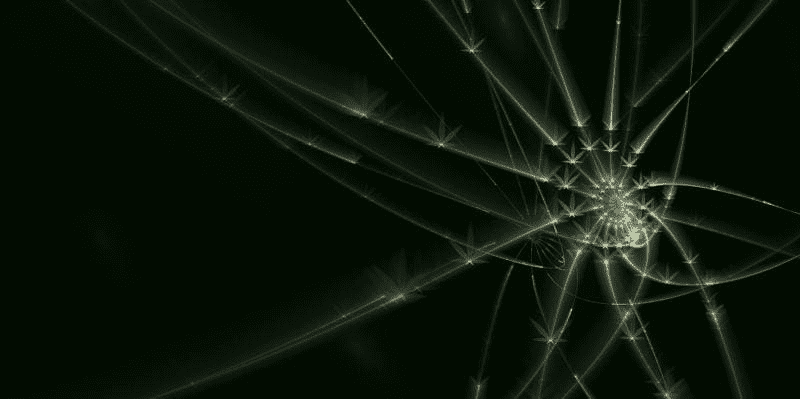
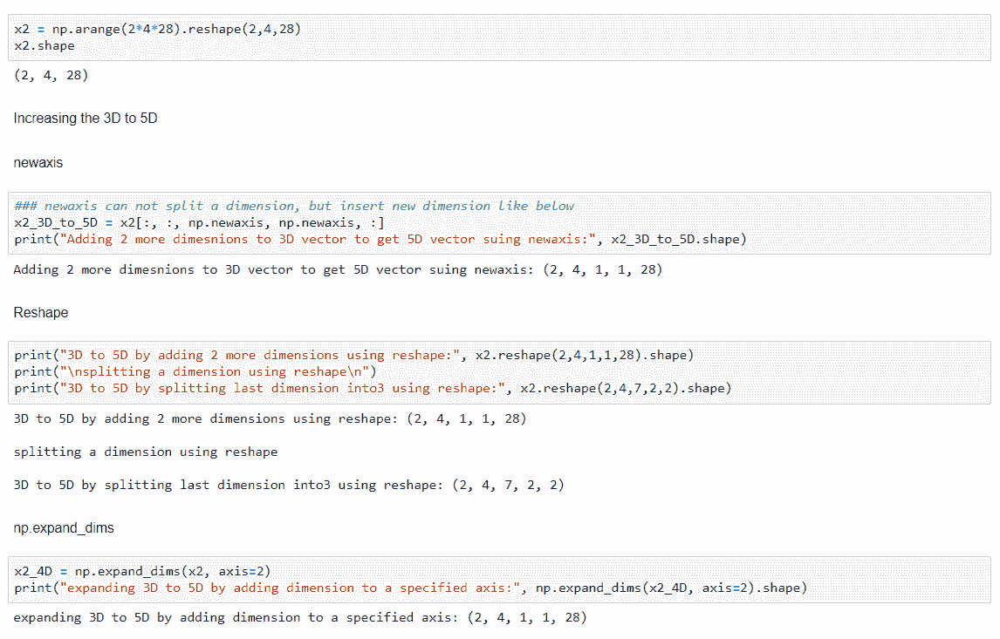
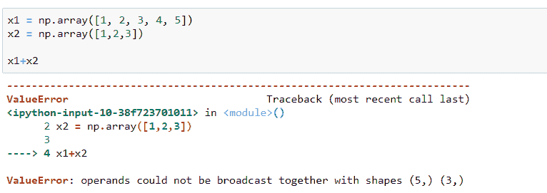
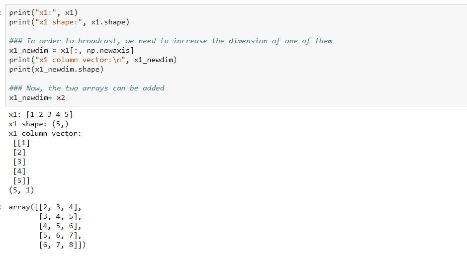

# 如何处理 NumPy 中的维度

> 原文：[`www.kdnuggets.com/2020/07/numpy-handle-dimensions.html`](https://www.kdnuggets.com/2020/07/numpy-handle-dimensions.html)



**图片来源：Garik Barseghyan，来自 [Pixabay](https://pixabay.com/illustrations/fractal-abstract-background-physics-1352598/)**

* * *

## 我们的前三个课程推荐

 1\. [谷歌网络安全证书](https://www.kdnuggets.com/google-cybersecurity) - 快速进入网络安全职业生涯。

 2\. [谷歌数据分析专业证书](https://www.kdnuggets.com/google-data-analytics) - 提升你的数据分析技能

 3\. [谷歌 IT 支持专业证书](https://www.kdnuggets.com/google-itsupport) - 支持你所在组织的 IT

* * *

**np.newaxis**

+   它用于增加现有数组的维度。它使用切片操作符重新创建数组。

+   维度在数组中的位置通过 np.newaxis 临时添加。‘None’ 也可以用来代替 np.newaxis。

**np.reshape：**

+   它用于将数组重新调整为所需的布局。

**np.expand_dims：**

+   它通过在扩展数组形状中的轴位置插入新轴来扩展数组的形状

让我们看看一些主要应用场景，其中上述 NumPy 维度处理操作非常有用：

### **应用 1**：**Rank 1 数组到行/列向量的转换**

在这里，我们创建了一个形状为 (4,) 的 4 元素数组，这称为 **Rank 1 数组**。

```py
Array of 4 elements: [0 1 2 3]
Notice the shape, this is rank 1 array: (4,)
after transpose: (4,)
```

然而，Rank 1 数组往往会导致模糊的结果，因为它们不一致地表现为行/列向量。如上所示，如果我们对 x1 进行转置，其形状保持不变。

因此，通常建议明确指定数组的维度。这可以通过上述三种技术实现：

+   使用 np.newaxis：

```py
row vector: [[0 1 2 3]]
(1, 4)

column vector:
 [[0]
 [1]
 [2]
 [3]]
(4, 1)
```

+   使用 np.reshape

```py
Row vector using reshape: [[0 1 2 3]]
column vector using reshape:
 [[0]
 [1]
 [2]
 [3]]
```

+   使用 np.expand_dims

```py
Row vector using expand_dims: [[0 1 2 3]]
column vector using expand_dims:
 [[0]
 [1]
 [2]
 [3]]
```

### **应用 2**：**增加维度**

创建另一个形状为 (2,4,28) 的数组 x2，并检查如何将 x2 的维度从 3D 扩展到 5D



从上述内容中需要注意的关键点是 np.reshape 也允许你拆分维度。

### **应用 3：广播**

根据 [NumPy 文档](https://numpy.org/doc/stable/user/basics.broadcasting.html#:~:text=The%20term%20broadcasting%20describes%20how,that%20they%20have%20compatible%20shapes.)：

> *broadcasting 描述了 numpy 在算术操作中如何处理不同形状的数组。*

例如，当我们将以下两个数组相加时，由于形状不匹配，会显示 'ValueError'：



让我们看看 np.newaxis 如何增加下面一个数组的维度：



由于我们主要需要调整数组的维度以进行正确的广播操作，`np.reshape` 和 `np.expand_dims` 增加维度的方式效果相同（如前面的例子所示）。

感谢阅读 !!!

带有完整代码的 Jupyter notebook 放置在 [这里](https://github.com/vidhi-am/numpy-dimension/blob/master/dimension%20handling-checkpoint.ipynb)。

**参考资料：**

+   [`stackoverflow.com/questions/46334014/np-reshapex-1-1-vs-x-np-newaxis?noredirect=1&lq=1`](https://stackoverflow.com/questions/46334014/np-reshapex-1-1-vs-x-np-newaxis?noredirect=1&lq=1)

+   [`stackoverflow.com/questions/28385666/numpy-use-reshape-or-newaxis-to-add-dimensions`](https://stackoverflow.com/questions/28385666/numpy-use-reshape-or-newaxis-to-add-dimensions)

**[Vidhi Chugh](https://vidhi-chugh.medium.com/)** 是一位获奖的 AI/ML 创新领袖和 AI 伦理学家。她在数据科学、产品和研究的交汇处工作，以提供商业价值和洞察力。她倡导以数据为中心的科学，并在数据治理领域拥有领先的专业知识，致力于构建可信赖的 AI 解决方案。

[原文](https://medium.com/analytics-vidhya/numpy-ways-to-handle-dimensions-939752c75d89)。已获许可重新发布。

### 更多相关内容

+   [数据质量维度：用大期望确保数据质量](https://www.kdnuggets.com/2023/03/data-quality-dimensions-assuring-data-quality-great-expectations.html)

+   [使用 NumPy 的掩码数组处理缺失数据](https://www.kdnuggets.com/masked-arrays-in-numpy-to-handle-missing-data)

+   [7 种处理不平衡数据的技术](https://www.kdnuggets.com/2017/06/7-techniques-handle-imbalanced-data.html)

+   [KDnuggets 新闻，8 月 31 日：完整的数据科学学习路线图…](https://www.kdnuggets.com/2022/n35.html)

+   [如何使用 Scikit-learn 的 Imputer 模块处理缺失数据](https://www.kdnuggets.com/how-to-handle-missing-data-with-scikit-learns-imputer-module)

+   [如何在数据集中使用 Pandas 处理异常值](https://www.kdnuggets.com/how-to-handle-outliers-in-dataset-with-pandas)
