# 只有 NumPy：从头理解和创建计算图神经网络

> 原文：[`www.kdnuggets.com/2019/08/numpy-neural-networks-computational-graphs.html`](https://www.kdnuggets.com/2019/08/numpy-neural-networks-computational-graphs.html)

评论

**作者 [Rafay Khan](https://medium.com/@rafayak)**。

理解新概念可能很困难，尤其是当现在有大量资源但仅提供了对复杂概念的粗略解释时。这篇博客是为了填补有关如何创建计算图形式的神经网络的详细讲解的空缺。

* * *

## 我们的前三个课程推荐

 1\. [Google 网络安全证书](https://www.kdnuggets.com/google-cybersecurity) - 快速进入网络安全职业的快车道。

 2\. [Google 数据分析专业证书](https://www.kdnuggets.com/google-data-analytics) - 提升你的数据分析能力

 3\. [Google IT 支持专业证书](https://www.kdnuggets.com/google-itsupport) - 支持你的组织的 IT

* * *

在这篇博客文章中，我总结了我所学到的内容，以便回馈社区并帮助新手。我将创建常见形式的神经网络，完全依靠[NumPy](https://www.numpy.org/)。

*这篇博客文章分为两个部分，第一部分将理解神经网络的基础知识，第二部分将包含实现第一部分所学内容的代码。*

* * *

### 第Ⅰ部分：理解神经网络

### 让我们深入探讨

神经网络是一种受到大脑工作方式启发的模型。类似于大脑中的神经元，我们的‘数学神经元’也直观地彼此连接；它们接收输入（树突），对其进行一些简单的计算，然后产生输出（轴突）。

学习某样东西的最佳方式是亲自构建它。让我们从一个简单的神经网络开始，并手动解决它。这将让我们了解计算是如何在神经网络中流动的。

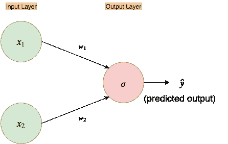

图 1\. 简单的输入输出神经网络。

如上图所示，大多数时候你会看到神经网络以类似的方式描绘。但这张简洁的图片隐藏了一些复杂性。让我们展开它。

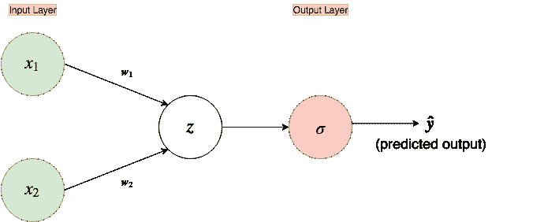

图 2\. 扩展的神经网络

现在，让我们逐一查看图中的每个节点，了解它所代表的内容。

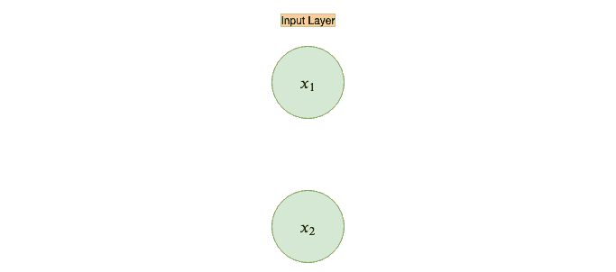

图 3\. 输入节点 ***x₁*** 和 ***x₂***

这些节点代表了我们用于第一个和第二个特征的输入，***x₁*** 和 ***x₂***，定义了我们提供给神经网络的单个示例，*因此被称为***“输入层”***


图 4\. 权重

***w₁*** 和 ***w₂*** 表示我们的权重向量（在一些神经网络文献中，它用*theta*符号表示，即** *θ* **）。直观地说，这些决定了每个输入特征在计算下一个节点时应有多大影响。如果你对此不熟悉，可以将它们视为类似于线性方程中的‘斜率’或‘梯度’常数。

*权重是我们神经网络需要“学习”的主要值*。所以最初，我们将它们设置为 ***随机值*** 并让我们的“*学习算法*”决定最佳权重，以产生正确的输出。

为什么随机初始化？稍后会详细说明。


图 5. 线性操作

这个节点表示一个线性函数。简单地说，*它接收所有传入的输入，并将它们创建成一个线性方程/组合*。（*根据惯例，理解为每个节点的线性组合包含权重和输入，除了输入层中的输入节点，因此这个节点在图中经常被省略，如图 1 所示。在这个示例中，我将它保留*）

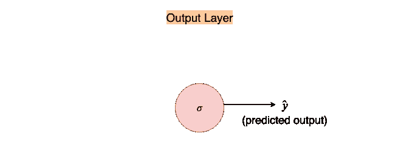

图 6. 输出节点

这个 ***σ*** 节点将输入传递给以下函数，称为 **sigmoid 函数**（因其 S 形曲线而得名），也称为 **logistic 函数**：

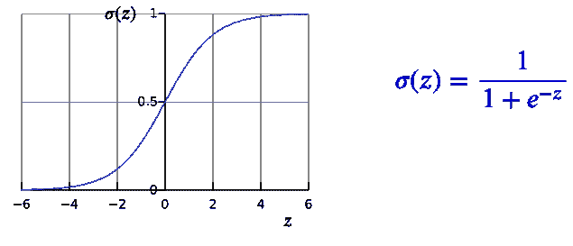

图 7. Sigmoid（Logistic）函数

Sigmoid 是神经网络中众多“激活函数”之一。激活函数的作用是将输入转换到不同的范围。例如，如果 *z > 2*，那么 *σ(z) ≈ 1*，类似地，如果 *z < -2*，则 *σ(z) ≈ 0*。所以，sigmoid 函数将输出范围压缩到 (0, 1)（此‘()’符号表示排他性边界；函数渐近线但不会完全输出 0 或 1，而是接近边界值）。

**在我们上面的神经网络中，由于它是最后一个节点，因此它执行输出的功能**。预测输出用 ***ŷ*** 表示。（*注意：在一些神经网络文献中，这用‘****h(θ)’**** 表示，其中‘h’称为假设，即这是神经网络的假设，也就是输出预测，给定参数 θ；其中 θ 是神经网络的权重*）。

* * *

现在我们知道每个元素代表什么了，让我们通过手动计算一些虚拟数据中的每个节点来展现我们的实力吧。

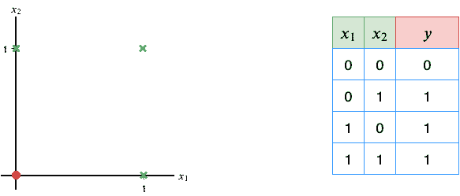

图 8. 或门

上面的数据代表一个**OR**门（如果任何输入为 1 则输出 1）。表格的每一行代表一个*‘示例’*，我们希望神经网络从中学习。通过学习这些示例，我们希望神经网络能够执行 OR 门的功能；给定输入特征，***x₁*** 和 ***x₂***，尝试输出相应的***y（也称为‘标签’）***。*我还将这些点绘制在二维平面上，以便于可视化（绿色交叉点表示输出（***y***）为***1***的点，而红色点表示输出为***0***的点）。*

这个 OR 门数据特别有趣，因为它是***线性可分的***，即我们可以画一条直线来将绿色交叉点与红色点分开。

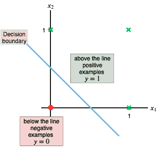

图 9\. 显示 OR 门数据是线性可分的

我们将很快看到我们的简单神经网络如何执行这一任务。

数据在我们的神经网络中从左到右流动。在技术术语中，这个过程叫做**‘前向传播’**；每个节点的计算结果被传递到它所连接的下一个节点。

让我们详细了解一下神经网络在给定第一个示例***x₁=0*** 和 ***x₂=0*** 时将执行的所有计算。同时，我们将初始化权重** *w₁***和***w₂*** 为***w₁=0.1*** 和 ***w₂=0.6****（回顾一下，这些权重是随机选择的）*

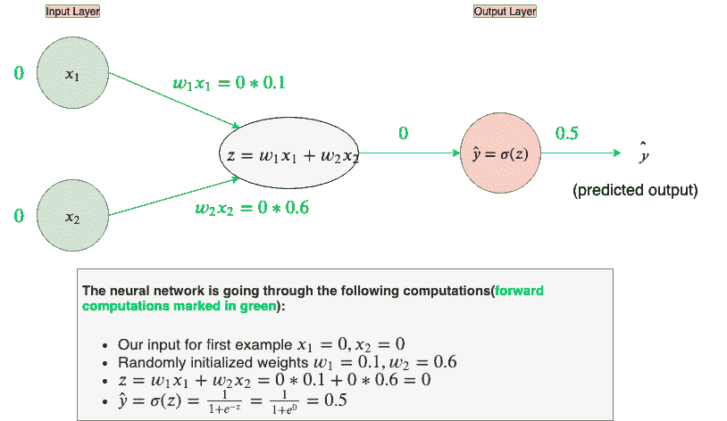

图 10\. 从 OR 表数据中进行的第一个示例的前向传播

以我们当前的权重，***w₁= 0.1*** 和 ***w₂ = 0.6***，我们的网络输出距离我们期望的位置还有点距离。预测的输出，***ŷ***，应该是***ŷ≈0***对于***x₁=0*** 和 ***x₂=0***，现在它的***ŷ=0.5***。

那么，如何告诉神经网络它距离我们期望的输出有多远呢？这时，***损失函数***来救援。

* * *

### 损失函数

*损失函数是一个简单的方程，告诉我们神经网络预测的输出（***ŷ***）与期望输出（***y***）之间的距离，只针对一个示例。*

*损失函数的****导数****决定了是增加还是减少权重。正的导数意味着减少权重，而负的导数则意味着增加权重。****斜率越陡峭，预测错误越大。*

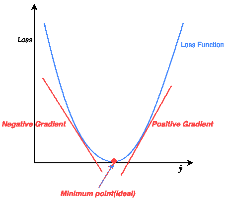

图 11\. 损失函数的可视化

*图 11 中描绘的损失函数曲线是一个理想化的版本。在实际情况下，损失函数可能不会如此平滑，而是沿着到达最小值的路径上有一些起伏和鞍点。*

有许多不同种类的损失函数***每种都计算预测输出与期望输出之间的误差***。在这里，我们将使用其中一种最简单的损失函数，即***平方误差损失函数***。定义如下：


图 12\. 损失函数。计算单个示例的误差

采用**平方保持一切都为正**，以及**分数 (1/2) 是为了在对平方** **项求导时可以相互抵消** *(在一些机器学习从业者中，常常会省略这个分数)*。

从直观上讲，平方误差损失函数帮助我们最小化预测线（蓝线）与实际数据（绿色点）之间的垂直距离。在后台，这条预测线是我们的***z***（线性函数）节点。

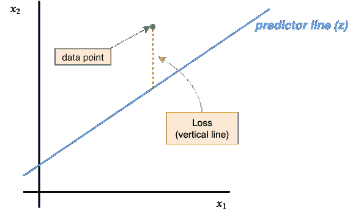

图 13\. 损失函数效应的可视化

* * *

现在我们知道了损失函数的目的，让我们计算当前预测的误差***ŷ=0.5***，已知***y=0***


图 14\. 第一个示例计算的损失

如我们所见，损失是***0.125***。基于此，*我们现在可以使用损失函数的导数来检查是否需要增加或减少权重*。

这个过程被称为***反向传播***，因为我们将执行与*前向*阶段相反的操作。我们将从输出向输入追踪，而不是从输入到输出。简单来说，反向传播使我们能够找出神经网络的每一部分对损失的责任程度。

* * *

为了执行反向传播，我们将采用以下技术：*在每个节点，我们只计算局部梯度（该节点的偏导数），然后在反向传播过程中，当我们从上游接收到梯度的数值时，将这些数值与局部梯度相乘，传递给各自连接的节点。*

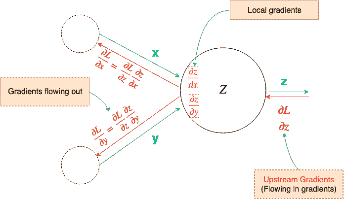

图 15\. 梯度流

*这是一种从微积分中**链式法则**的推广。*

* * *

由于***ŷ***（预测标签）决定了我们的***损失***，而***y***（实际标签）是常数，对于单个示例，*我们将对损失关于****ŷ****进行偏导数计算*

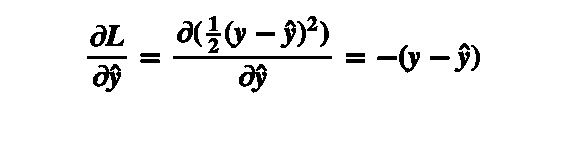

图 16\. 损失对*ŷ*的偏导数

由于反向传播步骤可能看起来有些复杂，我将逐步讲解：

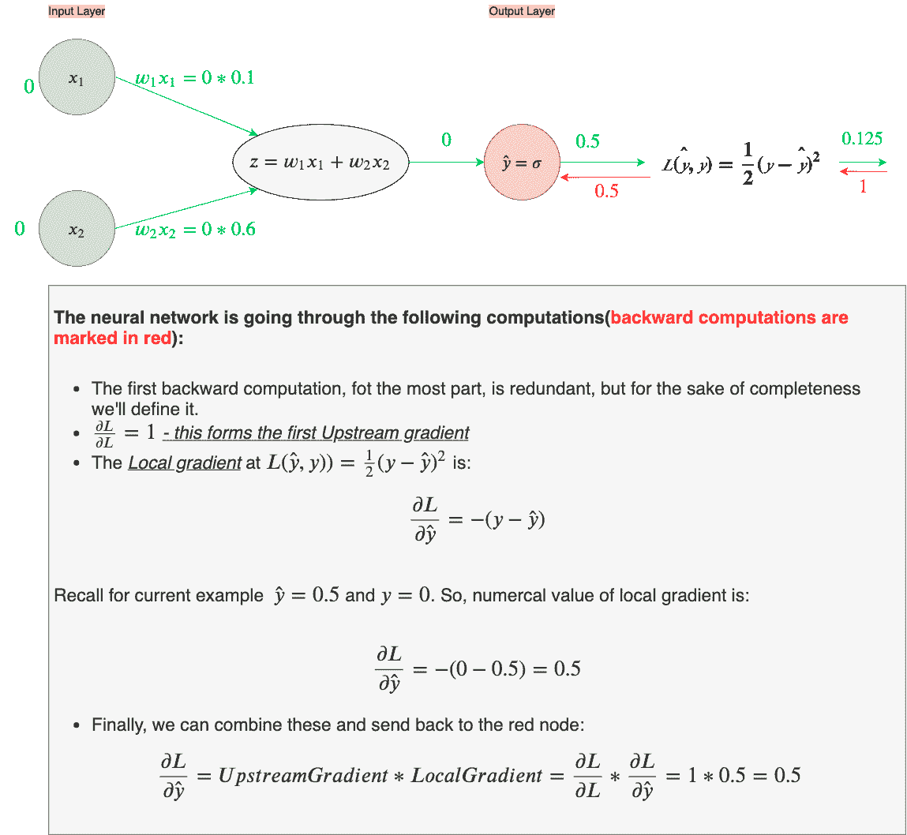

图 17.a. 反向传播

* * *

对于下一个计算，我们需要 sigmoid 函数的导数，因为它形成了红色节点的局部梯度。让我们推导一下。

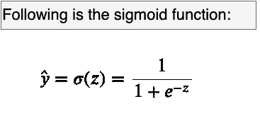

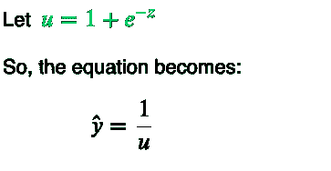

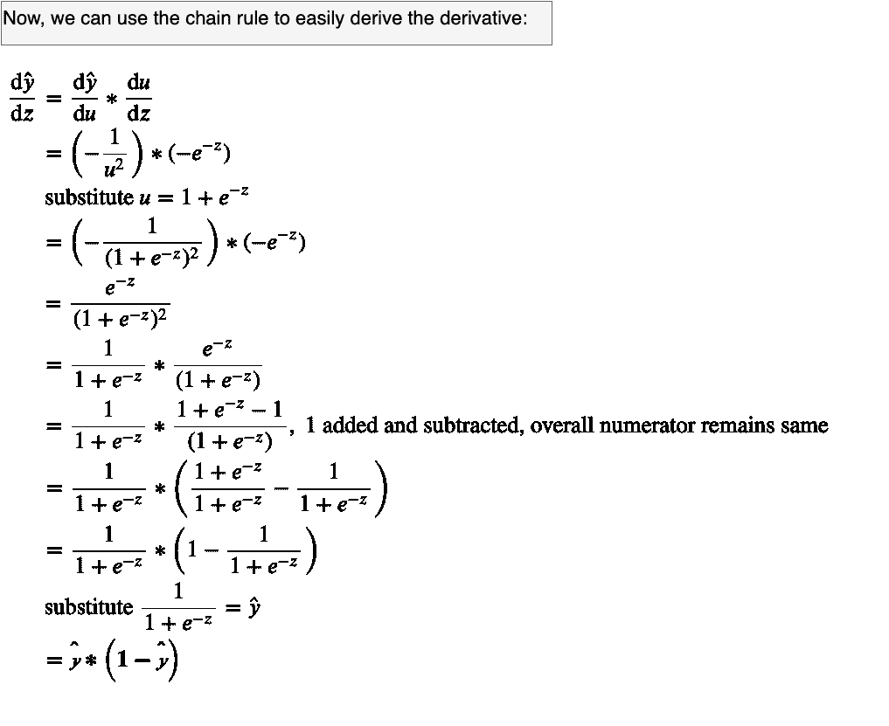

图 18\. Sigmoid 函数的导数。

让我们在下一步的反向计算中使用这一点

* * *

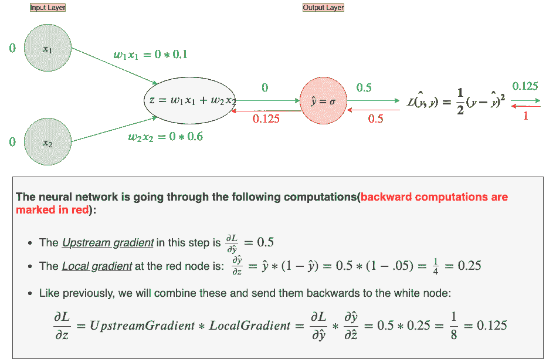

图 17.b. 反向传播

反向计算不应传播到输入，因为我们不希望更改输入数据（即红色箭头不应指向绿色节点）。我们只想更改与输入相关的权重。

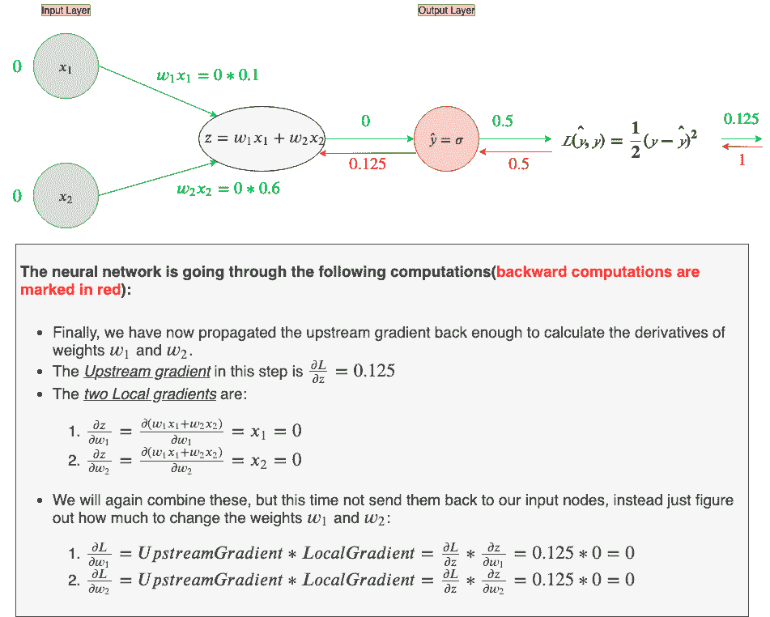

图 17.c. 反向传播

发现了什么奇怪的东西吗？*权重 w₁和 w₂对损失的导数是零*！如果导数为零，我们不能增加或减少权重。那么，如果我们不能调整权重，如何在这种情况下获得期望的输出呢？*这里的关键点是局部梯度（***∂z/∂w₁***和***∂z/∂w₂***）是****x₁****和****x₂***，在这个例子中，都是零（即没有提供信息）。

这让我们引出了***偏置***的概念。

* * *

### 偏置

回想一下你高中时的直线方程。

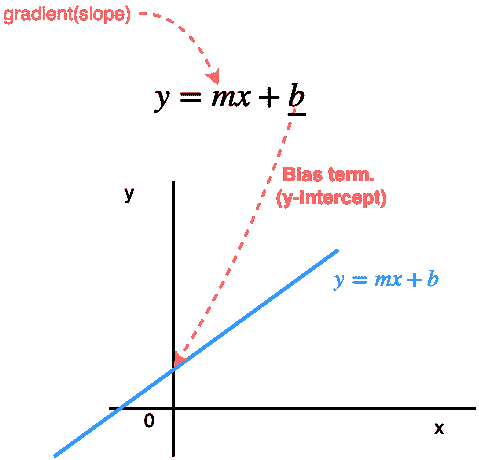

图 19. 直线方程

这里 ***b***是偏置项。从直观上讲，偏置告诉我们所有用 ***x****（自变量）计算的输出*应该有一个加性偏置为 ***b***。所以，当***x=0***（没有来自*自变量*的信息）时，输出应该偏向于仅仅是****b***。

*请注意，没有偏置项的直线只能通过原点（0, 0），线与线之间唯一的区别就是梯度****m***。*

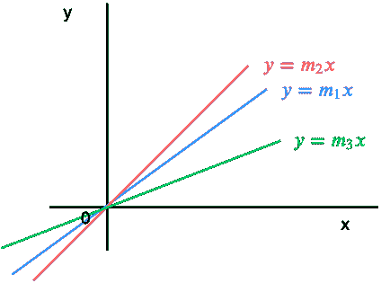

图 20. 从原点出发的直线

* * *

所以，利用这些新信息，让我们在神经网络中添加一个节点：偏置节点。(*在神经网络文献中，除了输入层之外，每一层都假设有一个偏置节点，就像线性节点一样，因此这个节点在图中也常常被省略。*)

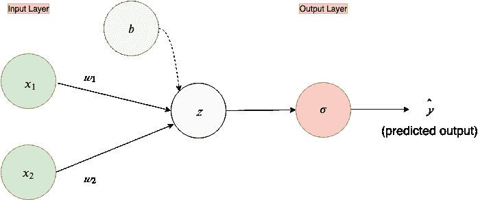

图 21. 带偏置节点的扩展神经网络

现在我们用相同的例子进行前向传播，***x₁=0, x₂=0, y=0***，并设置偏置***b=0***（初始偏置总是设置为零，而不是随机数），让反向传播的损失来调整偏置。

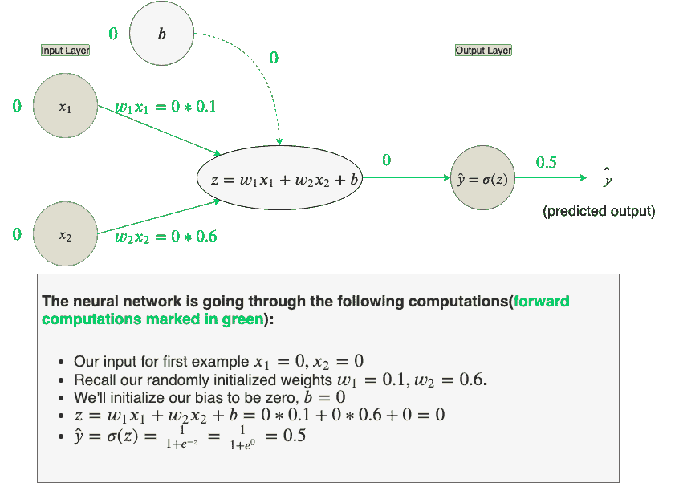

图 22. 带偏置单元的 OR 表数据的前向传播第一个例子

好吧，偏置为“***b=0***”的前向传播没有改变我们的输出，但在做出最终判断之前，让我们进行反向传播。

如前所述，让我们一步步地进行反向传播。

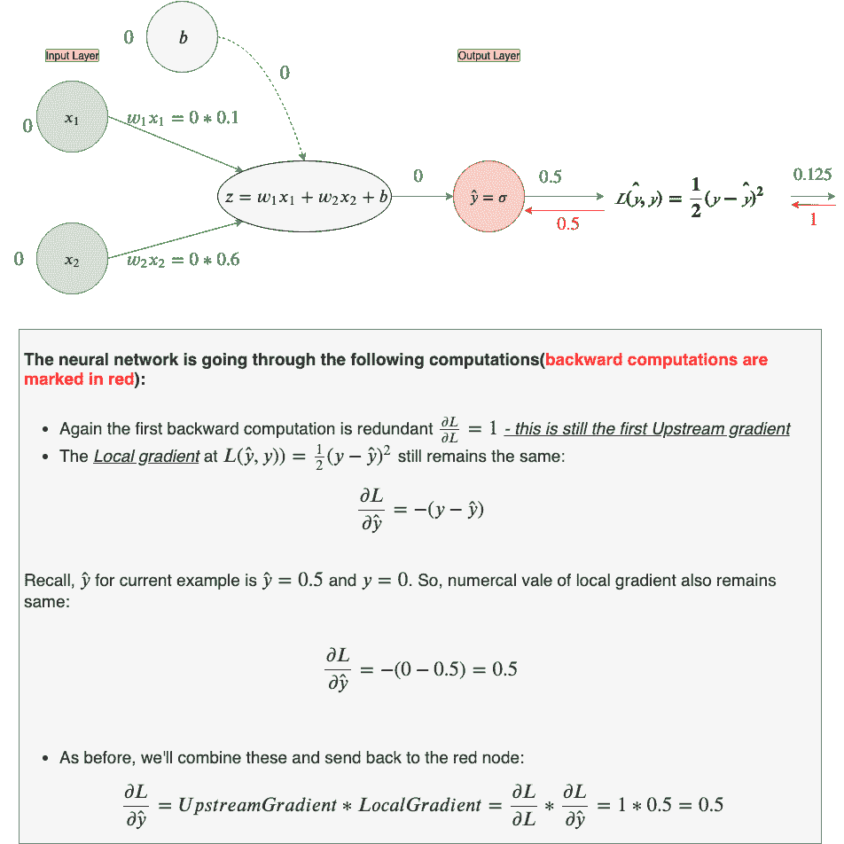

图 23.a. 带偏置的反向传播

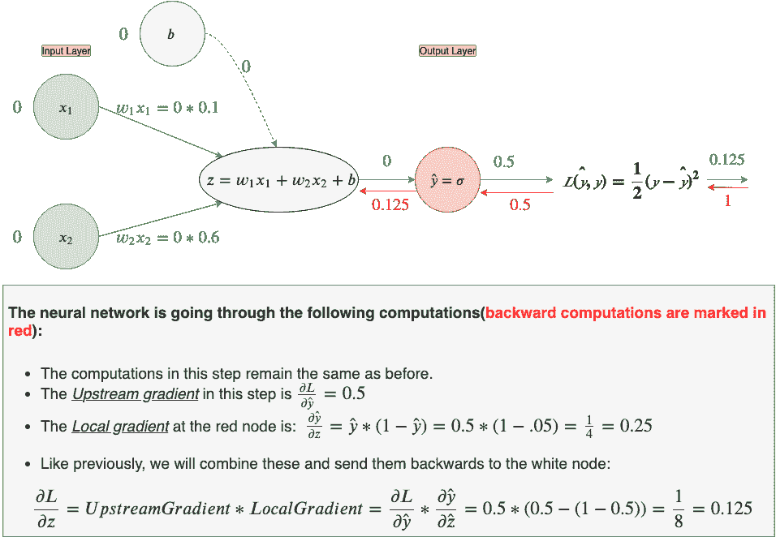

图 23.b. 带偏置的反向传播

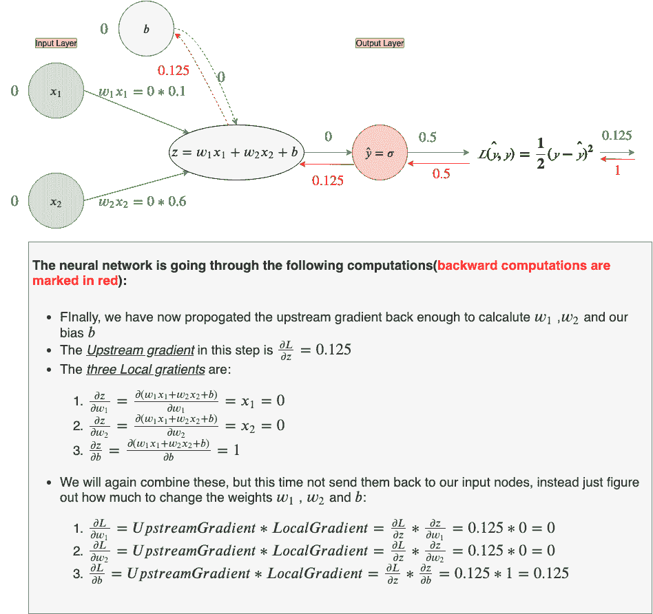

图 23.c. 带偏置的反向传播

太好了！我们刚刚找到了调整偏置的量。由于偏置的导数（**∂L/∂b**）为正 0.125，我们需要沿着梯度的负方向调整偏置（回忆之前的损失函数曲线）。这在技术上称为***梯度下降***，因为我们使用梯度的方向“下降”从斜坡区域到平坦区域。让我们开始吧。

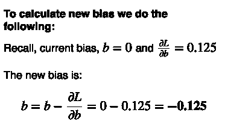

图 24\. 使用梯度下降计算的新偏差

现在，我们已经将偏差略微调整为 ***b=-0.125，***让我们通过进行 **前向传播**和** 检查新的损失**来测试我们是否做对了。

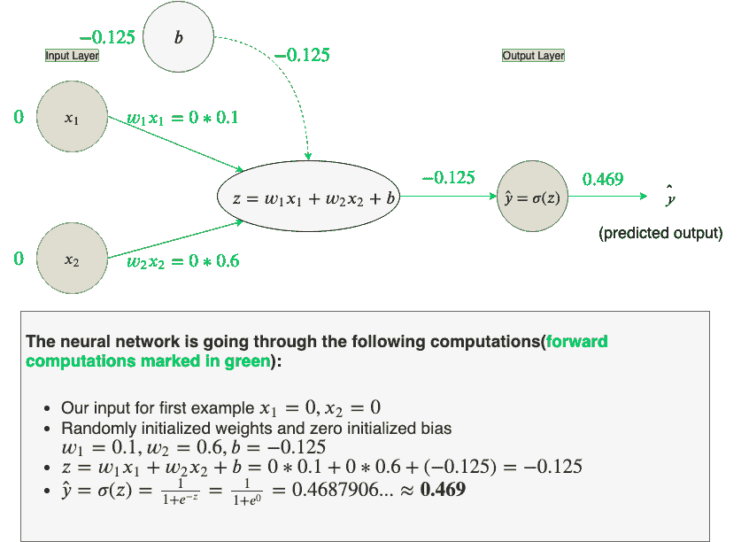

图 25\. 使用新计算的偏差进行前向传播

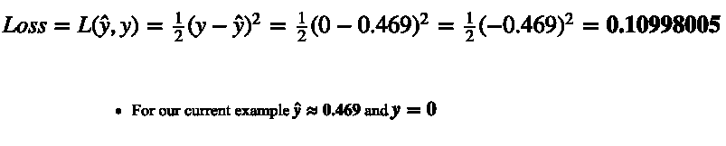

图 26\. 新计算的偏差后的损失

现在我们的预测输出是*** ŷ≈0.469****（四舍五入到小数点后 3 位）****， ***比之前的 0.5 有了轻微的改进，损失从 0.125 降到大约 ***0.109***。这种轻微的修正是神经网络通过将预测输出与期望输出 ***y*** 进行比较后‘学习’到的，然后朝梯度的相反方向移动***。 ***相当酷，对吧？

现在你可能会想，这只是比之前的结果略有改进，我们如何才能达到最小损失。两个因素发挥作用： ***a)* 我们执行了多少次‘训练’**（每个训练周期包括前向传播、反向传播和通过梯度下降更新权重）。 ***b)* 学习率。**

学习率？？？那是什么？让我们来谈谈它。

* * *

### 学习率

回顾一下，我们如何通过在梯度的相反方向上移动来计算新的偏差（即***梯度下降***）。

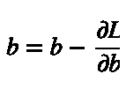

图 27\. 更新偏差的方程

注意到当我们更新偏差时，我们在梯度的相反方向上移动了 ***1 步。***

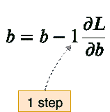

图 28\. 更新偏差的方程，显示“步数”

我们可以在梯度的相反方向上移动 0.5、0.9、2、3 或任何我们想要的步数。这种‘*步数*’就是我们定义的****学习率***，通常用*** α***(alpha)***表示。***

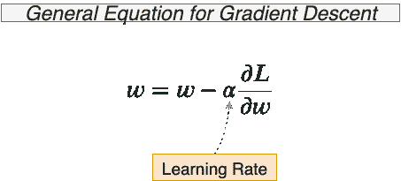

图 29\. 梯度下降的一般方程

学习率定义了我们达到最小损失的速度。让我们在下面可视化学习率的作用：

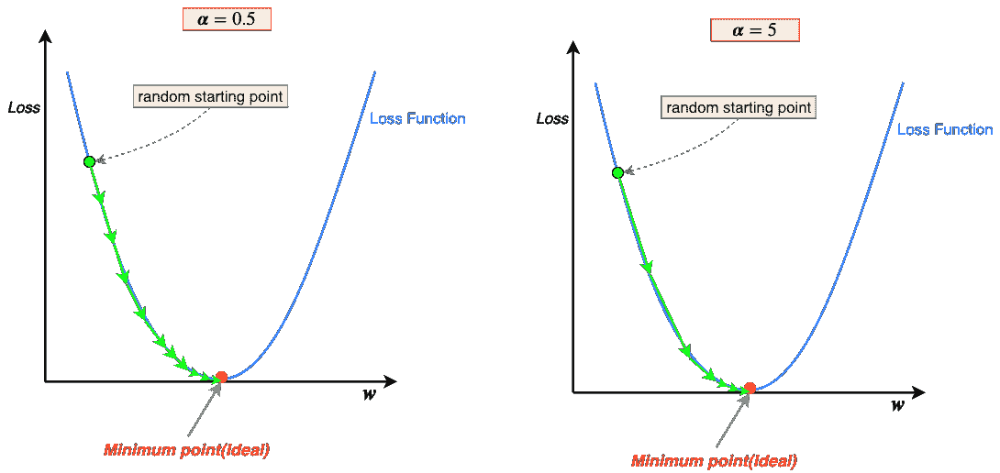

图 30\. 可视化学习率的效果

如你所见，使用较低的学习率（α=0.5）时，我们沿曲线的下降较慢，需要很多步才能到达最小点。另一方面，使用较高的学习率（α=5），我们步伐更大，更快到达最小点。

*眼尖的读者可能注意到，梯度下降步骤（绿色箭头）在接近最小点时越来越小，这是为什么呢？回忆一下，学习率在曲线上的那个点与梯度相乘；当我们从倾斜区域下降到 u 形曲线的平坦区域时，接近最小点，梯度不断变小，因此步伐也变小。因此，在训练过程中改变学习率是不必要的（一些梯度下降的变体开始时使用较高的学习率以快速下坡，然后逐渐降低，这被称为“退火学习率”）*

那么，结论是什么呢？只需将学习率设置得尽可能高，以便快速达到最佳损失吗？不是的。学习率可能是把双刃剑。学习率过高，参数（权重/偏置）不会达到最佳值，而是开始远离最佳值。学习率过小，参数收敛到最佳值的时间过长。

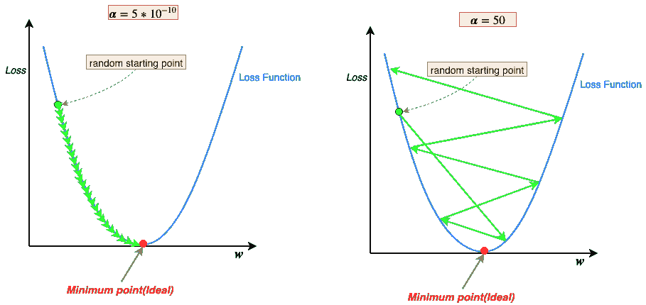

图 31. 可视化非常低与非常高学习率的效果。

小学习率（α=5*10⁻¹⁰）导致需要很多步骤才能达到最小点，这很容易理解；将梯度乘以一个小数（α）会导致步伐成比例地变小。

大学习率（α=50）导致梯度下降发散可能令人困惑，但答案很简单；注意到在每一步，梯度下降通过沿直线（图中的绿色箭头）移动来逼近其下行路径，简而言之，它估计其向下的路径。当学习率过高时，我们迫使梯度下降采取更大的步伐。更大的步伐往往过高估计了向下的路径并越过了最小点，然后为了纠正错误的估计，梯度下降试图朝着最小点移动，但由于学习率过高，再次越过最小点。这个不断过高估计的循环最终导致结果发散（每次训练周期后的损失增加，而不是减少）。

学习率被称为***超参数***。超参数是神经网络不能通过梯度反向传播实质上学习的参数，它们必须由神经网络模型的创建者根据问题及其数据集手动调整。*（上面选择的损失函数也是超参数）*

总而言之，目标不是找到“完美的学习率”，而是找到一个足够大的学习率，使神经网络能够成功有效地训练而不发散。

* * *

到目前为止，我们仅使用一个示例（***x₁=0***和***x₂=0***）来调整我们的权重和偏差（*实际上，到目前为止仅调整了偏差*????），这将整个数据集（或门表）中的一个示例的损失降低了。但我们有多个示例需要学习，我们希望减少所有示例的损失。**理想情况下，在一次训练迭代中，我们希望减少所有训练示例的损失**。这称为**批量梯度下降**（或完整批量梯度下降），因为我们在每次训练迭代中使用整个训练示例批量来改善我们的权重和偏差。*（其他形式包括****迷你批量梯度下降****，我们在每次迭代中使用数据集的一个子集，以及****随机梯度下降****，我们在每次训练迭代中仅使用一个示例，就像我们到目前为止所做的那样。）*

*神经网络经过所有训练示例的训练迭代称为****Epoch****。*如果使用迷你批量，则在神经网络遍历所有迷你批量后，epoch 就完成了，这对于随机梯度下降也是类似的，其中一个批量仅是一个示例。*

在进一步讨论之前，我们需要定义一个叫做***成本函数***的概念。

* * *

### 成本函数

当我们执行“*批量梯度下降*”时，我们需要稍微修改我们的损失函数，以适应不仅仅是一个示例，而是批量中的所有示例。这种调整后的损失函数称为**成本函数**。

*另外，请注意，成本函数的曲线类似于损失函数的曲线（相同的 U 形）。*

***与在一个示例上计算损失不同，成本函数计算所有示例的平均损失。***

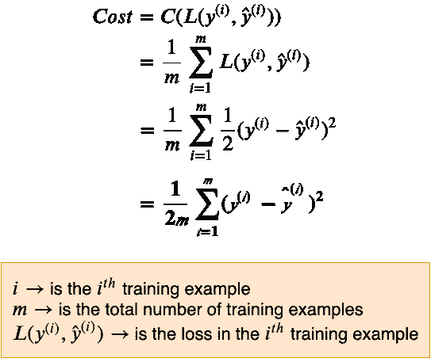

图 32\. 成本函数

直观地说，成本函数是在扩展损失函数的能力。回想一下，损失函数是如何帮助最小化*单个*数据点和预测线（***z***）之间的垂直距离的。**成本函数有助于同时最小化多个数据点之间的垂直距离（平方误差损失）。**

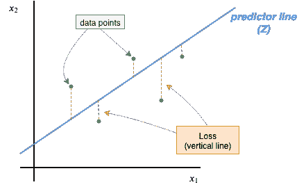

图 33\. 成本函数效果的可视化

**在批量梯度下降中，我们将使用成本函数的导数**，而不是损失函数，来指导我们在所有示例中的最低成本路径。*（在某些神经网络文献中，成本函数有时也用字母****‘J’****表示。）*

让我们看看成本函数的导数方程如何与损失函数的普通导数不同。

### 成本函数的导数

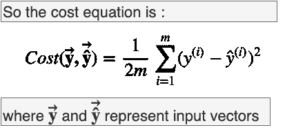

图 34\. 成本函数显示它接受输入向量

对这个成本函数取导数，它以向量为输入并对其进行求和，可能有些棘手。因此，让我们从一个简单的示例开始，然后再推广导数。

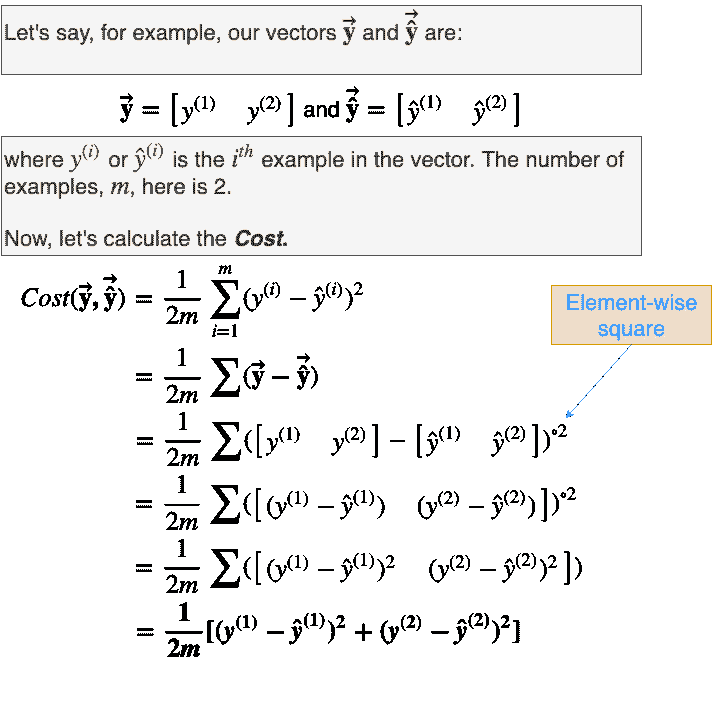

图 35\. 简单向量化示例中的成本计算

在成本的计算中没有新内容。正如预期的那样，成本最终是损失的平均值，但实现现在是向量化的*（我们进行了向量化减法，接着是逐元素的指数运算，称为 Hadamard 指数运算）*。让我们推导偏导数。

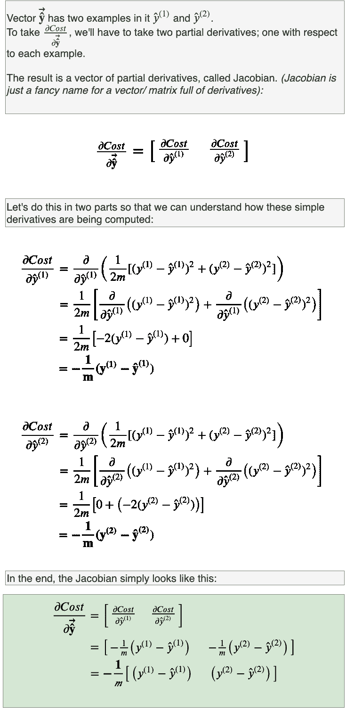

图 36\. 简单示例中雅可比矩阵的计算

从中，我们可以将偏导数方程进行概括。


图 37\. 广义偏导数方程

现在我们应该花点时间注意一下损失的导数与成本的导数之间的区别。

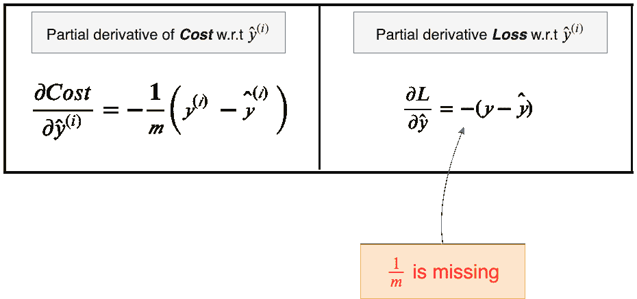

图 38\. 损失和成本相对于（w.r.t）** ŷ⁽ⁱ⁾**的偏导数比较

稍后我们将看到这个小变化如何体现在梯度计算中。

* * *

回到批量梯度下降。

批量梯度下降有两种方法：

**1.** 对于每次训练迭代，创建单独的临时变量（大写的 Δ），这些变量将累积来自训练集中每个**“*m”*** 示例的权重和偏置的梯度（小写的 δ），然后在迭代结束时使用累积梯度的平均值更新权重。这是一种慢方法。*（对于那些熟悉时间复杂度分析的人，你可能会注意到，随着训练数据集的增长，这将成为一个多项式时间算法 O(n²)）*

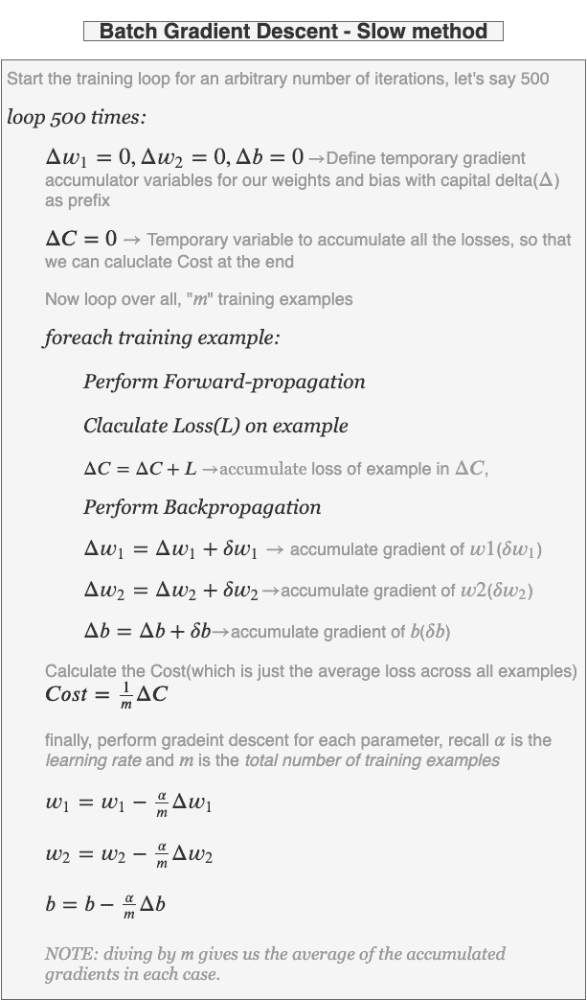

图 39\. 批量梯度下降慢方法

**2.** 更快的方法与上述类似，但使用向量化计算来一次性计算所有训练样本的所有梯度，因此移除了内部循环。向量化计算在计算机上运行速度更快。这是所有流行神经网络框架使用的方法，也是我们在本博客剩下部分将遵循的方法。

对于向量化计算，我们将对神经网络计算图的“Z”节点进行调整，并使用成本函数而不是损失函数。

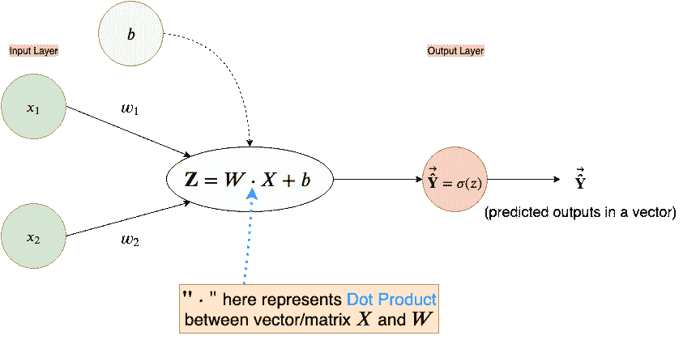

图 40\. Z 节点的向量化实现

请注意，在上图中，我们对** dot-product** 进行了计算，这里的***W***和***X***可以是适当大小的矩阵或向量。偏置***b***在这里仍然是一个单一的数字*(一个标量量)*，将以逐元素的方式添加到点积的输出中。预测的输出不仅是一个数字，而是一个向量***Ŷ***，其中每个元素是各自示例的预测输出。

在进行前向传播和反向传播之前，让我们设置数据（***X, W, b & Y***）。

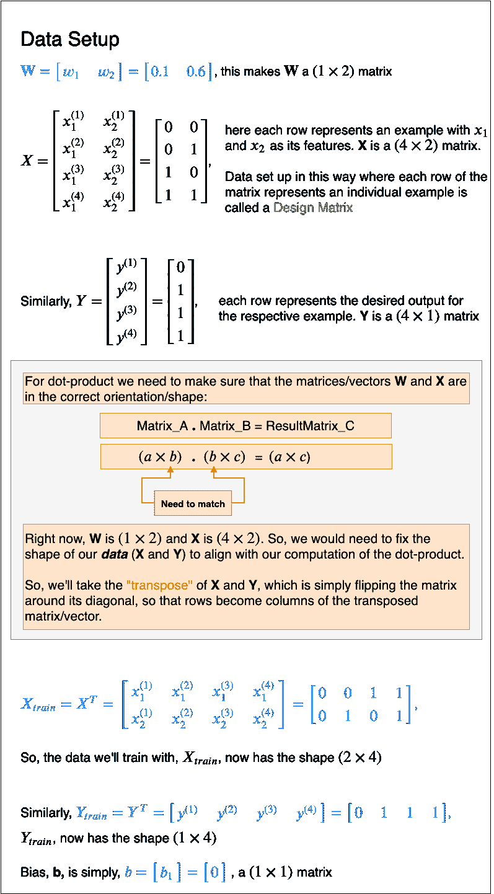

图 41\. 设置向量化计算的数据。

我们现在终于准备好使用**Xₜᵣₐᵢₙ**、**Yₜᵣₐᵢₙ**、**W**和**b**进行前向传播和反向传播。

*(注意：下列所有结果都四舍五入到小数点后三位，仅为简洁起见)*

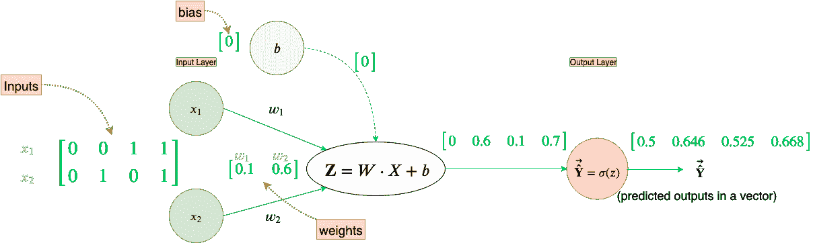

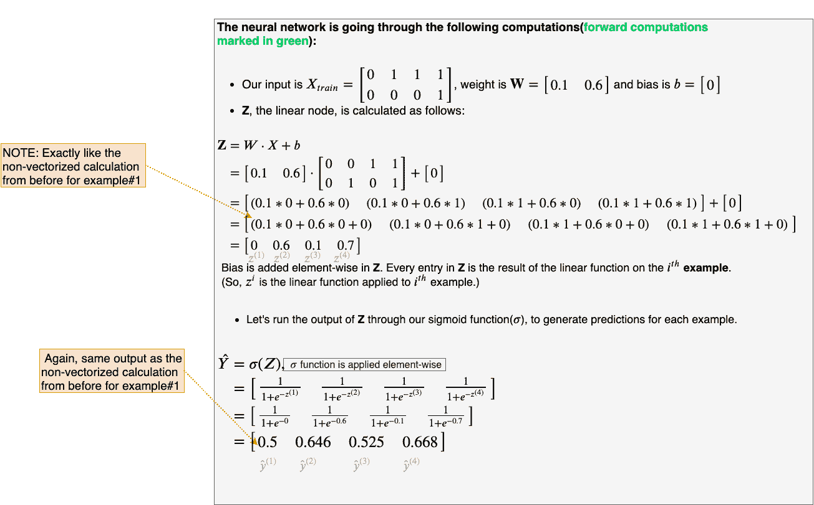

图 42\. 对 OR 门数据集的向量化前向传播

通过向量化我们的计算，我们在一次操作中计算了数据集中所有示例的前向传播步骤，这真是太棒了。

我们现在可以计算这些输出预测的**成本**。*(我们将详细讲解计算过程，以确保没有混淆)*

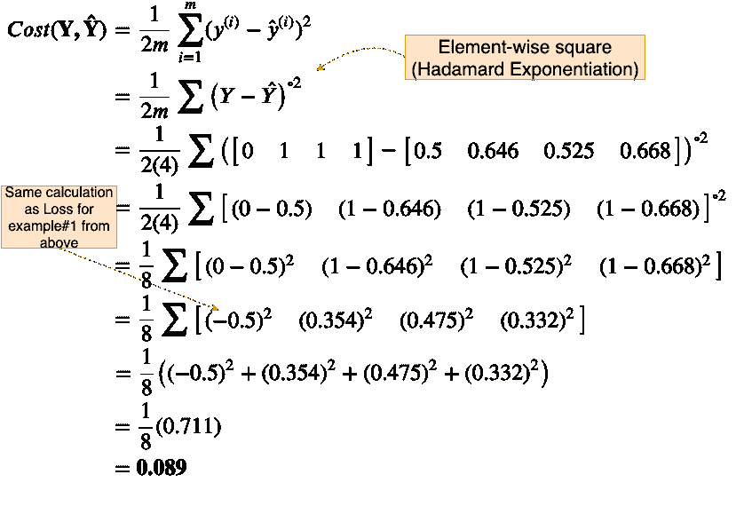

图 43\. 对 OR 门数据的成本计算

我们当前权重**W**下的**成本**为**0.089**。我们的目标是使用反向传播和梯度下降来减少这一成本。和以前一样，我们将逐步进行反向传播。

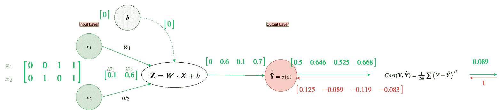

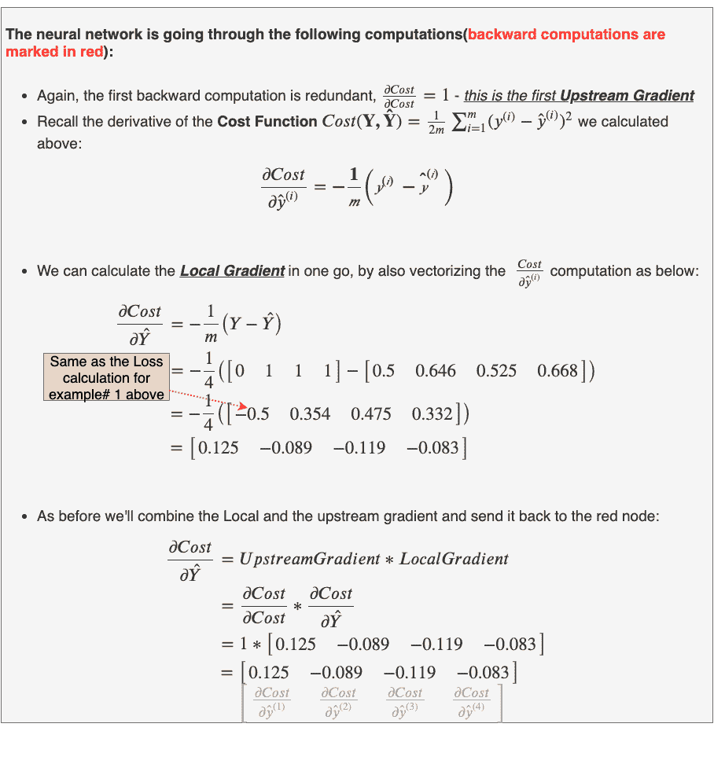

图 44.a. 对 OR 门数据的向量化反向传播

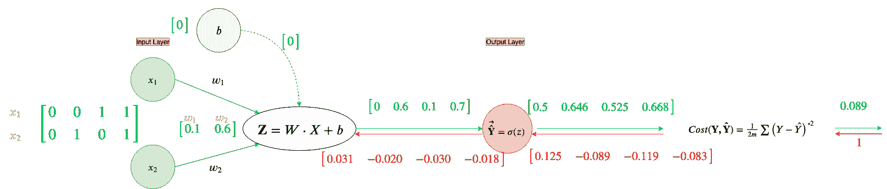

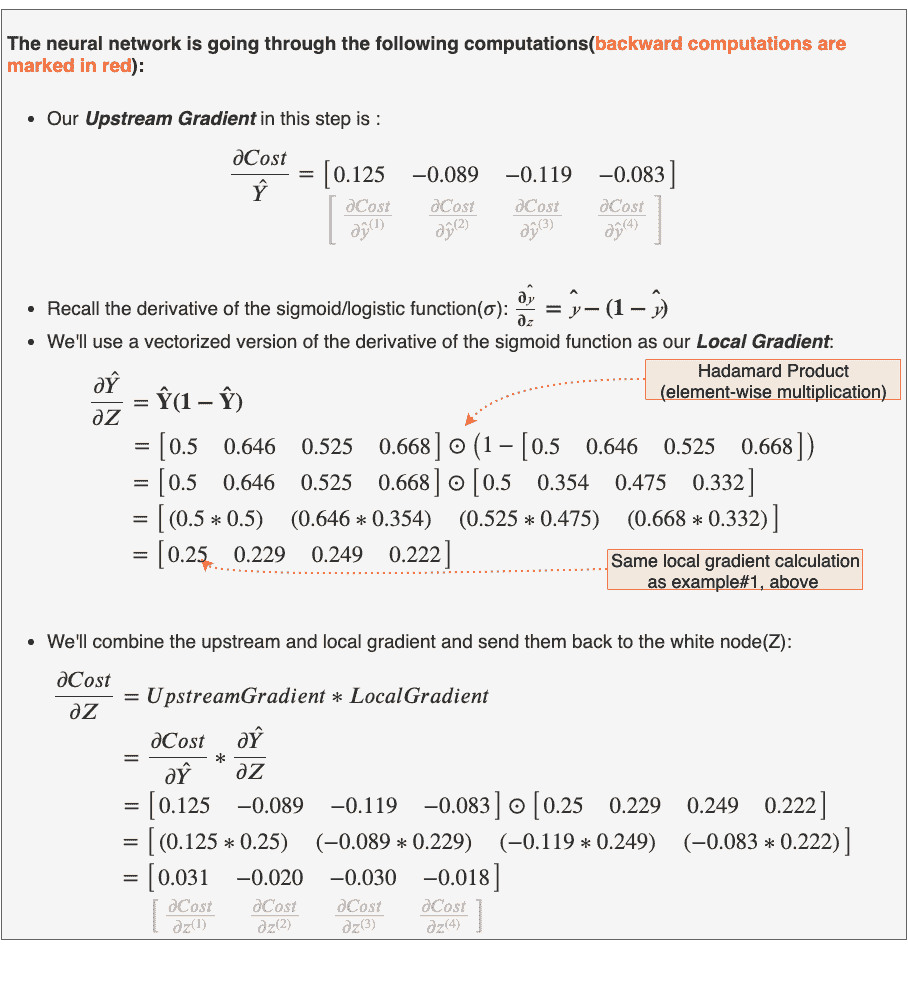

图 44.b. 对 OR 门数据的向量化反向传播

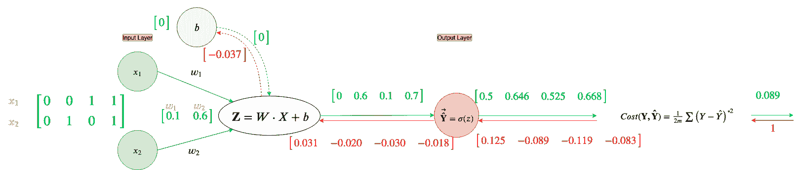


图 44.c. 对 OR 门数据的向量化反向传播

哇，我们使用了*批量梯度下降*的向量化实现来一次性计算所有梯度。

*(细心的人可能会好奇在最后一步中如何计算局部梯度和最终梯度。别担心，我会在最后一步解释梯度的推导过程。现在只需知道最后一步中定义的梯度是对计算 ∂Cost/∂W 和 ∂Cost/∂b 的简单方法的一种优化即可)*

让我们更新权重和偏置，保持学习率与之前的非向量化实现相同，即***α=1***。


图 45\. 计算的新权重和偏置

现在我们已经更新了权重和偏置，进行**前向传播**并**计算新成本**以检查我们是否做对了。


图 46\. 使用更新后的权重和偏置的向量化前向传播


图 47\. 更新参数后的新成本

所以，我们*将成本（所有示例的平均损失）*从最初的成本***0.089***减少到**0.084**。在我们收敛到较低成本之前，还需要进行多次训练迭代。

在这一点上，我建议你自己执行反向传播步骤。结果应该是（四舍五入到小数点后三位）：***∂Cost/∂W = [-0.044, -0.035]*** 和 ***∂Cost/∂b = [-0.031]***。

回想一下，在我们训练神经网络之前，我们如何预测神经网络可以分离图 9 中的两个类别，而在大约 5000 个 Epochs（全批量训练迭代）后，成本稳步下降到大约***0.0005***，我们得到了以下决策边界***：***


图 48。5000 个 Epochs 后的成本曲线和决策边界

**成本曲线**基本上是经过一定次数迭代（epochs）后绘制的成本值。注意，成本曲线在大约 3000 个 epochs 后趋于平坦，这意味着神经网络的权重和偏置已收敛，因此进一步训练只会稍微改善我们的权重和偏置。为什么？回想一下 u 形损失曲线，当我们越来越接近最小点（平坦区域）时，梯度变得越来越小，因此梯度下降的步长非常小。

**决策边界**显示了神经网络输出从一种变为另一种的线。我们可以通过为决策边界上下区域着色来更好地可视化这一点。


图 49。5000 个 Epochs 后的决策边界可视化

这使得情况更加清晰。红色阴影区域是决策边界下方的区域，决策边界下的所有区域输出（**ŷ**）为**0**。同样，决策边界上方的所有区域，阴影为绿色，输出为**1**。总之，我们的简单神经网络通过查看训练数据并找出如何分离两个输出类别（**y=1**和**y=0**）学会了决策边界。现在当***x₁***或***x₂***或两者都是 1 时，输出神经元就会激活（产生 1）。

现在是查看“**1/m**”（“**m**”是训练数据集中样本总数）在成本函数中如何体现在梯度的最终计算中的好时机。


图 50。比较相对于成本和损失的导数对神经网络参数的影响

**由此，最重要的一点是，通过成本函数更新权重所使用的梯度是训练迭代过程中计算的所有梯度的平均值；** **偏置也是如此**。你可以通过自己检查向量化计算来确认这一点。

取所有梯度的平均值有一些好处。首先，它给我们一个较少噪声的梯度估计。其次，结果学习曲线平滑，帮助我们轻松判断神经网络是否在学习。这两个特性在训练神经网络时非常有用，尤其是在处理标记错误的数据集时。

* * *

### 这很好，但你是怎么计算梯度 ∂Cost/∂W 和 ∂Cost/∂b 的呢？

我经常从中学习的神经网络指南和博客文章往往省略了复杂的细节，或者对这些细节给出了非常模糊的解释。在这篇博客中，我们将逐一讨论所有内容，绝不遗漏任何细节。

### 首先，我们来处理∂Cost/∂b。我们为什么要对梯度进行求和？

为了说明这一点，我在三个非常简单的方程上应用我们的计算图技术。


图 51\. 简单方程的计算图

我特别关注***b***节点，所以我们来对它进行反向传播。


图 52\. 简单方程的计算图上的反向传播

注意到** *b*** 节点正在从** 两个** 其他节点接收梯度。因此，流入节点***b ***的梯度总和是两个流入梯度的*总和*。


图 53\. 流入节点**b**的梯度总和

从这个例子中，我们可以概括出以下规则：***对一个节点，求和所有可能路径上的所有流入梯度。***

让我们可视化一下这个规则在计算**偏差**时是如何应用的。*我们的神经网络可以被看作是对每个示例进行****独立****的计算*，但在训练迭代中使用共享的权重和偏差参数。下图中，偏差(***b***) 被可视化为我们神经网络执行的所有单独计算的共享参数。


图 54\. 可视化偏差参数在训练周期中的共享情况。

按照上面定义的一般规则，我们将对所有可能路径上的所有流入梯度进行求和，得到偏差节点**b**的总梯度。


图 55\. 可视化所有可能的反向传播路径到共享偏差参数

由于∂Z/∂b（Z 节点的局部梯度）等于**1**，所以在***b ***处的总梯度是每个示例相对于成本的梯度总和。


图 56\. 证明∂Cost/∂b 是上游梯度的总和

现在我们已经搞清楚了偏差的导数，接下来我们要讨论权重的导数，更重要的是权重的局部梯度。

### 为什么局部梯度（∂Z/∂W）等于输入训练数据（X_train）的转置？

这可以用与上述偏差计算类似的方法来回答，但主要的复杂性在于计算权重矩阵(***W***)和数据矩阵(***Xₜᵣₐᵢₙ***)之间的点积的导数，这形成了我们的局部梯度。


图 57.a. 计算点积的导数。

点积的这个导数有点复杂，因为**我们不再处理标量量**，而是**W**和**X**都是矩阵，**W⋅X**的结果也是矩阵。让我们先通过一个简单的例子深入探讨，然后从中进行概括。


图 57.b. 点积导数的计算。

让我们计算***A***相对于***W***的导数。


图 57.c. 点积导数的计算。

让我们在一个处理多个示例的训练迭代中可视化这一点。*(注意输入示例是列向量。)*


图 58. 训练周期中共享权重的可视化

就像偏置(**b**)在训练迭代中的每次计算中都被共享一样，权重(***W***)也在被共享。我们也可以可视化梯度回流到权重，如下所示*(注意每个示例相对于***W***的局部导数结果是输入示例的行向量，即输入的转置)*：


图 59. 可视化所有可能的反向传播路径到共享权重参数

再次遵循上述的一般规则，我们将汇总来自所有可能路径的梯度到权重节点**W**。


图 60. 在可视化之后∂Cost/∂W 的推导。

到目前为止，我们计算***∂Cost/∂W***的方法虽然正确且解释得很好，但它并不是最优的计算方法。我们也可以对这个计算进行向量化。接下来我们来做这个。


图 61. 证明∂Cost/∂W 是上游梯度与***Xₜᵣₐᵢₙ***的转置之间的点积

### 有没有更简单的方法来找出这一点，而不需要数学计算？

是的！使用***维度分析***。

在我们的 OR 门示例中，我们知道流入节点***Z***的梯度是(1 × 4)矩阵，Xₜᵣₐᵢₙ是(2 × 4)矩阵，且相对于***W***的 Cost 的导数需要与***W***大小相同，即(1 × 2)。因此，生成(1 × 2)矩阵的唯一方法是计算***Z***与***Xₜᵣₐᵢₙ***的转置的点积。


同样，知道偏置***b***是一个简单的(1 × 1)矩阵，流入节点 Z 的梯度是(1 × 4)，通过维度分析我们可以确定相对于***b***的 Cost 的梯度也需要是(1 × 1)矩阵。鉴于局部梯度(***∂Z/∂b***)仅等于***1***，我们可以通过汇总上游梯度来实现这一点。

*最后，当推导导数表达式时，先在小示例上进行工作，然后再从那里推广。例如，在这里，当计算相对于 ****W 的点积的导数时，我们使用了一个单列向量作为测试案例，并从那里推广。如果我们使用整个数据矩阵，那么导数将导致一个 (4 × 1 × 2) 张量（多维矩阵），其计算可能会变得有些复杂。*

* * *

在结束这一部分之前，让我们看一个稍微复杂的例子。


图 62\. XOR 门数据

上面的图 62 表示 XOR 门数据。注意到，标签 ***y*** 仅在 ***x₁*** 或 ***x₂*** 中的一个值等于 ***1*** 时才等于 ***1***，*而不是两个值都等于 1*。这使得这个数据集特别具有挑战性，因为数据不是线性可分的，即没有单一的直线决策边界能够成功地分隔数据中的两个类别（***y=1*** 和 ***y=0***）。XOR 曾经是早期形式的人工神经网络的祸根。


图 63\. 一些错误的线性决策边界

记住，我们当前的神经网络之所以成功，是因为它能够找出能够成功分隔 OR 门数据集两个类别的直线决策边界。这里，直线无法解决问题。那么，我们如何让神经网络解决这个问题呢？

嗯，我们可以做两件事：

1.  修改数据本身，使得除了特征 ***x₁*** 和 ***x₂*** 外，第三个特征提供一些额外的信息，帮助神经网络确定一个好的决策边界。这一过程称为 ***特征工程***。

1.  改变神经网络的架构，使其更深。

让我们比较一下两者，看看哪一个更好。

### 特征工程

让我们看看一个类似 XOR 数据的数据集，这将帮助我们做出一个重要的认识。


图 64\. 不同象限中的 XOR 类数据

图 64 中的数据与 XOR 数据完全相同，只是每个数据点分布在不同的象限中。注意到在 **第 1 象限和第 3 象限中的所有值都是正的**，而在 **第 2 象限和第 4 象限中的所有值都是负的**。


图 65\. 正负象限

为什么呢？在 **第 1** 和 **第 3** 象限中，值的符号被平方，而在 **第 2** 和 **第 4** 象限中，值是负数和正数之间的简单乘积，结果是负数。


图 66\. 特征乘积的结果

这为我们提供了一个使用两个特征的乘积来工作的模式。我们甚至可以在 XOR 数据中看到类似的模式，每个象限都可以以类似的方式进行识别。


图 67\. XOR 数据图中的象限模式

***因此，一个好的第三个特征 x₃ 将是特征 x₁ 和 x₂ 的乘积（即 x₁*x₂）。***

特征的乘积称为 ***特征交叉***，结果是一个新的 ***合成特征***。*特征交叉可以是特征本身（例如 ****x₁², x₁³,…****），两个或更多特征的乘积（例如 ****x₁*x₂, x₁*x₂*x₃, …****），甚至是两者的组合（例如 ****x₁²*x₂****）。例如，在一个房屋数据集中，其中输入特征是房屋的宽度和长度（以码为单位），标签是房屋在地图上的位置，房屋的宽度和长度之间的特征交叉可能是这个位置的更好预测器，从而给我们一个新的特征“房屋大小（平方码）”。*

让我们将新的合成特征添加到我们的训练数据 Xₜᵣₐᵢₙ 中。


图 68\. 新的训练数据

使用此特性交叉，我们现在可以成功地学习决策边界，而无需显著改变神经网络的架构。我们只需要在输入层添加一个用于 ***x₃*** 的输入节点以及一个相应的权重（*随机设置为 0.2*）。


图 69\. 以特征交叉（x₃）为输入的神经网络


图 70\. 扩展的神经网络，以特征交叉（x₃）为输入

以下是神经网络的*第一次*训练迭代，您可以自行进行计算并确认这些计算，因为它们是很好的练习。由于我们已经熟悉了这种神经网络架构，我将不会像以前一样逐步讲解所有计算步骤。

*(下面的所有计算均四舍五入到小数点后三位)*


图 71\. 第一次训练迭代中的前向传播


图 72\. 第一次训练迭代中的反向传播


图 73\. 第一次训练迭代中新权重和偏置的梯度下降更新

经过 5000 次迭代后，学习曲线和决策边界如下：


图 74\. 具有特征交叉的神经网络的学习曲线和决策边界

如前所述，为了更好地可视化，我们可以对神经网络决策从一种到另一种的区域进行阴影处理。


图 75\. 为了更好的可视化而阴影处理的决策边界

***注意，特征工程使我们能够创建一个非线性的决策边界。*** 它是如何做到的？我们只需查看 ***Z*** 节点正在计算的函数。


图 76\. 节点**Z**在添加特征交叉后计算多项式

因此，特征交叉帮助我们创建了复杂的非线性决策边界。

***这是一个非常强大的想法！***

### 更改神经网络架构

这是更有趣的方法，因为它让我们绕过特征工程，***让神经网络自行找出特征交叉！***

让我们看看以下神经网络：


图 77\. 具有一个隐藏层的神经网络。

因此，我们在神经网络架构中添加了一些新的节点，保持输入层和输出层不变。这些新增的节点列称为***隐藏层。*** 为什么叫隐藏层？因为在定义后，我们无法直接控制隐藏层中的神经元如何学习，不像输入层和输出层，我们可以通过更改数据来改变它们；同时，由于隐藏层既不是神经网络的输出也不是输入，它们本质上对用户来说是隐藏的。

***我们可以有任意数量的隐藏层，每层可以有任意数量的神经元***。这个结构需要由神经网络的创建者定义。*因此，****隐藏层的数量和每层神经元的数量也是超参数。我们添加的隐藏层越多，神经网络架构越深；我们在隐藏层中添加的神经元越多，网络架构越宽。神经网络模型的深度就是“深度学习”这一术语的来源。***

*图 77 中的架构具有一个隐藏层，包含三个 sigmoid 神经元，是经过一些实验后选择的。*

由于这是一个新的架构，我将逐步讲解计算过程。

首先，让我们扩展神经网络。


图 78\. 扩展的神经网络，具有一个隐藏层

现在让我们进行***前向传播：***


图 79.a. 在具有隐藏层的神经网络上进行前向传播


图 79.b. 在具有隐藏层的神经网络上进行前向传播

现在我们可以计算成本：


图 80\. 在**第一次**前向传播后，具有一个隐藏层的神经网络的成本

计算成本后，我们可以进行反向传播并改进权重和偏置。


图 81.a. 在具有隐藏层的神经网络上进行反向传播


图 81.b. 带有隐藏层的神经网络的反向传播


图 81.c. 带有隐藏层的神经网络的反向传播


图 81.d. 带有隐藏层的神经网络的反向传播


图 81.e. 带有隐藏层的神经网络的反向传播

呼！这真是很多内容，但它大大提高了我们的理解。让我们进行梯度下降更新：


图 82. 带有隐藏层的神经网络的梯度下降更新

在这一点上，我鼓励所有读者自己进行一次训练迭代。得到的梯度应大致为（四舍五入到 3 位小数）：


图 83. 第二次训练迭代期间计算的导数

经过 5000 次迭代后，成本稳定下降至约***0.0009***，我们得到如下的学习曲线和决策边界：


图 84. 带有一个隐藏层的神经网络的学习曲线和决策边界

让我们还可视化神经网络从 0（红色）到 1（绿色）的决策变化：


图 85. 带有一个隐藏层的神经网络的阴影决策边界

这表明神经网络实际上已经学会了在哪里激活（输出 1）和在哪里保持静默（输出 0）。

如果我们再添加另一个隐藏层，可能有 2 或 3 个 sigmoid 神经元，我们可以得到一个更复杂的决策边界，可能会更紧密地拟合我们的数据，但我们将把这个留到编码部分。

在我们结束这一部分之前，我想回答一些剩下的问题：

### 1- 那么，特征工程和深度神经网络哪个更好？

好吧，答案取决于许多因素。一般来说，如果我们有大量的训练数据，我们可以直接使用深度神经网络来获得令人满意的准确度，但如果数据有限，我们可能需要进行一些特征工程，以从神经网络中提取更多性能。正如你在上面的特征工程示例中看到的，为了创建良好的特征交叉，我们需要对所使用的数据集有深入的了解。

*特征工程与深度神经网络的结合是一个强大的组合。*

### 2- 如何计算神经网络中的层数？

按惯例，我们不计算没有可调权重和偏置的层。因此，虽然输入层是一个单独的“层”，但在指定神经网络的深度时我们不计算它。

所以，我们最后一个例子是“*2 层神经网络*”（一个隐藏层+输出层），而之前的所有例子只是“*1 层神经网络*”（仅输出层）。

### 3- 为什么使用激活函数？

***激活函数是非线性函数，给神经元添加非线性。特征交叉是隐藏层中堆叠激活函数的结果***。因此，一系列激活函数的组合产生了复杂的非线性决策边界。在本博客中，我们使用了 sigmoid/logistic 激活函数，但还有许多其他类型的激活函数（*ReLU 是隐藏层的热门选择*），每种都有一定的好处。 ***激活函数的选择也是创建神经网络时的一个超参数。***

***没有激活函数来添加非线性，无论我们堆叠多少线性函数，它们的结果仍然是线性的。*** 请考虑以下几点：


图 86\. 显示堆叠线性层/函数结果为线性层/函数

你可以使用任何非线性函数作为激活函数。一些研究人员甚至使用了 ***cos*** 和 **sin** 函数。激活函数最好是连续的，即函数的定义域中没有断点。

### 4- 为什么随机初始化权重？

现在这个问题更容易回答了。注意，如果我们将层中的所有权重设置为相同的值，那么通过每个节点的梯度将是相同的。简而言之，层中的所有节点将学习关于数据的相同特征。将权重设置为 ***随机值有助于打破权重的对称性***，以便层中的每个节点都有机会学习训练数据的独特方面。

神经网络中设置权重的方法有很多。对于小型神经网络，设置权重为小的随机值是可以的。对于较大的网络，我们倾向于使用“Xavier”或“He”初始化方法（*将在编码部分介绍*）。这两种方法都将权重设置为随机值，但控制其方差。 *目前，可以说当网络似乎无法收敛且使用“纯粹”的小随机值设置权重时，成本变得静态或减小得很慢时，使用这些方法就足够了。* 权重初始化是一个活跃的研究领域，将成为未来“Nothing but Numpy”博客的主题。

偏置也可以随机初始化。但是在实践中，它似乎对神经网络的性能没有太大影响。也许这是因为神经网络中的偏置项数量远少于权重。

我们在这里创建的神经网络类型称为“***全连接前馈网络***”或简单地称为“***前馈网络***”。

这部分内容结束了。

* * *

### 第二部分：编写模块化神经网络

这一部分的实现遵循面向对象编程原则。

让我们首先查看**线性层**类。构造函数接受以下参数：传入数据的形状（`input_shape`），层输出的神经元数量（`n_out`），以及需要执行的随机权重初始化类型（`ini_type=”plain”`，默认为“plain”，即仅小随机高斯数）。

`initialize_parameters` 是一个用于定义权重和偏差的辅助函数。我们稍后会单独查看它。

线性层实现以下函数：

+   `forward(A_prev)`：此函数允许线性层接受来自前一层的激活值（输入数据可以看作是来自输入层的激活值），并对其执行线性操作。

+   `backward(upstream_grad)`：此函数计算成本对权重、偏差和来自前一层的激活值的导数（`dW`、`db` 和 `dA_prev`）。

+   `update_params(learning_rate=0.1)`：此函数使用在`backward`函数中计算的导数，对权重和偏差执行梯度下降更新。默认学习率（α）为 0.1。

```py
import numpy as np  # import numpy library
from util.paramInitializer import initialize_parameters  # import function to initialize weights and biases

class LinearLayer:
    """
        This Class implements all functions to be executed by a linear layer
        in a computational graph
        Args:
            input_shape: input shape of Data/Activations
            n_out: number of neurons in layer
            ini_type: initialization type for weight parameters, default is "plain"
                      Opitons are: plain, xavier and he
        Methods:
            forward(A_prev)
            backward(upstream_grad)
            update_params(learning_rate)
    """

    def __init__(self, input_shape, n_out, ini_type="plain"):
        """
        The constructor of the LinearLayer takes the following parameters
        Args:
            input_shape: input shape of Data/Activations
            n_out: number of neurons in layer
            ini_type: initialization type for weight parameters, default is "plain"
        """

        self.m = input_shape[1]  # number of examples in training data
        # `params` store weights and bias in a python dictionary
        self.params = initialize_parameters(input_shape[0], n_out, ini_type)  # initialize weights and bias
        self.Z = np.zeros((self.params['W'].shape[0], input_shape[1]))  # create space for resultant Z output

    def forward(self, A_prev):
        """
        This function performs the forwards propagation using activations from previous layer
        Args:
            A_prev:  Activations/Input Data coming into the layer from previous layer
        """

        self.A_prev = A_prev  # store the Activations/Training Data coming in
        self.Z = np.dot(self.params['W'], self.A_prev) + self.params['b']  # compute the linear function

    def backward(self, upstream_grad):
        """
        This function performs the back propagation using upstream gradients
        Args:
            upstream_grad: gradient coming in from the upper layer to couple with local gradient
        """

        # derivative of Cost w.r.t W
        self.dW = np.dot(upstream_grad, self.A_prev.T)

        # derivative of Cost w.r.t b, sum across rows
        self.db = np.sum(upstream_grad, axis=1, keepdims=True)

        # derivative of Cost w.r.t A_prev
        self.dA_prev = np.dot(self.params['W'].T, upstream_grad)

    def update_params(self, learning_rate=0.1):
        """
        This function performs the gradient descent update
        Args:
            learning_rate: learning rate hyper-param for gradient descent, default 0.1
        """

        self.params['W'] = self.params['W'] - learning_rate * self.dW  # update weights
        self.params['b'] = self.params['b'] - learning_rate * self.db  # update bias(es)

```

图 87\. 线性层类

现在让我们看看**Sigmoid 层**类，它的构造函数接受作为参数的前一个线性层传入的数据形状（`input_shape`）。

Sigmoid 层实现以下函数：

+   `forward(Z)`：此函数允许 Sigmoid 层接受来自前一层的线性计算值（`Z`），并对其执行 Sigmoid 激活。

+   `backward(upstream_grad)`：此函数计算成本对***Z***（`dZ`）的导数。

```py
import numpy as np  # import numpy library

class SigmoidLayer:
    """
    This file implements activation layers
    inline with a computational graph model
    Args:
        shape: shape of input to the layer
    Methods:
        forward(Z)
        backward(upstream_grad)
    """

    def __init__(self, shape):
        """
        The consturctor of the sigmoid/logistic activation layer takes in the following arguments
        Args:
            shape: shape of input to the layer
        """
        self.A = np.zeros(shape)  # create space for the resultant activations

    def forward(self, Z):
        """
        This function performs the forwards propagation step through the activation function
        Args:
            Z: input from previous (linear) layer
        """
        self.A = 1 / (1 + np.exp(-Z))  # compute activations

    def backward(self, upstream_grad):
        """
        This function performs the  back propagation step through the activation function
        Local gradient => derivative of sigmoid => A*(1-A)
        Args:
            upstream_grad: gradient coming into this layer from the layer above
        """
        # couple upstream gradient with local gradient, the result will be sent back to the Linear layer
        self.dZ = upstream_grad * self.A*(1-self.A)

```

图 88\. Sigmoid 激活层类

`initialize_parameters`函数仅在线性层中使用，用于设置权重和偏差。它根据输入（`n_in`）和输出（`n_out`）的大小定义权重矩阵和偏差向量的形状。然后，这个辅助函数将权重（W）和偏差（b）以 Python 字典的形式返回给相应的线性层。

```py
def compute_cost(Y, Y_hat):
    """
    This function computes and returns the Cost and its derivative.
    The is function uses the Squared Error Cost function -> (1/2m)*sum(Y - Y_hat)^.2
    Args:
        Y: labels of data
        Y_hat: Predictions(activations) from a last layer, the output layer
    Returns:
        cost: The Squared Error Cost result
        dY_hat: gradient of Cost w.r.t the Y_hat
    """
    m = Y.shape[1]

    cost = (1 / (2 * m)) * np.sum(np.square(Y - Y_hat))
    cost = np.squeeze(cost)  # remove extraneous dimensions to give just a scalar

    dY_hat = -1 / m * (Y - Y_hat)  # derivative of the squared error cost function

    return cost, dY_hat

```

图 89\. 设置权重和偏差的辅助函数

最后，成本函数`compute_cost(Y, Y_hat)`以最后一层的激活值（`Y_hat`）和真实标签（`Y`）作为参数，计算并返回平方误差成本（`cost`）及其导数（`dY_hat`）。

```py
def compute_cost(Y, Y_hat):
    """
    This function computes and returns the Cost and its derivative.
    The is function uses the Squared Error Cost function -> (1/2m)*sum(Y - Y_hat)^.2
    Args:
        Y: labels of data
        Y_hat: Predictions(activations) from a last layer, the output layer
    Returns:
        cost: The Squared Error Cost result
        dY_hat: gradient of Cost w.r.t the Y_hat
    """
    m = Y.shape[1]

    cost = (1 / (2 * m)) * np.sum(np.square(Y - Y_hat))
    cost = np.squeeze(cost)  # remove extraneous dimensions to give just a scalar

    dY_hat = -1 / m * (Y - Y_hat)  # derivative of the squared error cost function

    return cost, dY_hat

```

图 90\. 计算平方误差成本和导数的函数。

*此时，你应该在另一个窗口中打开*[***2_layer_toy_network_XOR***](https://github.com/RafayAK/NothingButNumPy/blob/master/2_layer_toy_network_XOR.ipynb)* Jupyter 笔记本，并对照本博客和笔记本进行查看。*

现在我们准备好创建我们的神经网络了。让我们使用*图 77*中定义的架构来处理 XOR 数据。

```py
# define training constants
learning_rate = 1
number_of_epochs = 5000

np.random.seed(48) # set seed value so that the results are reproduceable
                  # (weights will now be initailzaed to the same pseudo-random numbers, each time)

# Our network architecture has the shape: 
#                   (input)--> [Linear->Sigmoid] -> [Linear->Sigmoid] -->(output)  

#------ LAYER-1 ----- define hidden layer that takes in training data 
Z1 = LinearLayer(input_shape=X_train.shape, n_out=3, ini_type='xavier')
A1 = SigmoidLayer(Z1.Z.shape)

#------ LAYER-2 ----- define output layer that take is values from hidden layer
Z2= LinearLayer(input_shape=A1.A.shape, n_out=1, ini_type='xavier')
A2= SigmoidLayer(Z2.Z.shape)

```

图 91\. 定义层和训练参数

现在我们可以开始主要的训练循环：

```py
costs = [] # initially empty list, this will store all the costs after a certian number of epochs

# Start training
for epoch in range(number_of_epochs):

    # ------------------------- forward-prop -------------------------
    Z1.forward(X_train)
    A1.forward(Z1.Z)

    Z2.forward(A1.A)
    A2.forward(Z2.Z)

    # ---------------------- Compute Cost ----------------------------
    cost, dA2 = compute_cost(Y=Y_train, Y_hat=A2.A)

    # print and store Costs every 100 iterations.
    if (epoch % 100) == 0:
        #print("Cost at epoch#" + str(epoch) + ": " + str(cost))
        print("Cost at epoch#{}: {}".format(epoch, cost))
        costs.append(cost)

    # ------------------------- back-prop ----------------------------
    A2.backward(dA2)
    Z2.backward(A2.dZ)

    A1.backward(Z2.dA_prev)
    Z1.backward(A1.dZ)

    # ----------------------- Update weights and bias ----------------
    Z2.update_params(learning_rate=learning_rate)
    Z1.update_params(learning_rate=learning_rate)

```

图 92\. 训练循环

运行笔记本中的循环，我们看到成本在 4900 次迭代后下降到大约 0.0009。

```py
...
Cost at epoch#4600: 0.001018305488651183
Cost at epoch#4700: 0.000983783942124411
Cost at epoch#4800: 0.0009514180100050973
Cost at epoch#4900: 0.0009210166430616655
```

学习曲线和决策边界如下所示：


图 93. 学习曲线、决策边界及阴影决策边界。

我们训练的神经网络生成的预测是准确的。

```py
The predicted outputs:
 [[ 0\.  1\.  1\.  0.]]
The accuracy of the model is: 100.0%
```

确保查看 [***代码库***](https://github.com/RafayAK/NothingButNumPy) 中的其他笔记本。我们将在未来的“Nothing but NumPy”博客中基于在本博客中学到的内容进行构建，因此，建议你记忆层类并尝试重建 OR 门示例，以作为练习，***Part******Ⅰ****。

本博客到此结束。希望你喜欢。

如有任何问题，请随时通过 [twitter](https://twitter.com/RafayAK) [**@**RafayAK](https://twitter.com/RafayAK) 联系我。

* * *

**本博客的完成离不开以下资源和人士的帮助：**

+   Andrej Karpathy’s ([**@**karpathy](https://twitter.com/karpathy)) 斯坦福 [课程](http://cs231n.stanford.edu/)

+   Christopher Olah’s ([**@**ch402](https://twitter.com/ch402)) [博客](https://colah.github.io/)s

+   Andrew Trask’s ([**@**iamtrask](https://twitter.com/iamtrask)) [博客](https://iamtrask.github.io/)

+   Andrew Ng ([**@**AndrewYNg](https://twitter.com/AndrewYNg)) 和他在 Coursera 上的 [深度学习](https://www.coursera.org/specializations/deep-learning) 和 [机器学习](https://www.coursera.org/learn/machine-learning) 课程

+   [特伦斯·帕尔](http://parrt.cs.usfca.edu/) ([**@**the_antlr_guy](https://twitter.com/the_antlr_guy)) 和 [杰里米·霍华德](http://www.fast.ai/about/#jeremy) ([**@**jeremyphoward](https://twitter.com/jeremyphoward)) ([`explained.ai/matrix-calculus/index.html`](https://explained.ai/matrix-calculus/index.html))

+   Ian Goodfellow ([**@**goodfellow_ian](https://twitter.com/goodfellow_ian)) 和他精彩的 [书籍](https://www.deeplearningbook.org/)

+   最后，感谢 Hassan-uz-Zaman ([**@**OKidAmnesiac](https://twitter.com/OKidAmnesiac)) 和 Hassan Tauqeer 的宝贵反馈。

[原文](https://medium.com/towards-artificial-intelligence/nothing-but-numpy-understanding-creating-neural-networks-with-computational-graphs-from-scratch-6299901091b0)。经许可转载。

**相关：**

+   [绝对初学者的神经网络与 Numpy: 介绍](https://www.kdnuggets.com/2019/03/neural-networks-numpy-absolute-beginners-introduction.html)

+   [使用 NumPy 从零开始构建卷积神经网络](https://www.kdnuggets.com/2018/04/building-convolutional-neural-network-numpy-scratch.html)

+   [使用 NumPy 实现人工神经网络和图像分类](https://www.kdnuggets.com/2019/02/artificial-neural-network-implementation-using-numpy-and-image-classification.html)

### 更多相关主题

+   [成为伟大数据科学家所需的 5 项关键技能](https://www.kdnuggets.com/2021/12/5-key-skills-needed-become-great-data-scientist.html)

+   [每个初学者数据科学家都应掌握的 6 种预测模型](https://www.kdnuggets.com/2021/12/6-predictive-models-every-beginner-data-scientist-master.html)

+   [2021 年最佳 ETL 工具](https://www.kdnuggets.com/2021/12/mozart-best-etl-tools-2021.html)

+   [停止学习数据科学以寻找目标，找到目标后…](https://www.kdnuggets.com/2021/12/stop-learning-data-science-find-purpose.html)

+   [一项 90 亿美元的 AI 失败案例分析](https://www.kdnuggets.com/2021/12/9b-ai-failure-examined.html)

+   [建立一个强大的数据团队](https://www.kdnuggets.com/2021/12/build-solid-data-team.html)
