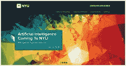

# NYU 数据科学项目 – 需要了解的事项

> 原文：[`www.kdnuggets.com/2014/06/nyu-data-science-program-overview.html`](https://www.kdnuggets.com/2014/06/nyu-data-science-program-overview.html)

作者：Ran Bi，2014 年 6 月

对于数据科学家而言，这是一个激动人心的时刻，对于像我这样希望成为数据科学家的人来说也是如此。幸运的是，我在去年这个时候被录取到了 [NYU 数据科学项目](http://cds.nyu.edu)。这是我在这个新数据科学项目中的经历总结。希望它能让你对 NYU 的数据科学有更清晰的了解。

这是第一部分， 第二部分，我将详细介绍人员和课程。

* * *

## 我们的前 3 个课程推荐

 1\. [谷歌网络安全证书](https://www.kdnuggets.com/google-cybersecurity) - 快速进入网络安全职业道路。

 2\. [谷歌数据分析专业证书](https://www.kdnuggets.com/google-data-analytics) - 提升你的数据分析技能

 3\. [谷歌 IT 支持专业证书](https://www.kdnuggets.com/google-itsupport) - 支持你的组织的 IT

* * *

**让我从基本信息开始。** 这里有一些数字：31 名学生，12 门课程，2 年。Yann LeCun 教授是去年数据科学中心（CDS）的主任。但 Yann 去了 Facebook，现在他是 NYU 的兼职教授。Raghu Varadhan 教授和 David Hogg 教授继任成为我们的新主任。

**这个项目有什么特别之处？** 首先，这是世界上第一个名为“数据科学”的硕士项目。[[查看其他许多项目]](/education/usa-canada.html)。但这只是一个名字，虽然是一个非常热门的名字。CMU 称之为计算数据科学，改名自大型信息系统；斯坦福没有更改名称，但它开始提供统计学和 ICME 部门下的数据科学硕士课程。

其次，它位于纽约。嗯，哥伦比亚的数据科学与工程研究所和康奈尔纽约科技也在纽约。就个人而言，我认为出色的 [教职员工](http://cds.nyu.edu/people/) 和由于“Exabyte 时代”和“大苹果”的众多机会使其成为一个有吸引力的项目。

正如 CDS 的网站所说，

> 这个倡议特别专注于利用大数据的潜在力量，转变从医疗保健到商业再到政府等各个领域。

我认为对数据科学家的高需求是因为它在各个领域中的重要性。数据科学项目提供了灵活性，可以通过特定领域的课程进行定制，例如生物学、经济学、神经科学、物理学、政治学、心理学和音乐。 [点击这里](http://cds.nyu.edu/academics/pre-approved-elective-courses/) 查看预先批准的选修课程的完整列表。

CDS 今年收到超过六百份申请，并录取了约 90 名学生，其中 48 名已经入学。这略高于 50%，这是正常的。我收到了一些关于该项目的问题，例如“这个项目是学术型还是职业型”。这可能听起来奇怪，但六门必修课程中的五门是为博士项目设计的。该硕士项目的目标是帮助所有学生找到工作。所以你可以称之为职业型或学术型，随你喜欢。

此外，数据科学博士项目正在筹备中。目前正在等待州政府的审核。由于缺乏工作人员，州政府的进度较慢。对于提案本身没有反馈。“我们不能在提案获批之前进行宣传，”Roy 说。

**Ran Bi** 是纽约大学数据科学项目的硕士生。她在 NYU 期间完成了多个机器学习、深度学习和大数据分析项目。她本科期间的金融工程背景也使她对商业分析感兴趣。

**相关：**

+   NYU 数据科学中心：Moore-Sloan 数据科学研究员

+   KDnuggets 独家：与深度学习专家、Facebook AI 实验室主任 Yann LeCun 的访谈

+   KDnuggets 独家：与 Yann LeCun 的访谈第二部分

+   NYU、伯克利、UW 三方数百万美元合作伙伴关系，利用数据科学家和大数据的潜力

### 更多相关主题

+   [你不知道的 SAS 数据科学学院的 3 件事](https://www.kdnuggets.com/2022/07/sas-3-things-didnt-know-sas-academy-data-science.html)

+   [你需要了解的关于数据管理的 6 件事及其重要性…](https://www.kdnuggets.com/2022/05/6-things-need-know-data-management-matters-computer-vision.html)

+   [你在扩展 Web 数据驱动产品时应知道的事项](https://www.kdnuggets.com/2023/08/things-know-scaling-web-datadriven-product.html)

+   [7 件你不知道的低代码工具的使用方法](https://www.kdnuggets.com/2022/09/7-things-didnt-know-could-low-code-tool.html)

+   [构建 LLM 应用程序时需要了解的 5 件事](https://www.kdnuggets.com/2023/08/5-things-need-know-building-llm-applications.html)

+   [通过第三名的在线数据科学硕士课程最大化你的价值](https://www.kdnuggets.com/2023/05/bay-path-maximize-value-online-masters-data-science.html)
