# 数据科学家的面向对象编程：构建你的 ML 估算器

> 原文：[`www.kdnuggets.com/2019/08/object-oriented-programming-data-scientists-estimator.html`](https://www.kdnuggets.com/2019/08/object-oriented-programming-data-scientists-estimator.html)

 评论

**更新**：你可以在[**这里**](https://github.com/tirthajyoti/Machine-Learning-with-Python/blob/master/OOP_in_ML/Class_MyLinearRegression.py)找到最新的 Python 脚本（包含线性回归类定义和方法）。利用它进一步构建或进行实验。

### 问题是什么？

* * *

## 我们的前三个课程推荐

 1\. [谷歌网络安全证书](https://www.kdnuggets.com/google-cybersecurity) - 快速进入网络安全职业生涯。

 2\. [谷歌数据分析专业证书](https://www.kdnuggets.com/google-data-analytics) - 提升你的数据分析能力

 3\. [谷歌 IT 支持专业证书](https://www.kdnuggets.com/google-itsupport) - 支持组织的 IT 工作

* * *

数据科学家往往来自于与传统计算机科学/软件工程相去甚远的背景——物理学、生物学、统计学、经济学、电气工程等。

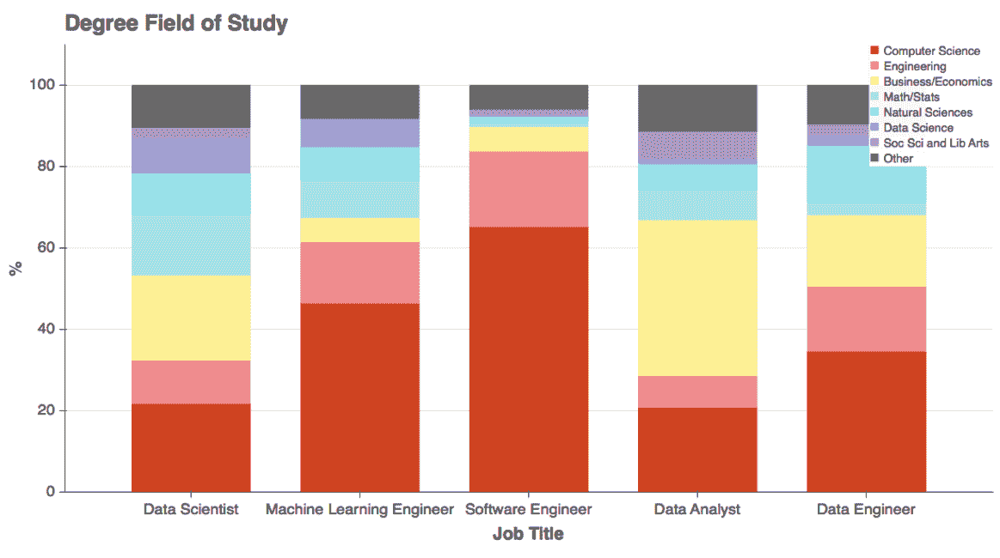

**来源**：[“数据科学家来自哪里？”](https://medium.com/indeed-engineering/where-do-data-scientists-come-from-fc526023ace)

但最终，他们预计会掌握足够的编程/软件工程知识，以对他们的组织和业务产生真正的影响。

**[成为数据科学家并不意味着你是软件工程师！](https://towardsdatascience.com/being-a-data-scientist-does-not-make-you-a-software-engineer-c64081526372?source=post_page-----7da416751f64----------------------)**

如何构建可扩展的机器学习系统——第一部分/2 部分

那么，大多数现代编程语言和软件工程范式的核心是什么？

[面向对象编程（OOP）。](https://www.webopedia.com/TERM/O/object_oriented_programming_OOP.html)

但[面向对象编程（OOP）](https://realpython.com/python3-object-oriented-programming/)的原理对初学者来说可能感觉陌生或甚至令人畏惧。因此，那些背景中没有计算机编程正式培训的数据科学家可能会发现面向对象编程的概念在日常工作中有些难以接受。

受欢迎的数据科学/人工智能/机器学习的 MOOC 和训练营也无济于事。

他们尝试为新兴的数据科学家提供一种统计学、数值分析、科学编程、机器学习（ML）算法、可视化，甚至可能还有一点用于部署这些 ML 模型的网络框架的混合风味。

几乎所有这些都可以学习和实践，即使不严格遵循面向对象编程的原则。事实上，渴望学习最新神经网络架构或最酷数据可视化技术的年轻数据科学家，如果被面向对象编程范式的细节淹没，可能会感到窒息。因此，MOOCs 通常不会在数据科学课程中混合或强调它。

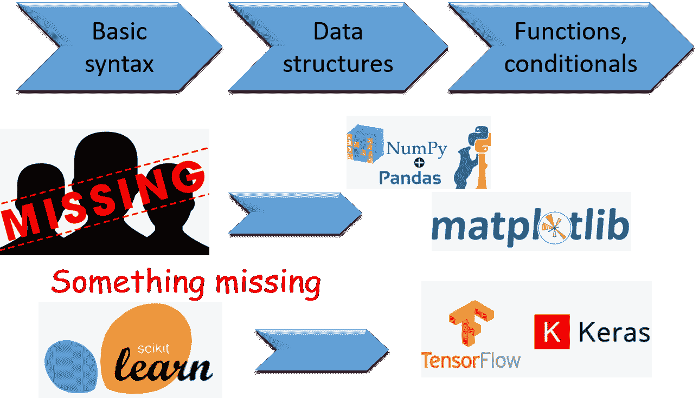

### 一个简单的例子（还有一些…）

让我用 Python 举个例子，因为它是[数据科学和机器学习任务中增长最快的语言](https://stackoverflow.blog/2017/09/14/python-growing-quickly/)。

### 算术例子

如果让你编写一个程序来实现涉及几个数字 `a` 和 `b` 的加法、减法、乘法和除法，你最有可能怎么做？

你很可能会打开一个 Jupyter notebook，在一个单元格中输入以下内容，按 *shift-enter* 并获取结果。

```py
a+b
a-b
a*b
a/b
```

如果你喜欢通过使用函数来整理事物，你可以这样做，

```py
def add(a,b):
    return a+b
...
```

但是你会去定义一个完整的（包括初始化方法）的 Calc ***类*** 并将这些函数放入该类作为 ***方法*** 吗？这些都是类似性质的操作，并且处理相似的数据。为什么不[封装](https://stackify.com/oop-concept-for-beginners-what-is-encapsulation/)到一个更高级的对象中呢？为什么不是下面的代码？

```py
class Calc:
    def __init__(self,a,b):
        self.a = a
        self.b = b
    def add(self):
        return self.a+self.b
    def sub(self):
        return self.a-self.b
    def mult(self):
        return self.a*self.b
    def div(self):
        return self.a/self.b
```

不，你不会这样做。对这个特定问题来说，做这样的事情可能没有意义。但这个想法是有效的——*如果你有数据和函数（在面向对象编程的术语中称为方法），可以逻辑地结合起来，那么它们应该封装在一个类中*。

但为了快速得到一些简单的数值计算结果，这似乎工作量太大了。那么，这有什么意义？数据科学家通常的价值在于他们是否能得到数据问题的正确答案，而不是他们在代码中使用了什么复杂的对象。

### 数据科学家的例子

如果数据科学家不是以这种方式编程，那么是否意味着他们实际上不需要使用这些复杂的编程结构？

**错误。**

在无意识的情况下，数据科学家大量利用了面向对象编程范式的好处。**一直如此**。

还记得`plt.plot`在`import matplotlib.pyplot as plt`之后吗？

那些**.**符号。你有一丝面向对象编程的痕迹。就在这里。

或者，你还记得在 Jupyter notebook 中学会了这个酷技巧——在输入一个点（.）后按下 Tab 键，从而显示所有可以与一个*object*关联的函数吗？像这样，

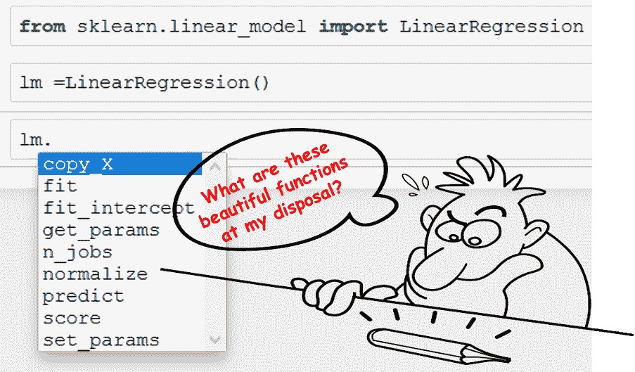

### 这个例子展示了什么？

这个例子展示了逻辑一致性的遵守。

如果没有面向对象编程范式，我们就不得不将这些函数命名为`linear_model_linear_regression_fit`、`linear_model_linear_regression_predict`，等等。它们不会被归入一个共同的逻辑单元下。

为什么？因为它们是不同的函数，作用于不同的数据集。`fit`函数需要训练特征和目标，而`predict`只需要测试数据集。`fit`函数不期望返回任何东西，而`predict`则期望返回一组预测结果。

**那么，为什么它们会在同一个下拉菜单下显示**？尽管它们不同，但它们有一个共同点，即*它们都可以被想象成整体线性回归过程的重要部分*——我们期望线性回归能够适应一些训练数据，然后能够对未来未见的数据进行预测。我们还期望线性回归模型能给出一些关于拟合效果的指示——通常是一个被称为回归系数或 R² 的数值量。正如预期的，我们看到一个函数`score`，它正好返回那个 R² 数字，也在`fit`和`predict`附近。

整洁又干净，不是吗？

> 数据、函数和参数共存于一个逻辑单元内。

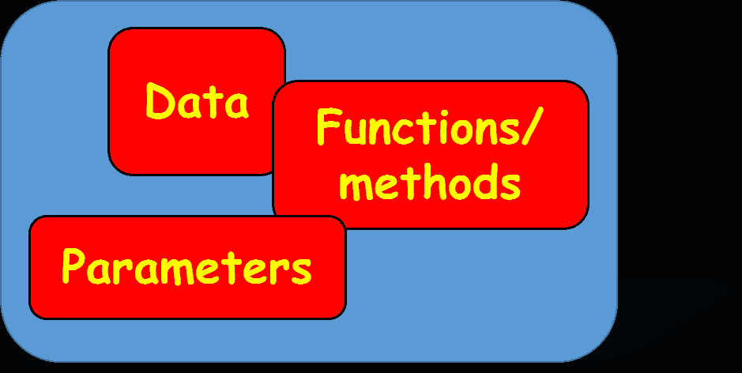

### 这是怎么做到的？

这是因为**我们超越了个体差异，把线性回归视为一个高级过程**，并决定它应该服务于哪些基本操作以及它应该告知用户哪些关键参数。

我们创建了一个高层次的类叫做`LinearRegression`，在其中将所有这些看似不相关的函数归为一个组，以便于记录和提高可用性。

一旦我们从库中导入了这个类，我们只需创建一个类的实例——我们称之为`lm`。就这样。所有归入该类下的函数都通过新定义的实例`lm`对我们可用。

如果我们对函数的某些内部实现不满意，我们可以修改它们并在修改后重新附加到主类上。只有内部函数的代码发生变化，其他没有改变。

看，看起来多么合逻辑且可扩展？

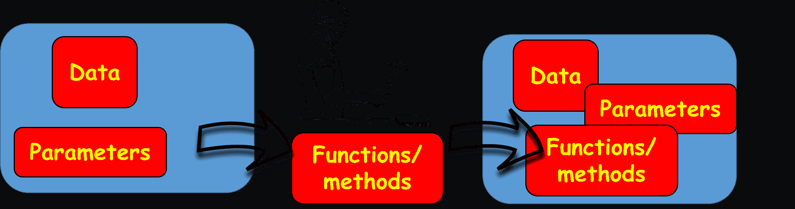

### 创建你自己的 ML 估算器

传统的面向对象编程介绍会有很多使用类的例子，比如——动物、体育、几何形状。

对于数据科学家来说，**为什么不使用他们在代码中每天使用的对象——机器学习估算器来说明这些概念呢**？就像上面图片中显示的 Scikit-learn 库中的`lm`对象一样。

### 一个经典的线性回归估算器——带有一丝变化

[**在这个 Github 仓库**](https://github.com/tirthajyoti/Machine-Learning-with-Python/tree/master/OOP_in_ML)中，我一步步展示了如何构建一个简单的线性回归（单变量或多变量）估算器类，遵循面向对象编程的范式。

是的，它是那种古老的线性回归类。它具有与 Scikit-learn 的 `LinearRegression` 类相同的`fit`和`predict`方法。但它有更多功能。这里是一个简要预览……

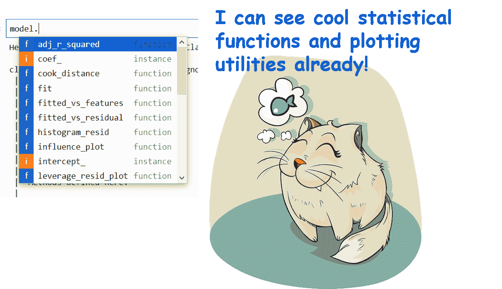

是的，这个估计器比 Scikit-learn 的估计器更丰富，因为它除了标准的`fit`、`predict`和 R² `score`函数外，还具有**一系列对线性回归建模任务至关重要的其他实用工具**。

特别是对于数据科学家和统计建模人员——他们不仅希望进行预测，还希望

+   测量[拟合优度](https://blog.minitab.com/blog/adventures-in-statistics-2/regression-analysis-how-do-i-interpret-r-squared-and-assess-the-goodness-of-fit)，

+   验证[线性回归的假设](https://statisticsbyjim.com/regression/ols-linear-regression-assumptions/)，

+   检查[数据中的多重共线性](https://blog.minitab.com/blog/understanding-statistics/handling-multicollinearity-in-regression-analysis)，或者

+   检测[离群值](https://stattrek.com/regression/influential-points.aspx)。

**[你如何在 Python 中检查回归模型的质量？](https://towardsdatascience.com/how-do-you-check-the-quality-of-your-regression-model-in-python-fa61759ff685?source=post_page-----7da416751f64----------------------)**

线性回归深深扎根于统计学习中，因此必须检查模型的‘优度……

### 你如何开始构建这个类？

我们从一个简单的代码片段开始定义类。我们将其命名为`MyLinearRegression`。

在这里，`self`表示对象本身，而`__init__`是一个[在创建类的实例时会调用的特殊函数](https://micropyramid.com/blog/understand-self-and-__init__-method-in-python-class/)。顾名思义，`__init__`可以用来用必要的参数（如果有的话）初始化类。

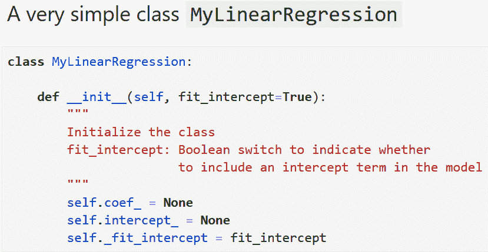

我们可以添加一个简单的描述字符串以保持诚实 :-)

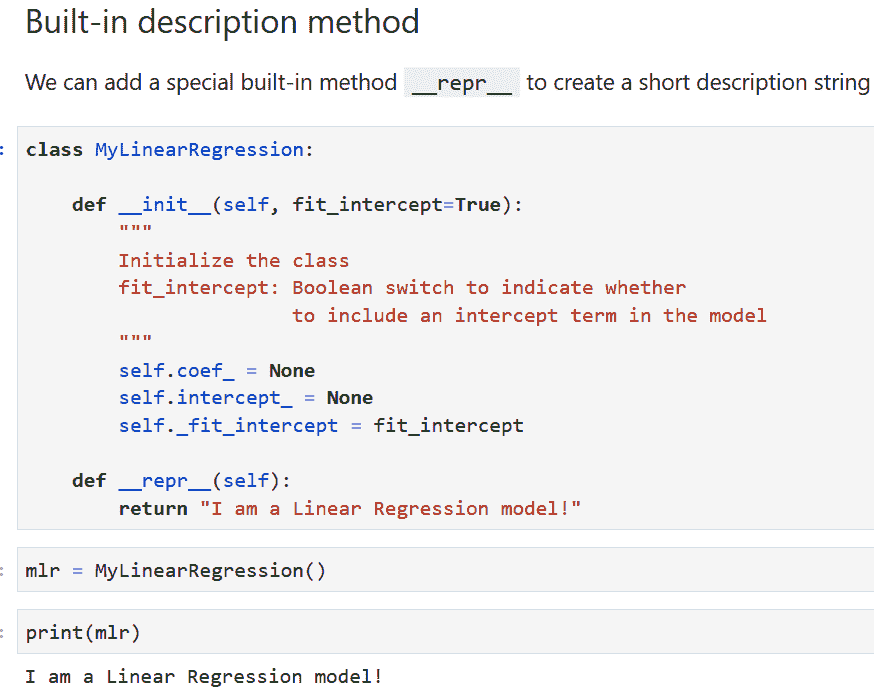

接下来，我们添加核心的`fit`方法。请注意[**文档字符串**](https://www.geeksforgeeks.org/python-docstrings/)，它描述了方法的目的、功能以及期望的数据类型。[这些都是良好面向对象编程原则的一部分](https://towardsdatascience.com/how-a-simple-mix-of-object-oriented-programming-can-sharpen-your-deep-learning-prototype-19893bd969bd)。

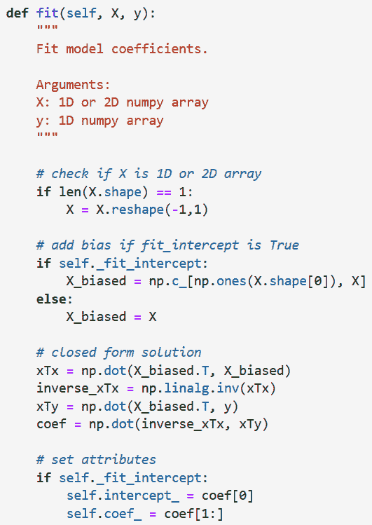

我们可以生成一些随机数据来测试到目前为止的代码。我们创建一个两个变量的线性函数。以下是数据的散点图。

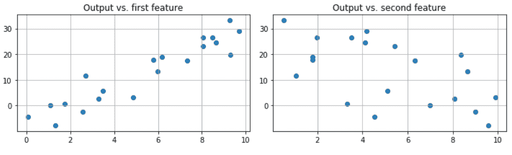

现在，我们可以创建一个名为`mlr`的`MyLinearRegression`类的实例。如果我们尝试打印回归参数，会发生什么呢？

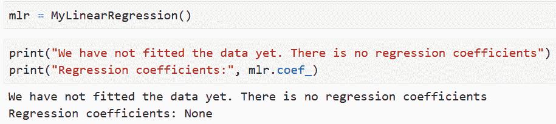

因为`self.coef_`被设置为`None`，所以在尝试打印`mlr.coef_`时得到的结果是一样的。注意，自创建`mlr`实例后，`self`变成了`mlr`的同义词。

但是`fit`的定义包括在拟合完成后设置属性。因此，我们可以直接调用`mlr.fit()`并打印出拟合的回归参数。


### 最重要的`Predict`方法

拟合之后就是预测。我们可以很容易地将该方法添加到我们的回归类中。

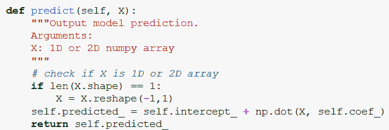

### 如果我们想添加一个（或几个）绘图工具函数怎么办？

到目前为止，我们开始扩展我们的回归类，并**添加一些标准 scikit-learn 类中没有的东西！**例如，我们总是想查看拟合值与真实值的比较。为此创建一个函数很简单。我们将其命名为`plot_fitted`。

请注意，[方法类似于普通函数](https://stackoverflow.com/questions/155609/whats-the-difference-between-a-method-and-a-function/29379748)。它可以接受额外的参数。在这里，我们有一个参数`reference_line`（默认设置为`False`），它在拟合与真实图中绘制了一条 45 度参考线。另外，注意文档字符串的描述。

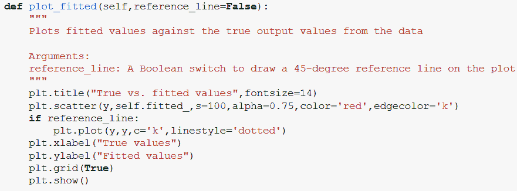

我们可以通过简单地做以下操作来测试方法`plot_fitted`，

```py
m = MyLinearRegression()
m.fit(X,y)
m.plot_fitted()
```

或者，我们可以选择绘制参考线，

```py
m.plot_fitted(reference_line=True)
```

我们得到以下图！

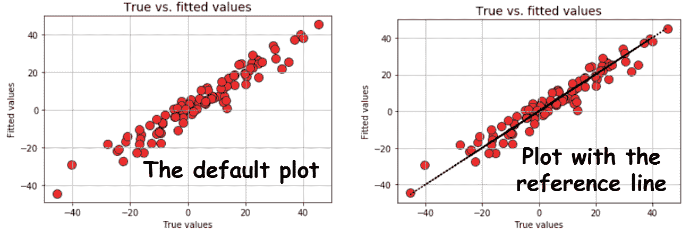

一旦我们明白可以将任何有用的方法添加到处理相同数据（训练集）且目的相同（线性回归）的类中，我们的想象力就没有界限了！如何将以下图添加到我们的类中？

+   **对角图**（绘制所有特征和输出之间的成对关系，类似于 R 中的`pairs`函数）

+   **拟合与残差**图（这属于线性回归的诊断图，即检查基本假设的有效性）

+   **直方图**和**分位数-分位数（Q-Q）**图（这用于检查误差分布的正态性假设）

### 继承 — 不要让你的主类过于繁重

当我们热情地规划要添加到类中的实用方法时，我们认识到这种方法可能会使主类的代码非常长且难以调试。为了解决这个难题，我们可以利用面向对象编程的另一个美丽原则——[**继承**](https://www.geeksforgeeks.org/inheritance-in-python/)。

**[Python 中的继承 - GeeksforGeeks](https://www.geeksforgeeks.org/inheritance-in-python/?source=post_page-----7da416751f64----------------------)**

继承是一个类从另一个类派生或继承属性的能力。其好处…

我们进一步认识到**并非所有绘图类型相同**。Pairplots 和拟合与真实数据的绘图性质相似，因为它们只能从数据中推导出。其他绘图与拟合优度和残差有关。

因此，我们可以创建两个独立的类来实现这些绘图功能——`Data_plots`和`Diagnostic_plots`。

而且你猜怎么着！我们可以将我们的主`MyLinearRegression`类***定义为这些工具类的组成部分***。这就是继承的实例。

**注意**：这可能与标准的父类-子类继承实践有所不同，但在这里使用了相同的语言特性，以保持主类的简洁和紧凑，同时从其他类似构建的类中继承有用的方法。

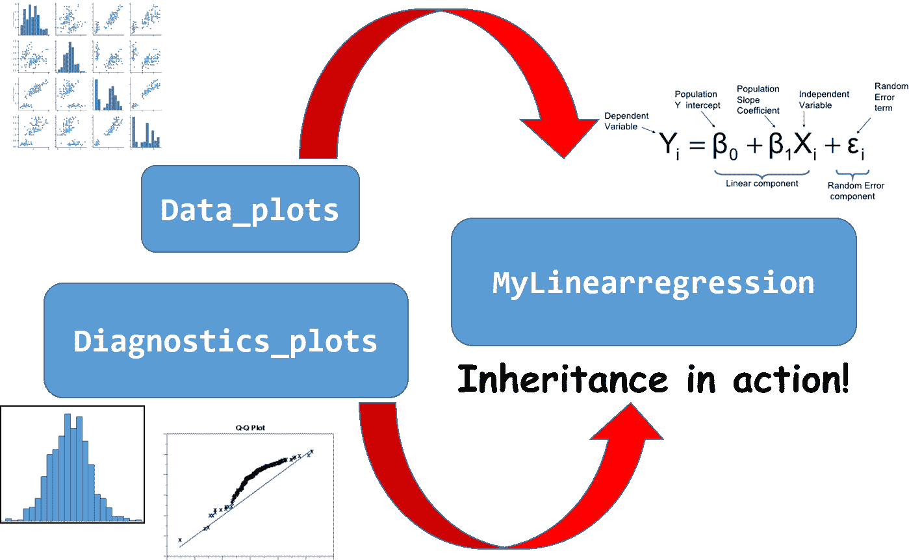

注意以下代码片段仅供说明。请使用上面的 Github 链接查看实际代码。

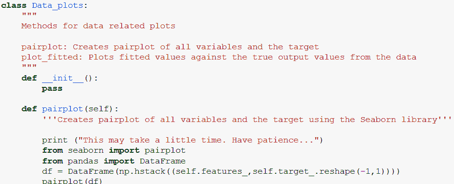

`Data_plots`类！图

`Diagnostics_plots`类

而且`MyLinearRegression`的定义仅略有改变，

```py
class MyLinearRegression(Diagnostics_plots,Data_plots):

    def __init__(self, fit_intercept=True):
        self.coef_ = None
        self.intercept_ = None
        self._fit_intercept = fit_intercept
...
```

通过简单地将`Data_plots`和`Diagnostics_plots`的引用传递给`MyLinearRegression`类的定义，我们继承了这些类的所有方法和属性。

现在，为了检查误差项的正态性假设，我们可以简单地拟合模型并运行这些方法。

```py
m = MyLinearRegression() # A brand new model instance
m.fit(X,y) # Fit the model with some datam.histogram_resid() # Plot histogram of the residuals
m.qqplot_resid() # Q-Q plot of the residuals
```

我们得到，

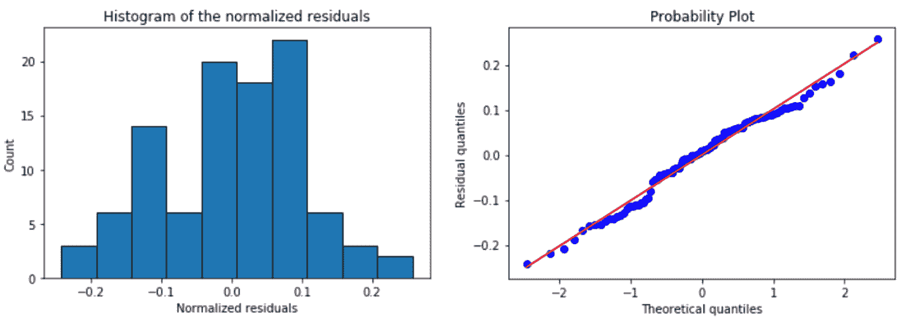

再次，代码的分离在这里发挥作用。你可以在不触及主类的情况下修改和改进核心绘图工具。高度灵活且减少错误的做法！

### 利用面向对象编程的强大功能做更多的事情

我们不会进一步详细说明可以添加到`MyLinearRegression`的各种工具类和方法。你可以[**查看 Github 仓库**](https://github.com/tirthajyoti/Machine-Learning-with-Python/tree/master/OOP_in_ML)。

### 添加的额外类

为了完整性，我们添加了，

+   一个用于计算各种回归指标的类`Metrics`— SSE、SST、MSE、*R*²和调整后的*R*²。

+   一个用于绘制 Cook 距离、杠杆和影响图的类`Outliers`

+   一个用于计算方差膨胀因子（VIF）的类`Multicollinearity`

总的来说，宏观计划如下，

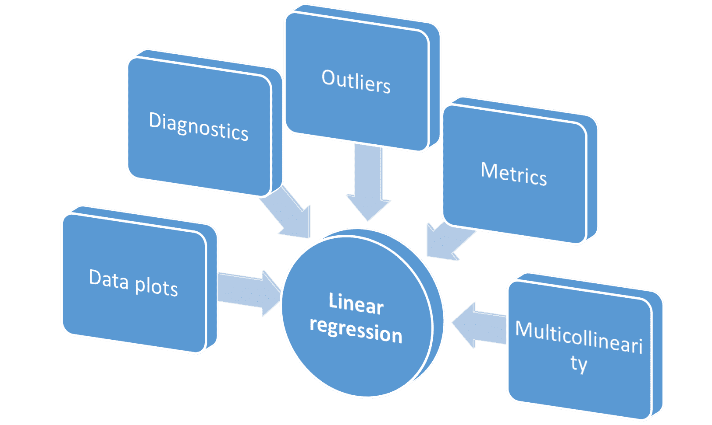

这个类是否比 Scikit-learn 的 LinearRegression 类更丰富？由你决定。

### 通过创建分组工具来添加语法糖

一旦你继承了其他类，它们的行为就像你熟悉的普通 Python 模块一样。因此，你可以向主类添加工具方法，以便同时执行子类中的多个方法。

例如，下面的方法一次运行所有常见的诊断检查。注意我们是如何通过放置一个简单的**.DOT**，即`Diagnostics_plot.histogram_resid`来访问绘图方法的。就像从 Pandas 或 NumPy 库中访问函数一样！

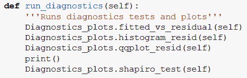

主类中的`run_diagnostics`方法

有了这个，我们可以在数据拟合后用一行代码运行所有的诊断。

```py
m = MyLinearRegression() # A brand new model instance
m.fit(X,y) # Fit the model with some datam.run_diagnostics()
```

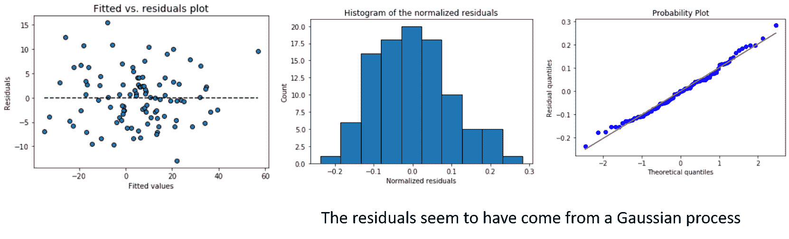

同样，你可以将所有的异常值绘图功能添加到一个实用方法中。

### 模块化——将类作为模块导入

虽然这不是一个经典的 OOP 原则，但遵循 OOP 范式的主要优势是[**能够模块化你的代码**](https://atomicobject.com/resources/oo-programming/encapsulation-modularity)。

你可以在标准的 Jupyter 笔记本中试验和开发所有这些代码。但为了最大程度的模块化，考虑将笔记本转换为独立的可执行 Python 脚本（.py 扩展名）。作为良好的实践，删除文件中的所有不必要的注释和测试代码，仅保留类。

[**这里是我为这篇文章整理的脚本链接**](https://github.com/tirthajyoti/Machine-Learning-with-Python/blob/master/OOP_in_ML/Class_MyLinearRegression.py)。

一旦你这样做了，你可以从完全不同的笔记本中导入`MyLinearRegression`类。这通常是[**测试你的代码的首选方式**](https://atomicobject.com/resources/oo-programming/encapsulation-modularity)，因为这不会触及核心模型，而是仅用不同的数据样本和功能参数进行测试。

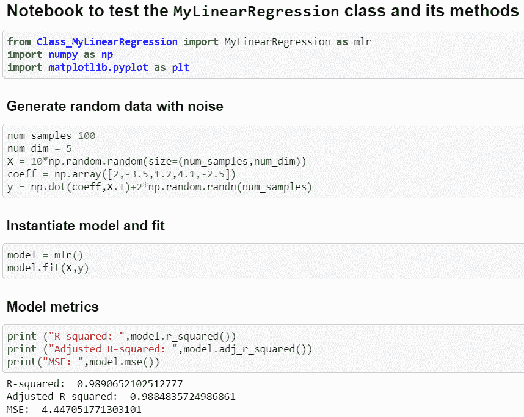

此时，你可以考虑将这个 Python 脚本放到 Github 上，创建一个 Setup.py 文件，建立适当的目录结构，并将其[发布为一个独立的线性回归包](https://towardsdatascience.com/build-your-first-open-source-python-project-53471c9942a7)，该包可以进行拟合、预测、绘图、诊断等操作。

当然，你还需要添加大量的[文档字符串描述](https://www.geeksforgeeks.org/python-docstrings/)、函数使用示例、[断言检查](https://airbrake.io/blog/python-exception-handling/python-assertionerror)和[单元测试](http://softwaretestingfundamentals.com/unit-testing/)，以使其成为一个优秀的包。

> 作为数据科学家，现在你已经为自己的技能库增加了一项重要技能——遵循面向对象编程（OOP）原则的软件开发。

这并不难，对吧？

### 后记

### 动机与相关文章

为撰写这篇文章，我受到[这篇精彩文章](https://dziganto.github.io/classes/data%20science/linear%20regression/machine%20learning/object-oriented%20programming/python/Understanding-Object-Oriented-Programming-Through-Machine-Learning/)的启发，这篇文章更详细地探讨了 Python 中 OOP 的概念，并结合了机器学习的背景。

**[通过机器学习理解面向对象编程](https://dziganto.github.io/classes/data%20science/linear%20regression/machine%20learning/object-oriented%20programming/python/Understanding-Object-Oriented-Programming-Through-Machine-Learning/?source=post_page-----7da416751f64----------------------)**

面向对象编程（OOP）并不容易理解。你可以不断阅读教程，但仍可能无法完全掌握…

我写了一篇类似的文章，在深度学习的背景下涉及了更多基础方法。可以在这里查看，

**[如何通过简单的面向对象编程提升你的深度学习原型](https://towardsdatascience.com/how-a-simple-mix-of-object-oriented-programming-can-sharpen-your-deep-learning-prototype-19893bd969bd?source=post_page-----7da416751f64----------------------)**

通过混合简单的面向对象编程概念，如函数化和类继承，你可以添加…

### 课程？

我尝试寻找相关课程，但如果你使用的是 Python，发现很少有相关课程。大多数软件工程课程使用的是 Java。以下是两个可能对你有帮助的课程，

+   [面向数据科学家的 Python 软件工程](https://www.datacamp.com/courses/software-engineering-for-data-scientists-in-python)

+   [Python 类与继承](https://www.coursera.org/learn/python-classes-inheritance/)

如果你有任何问题或想法，请通过[**tirthajyoti[AT]gmail.com**](mailto:tirthajyoti@gmail.com)联系作者。此外，你可以查看作者的 GitHub 仓库，获取其他有趣的 Python、R 或 MATLAB 代码片段和机器学习资源。如果你像我一样对机器学习/数据科学充满热情，请随时[在 LinkedIn 上添加我](https://www.linkedin.com/in/tirthajyoti-sarkar-2127aa7/)或[关注我在 Twitter 上的动态](https://twitter.com/tirthajyotiS)。

[原文](https://towardsdatascience.com/object-oriented-programming-for-data-scientists-build-your-ml-estimator-7da416751f64)。经许可转载。

**相关：**

+   如何通过简单的面向对象编程提升你的深度学习原型

+   数学编程 —  促进数据科学进步的关键习惯

+   使用 Python 优化：如何在最小风险下赚取最大金额？

### 更多相关话题

+   [成为优秀数据科学家所需的 5 项关键技能](https://www.kdnuggets.com/2021/12/5-key-skills-needed-become-great-data-scientist.html)

+   [每位初学者数据科学家应掌握的 6 种预测模型](https://www.kdnuggets.com/2021/12/6-predictive-models-every-beginner-data-scientist-master.html)

+   [2021 年最佳 ETL 工具](https://www.kdnuggets.com/2021/12/mozart-best-etl-tools-2021.html)

+   [是什么使 Python 成为初创公司的理想编程语言](https://www.kdnuggets.com/2021/12/makes-python-ideal-programming-language-startups.html)

+   [停止学习数据科学，找到目标，再找到目标…](https://www.kdnuggets.com/2021/12/stop-learning-data-science-find-purpose.html)

+   [建立一个稳固的数据团队](https://www.kdnuggets.com/2021/12/build-solid-data-team.html)
