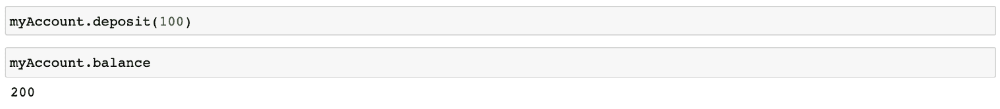
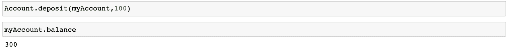
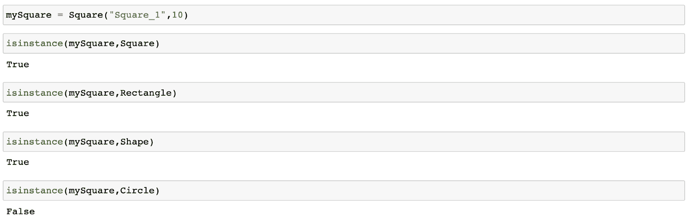
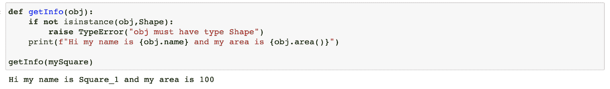
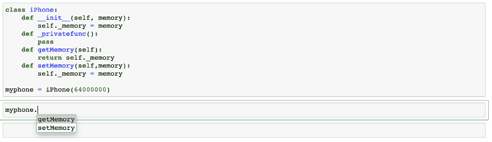
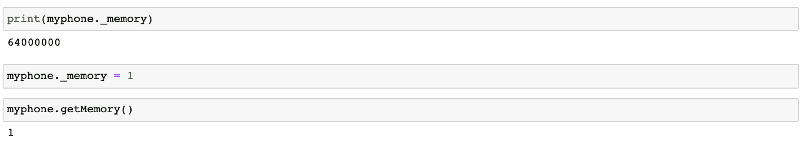
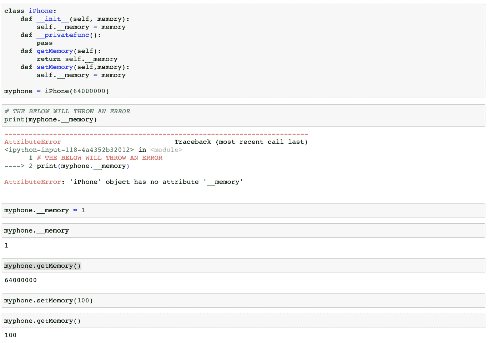

# 数据科学家简明易懂的面向对象编程解释

> 原文：[`www.kdnuggets.com/2020/12/object-oriented-programming-explained-simply-data-scientists.html`](https://www.kdnuggets.com/2020/12/object-oriented-programming-explained-simply-data-scientists.html)

评论

图片由[Jelleke Vanooteghem](https://unsplash.com/@ilumire?utm_source=medium&utm_medium=referral)在[Unsplash](https://unsplash.com/?utm_source=medium&utm_medium=referral)上提供

* * *

## 我们的前三大课程推荐

 1\. [谷歌网络安全证书](https://www.kdnuggets.com/google-cybersecurity) - 快速进入网络安全职业生涯。

 2\. [谷歌数据分析专业证书](https://www.kdnuggets.com/google-data-analytics) - 提升你的数据分析技能

 3\. [谷歌 IT 支持专业证书](https://www.kdnuggets.com/google-itsupport) - 支持你的组织进行 IT 工作

* * *

面向对象编程（OOP）对于初学者来说可能是一个难以理解的概念。这主要是因为很多地方并没有以正确的方式解释它。通常，很多书籍从讲解 OOP 的三个重要术语开始——**封装、继承和多态**。但当书本能够解释这些主题时，任何刚开始学习的人可能已经感到迷茫了。

因此，我考虑了让这个概念对其他程序员、数据科学家和 Python 爱好者更容易理解的方法。我打算通过去掉所有术语，并通过一些例子来实现。我会从解释类和对象开始。然后我会解释在各种情况下类为什么重要以及它们如何解决一些基本问题。这样，读者也能在文章结束时理解这三个重要术语。

在这个名为[**Python Shorts**](https://towardsdatascience.com/tagged/python-shorts)的系列帖子中，我将解释一些由 Python 提供的简单但非常有用的构造、一些必备技巧以及我在数据科学工作中经常想到的一些使用案例。

***这篇文章是以通俗的方式解释面向对象编程。***

### 什么是对象和类？

简单来说，Python 中的一切都是对象，而类是对象的蓝图。所以当我们写：

```py
a = 2
b = "Hello!"
```

我们创建了一个值为 2 的`int`类对象`a`，和一个值为“Hello！”的`str`类对象`b`。在某种程度上，当我们使用数字或字符串时，这两个特定的类是默认提供给我们的。

除此之外，我们中的许多人实际上在使用类和对象时甚至没有意识到这一点。例如，当你使用任何 Scikit-Learn 模型时，你实际上是在使用一个类。

```py
clf = RandomForestClassifier()
clf.fit(X,y)
```

在这里，你的分类器`clf`是一个对象，而 fit 是定义在类`RandomForestClassifier`中的一个方法。

### 但是为什么要使用类？

我们在使用 Python 时经常使用它们。但究竟是什么原因呢？类有什么特别之处？我可以用函数做到同样的事吗？

是的，你可以。但是，与函数相比，类确实为你提供了很多强大的功能。举个例子，`str` 类为对象定义了很多函数，我们可以通过按下 tab 键直接访问这些函数。虽然也可以编写所有这些函数，但那样的话，它们就不会通过按下 tab 键直接使用。


类的这一特性被称为**封装**。从 [维基百科](https://en.wikipedia.org/wiki/Encapsulation_(computer_programming)) —— ***封装*** 指的是将数据与操作这些数据的方法捆绑在一起，或者限制对某些对象组件的直接访问。

在这里，`str` 类将数据（“Hello!”）与操作数据的所有方法捆绑在一起。我将在文章结束时解释该语句的第二部分。以同样的方式，`RandomForestClassifier` 类将所有分类器方法（`fit`、`predict` 等）捆绑在一起。

除此之外，类的使用还可以帮助我们使代码更加模块化和易于维护。假设我们要创建一个类似于 Scikit-Learn 的库。我们需要创建很多模型，每个模型都将具有 fit 和 predict 方法。如果我们不使用类，我们将不得不为每个不同的模型创建很多函数，如下所示：

```py
RFCFit
RFCPredict
SVCFit
SVCPredict
LRFit
LRPredict and so on.
```

这种代码结构工作起来简直是一场噩梦，因此 Scikit-Learn 将每个模型定义为一个具有 `fit` 和 `predict` 方法的类。

### 创建一个类

现在我们理解了为什么要使用类以及它们的重要性，那么我们如何真正开始使用它们呢？创建一个类非常简单。下面是你将编写的任何类的基本代码：

```py
class myClass:
    def __init__(self, a, b):
        self.a = a
        self.b = b    def somefunc(self, arg1, arg2):
        #SOME CODE HERE
```

我们在这里看到很多新关键字。主要的有 `class`、`__init__` 和 `self`。这些是什么？通过一些示例可以很容易地解释。

假设你在一个拥有许多账户的银行工作。我们可以创建一个名为 account 的类，用于处理任何账户。例如，下面我创建了一个基础的玩具类 `Account`，它存储用户的数据——即 `account_name` 和 `balance`。它还提供了两个方法来 `deposit`/`withdraw` 银行账户中的钱。请仔细阅读，它遵循与上面相同的结构。

```py
class Account:
    def __init__(self, account_name, balance=0):
        self.account_name = account_name
        self.balance = balance

    def deposit(self, amount):
        self.balance += amount

    def withdraw(self,amount):
        if amount <= self.balance:
            self.balance -= amount
        else:
            print("Cannot Withdraw amounts as no funds!!!")
```

我们可以通过以下方式创建一个名为 Rahul 的账户，并设置金额为 100：

```py
myAccount = Account("Rahul",100)
```

我们可以通过以下方式访问这个账户的数据：


但是，这些属性 `balance` 和 `account_name` 是如何已经分别设置为 100 和 “Rahul” 的？我们从未调用 `__init__` 方法，那么为什么对象会获得这些属性？答案是 `__init__` 是一个**魔法方法**（还有许多其他魔法方法，我会在下一个关于魔法方法的帖子中扩展），每当我们创建对象时它都会运行。所以当我们创建 `myAccount` 时，它会自动运行函数 `__init__`。

现在我们了解了`__init__`，让我们尝试向账户中存入一些钱。我们可以通过以下方式实现：



我们的余额上升到 200。但是你有没有注意到，我们的函数 `deposit` 需要两个参数，即 `self` 和 `amount`，但我们只提供了一个，仍然能正常工作。

**那么，`**self**`** 是什么？** 我喜欢通过以不同的方式调用相同的函数来解释 self。下面，我调用了属于 `account` 类的同一个函数 deposit，并为其提供了 `myAccount` 对象和 `amount`。现在，函数接受两个参数，这是它应该有的。



我们的 `myAccount` 余额如预期增加了 100。所以我们调用的是同一个函数。现在，这只有在 `self` 和 `myAccount` 完全相同的对象时才会发生。当我调用 `myAccount.deposit(100)` 时，Python 将相同的对象 `myAccount` 作为参数 `self` 提供给函数调用。这就是为什么函数定义中的 `self.balance` 实际上指代 `myAccount.balance`。

### 但仍然存在一些问题


图片由[Volodymyr Hryshchenko](https://unsplash.com/@lunarts?utm_source=medium&utm_medium=referral)拍摄，来源于[Unsplash](https://unsplash.com/?utm_source=medium&utm_medium=referral)

我们知道如何创建类，但仍然有另一个重要的问题我还没有触及。

假设你在苹果 iPhone 部门工作，并且需要为每个 iPhone 型号创建一个不同的类。在这个简单的示例中，我们假设我们 iPhone 的第一个版本目前只做一件事——打电话并具有一些内存。我们可以将这个类写成：

```py
class iPhone:
    def __init__(self, memory, user_id):
         self.memory = memory
         self.mobile_id = user_id
    def call(self, contactNum):
         # Some Implementation Here
```

现在，苹果计划推出 `iPhone1`，这个 `iPhone` 型号引入了一项新功能——拍照功能。实现这一功能的一种方法是复制粘贴上述代码，创建一个新的类 `iPhone1`，如下所示：

```py
class iPhone1:
    **def __init__(self, memory, user_id):
         self.memory = memory
         self.mobile_id = user_id**
         self.pics = []    **def call(self, contactNum):
         # Some Implementation Here**    def click_pic(self):
         # Some Implementation Here
         pic_taken = ...
         self.pics.append(pic_taken)
```

但正如你所见，上面显示的（加粗的部分）代码重复过多，而 Python 提供了一个解决代码重复的问题的方法。编写我们 iPhone1 类的一个好方法是：

```py
Class iPhone1(**iPhone**):
    def __init__(self,**memory,user_id**):
         **super().__init__(memory,user_id)**
         self.pics = []
    def click_pic(self):
         # Some Implementation Here
         pic_taken = ...
         self.pics.append(pic_taken)
```

这就是继承的概念。根据[维基百科](https://en.wikipedia.org/wiki/Inheritance_(object-oriented_programming))：**继承**是基于另一个对象或类创建一个对象或类的机制，从而保留类似的实现。简单来说，`iPhone1`现在可以访问类`iPhone`中定义的所有变量和方法。

在这种情况下，我们不需要进行代码重复，因为我们已经从父类 iPhone 继承（获取）了所有方法。因此，我们不必再次定义`call`函数。此外，我们没有使用 super 在`__init__`函数中设置 mobile_id 和 memory。

**但这`**`super().__init__(memory,user_id)`**`是什么？**

在现实生活中，你的`__init__`函数不会是这样简洁的两行函数。你需要在类中定义很多变量/属性，而将它们复制到子类（这里是 iphone1）中会变得麻烦。因此存在 super()。这里`**super().__init__()**`实际上调用了父类`iPhone`的`**__init__**`方法。所以在这里，当`iPhone1`类的`__init__`函数运行时，它会自动使用父类的`__init__`函数设置`memory`和`user_id`。

***我们在 ML/DS/DL 中哪里可以看到这个？*** 下面是我们如何创建一个[PyTorch](https://mlwhiz.com/blog/2020/09/09/pytorch_guide/)模型。该模型从`nn.Module`类继承了所有内容，并使用`super`调用了该类的`__init__`函数。

```py
class myNeuralNet(nn.Module):    def __init__(self):
        **super().__init__()**
        # Define all your Layers Here
        self.lin1 = nn.Linear(784, 30)
        self.lin2 = nn.Linear(30, 10)    def forward(self, x):
        # Connect the layer Outputs here to define the forward pass
        x = self.lin1(x)
        x = self.lin2(x)
        return x
```

**但什么是多态？** 我们对类的理解越来越好，所以我想我现在会尝试解释多态。看下面的类。

这里我们有基础`class Shape`和其他派生类——`Rectangle`和`Circle`。还要注意我们在`Square`类中如何使用多层继承，它是从`Rectangle`派生的，而`Rectangle`又从`Shape`派生。每个这些类都有一个名为`area`的函数，根据形状定义。因此，通过**多态**，一个同名函数可以做多种事情。***实际上，这就是多态的字面意思：“具有多种形式的东西”。***因此，我们的函数`area`具有多种形式。

多态在 Python 中的另一种实现方式是使用`isinstance`方法。使用上面的类，如果我们这样做：



因此，对象`mySquare`的实例类型是`Square`，

`Rectangle` 和 `Shape`。因此对象是多态的。这具有许多优良的属性。例如，我们可以创建一个与`Shape`对象一起工作的函数，它将完全适用于任何派生类（`Square`、`Circle`、`Rectangle`等），通过利用多态。



### 更多信息：

为什么我们会看到以**单下划线和双下划线**开头的函数名或属性名？有时我们想让类中的属性和函数保持私有，不让用户看到它们。这是**封装**的一部分，我们希望“*限制对对象某些组件的直接访问*”。例如，假设我们不想让用户在创建后看到我们 iPhone 的内存（RAM）。在这种情况下，我们通过在变量名中使用下划线来创建属性。

所以当我们以以下方式创建`iPhone`类时，你将无法在你的 ipython 笔记本中使用 Tab 访问你的`memory`或`privatefunc`，因为该属性现在被用 _ 标记为私有。



但你仍然可以通过（虽然不推荐）更改变量值。



你也可以使用方法 _privatefunc，通过`myphone._privatefunc()`。如果你想避免这种情况，可以在变量名前使用双下划线。例如，`print(myphone.__memory)`的调用会引发错误。此外，你不能通过`myphone.__memory = 1`来更改对象的内部数据。



但如你所见，你可以在你的类定义中通过`setMemory`函数访问和修改这些`self.__memory`值。

### 结论


照片由[Jeshoots.com](https://unsplash.com/@jeshoots?utm_source=medium&utm_medium=referral)拍摄，发布在[Unsplash](https://unsplash.com/?utm_source=medium&utm_medium=referral)上

我希望这对你理解类有所帮助。关于类的内容还有很多，我将在下一篇关于魔术方法的帖子中讨论。敬请关注。此外，总结一下，这篇文章中我们学习了 OOP 和创建类以及 OOP 的各种基础知识：

+   **封装**：对象包含所有属于自己的数据。

+   **继承**：我们可以创建一个类层次结构，其中父类的方法传递给子类。

+   **多态性**：一个函数有多种形式，或者对象可能有多种类型。

为了结束这篇文章，我将给你一个练习，我认为这可能会帮助你理清一些概念。***创建一个类来管理三维对象（球体和立方体），包括体积和表面积***。基本的代码框架如下：

```py
import mathclass Shape3d:
    def __init__(self, name):
        self.name = name    def surfaceArea(self):
        pass

    def volume(self):
        pass

    def getName(self):
        return self.name

class Cuboid():
    passclass Cube():
    pass

class Sphere():
    pass
```

我会把***答案放在这篇文章的评论中。***

如果你想了解更多关于[Python](https://amzn.to/2XPSiiG)的知识，我推荐你查看来自密歇根大学的[**中级 Python 课程**](https://bit.ly/2XshreA)。千万不要错过。

我将来也会写更多这样的文章。请告诉我你对这个系列的看法。关注我在[**Medium**](https://medium.com/@rahul_agarwal)上的动态，或订阅我的[**博客**](http://eepurl.com/dbQnuX)以获取相关信息。正如往常一样，我欢迎反馈和建设性的批评，可以通过 Twitter 联系我[@mlwhiz](https://twitter.com/MLWhiz)。

此外，小免责声明——这篇文章中可能包含一些关联链接到相关资源，因为分享知识从来不是一件坏事。

**简介：[Rahul Agarwal](https://www.linkedin.com/in/rahulagwl/)** 是 WalmartLabs 的高级统计分析师。关注他在 Twitter 上的动态[@mlwhiz](https://twitter.com/MLWhiz)。

[原文](https://towardsdatascience.com/object-oriented-programming-explained-simply-for-data-scientists-ce2c7b5db1d)。经授权转载。

**相关：**

+   10 个被低估的 Python 技能

+   数据科学家需要注意的 6 条建议

+   每个数据科学家都必须知道的 5 种分类评估指标

### 更多相关主题

+   [成为一名出色的数据科学家所需的 5 项关键技能](https://www.kdnuggets.com/2021/12/5-key-skills-needed-become-great-data-scientist.html)

+   [每个初学者数据科学家都应该掌握的 6 种预测模型](https://www.kdnuggets.com/2021/12/6-predictive-models-every-beginner-data-scientist-master.html)

+   [2021 年最佳 ETL 工具](https://www.kdnuggets.com/2021/12/mozart-best-etl-tools-2021.html)

+   [是什么让 Python 成为初创企业的理想编程语言](https://www.kdnuggets.com/2021/12/makes-python-ideal-programming-language-startups.html)

+   [停止学习数据科学以寻找目标，并找到目标后...](https://www.kdnuggets.com/2021/12/stop-learning-data-science-find-purpose.html)

+   [建立一个稳固的数据团队](https://www.kdnuggets.com/2021/12/build-solid-data-team.html)
