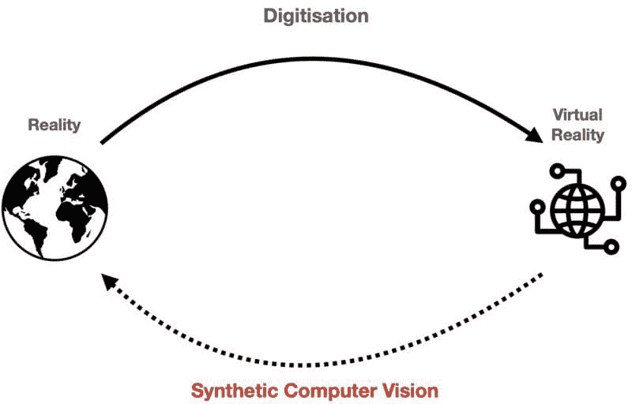
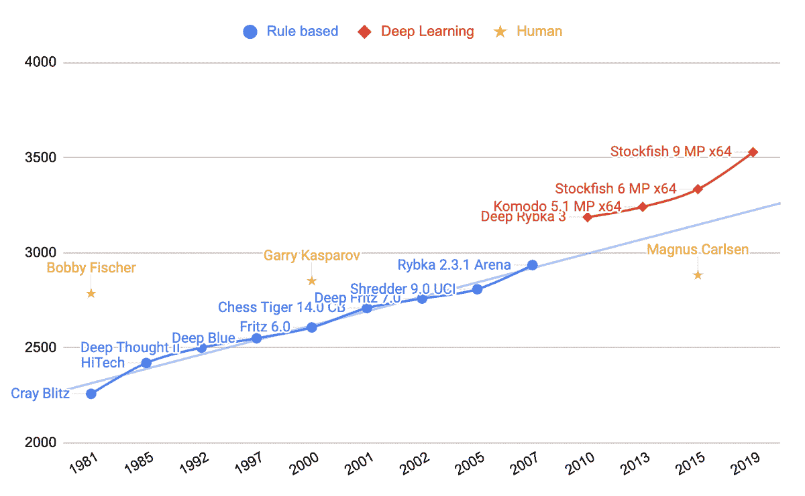
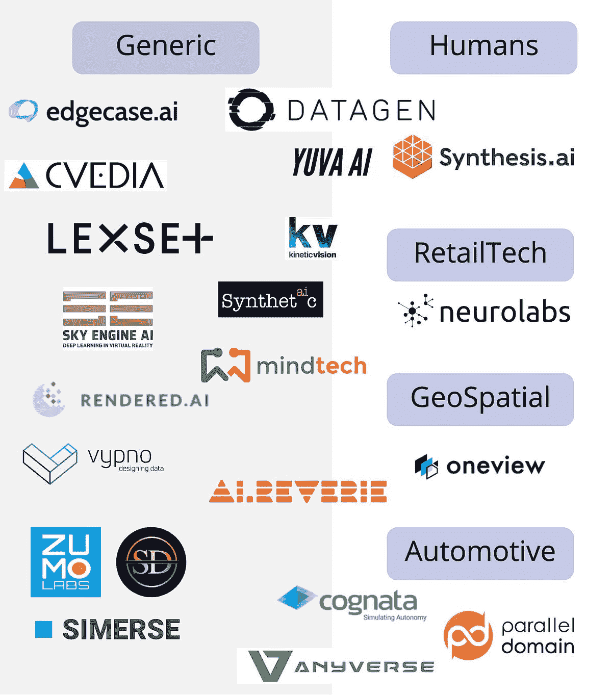

# 我们对算法的痴迷如何破坏了计算机视觉：以及合成计算机视觉如何修复它

> 原文：[`www.kdnuggets.com/2021/10/obsession-algorithms-broke-computer-vision.html`](https://www.kdnuggets.com/2021/10/obsession-algorithms-broke-computer-vision.html)

评论

**作者：[Paul Pop](https://www.linkedin.com/in/paul-pop/)，Neurolabs 的联合创始人兼首席执行官**

合成计算机视觉旨在将虚拟世界中的内容翻译回现实世界。（图片来自作者）

## ????️ 计算机视觉的现状

* * *

## 我们的前三大课程推荐

 1\. [谷歌网络安全证书](https://www.kdnuggets.com/google-cybersecurity) - 快速进入网络安全职业的快车道。

 2\. [谷歌数据分析专业证书](https://www.kdnuggets.com/google-data-analytics) - 提升你的数据分析技能

 3\. [谷歌 IT 支持专业证书](https://www.kdnuggets.com/google-itsupport) - 支持你的组织 IT 需求

* * *

根据[Crunchbase](https://www.crunchbase.com/login?redirect_to=%2Fhub%2Fcomputer-vision-companies)的数据，截至目前，过去 8 年里，计算机视觉领域的初创公司获得了超过 150 亿美元的投资。超过 20 家公司目前的估值已超过 10 亿美元，并且根据[Forbes](https://www.forbes.com/sites/robtoews/2021/02/28/a-wave-of-billion-dollar-computer-vision-startups-is-coming/)的报道，未来还会有更多。

为什么这些公司如此受重视？简单来说，它们在教计算机如何“看”。通过这样做，它们在自动化以前由人类视觉完成的任务。

这一繁荣是由于 2012 年计算机视觉领域的**拐点**，随着神经网络的出现——这些算法模仿人脑，并使用大量人工标注的数据进行训练。自 2012 年以来，算法不断改进，在许多视觉任务中已能与人类匹敌，例如物体计数，[唇读](https://www.technologyreview.com/2016/11/21/69566/ai-has-beaten-humans-at-lip-reading/)或[癌症筛查](https://www.nature.com/articles/s41598-019-48995-4)。

在接下来的 10 年里，每个人都尽了自己的一份力：学术界通过改进算法引领了潮流；大公司则投资了大量人力，勤勉地标注这些图像数据集。其中一些努力甚至被开源，惠及社区，比如[ImageNet](https://www.image-net.org/)，一个包含 1400 万张图像的数据集。

不幸的是，现在这些系统正在投入生产时，我们遇到了瓶颈：

1.  我们拥有的**标记数据是不可靠的**。来自 MIT 研究人员的[系统研究](https://venturebeat.com/2021/03/28/mit-study-finds-systematic-labeling-errors-in-popular-ai-benchmark-datasets/)发现，ImageNet 的平均错误率为[5.93%的错误标记](https://l7.curtisnorthcutt.com/label-errors)，其他数据集的平均错误率为 3.4%。

1.  **解决数据问题的努力很少**。学术界的智力投入几乎完全专注于算法开发，忽视了对良好数据的基本需求——Andrew Ng 的估计比例为[99%的算法关注 vs 1%的数据](https://www.youtube.com/watch?t=526&v=06-AZXmwHjo&feature=youtu.be)。

1.  计算机视觉**算法不能很好地泛化**从一个领域到另一个领域。一个在法国南部训练检测汽车的算法在雪地中的挪威会很难检测到同样的汽车。同样，一个在特定相机上训练的系统可能在另一种相机品牌和型号上表现不佳。

## ♟️ 寻找灵感

早在 1946 年，艾伦·图灵就建议将棋类作为计算机能力的基准，此后这一领域经过了大量研究，吸引了广泛的媒体关注。

衡量棋类表现的一种被广泛接受的方法是通过[Elo 评级系统](https://en.wikipedia.org/wiki/Elo_rating_system)，它提供了对玩家技能的有效比较。下图展示了世界冠军和棋类引擎。过去 50 年里，人类表现徘徊在 2800 的评级附近，然后在 2010 年被计算机所压制。

直到上个十年，我们人类设计的棋类算法基于我们能设计和理解的规则。深度学习革命让我们突破了人类理解的局限，带来了飞跃——就像它在计算机视觉领域一样。

棋类引擎与人类 ELO 评级（图片来自作者）

尽管深度学习棋类游戏引擎的进步非常显著，但现在已经被下一个级别的棋类引擎：**AlphaZero**（来自 DeepMind）所压制。更令人印象深刻的是，**AlphaZero 并未使用任何人类来源的数据**来实现这一性能。它的构建没有任何关于历史棋局的知识，也没有任何寻找最佳走法的人类指导。AlphaZero 既是老师也是学生——它通过自我对弈并在过程中学习来教会自己如何更好地玩游戏。

AlphaZero 击败了当时最强的棋类引擎[Stockfish 8](https://www.notion.so/neurolabs/chess.com/news/view/updated-alphazero-crushes-stockfish-in-new-1-000-game-match)，且没有输掉一场比赛，即使在 AlphaZero 被给予[少一个数量级的时间](https://chess24.com/en/read/news/alphazero-really-is-that-good)来计算下一步棋时，依然保持了这一优势。

考虑到 AlphaZero 的显著进展，人们不禁要问：***我们能否将其在国际象棋中的成功转化为计算机视觉？***

## ???? 新潮流：数据中心化 AI

在新的[数据中心化 AI](https://www.forbes.com/sites/gilpress/2021/06/16/andrew-ng-launches-a-campaign-for-data-centric-ai/?sh=6d7fce8574f5)范式下，目标不是创造更好的算法，而是通过改变数据本身来提高性能。即使我们忽略获取和标记图像数据集的困难，数据质量的问题仍然存在：我们是否均匀覆盖了所有可能的使用案例？数据是否涵盖了边缘案例？

如果我们要跟随数据中心化计算机视觉的路径，就必须控制数据来源过程。数据需要平衡，我们需要充分理解影响计算机视觉模型学习的参数。

让我们以一个简单的例子来看待控制这三个参数：摄像机角度、光照和遮挡。你能想象在收集上千张相关图像的同时，还要细心控制这三个参数的值吗？使用真实数据，这个任务是艰巨的。

## ???? 我们今天如何管理数据？

在过去 5 年里，我们在优化数据收集过程和数据标签质量方面取得了巨大的进步。此外，我们学会了通过使用各种*数据增强*技术来充分利用数据集。给定我们数据集中的一张图像，我们应用数学函数来创造更多的数据多样性。

目前已有超过 400 家公司，总[市场价值达到 1.3 万亿美元](https://www.grandviewresearch.com/industry-analysis/data-collection-labeling-market)（稍高于 Facebook 的市场价值），专注于满足我们最新算法的数据需求。

但当前的路径是否走到死胡同了？我们是否达到了基于人类来源数据集的算法的极限？就像在国际象棋中，只要我们使用人类来源的数据作为算法的输入，我们在设计上就无法显著超越自己的能力。

*在国际象棋中，深度学习突破的出现是当我们停止依赖次优的人类数据，并允许机器生成自己的数据以优化学习时。在计算机视觉领域，我们也必须如此，允许机器生成其优化学习所需的数据。*

## ???? 计算机视觉的下一步是什么？

创建训练数据的真正可扩展方式是通过**虚拟现实引擎**。就真实感而言，输出已[变得无法区分](https://www.youtube.com/watch?v=S3DEM6XDDTk)现实世界，给予用户完全的场景控制。这使得用户能够**生成智能数据**，这些数据对计算机视觉模型的学习真正有用。**合成数据可以成为新数据中心 AI 框架所需的基石**。

我们有充分的理由相信，视觉合成数据广泛应用的时机已经到来。

+   虚拟现实引擎拥有专门的组件用于合成数据生成（[NVIDIA IsaacSim](https://developer.nvidia.com/isaac-sim), [Unity Perception](https://github.com/Unity-Technologies/com.unity.perception)），所生成的数据不仅仅是视觉上的盛宴，而且对于训练更好的[算法至关重要](https://www.prnewswire.com/news-releases/survey-of-industry-leaders-shows-synthetic-data-is-essential-to-building-more-capable-ai-models-301377167.html)。

+   3D 资产正迅速成为商品——最新的[iPhone 配备了 LiDAR](https://www.geoweeknews.com/news/apple-debuts-its-own-api-for-reality-capture-and-3d-object-creation-but-where-s-the-lidar)，而第一代 3D 扫描应用正在产生出色的[结果](https://www.linkedin.com/posts/albandenoyel_photogrammetry-objectcapture-3dcapture-activity-6833436374952099840-MPTn)。

+   [元宇宙即将到来，并且意义重大](https://www.forbes.com/sites/cathyhackl/2020/07/05/the-metaverse-is-coming--its-a-very-big-deal/)。如果预测中的一部分[$60B 增长](https://www.marketsandmarkets.com/Market-Reports/augmented-reality-market-82758548.html)变成现实，我们将生活在一个虚拟现实成为日常的世界中。数字双胞胎今天已有实际应用：例如 BMW 的[未来工厂](https://www.youtube.com/watch?v=6-DaWgg4zF8)和 Google 的[供应链双胞胎](https://venturebeat-com.cdn.ampproject.org/c/s/venturebeat.com/2021/09/14/google-launches-digital-twin-tool-for-logistics-and-manufacturing/amp/)。

+   行业内的创新者已经开始使用虚拟现实来改进计算机视觉算法：特斯拉[正在使用虚拟世界](https://www.youtube.com/watch?v=6hkiTejoyms)来生成边缘案例和新颖的驾驶场景视图。

## ????️‍????️ 合成计算机视觉 (SCV)

拥有构建自己数据的正确工具，我们可以设想一个计算机视觉算法在没有繁琐的手动数据标记过程下开发和训练的世界。[Gartner](https://blogs.gartner.com/andrew_white/2021/07/24/by-2024-60-of-the-data-used-for-the-development-of-ai-and-analytics-projects-will-be-synthetically-generated/) 预测，在未来 3 年内，合成数据将比真实数据更为普遍。

为什么不再进一步呢？如果有一个世界，其中**人类不需要为计算机视觉标注图像**，会怎样？

## ???? 未来光明

使用合成计算机视觉，我们在虚拟现实中构建模型，然后在现实世界中部署。就像 AlphaZero 自己学习了什么在国际象棋中重要一样，我们让算法决定它们需要看到什么，以便最佳地学习。

> 在合成计算机视觉（SCV）中，我们使用虚拟现实引擎训练计算机视觉模型，并将这些模型部署到现实世界中。

## ????超越 RGB 图像

现实远比[人眼所能看到的](https://youtu.be/RZdfE_7cde0?t=188)要复杂得多。我们构建的算法主要集中在一个人类可以理解和标注的范围内。但情况不必非如此——我们可以为超出人类感知范围的传感器构建算法。我们可以在虚拟现实中以编程方式训练这些算法，而无需对它们的有效性产生怀疑。

## ???? 更聪明，而非更辛苦

我们可以聪明地选择数据来源来让算法学习，而不是构建更大的模型和使用更多的计算能力来解决问题。算法不需要更多相同的数据来学习，它们需要各种各样的数据。

Deep Mind 展示了 AlphaZero 只是起点，他们将相同的原则应用于[围棋](https://www.youtube.com/watch?v=WXuK6gekU1Y)、[星际争霸](https://www.youtube.com/watch?v=cUTMhmVh1qs)和[蛋白质折叠](https://deepmind.com/blog/article/alphafold-a-solution-to-a-50-year-old-grand-challenge-in-biology)。如今，我们拥有所有必要的构建模块来构建一个*AlphaZero 式的计算机视觉*，这是一个在设计上不受**人类输入**限制的自学习系统。一个能够创建和操控虚拟场景，并通过这些场景自我学习如何解决视觉自动化任务的系统。

## ???? 合成数据生成领域的先驱

合成计算机视觉的基础是建立在**合成数据**上的。大约有[30 家初创公司](https://drive.google.com/file/d/1xhgmO9U8WZoYFi7tviUDiyLWz-SYvRFe/view)在视觉合成数据生成领域运营。其中一些专注于特定垂直领域的用例，而大多数则在多个垂直领域中横向操作。

按重点分类的合成数据公司（图像作者提供）。

到了 2021 年，我们仍处于起步阶段。请记住，合成数据只是**待解决难题的一部分**！

## ❓亲爱的读者，您有以下问题：

1.  很容易想象，在 10 年内，你的智能手机在通用视觉感知方面将比你更强大，但我们将如何实现这一点呢？

+   （增强）数据标注员是会长期存在还是仅仅是一个过渡阶段？

+   标注工作会从 2D 世界转移到 3D 世界吗？还是我们可以完全不采用这种方法？

1.  通过深度学习算法在计算机视觉领域取得了**最先进**的成果——合成计算机视觉能否推动一波此前未曾出现的改进算法？

**简介： [Paul Pop](https://www.linkedin.com/in/paul-pop/)** 是 Neurolabs 的联合创始人兼首席执行官。拥有爱丁堡大学计算机科学与人工智能背景，并在过去十年中从事计算机视觉工作。曾在 Hudl 领导团队开发了如今在大多数欧洲足球联赛中使用的计算机视觉球员跟踪系统。

**相关：**

+   计算机视觉的开源数据集

+   合成数据类型和生成方法概述

+   教 AI 用合成数据分类时间序列模式

### 更多相关话题

+   [大多数公司数据访问严重不足，71%的人认为……](https://www.kdnuggets.com/2023/07/mostly-data-access-severely-lacking-synthetic-data-help.html)

+   [10 种最常见的数据质量问题及解决方法](https://www.kdnuggets.com/2022/11/10-common-data-quality-issues-fix.html)

+   [合成数据社区已成立，我们为何需要它](https://www.kdnuggets.com/2022/04/community-synthetic-data-need.html)

+   [高保真合成数据适用于数据工程师和数据科学家](https://www.kdnuggets.com/2022/tonic-high-fidelity-synthetic-data-engineers-scientists-alike.html)

+   [如何通过 AI 生成的合成数据民主化 AI/ML 和数据科学](https://www.kdnuggets.com/2022/11/mostly-ai-democratize-aiml-data-science-aigenerated-synthetic-data.html)

+   [关于数据管理的 6 件事及其重要性](https://www.kdnuggets.com/2022/05/6-things-need-know-data-management-matters-computer-vision.html)
