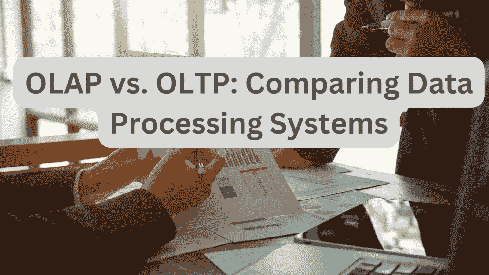
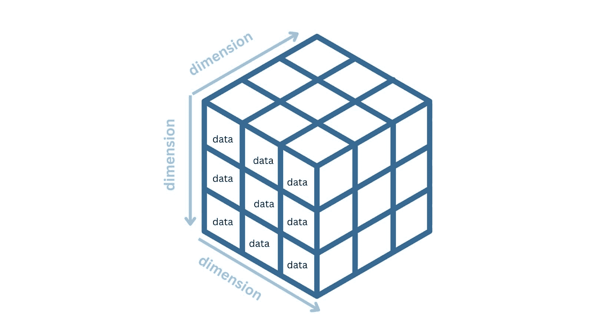

# OLAP 与 OLTP：数据处理系统的比较分析

> 原文：[`www.kdnuggets.com/2023/08/olap-oltp-comparative-analysis-data-processing-systems.html`](https://www.kdnuggets.com/2023/08/olap-oltp-comparative-analysis-data-processing-systems.html)

图片来源：作者

现在，组织从各种来源生成大量数据：客户互动、销售交易、社交媒体等等。从这些数据中提取有意义的信息需要能够有效处理、存储和分析数据的系统。

* * *

## 我们的前三名课程推荐

 1\. [谷歌网络安全证书](https://www.kdnuggets.com/google-cybersecurity) - 快速入门网络安全职业。

 2\. [谷歌数据分析专业证书](https://www.kdnuggets.com/google-data-analytics) - 提升你的数据分析技能

 3\. [谷歌 IT 支持专业证书](https://www.kdnuggets.com/google-itsupport) - 支持你所在组织的 IT 部门

* * *

**OLAP**（在线分析处理）和 **OLTP**（在线事务处理）系统在数据处理方面扮演着关键角色。OLAP 系统使企业能够进行复杂的数据分析并推动业务决策。另一方面，OLTP 系统确保日常操作的顺利进行。它们处理实时事务过程，同时保持数据一致性。

让我们进一步了解 OLAP 和 OLTP 系统，并理解它们之间的关键区别。

# OLAP 和 OLTP 系统概述

我们将从 OLAP 和 OLTP 系统的概述开始：

## 什么是 OLAP 系统？

**OLAP（在线分析处理）** 是一类数据处理系统，旨在支持复杂的分析查询，并从大量的历史数据中提供有价值的见解。

OLAP 系统对于商业智能、数据仓库和决策支持系统等应用至关重要。它们使组织能够分析趋势、发现模式，并基于历史数据做出战略决策。

这些系统利用 [OLAP 立方体](https://learn.microsoft.com/en-us/system-center/scsm/olap-cubes-overview)，这是一种允许进行多维数据分析的基本组件（稍后我们将学习有关 OLAP 立方体的内容）。

## 什么是 OLTP 系统？

**OLTP（在线事务处理）** 指的是一种数据处理系统，专门用于实时事务操作和日常操作任务。

OLTP 数据库维护 ACID（原子性、一致性、隔离性、持久性）属性，确保可靠和一致的事务。OLTP 系统通常用于需要快速且并发处理小型、快速和实时事务的应用程序。

因为 OLTP 系统确保数据始终保持最新和一致，所以它们非常适合用于电子商务、银行和金融交易等应用。

# OLAP 与 OLTP：它们之间的区别是什么？

现在我们已经了解了 OLAP 和 OLTP 系统，让我们继续了解它们的区别。

## #1 – 系统规模和数据量

OLAP 系统通常比 OLTP 系统大得多。OLAP 系统管理*大量的历史数据*，通常需要显著的存储容量和计算资源。

与 OLAP 系统相比，OLTP 系统处理的*数据集相对较小*，重点是实时处理和快速响应时间。

## #2 – 数据模型

OLAP 数据库使用**非规范化**的数据结构以*优化查询性能*。通过存储预聚合和冗余数据，这些系统可以高效地处理复杂的分析查询，无需大量连接。非规范化结构加快了数据检索，但可能会导致存储需求增加。

OLAP 系统支持多维数据分析，通常使用星型或雪花型模式实现，其中数据被组织成维度和度量。所有 OLAP 系统的核心是*OLAP 立方体*，它促进了多维数据分析。**那么 OLAP 立方体是什么？**

OLAP 立方体用于多维数据分析 | 图片来源于作者

OLAP 立方体是一种多维数据结构，将数据组织成多个维度和度量。

+   每个**维度**表示一个特定的类别或属性，例如时间、地理、产品或客户。

+   **度量**是与这些维度相关的数值或指标。这些通常包括数据如销售收入、利润、销售数量或任何其他相关的 KPI（关键绩效指标）。

立方体的多维结构允许用户从不同的角度探索数据，包括钻取、切片、切块和汇总等操作—在不同的粒度级别查看数据。

例如，考虑一个包含电子商务公司销售数据的 OLAP 立方体。立方体的维度可能包括：

+   **时间**（月份、季度、年份），

+   **地理**（国家、地区等），以及

+   **产品类别**（电子产品、时尚、家用电器等）。

一些度量包括销售收入、销售数量和利润。OLAP 立方体让你通过选择特定维度分析销售表现，例如查看特定时间段内某一地区的销售收入，或比较不同产品类别的销售情况。

OLTP 数据库采用**规范化**的数据结构，以最小化数据冗余并确保数据完整性。规范化将数据分为多个相关表，减少数据异常的风险并提高存储效率。

## #3 – 查询类型与响应时间

OLAP 系统优化了处理涉及聚合、排序、分组和计算的复杂分析查询。这些查询通常涉及大量历史数据，并需要显著的计算资源。由于其分析性质，OLAP 查询可能具有较长的执行时间。

OLTP 系统设计用于处理大量小型、快速和并发的事务查询。这些查询主要涉及单条记录的插入、更新和删除。OLTP 系统专注于实时数据处理，并确保事务操作的快速响应时间。

## #4 – 性能需求

OLAP 系统旨在支持复杂的分析查询和多维数据分析。

OLTP 系统应该具备快速的响应时间。它们应能够支持大量的并发事务，同时保持数据完整性——数据差异最小化。

# OLAP 与 OLTP：总结区别

让我们通过列出 OLAP 和 OLTP 系统在我们讨论的不同特性上的区别来总结我们的讨论：

| **特性** | **OLAP** | **OLTP** |
| --- | --- | --- |
| **数据量** | 大量历史数据 | 小量实时事务数据 |
| **系统规模** | 远大于 OLTP 系统 | 远小于 OLTP 系统 |
| **数据模型** | 为了性能而非规范化 | 为了完整性和最小冗余而规范化 |
| **查询类型** | 复杂分析查询 | 简单查询 |
| **响应时间** | 可能较长的执行时间 | 更快的响应时间 |
| **性能需求** | 数据的多维分析，针对涉及聚合的复杂查询优化以提高检索速度 | 实时并发事务的快速处理，具有低延迟 |

# 总结

总结：OLAP 系统有助于对大量历史数据进行深入分析，而 OLTP 系统则确保快速可靠的实时操作。

然而，在实际应用中，组织通常会在其数据处理生态系统中部署 OLAP 和 OLTP 的组合。这种混合方法使他们能够有效管理操作数据，同时从历史数据中获取有价值的见解。

如果你想开始学习数据工程，查看这份数据工程初学者指南。

**[Bala Priya C](https://www.linkedin.com/in/bala-priya/)** 是一位来自印度的开发者和技术作家。她喜欢在数学、编程、数据科学和内容创作的交汇处工作。她的兴趣和专长领域包括 DevOps、数据科学和自然语言处理。她喜欢阅读、写作、编码和喝咖啡！目前，她正在通过编写教程、操作指南、评论文章等方式，学习并与开发者社区分享她的知识。

### 更多相关内容

+   [OLAP 已死了吗？](https://www.kdnuggets.com/2022/10/olap-dead.html)

+   [Pandas 与 Polars：Python 数据框架库的比较分析](https://www.kdnuggets.com/pandas-vs-polars-a-comparative-analysis-of-python-dataframe-libraries)

+   [LangChain 与 LlamaIndex 的比较分析](https://www.kdnuggets.com/comparative-analysis-of-langchain-and-llamaindex)

+   [2023 年前十名开源数据科学工具的比较概述](https://www.kdnuggets.com/a-comparative-overview-of-the-top-10-open-source-data-science-tools-in-2023)

+   [实施推荐系统的十个关键经验教训](https://www.kdnuggets.com/2022/07/ten-key-lessons-implementing-recommendation-systems-business.html)

+   [Chip Huyen 分享实施机器学习系统的框架和案例研究](https://www.kdnuggets.com/2023/02/sphere-chip-huyen-shares-frameworks-case-studies-implementing-ml-systems.html)
