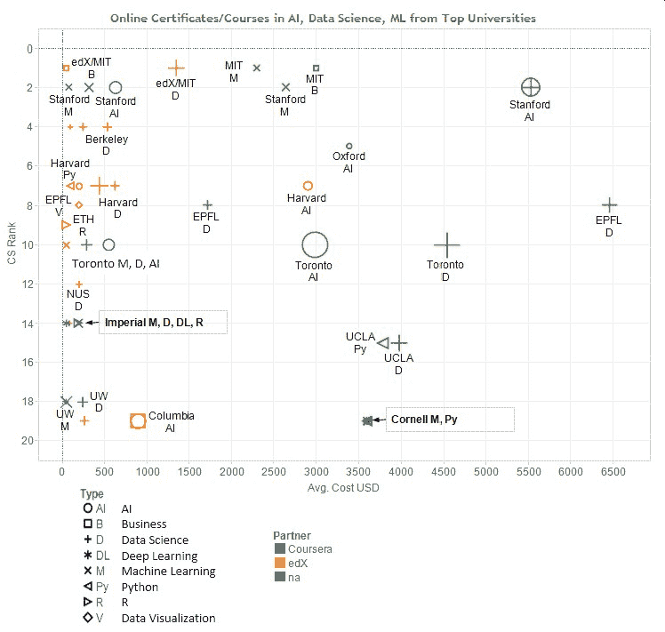

# 顶级大学的人工智能、数据科学、机器学习在线证书/课程

> 原文：[`www.kdnuggets.com/2020/09/online-certificates-ai-data-science-machine-learning-top.html`](https://www.kdnuggets.com/2020/09/online-certificates-ai-data-science-machine-learning-top.html)

评论当前的疫情没有减少对人工智能、数据科学、机器学习人才的需求，但加速了在线教育的转变。

我们最近发布了顶级大学在线人工智能、分析、数据科学、机器学习硕士学位调查。

但典型学位需要 12-18 个月才能获得，许多人可能希望通过参加课程并获得证书来更快地入门。在去年，我们介绍了[在线分析、数据科学、机器学习证书](https://www.kdnuggets.com/2019/07/top-certificates-analytics-data-science-machine-learning-ai.html)，但现在在线课程的选项太多，无法进行全面调查，因此在本博客中，我们仅涵盖了[QS 全球大学排名](https://www.topuniversities.com/university-rankings/university-subject-rankings/2020/computer-science-information-systems)中排名前 20 的计算机科学大学的课程和证书。非常感谢[Ahmad Anis](https://www.kdnuggets.com/author/ahmad-anis)收集了这些数据。

下图 1 显示了 Y 轴上的排名和 X 轴上的成本（以美元计）。

**图 1：顶级 20 所大学的人工智能、数据科学、商业分析、机器学习在线证书/课程**

一些大学在自己的平台上提供课程，但大多数大学也通过流行的在线教育平台 Coursera 和 edX 提供课程（用颜色表示）。我们发现，通过 Coursera / edX 获得的课程/证书比直接从大学获得的要便宜得多。

我们还研究了证书的类型（用形状表示），数据科学是最常见的。其分布为：

+   数据科学, 19

+   M: 机器学习, 10

+   人工智能, 8

+   B: 商业, 4

+   Py: Python, 4

+   R, 3

+   DL: 深度学习, 2

+   V: 数据可视化, 2

**表 1：顶级在线分析、商业分析、数据科学硕士课程。**

| **计算机科学排名

2020** | **大学/课程** | **描述** | **学习时长** | **学费（美元）** |

| 1 | MIT [机器学习：从数据到决策](https://professionalonline1.mit.edu/machine-learning/index.php) | 这不是一门编码课程，而是介绍机器学习工具和技术如何帮助在各种情况下做出更好决策的课程。 | 8 周，在线（不包括导向课程）；每周 6-8 小时 | $2300 |
| --- | --- | --- | --- | --- |
| 1 | MIT [商业中的机器学习](https://executive.mit.edu/openenrollment/program/machine-learning-implementation-in-business-self-paced-online/) | 在课程结束时，你将获得一个可以立即应用于业务的实际行动计划。 | 6 周，每周在线 4-5 小时，额外 2-3 小时 | $3200 |
| 1 | MIT [应用商业分析](https://executive.mit.edu/openenrollment/program/applied-business-analytics-self-paced-online/) | 完成应用商业分析后，你将知道哪种分析方法最适合你的情况，更重要的是，如何处理大数据并利用其实现更好的商业成果。 | 6 周在线学习；每周 5-6 小时 | $2800 |
| 1 | edX/MIT [商业分析优化方法](https://www.edx.org/course/optimization-methods-for-business-analytics) | 你将被介绍到优化的理论、算法和应用。线性和整数规划将通过代数和几何两种方式教授，然后应用于数据问题。学生将发展对代数公式的理解，并使用 Julia/JuMP 进行计算。 | 6 周 每周 6-8 小时 | $49 |
| 1 | edX/MIT [统计与数据科学微硕士@reg; 计划](https://www.edx.org/micromasters/mitx-statistics-and-data-science) | 从概率和统计到数据分析和机器学习，掌握解决复杂数据挑战所需的技能。完成这个微硕士计划将为你准备如：数据科学家、数据分析师、商业智能分析师、系统分析师、数据工程师等职位 | 5 门课程 1 年 2 个月 | $1350 |
| 2 | 斯坦福 [大规模数据集挖掘研究生证书](https://online.stanford.edu/programs/mining-massive-data-sets-graduate-certificate) | 你将掌握从大数据集（如网页、社交网络图和大型文档库）中提取信息的高效强大技术和算法。用这些技能提升你的职业生涯，为你的公司提供获得竞争优势的力量。 | 平均 1-2 年；最长 3 年完成 | $5533 |
| 2 | 斯坦福大学 [数据、模型与优化研究生证书](https://online.stanford.edu/programs/data-models-and-optimization-graduate-certificate) | 该证书专注于识别和解决信息数学问题。你将使用易于可视化和理解的统一原则来解决核心分析和算法问题。随着计算机科学和系统优化的进步，这个动态的项目将让你接触到在通信、金融和电气工程中使用的各种应用和工具。 | 平均 1-2 年；最长 3 年完成 | $5533 |
| 2 | 斯坦福大学 [人工智能研究生证书](https://online.stanford.edu/programs/artificial-intelligence-graduate-certificate) | 利用虚拟进入斯坦福教授（如 Andrew Ng）的课堂，体验人工智能革命的前沿。课程提供人工智能原理和技术的基础和高级技能，包括逻辑、知识表示、概率模型和机器学习。学生可以深入研究课题，课程涵盖机器人技术、视觉和自然语言处理等领域。 | 平均 1-2 年；最多 3 年完成 | $5533 |
| 2 | 斯坦福大学 [机器学习 CS229](https://online.stanford.edu/courses/cs229-machine-learning) | 该课程提供机器学习和统计模式识别的广泛介绍。学习监督学习和无监督学习以及学习理论、强化学习和控制。探索机器学习的最新应用，并为机器设计和开发算法。 | 3 个月 | $4732 |
| 2 | Coursera/斯坦福大学 [机器学习](https://coursera.org/learn/machine-learning/) | 机器学习、数据挖掘和统计模式识别的广泛介绍。主题包括：（i）监督学习（参数化/非参数化算法，支持向量机，核函数，神经网络）。 （ii）无监督学习（聚类，降维，推荐系统，深度学习）。 （iii）机器学习中的最佳实践（偏差/方差理论；机器学习和人工智能的创新过程） | 54 小时 | $79 |
| 2 | 斯坦福大学 [机器学习 XCS229I](https://online.stanford.edu/courses/xcs229i-machine-learning) | 监督学习/ 无监督学习 | 12 周 | $1595 |
| 2 | 斯坦福大学 [机器学习战略与强化学习导论 XCS229IMI](https://online.stanford.edu/courses/xcs229ii-machine-learning-strategy-and-intro-reinforcement-learning) | 强化学习/ 机器学习战略 | 每周 8-12 小时，12 周 | $1595 |
| 2 | Coursera/斯坦福大学 [医疗保健中的人工智能专业](https://www.coursera.org/specializations/ai-healthcare) | 人工智能在医疗保健中的当前和未来应用，目标是学习如何安全且合乎伦理地将人工智能技术引入临床。 | 每周 2 小时，8 个月 | $632 |
| 2 | Coursera/斯坦福大学 [概率图模型专业](https://www.coursera.org/specializations/probabilistic-graphical-models) | 概率图模型是各种应用（如医疗诊断、图像理解、语音识别、自然语言处理等）的最先进方法的基础。它们也是制定许多机器学习问题的基础工具。 | 每周 11 小时，4 个月 | $316 |
| 4 | edX/加州大学伯克利分校 [数据科学基础专业证书](https://www.edx.org/professional-certificate/berkeleyx-foundations-of-data-science) | 由 BerkeleyX 提供的专业证书将教你如何结合数据与 Python 编程技能，提出问题并探索你在未来工作中可能遇到的问题，无论在任何学科领域，甚至在日常生活中。这门课程将为你提供一个新的视角来探讨你关心的问题和难题。 | 4 个月，每周 4 - 6 小时 | $537 |
| 4 | edX/加州大学伯克利分校 [数据科学与工程 XSeries 程序（Spark）](https://www.edx.org/xseries/data-science-engineering-apache-spark) | 学生将获得构建和调试 Spark 应用程序的实践经验。课程将涵盖 Spark 的内部细节和分布式机器学习算法，为学生提供处理大数据和开发分布式环境代码的直觉。 | 3 个月，每周 5 - 10 小时 | $247 |
| 4 | edX/加州大学伯克利分校 [使用 Apache Spark 进行大数据分析](https://www.edx.org/course/big-data-analysis-with-apache-spark) | 这门统计和数据分析课程将尝试阐明数据科学家的预期输出，然后教学生如何使用 PySpark（Spark 的一部分）来满足这些期望。 | 4 周，每周 5-10 小时 | $99 |
| 5 | 牛津大学 [牛津人工智能项目](https://www.sbs.ox.ac.uk/programmes/oxford-artificial-intelligence-programme) | 该课程针对希望理解人工智能工作原理和可能性的管理者、商业领袖及技术专业人士。它提供了一个独特的机会，让你在构建人工智能应用的商业案例的同时，反思人工智能的应用及其局限性，从而形成有见地的观点。 | 6 周 | $3391 |
| 7 | edX/哈佛大学 [CS50 Python 人工智能入门](https://www.edx.org/course/cs50s-introduction-to-artificial-intelligence-with-python) | 在这门人工智能入门课程中学习如何使用 Python 进行机器学习。 | 7 周，每周 10-30 小时 | $199 |
| 7 | edX/哈佛大学 [生命科学数据分析专业证书](https://www.edx.org/professional-certificate/harvardx-data-analysis-for-life-sciences) | 使用开源的 R 编程语言，你将获得处理复杂生命科学和基因组数据所需工具的深刻理解。你将学习需要的数学概念和数据分析技术，以推动数据驱动的研究。 | 4 个月，每周 2 - 4 小时 | $626.4 |
| 7 | edX/哈佛大学 [使用 Python 进行研究](https://www.edx.org/course/using-python-for-research) | 在本课程中，我们首先回顾 Python 3 的基础知识，然后学习在研究环境中常用的工具。此版本的课程包括一个新的统计学习模块。通过引导介绍和更独立的深入探索相结合，你将通过各种案例研究实践新的 Python 技能，这些案例研究因其科学广度和覆盖不同 Python 特性而被选中。 | 12 周，每周 2-4 小时 | $99 |
| 7 | edX/哈佛大学 [数据科学专业证书](https://www.edx.org/professional-certificate/harvardx-data-science) | 该项目涵盖了概率、推断、回归和机器学习等概念，并帮助你开发一套必需的技能，包括 R 编程、使用 dplyr 进行数据整理、使用 ggplot2 进行数据可视化、使用 Unix/Linux 进行文件组织、使用 git 和 GitHub 进行版本控制以及使用 Rstudio 准备可重复文档。 | 1 年 5 个月；每周 2-3 小时 | $442 |
| 7 | 哈佛大学 [文本分析与自然语言处理](https://online-learning.harvard.edu/course/text-analytics-and-natural-language-processing-0?delta=0) | 本课程向学生介绍了使用各种工具进行文本分析的工具、技术和机会。 | 4 个月 | $2900 |
| 8 | 洛桑联邦理工学院 [应用数据科学：机器学习](https://www.extensionschool.ch/applied-data-science-machine-learning) | 这个中级课程将为你提供在数据科学热门领域的实践经验。你将学习数据获取、转换和预测分析的技术和工具，确保你在处理整个数据管道方面拥有坚实的基础。 | 450 小时 | $6468 |
| 8 | 洛桑联邦理工学院 [应用数据科学：沟通与可视化](https://www.extensionschool.ch/applied-data-science-communication-visualization) | 通过这个中级课程，你将学习数据科学流程中两个关键领域的最佳实践：沟通和可视化。你将学习需要的工具和技术，以生成更深入的探索性数据分析图形，并以更大的影响力将数据发现传达给多样化的观众。 | 450 小时 | $6468 |
| 8 | 洛桑联邦理工学院 [数据科学基础](https://www.extensionschool.ch/foundations-of-data-science) | 这个初级课程将让你深入了解各种数据类型及其用途。你将获得所有数据处理过程的实际操作经验，并掌握自动化数据、分析数据以及利用获得的洞察做出战略业务决策所需的工具和技术。 | 150 小时 | $1716 |
| 8 | edX/EPFL [生命科学家的图像处理与分析](https://www.edx.org/course/image-processing-and-analysis-for-life-scientists) | 本课程将教你从图像获取到图像过滤和分割的核心概念，帮助你独立处理简单的图像分析工作流程。 | 7 周，每周 2-3 小时 | $199 |
| 9 | edX/ 苏黎世联邦理工学院 [自主移动机器人](https://www.edx.org/course/autonomous-mobile-robots) | 运动、感知和智能导航的基本概念和算法。 | 15 周 | $50 |
| 10 | Coursera/ 多伦多大学 [GIS、地图制作与空间分析专业](https://www.coursera.org/specializations/gis-mapping-spatial-analysis) | 你将学习如何创建 GIS 数据，如何查找和评估在线数据，如何设计有效的地图，以及如何筛选数据和分析空间关系，还会学习如何处理卫星图像。 | 6 个月，每周 3 小时 | $294 |
| 10 | Coursera/ 多伦多大学 [自动驾驶汽车专业](https://www.coursera.org/specializations/self-driving-cars) | 本专业将为你提供对自动驾驶汽车行业中最先进工程实践的全面了解。 | 7 个月，每周 5 小时 | $553 |
| 10 | edX/ 多伦多大学 [量子机器学习](https://www.edx.org/course/quantum-machine-learning) | 在本课程中，我们将介绍几个量子机器学习算法，并用 Python 实现它们。 | 9 周，每周 6-8 小时 | $49 |
| 10 | 多伦多大学 [数据科学](https://learn.utoronto.ca/programs-courses/certificates/data-science) | 你将涵盖预测分析专业工具箱中的基本内容，包括神经网络和深度学习；数据提取和分析中使用的编程语言和软件；以及数据安全、合规和隐私问题。 | 从开始日期起 3 年完成 | $4539 |
| 10 | 多伦多大学 [人工智能](https://learn.utoronto.ca/programs-courses/certificates/artificial-intelligence) | 机器学习、深度学习和强化学习的实践技能 | 从开始日期起 3 年完成 | $2985 |
| 12 | edX/ 新加坡国立大学 [建筑、工程和建筑数据科学](https://www.edx.org/course/Data-Science-for-Construction-Architecture-and-Engineering) | 本课程介绍了数据科学技能，针对建筑设计、施工和运营中的应用。你将在此背景下学习实际编码，重点是基础 Python 编程和 Pandas 库。 | 7 周，每周 4-6 小时 | $199 |
| 14 | edX/ 帝国理工学院 [数据分析基础](https://www.edx.org/course/data-analysis-essentials) | 本课程将涵盖数据收集、展示、描述和从数据集中推断的基础知识。 | 6 周，每周 4-6 小时 | $79 |
| 14 | Coursera/ 伦敦帝国学院 [机器学习数学专业化](https://www.coursera.org/specializations/mathematics-machine-learning) | 学习数据科学和机器学习应用所需的数学基础知识。 | 4 个月，每周 4 小时 | $196 |
| 14 | Coursera/ 伦敦帝国学院 [TensorFlow 2 入门](https://www.coursera.org/learn/getting-started-with-tensor-flow2) | 在本课程中，你将学习一个完整的端到端工作流程，用于开发 TensorFlow 深度学习模型，包括使用 Sequential API 构建、训练、评估和预测模型，验证模型并包括正则化，实现回调，以及保存和加载模型。 | 26 小时 | $49 |
| 14 | Coursera/ 伦敦帝国学院 [使用 TensorFlow 2 自定义模型](https://www.coursera.org/learn/customising-models-tensorflow2) | 在本课程中，你将深入了解 TensorFlow，以便为任何应用程序开发完全自定义的深度学习模型和工作流程。你将使用 TensorFlow 的低级 API 来开发复杂的模型架构、完全自定义的层和灵活的数据工作流程。你还将扩展对 TensorFlow API 的知识，包括序列模型。 | 27 小时 | $49 |
| 14 | Coursera/ 伦敦帝国学院 [公共卫生统计分析与 R 专业化](https://www.coursera.org/specializations/statistical-analysis-r-public-health) | 掌握公共卫生统计学并学习 R。通过 R 提高你的统计思维能力，学习关键的数据分析方法。 | 4 个月 每周 3 小时 | $196 |
| 15 | 加州大学洛杉矶分校 [数据科学](https://www.uclaextension.edu/digital-technology/data-analytics-management/certificate/data-science) | 学习利用大数据的力量提取洞察力并改善决策，以解决现实世界的问题。获得数据管理和可视化、机器学习、统计模型等方面的实践经验，为数据科学职业做好准备。该证书可以在线或通过远程教学完成。 | 标准：6-24 个月，强化型 10 周 | $3980 |
| 15 | 加州大学洛杉矶分校 [数据工程师的 Python](https://www.uclaextension.edu/digital-technology/data-analytics-management/specialization/python-data-engineers) | 专注于大数据分析，课程涵盖数值计算、数据分析、非结构化数据、统计建模、数据可视化以及 Python 作为数据分析编程语言。该项目可以在线或在课堂上完成。 | 约 29 周 | $3785 |
| 18 | Coursera / 华盛顿大学 [大规模数据科学专业化](https://www.coursera.org/specializations/data-science) | 解决实际数据挑战。通过三门课程掌握计算、统计和信息数据科学。 | 5 个月，每周 3 小时 | $245 |
| 18 | Coursera / 华盛顿大学 [机器学习专项课程](https://www.coursera.org/specializations/machine-learning) | 通过一系列实际案例研究，你将获得在机器学习主要领域的应用经验，包括预测、分类、聚类和信息检索。你将学习分析大型和复杂的数据集，创建随着时间的推移而自我适应和改进的系统，并构建能够从数据中做出预测的智能应用程序。 | 7 个月，每周 3 小时 | $49 |
| 18 | Coursera / 华盛顿大学 [社交媒体数据分析](https://www.coursera.org/learn/social-media-data-analytics) | 学习成果：完成本课程后，你将能够：1\. 利用各种应用程序编程接口（API）服务从不同的社交媒体来源（如 YouTube、Twitter 和 Flickr）收集数据。2\. 使用相关性、回归和分类等方法处理主要为结构化的数据，以获取关于数据来源和生成这些数据的人的见解。3\. 分析主要为文本评论的非结构化数据，识别其中表达的情感。4\. 使用不同的工具来收集、分析和探索社交媒体数据，以用于研究和开发目的。 | 13 小时 | $49 |
| 19 | edX/ 哥伦比亚大学 [商业分析微硕士®项目](https://www.edx.org/micromasters/columbiax-business-analytics) | 将使学习者掌握技能、洞察力和理解力，通过数据、统计和定量分析，以及解释性和预测建模，来提高商业绩效，从而帮助做出可操作的决策。 | 1 年，每周 8 - 10 小时 | $896.4 |
| 19 | edX/ 哥伦比亚大学 [人工智能微硕士®项目](https://www.edx.org/micromasters/columbiax-artificial-intelligence) | 通过一个创新的在线项目，深入了解计算机科学中最迷人和增长最快的领域之一，该项目涵盖了人工智能及其应用领域中的有趣和引人入胜的主题。 | 1 年，每周 8 - 10 小时 | $896.4 |
| 19 | edX/ 哥伦比亚大学 [数据科学高管专业证书](https://www.edx.org/professional-certificate/columbiax-data-science-for-executives) | 在数据科学与分析专业证书项目中，你将深入了解最新的数据科学工具及其在金融、医疗、产品开发、销售等领域的应用。通过实际案例，我们将展示数据科学如何改善公司决策和绩效，个性化医疗，并推进你的职业目标。 | 4 个月，每周 7 - 10 小时 | $267.3 |
| 19 | 康奈尔大学 [Python 编程](https://www.ecornell.com/certificates/technology/Python-Programming/) | 本证书项目采用严格的以用户为中心的 Python 软件工程方法。其目标不仅仅是教你如何使用 Python，更是让你理解 Python 的核心原理，并发展成为一个熟练的 Python 程序员和软件开发人员的能力。你将设计、编码、测试、可视化、分析和调试 Python 函数和程序。同时，你还将获得一套强大的工具，以帮助你完成课程作业。 | 4.5 个月，每周 8-12 小时 | $3600 |
| 19 | 康奈尔大学 [机器学习](https://www.ecornell.com/certificates/technology/machine-learning/) | 通过数学和直觉的结合，你将练习构建机器学习问题的框架，并构建一个心理模型来理解数据科学家如何程序化地解决这些问题。通过研究和实现 k 近邻、朴素贝叶斯、回归树等算法，你将探索各种机器学习算法，并练习选择最佳模型，考虑如何有效实施这些模型的关键原则。你还将有机会在实时数据上实现算法，同时通过集成方法和支持向量机等方法调试和改进模型。最后，课程将探讨神经网络的内部工作原理，以及如何为不同类型的数据构建和调整神经网络。 | 3.5 个月，每周 6-9 小时 | $3600 |
| 19 | 康奈尔大学 [数据科学的 Python](https://www.ecornell.com/certificates/data-science/python-for-data-science) | 掌握使用 Python 以有意义的方式分析和可视化数据的能力，从而帮助解决复杂的商业问题。使用如 Jupyter Notebooks、NumPy 和 Pandas 等工具，你将有机会分析实际数据集，以识别数据中的模式和关系。你将获得使用内置和自定义数据类型的经验，以创建富有表现力和计算能力强的数据科学项目。最后，你将使用 Python 和 scikit-learn 构建预测性机器学习模型。 | 5 个月，每周 3-5 小时 | $3600 |
| 19 | 康奈尔大学 [R 数据分析证书](https://sha.cornell.edu/admissions-programs/executive-education/catalog/online/certificates/SHAC38) | 你将学习数据操作和可视化的技术，通过描述性统计描述数据，以及聚类。你将通过使用传统的参数模型（回归和逻辑回归）以及机器学习技术来扩展这些基本的报告方法。此外，你还将开发线性、非线性和 Monte Carlo 决策模型，使你能够做出更明智的决策。 | 约 72 小时 | $3600 |
| 19 | 康奈尔大学 [TABLEAU 中的数据可视化](https://www.ecornell.com/certificates/data-science/data-visualization-in-tableau) | 你将通过研究不同的数据类型及其在 Tableau 中的表达方式来开始这个证书课程。随着对 Tableau 的熟悉，你将练习根据标准分析和观众评估构建基本可视化。随着课程的进展，你将超越基本分析，结合批评和反馈，介绍可视化的迭代过程。最终，你将获得自信，使用你的数据可视化技能讲述引人入胜的故事。 | 2 个月 | $3600 |

**相关：**

+   [顶级在线分析、商业分析、数据科学硕士课程 - 更新版](https://www.kdnuggets.com/2020/09/best-online-masters-data-science-analytics-online.html)

+   [数据科学 MOOC 过于肤浅](https://www.kdnuggets.com/2020/07/data-science-moocs-superficial.html)

+   [分析、数据科学、机器学习和人工智能的顶级证书和认证](https://www.kdnuggets.com/2019/07/top-certificates-analytics-data-science-machine-learning-ai.html)

* * *

## 我们的前三个课程推荐

 1\. [谷歌网络安全证书](https://www.kdnuggets.com/google-cybersecurity) - 快速进入网络安全职业道路。

 2\. [谷歌数据分析专业证书](https://www.kdnuggets.com/google-data-analytics) - 提升你的数据分析能力

 3\. [谷歌 IT 支持专业证书](https://www.kdnuggets.com/google-itsupport) - 支持你的组织的 IT

* * *

### 更多相关内容

+   [数据科学学习统计的顶级资源](https://www.kdnuggets.com/2021/12/springboard-top-resources-learn-data-science-statistics.html)

+   [停止学习数据科学以寻找目标，并通过找到目标来…](https://www.kdnuggets.com/2021/12/stop-learning-data-science-find-purpose.html)

+   [成功数据科学家的五个特征](https://www.kdnuggets.com/2021/12/5-characteristics-successful-data-scientist.html)

+   [每个数据科学家都应了解的三个 R 库（即使你使用 Python）](https://www.kdnuggets.com/2021/12/three-r-libraries-every-data-scientist-know-even-python.html)

+   [一个 90 亿美元的 AI 失败案例分析](https://www.kdnuggets.com/2021/12/9b-ai-failure-examined.html)

+   [是什么让 Python 成为初创公司理想的编程语言](https://www.kdnuggets.com/2021/12/makes-python-ideal-programming-language-startups.html)
