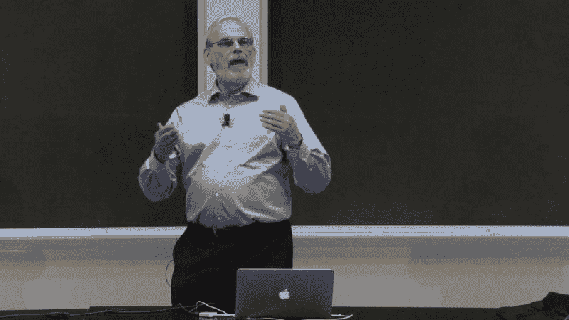
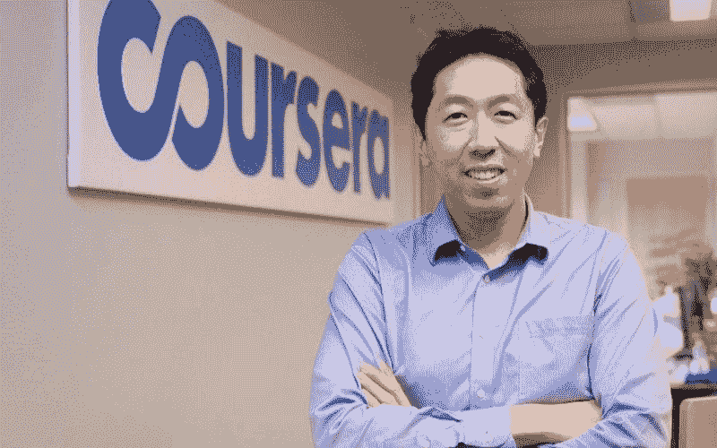
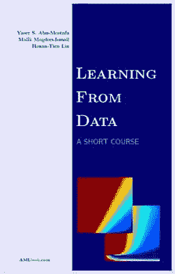
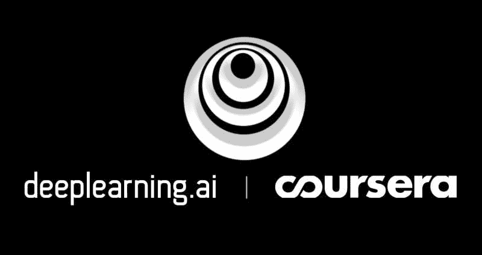

# 成为更好的数据科学家必须参加的在线课程

> 原文：[`www.kdnuggets.com/2020/09/online-courses-better-data-scientist.html`](https://www.kdnuggets.com/2020/09/online-courses-better-data-scientist.html)

评论

**由[David Adrián Cañones](https://davidadrian.cc/)，数据科学家与机器学习工程师**

* * *

## 我们的前 3 个课程推荐

 1. [谷歌网络安全证书](https://www.kdnuggets.com/google-cybersecurity) - 快速进入网络安全职业的快车道。

 2. [谷歌数据分析专业证书](https://www.kdnuggets.com/google-data-analytics) - 提升你的数据分析技能

 3. [谷歌 IT 支持专业证书](https://www.kdnuggets.com/google-itsupport) - 支持你所在组织的 IT

* * *

### 一些背景，曾经有一段时间…

我在 2015 年开始了数据科学的学习。这并不是一个有意的决定，而是对我雇主需求的回应。我在一家为西班牙公司提供自动化服务的公司工作，我们需要利用数据来**自动化那些规则不能轻易硬编码的复杂任务**。我刚刚从工程专业毕业，正值经济危机严重时期，具有一定的统计建模知识，并且熟练使用 MATLAB。

在 2015 年，还没有专门的数据科学学位或[训练营](https://www.ironhack.com/en/data-analytics)来快速进入该领域（至少在西班牙是这样），你能获得的最接近的学科是：数学（在西班牙，主要是为了成为公共教育系统中的教师/教授）或软件工程（大多数人更感兴趣于应用开发或创建新的“X”的 Uber，而不是当时乏味的数据科学工作）。

在这种背景下，大多数数据科学从业者都是刚刚从定量学科（大量来自不同领域的工程师，以及经济学和类似学科的人）毕业的新人。在这个背景下，我发现了一些珍贵的在线资源，它们在当时帮助了我，并且长期来看，让我今天（2020 年）成为了更好的数据科学家。

### 免责声明：在线课程不会让你成为数据科学家

成为数据科学家需要具备以下几种东西：

+   一个定量学位（不是严格必要，但有帮助）。

+   对所使用的工具和技术的实际知识。这是你可以在类似于[我](https://www.linkedin.com/in/davidadrian/)和[Pedro](https://www.linkedin.com/in/pedro-munoz-botas/)所教授的专业训练营中获得的。

+   实际的现实世界和相关项目经验。这是这个列表中最重要的一点，也是最难获得的。

+   被优秀的专业人士包围。正如我以前的老板常说的：如果你是房间里最聪明的人，你应该开始担心了。

+   **对数据科学如何运作有一个良好的理解，包括对数据结构、系统和算法在后台如何工作的理论知识。**

这一最后要点是本文的重点。我将在此介绍的在线课程专注于数据科学的理论基础。这些课程有一些共同特点：

+   这些课程**不是**那种你可以在通勤时一小时内完成的典型 DataCamp 纳米课程。这些是需要你投入时间的长期而艰难的课程。

+   由**顶级大学的优秀教授**教授。

+   在行业中被**非常重视**，包括公司、招聘人员等。

这些课程不会让你成为数据科学家，但在你通过真实项目练习技能、学习所需工具等的过程中，这些课程将为你长期成为数据科学家的成功奠定基础，并使你区别于那些仅仅训练机器学习模型和编写代码却对实际情况一无所知的平庸数据科学家。

### 本文没有任何课程的赞助

这点需要记住。与推荐数据科学课程的其他帖子和列表不同，这里有两个优势：

+   我已经完成了这里列出的每一门课程，我推荐它们的原因是基于我的个人经验，它们确实值得。我将附上每门课程的相应证书以证明我的话。

+   显然，没有任何课程作者赞助我在此列出他们的内容。

### 这些课程

让我们按时间顺序开始吧...

### [1. 使用 Python 的计算机科学与编程导论](https://www.edx.org/course/introduction-to-computer-science-and-programming-7)

Eric Grimson

这是 MIT 的 Eric Grimson 教授开设的**真正优秀**的课程。由于我有一些 MATLAB 经验，我作为数据科学家的第一个目标之一是学习 Python。当我参加这门课程时，内容是为 Python 2 准备的，但最近已更新为 Python 3。

这门课程有趣的地方在于，它介绍了计算机科学中一些重要的概念，这些概念通常被许多数据科学家忽略，例如：

+   数据结构

+   计算复杂度（Big O 符号）

+   面向对象编程

+   算法

+   递归

如果你是一名有经验的数据科学家但没有 Python 知识，应该考虑参加这门课程，因为它现在是标准课程。

[我的完成证书](https://courses.edx.org/certificates/b2cdc2a2bc8f4774a4d1cdca61a5a81b)。

### [2. 计算思维与数据科学导论](https://www.edx.org/course/introduction-to-computational-thinking-and-data-4)

这是前一个课程的第二部分。它重点关注**应用于统计的编程**。你可以期待编写大量的**模拟**代码。非常有趣。

[我的结业证书](https://courses.edx.org/certificates/705c792d66494fc0ad27c451cb691ca6)。

### [3. 分析边缘](https://www.edx.org/course/the-analytics-edge)

这是教授 Dimitris Bertsimas 开设的一个好课程。它聚焦于**机器学习**和优化**算法**的混合，并结合一些使用`ggplot`的**可视化**。课程内容包括：

+   线性模型

+   决策树

+   随机森林

+   聚类（k-means）

+   线性规划

+   一些自然语言处理（如今有点过时）

所有内容都用 R 语言教授。

[我的结业证书](https://courses.edx.org/certificates/35bb4da1cf61463abb62a6ef67f83472)。

### [4. 机器学习](https://www.coursera.org/learn/machine-learning)

Andrew Ng

这个课程不需要介绍。这可能是**关于机器学习最著名的课程**，也是近年来机器学习热潮的重要推动者。

这门课程由**著名教授兼 AI 倡导者 Andrew Ng（斯坦福大学）**教授。课程**优秀**，重点讲解了最流行的机器学习算法，包括其**数学基础**。

这是该领域最受重视的课程之一。

在 2016 年，这门课程是用 MATLAB/Octave 教授的。我最近看到他们正在将 MATLAB 更新为 Python，但这个更新尚未发布。

[我的结业证书](https://www.coursera.org/account/accomplishments/verify/8Y4PSZDQJ939)。

### [5. 数据学习](https://www.edx.org/course/learning-from-data-introductory-machine-learning)

这门由加州理工学院的教授 Yaser S. Abu-Mostafa 开设的**有趣**课程深入探讨了**什么**是统计学习，**为什么**它是可行的，以及**如何**正确进行，详细涵盖了如偏差-方差权衡、过拟合、正则化、验证、泛化理论等方面。

它以理论和严格的方式解释了机器学习的基础，不推荐没有数学背景的人学习。

其内容基于同名的[书籍](https://www.amazon.com/Learning-Data-Yaser-S-Abu-Mostafa/dp/1600490069)：

数据学习（书籍）

[我的结业证书](https://courses.edx.org/certificates/66eaf815c70b44bdbc4c54b9a06170f8)。

### [6. 深度学习专业化](https://www.coursera.org/specializations/deep-learning)

deeplearning.ai

这是**著名**的深度学习专业化课程，由 Andrew Ng 教授及其新的教育项目[**deeplearning.ai**](https://www.deeplearning.ai/)开设，是当前该领域最受重视的证书之一。

这是一个**长**期的 5 门课程专门化课程，专注于神经网络，这是当今最重要的算法之一，也是处理非结构化数据（图像、声音、文本、视频等）的最佳算法。

从第一门课程中的**基础**和**数学**知识开始，讲解神经网络，接着是**超参数调优**、**项目规划与策略**、**卷积架构**，最后是**序列模型**架构。

这些课程高度结构化、严谨且基础扎实，同时也很实用，包含大量真实的应用案例。

[我的完成证书](https://www.coursera.org/account/accomplishments/specialization/8DWTESSP5KKT)。

**这些是我推荐的高质量课程。**

然而，这些并不是我进入这个领域以来唯一完成的课程。我一直在参加各种课程，有时甚至同时参加两门；大多数课程都是关于数据科学的，虽然我有时也会扩展到其他主题，如城市设计、能源等。如果有兴趣，也许我会在另一篇文章中涉及这些话题。

你可以查看我完成的所有课程的完整列表 [在我的 LinkedIn 个人资料中](https://www.linkedin.com/in/davidadrian/)。

### 荣誉提名

有些课程不符合上述部分的资格，但值得一提……

### [1\. 深度学习导论](https://www.coursera.org/learn/intro-to-deep-learning)

这是莫斯科高等经济学院的一门课程。未在上述列表中列出，因为它非常广泛且不够结构化，但广泛性也可能是它的一个优点。

如果你在寻找一个*简短*的深度学习介绍课程，覆盖了许多架构而不太关注其背后的数学，并且不想花费几个月的时间来完成 deeplearning.ai 的完整深度学习专门化课程，这就是你的课程。

最终项目是构建一个能够生成图像字幕的应用，非常有趣且有趣。

[我的完成证书](https://www.coursera.org/account/accomplishments/records/RCHCYKVMUMNV)。

### [2\. 如何赢得数据科学竞赛：向顶级 Kagglers 学习](https://www.coursera.org/learn/competitive-data-science)

这是一个**不同**的机器学习课程。如果我只能选一个课程来学习机器学习，并且必须选择一个，我会选择这个课程。

这门课程涵盖了你成为**高效**数据科学家所需了解的几乎所有内容，涉及重要主题如下：

+   探索性数据分析。

+   从实际的角度出发，讲解了许多不同的机器学习算法（何时以及为何选择某一种算法而不是另一种以完成特定任务）。

+   技术如均值/目标编码。

+   来自 Kaggle 竞赛的许多真实案例，由竞赛获胜者和 Kaggle 大师如 [Μαριος Μιχαηλιδης](https://www.kaggle.com/kazanova) 进行讲解。

虽然本课程专注于竞争性数据科学（Kaggle 竞赛），这**与实际的工业机器学习项目不同**，在实际项目中不仅需要获得最佳分数（还需要考虑推理速度、维护性、鲁棒性等），但你可以获得改进机器学习模型的灵感。

[我的完成证书](https://www.coursera.org/account/accomplishments/records/87SZ3NV7A77P)。

### [3\. 医疗保健 AI 专业](https://www.coursera.org/specializations/ai-for-medicine)

Pie & AI（医学 AI 启动活动）

这个**非常近期的专业**由[deeplearning.ai](https://deeplearning.ai/)提供，讲述如何将人工智能应用于医疗保健领域。

鉴于 COVID-19 疫情的当前情况，不用说，公众和私营部门的努力正朝着寻找创新解决方案以应对这一公共卫生危机的方向发展。

目前，AI 应用于医疗保健被认为是一个全新的领域，并且**在未来十年中最有前景的领域**（从数据科学家的角度来看）：

> AI 不会取代医生，但使用 AI 的医生会取代那些不使用 AI 的医生 — Andrew Ng

在过去几年中，像市场营销、客户管理、能源等领域的 AI 解决方案取得了显著发展，但医疗保健领域由于以下原因一直滞后：

+   与数据隐私和伦理考虑相关的行政障碍。

+   对于一个相对传统的领域缺乏兴趣，在该领域医生与技术人员之间的沟通并不总是容易。

+   算法性能至关重要（涉及到人们的生命），因此 AI 的实施必须非常谨慎。

最近的疫情改变了公众对健康数据使用的看法，政府和公众都更愿意探索 AI 在医学领域的可能性。

这个专业由 3 门课程组成，涵盖：

+   医疗诊断中的 AI：学习如何基于医学图像等识别疾病。

+   医疗预后中的 AI：学习如何预测患者的未来健康。

+   医疗治疗中的 AI：了解因果推断、随机对照试验、模型解释性。这是这个专业中最不有趣的课程，而且由于它相对较新（2020 年 5 月），作业中仍然存在一些错误。

这些课程**从技术角度来看并不非常困难**，但如果你打算参加这个专业，最好有一些数据科学的经验，因为它专注于解释**传统 AI 和医疗 AI 的关键差异**。这些差异包括：

+   医疗保健的具体性能指标。

+   适用于医疗图像分割的深度学习架构。

+   强调生存分析。

如果你 **希望在 10 年后仍然是一名数据科学家**，在一个数据科学普遍化的竞争环境中，你应该选择这个专业。

+   [我的完成证书](https://www.coursera.org/account/accomplishments/specialization/3EXEQYHMJMWU)。

感谢阅读这篇文章，希望这些信息能帮助你提升职业发展或学到新东西。

PS：感谢 [Miriam Cañones](https://www.linkedin.com/in/miriamcc/) 在撰写本文时提供的反馈。

> 本文 **最初发布** 在我的 [个人网站和博客](https://davidadrian.cc/)。

**简介：[David Adrián Cañones](https://davidadrian.cc/)** （[**LinkedIn**](https://www.linkedin.com/in/davidadrian/?originalSubdomain=es)）是一名数据科学家和机器学习工程师。David 拥有超过五年的经验，帮助公司和机构利用数据解决复杂问题。

[原始文献](https://davidadrian.cc/top-courses-data-science/)。经许可转载。

**相关：**

+   超越表面：有实质内容的数据科学 MOOC

+   MIT 免费课程：Python 计算机科学与编程入门

+   超棒的机器学习和 AI 课程

### 相关主题

+   [10 门免费必修数据科学课程，帮助你入门](https://www.kdnuggets.com/10-free-must-take-data-science-courses-to-get-started)

+   [5 门免费的 AI 和 ChatGPT 课程，助你从 0 到 100](https://www.kdnuggets.com/5-free-courses-on-ai-and-chatgpt-to-take-you-from-0-100)

+   [2024 年你可以选修的 5 门顶级机器学习课程](https://www.kdnuggets.com/5-top-machine-learning-courses-you-can-take-in-2024)

+   [9 个可以让你获得学位的专业证书...如果…](https://www.kdnuggets.com/9-professional-certificates-that-can-take-you-onto-a-degree-if-you-really-want-to)

+   [现在可以选修的 AWS 顶级 8 个 GenAI 课程](https://www.kdnuggets.com/top-8-genai-courses-for-aws-to-take-now)

+   [在选修任何免费数据科学课程之前请阅读此文](https://www.kdnuggets.com/read-this-before-you-take-any-free-data-science-course)
