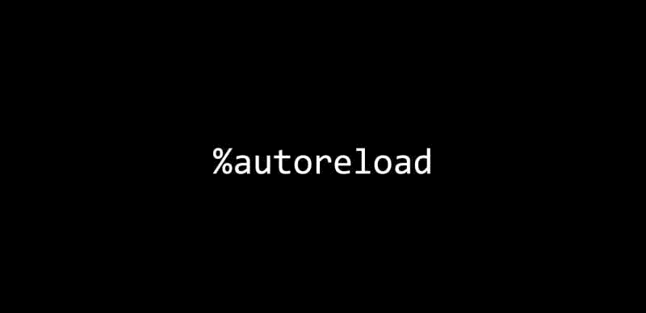

# 你真正需要的唯一 Jupyter Notebook 扩展

> 原文：[`www.kdnuggets.com/2021/06/only-jupyter-notebooks-extension-truly-need.html`](https://www.kdnuggets.com/2021/06/only-jupyter-notebooks-extension-truly-need.html)

评论

**由 [Olga Chernytska](https://www.linkedin.com/in/olga-chernytska-122700102/)，高级机器学习工程师**



* * *

## 我们的前 3 个课程推荐

 1\. [谷歌网络安全证书](https://www.kdnuggets.com/google-cybersecurity) - 快速进入网络安全职业轨道

 2\. [谷歌数据分析专业证书](https://www.kdnuggets.com/google-data-analytics) - 提升你的数据分析技能

 3\. [谷歌 IT 支持专业证书](https://www.kdnuggets.com/google-itsupport) - 支持您的组织的 IT

* * *

在 Jupyter Notebook 中工作时，将你的函数和类存储在单独的 .py 文件中并只导入它们是很方便的。这使得你的笔记本更易读，你可以在多个笔记本中轻松重用相同的函数和类。

假设你启动了你的笔记本，从 .py 文件中导入了自定义函数，加载了大数据集，并使用自定义函数进行了预处理。结果发现一个用于预处理的函数不正确，因此你修正了 .py 文件中的代码，然后再次运行带有预处理的单元格 —— 然而……没有变化，错误依然存在。Jupyter Notebook 没有看到更新后的函数版本。

不幸的是，这里唯一能做的就是重启内核，丢失已经加载到内存中的所有数据集。

除非你正在使用`autoreload`。

### 它是如何工作的

根据文档，`autoreload` “在执行用户代码之前自动重新加载模块” [1]。

这意味着现在你只需：在 .py 文件中修正函数，保存更改，返回笔记本并运行带有预处理的单元格。笔记本中的所有函数导入都会重新加载到最新版本，单元格中的代码会被执行 —— 你可以看到修正后的函数如何工作。


### 使用

为了实现这一魔法，将这段代码放入笔记本的第一个单元格中，并在启动内核后首先运行它：

```py
%load_ext autoreload
%autoreload 2
```

你只需在内核启动时运行一次。`autoreload` 将一直工作，直到你停止内核。

### 安装

不需要安装，它应该已经存在。`Autoreload` 在你安装 Jupyter Notebook 或 Jupyter Lab 时会自动安装。

### 更多

`Autoreload` 允许你仅重新加载特定模块，或排除某些模块的重新加载。如果你需要此功能，请查看官方文档 [1]。

### 参考文献

[1] [IPython 文档](https://ipython.readthedocs.io/en/stable/config/extensions/autoreload.html)

**个人简介： [Olga Chernytska](https://www.linkedin.com/in/olga-chernytska-122700102/)** 是一家大型东欧外包公司的高级机器学习工程师；参与了多个美国、欧洲和亚洲顶级公司的数据科学项目；主要专业领域和兴趣是深度计算机视觉。

[原文](https://notrocketscience.blog/the-only-extension-you-truly-need-when-working-in-jupyter-notebooks/)。经许可转载。

**相关：**

+   数据科学家在 Python 中常犯的 15 个错误（以及如何修复它们）

+   停止从命令行运行 Jupyter 笔记本

+   JupyterLab 3 到来了：立即升级的关键原因

### 更多相关话题

+   [成为专业数据工程师所需的唯一免费课程](https://www.kdnuggets.com/the-only-free-course-you-need-to-become-a-professional-data-engineer)

+   [成为深度学习面试准备的唯一课程](https://www.kdnuggets.com/the-only-interview-prep-course-you-need-for-deep-learning)

+   [成为 MLOps 工程师所需的唯一免费课程](https://www.kdnuggets.com/the-only-free-course-you-need-to-become-a-mlops-engineer)

+   [让你数据分析师职业成功的唯一课程](https://www.kdnuggets.com/the-only-course-you-need-to-smash-your-data-analyst-career)

+   [2022 年前 5 名免费云笔记本](https://www.kdnuggets.com/2022/04/top-5-free-cloud-notebooks-2022.html)

+   [来自 Anaconda 的最新消息！数据科学培训和云托管笔记本](https://www.kdnuggets.com/2022/11/anaconda-new-anaconda-data-science-training-cloud-hosted-notebooks.html)
