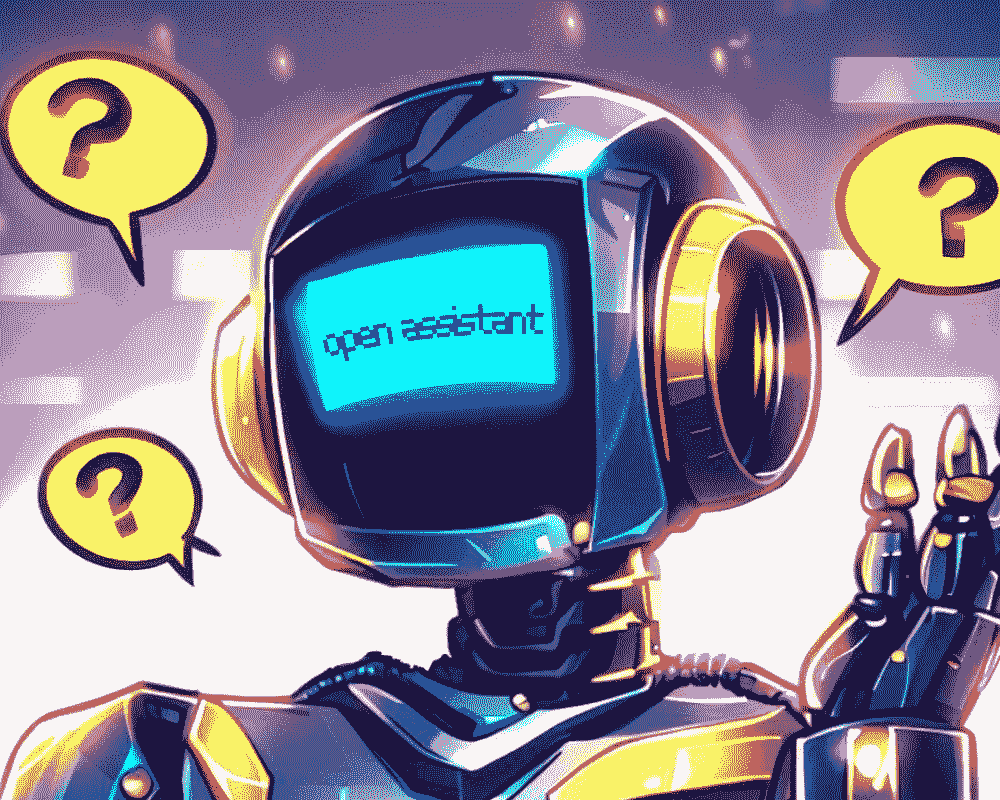
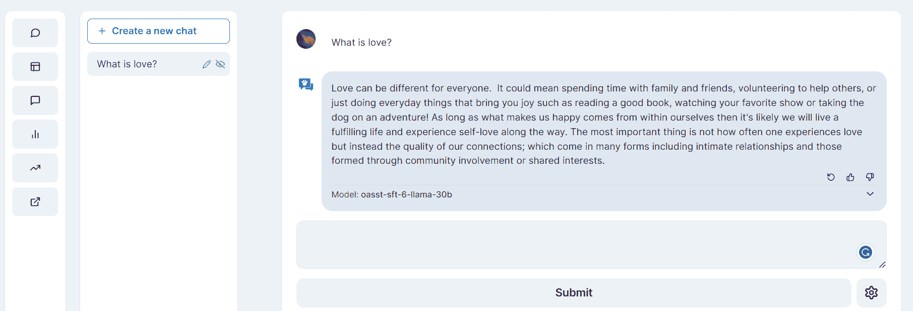
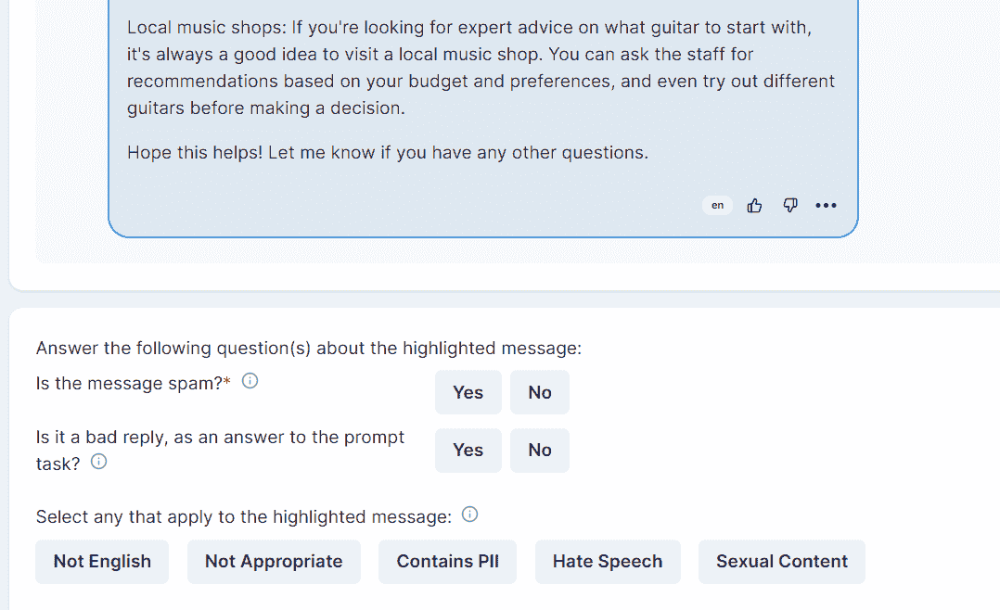
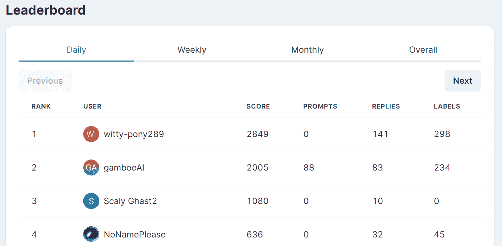

# Open Assistant: 探索开放和协作聊天机器人开发的可能性

> 原文：[`www.kdnuggets.com/2023/04/open-assistant-explore-possibilities-open-collaborative-chatbot-development.html`](https://www.kdnuggets.com/2023/04/open-assistant-explore-possibilities-open-collaborative-chatbot-development.html)

作者提供的图片 | Bing 图像创作者

我们正在看到 ChatGPT 开源替代品的快速发展，其中一些如 [Vicuna](https://vicuna.lmsys.org/)产生了令人惊叹的结果。但有一个问题。这些新模型有使用限制，我们不能将它们用于商业用途。

* * *

## 我们的前三个课程推荐

 1\. [Google 网络安全证书](https://www.kdnuggets.com/google-cybersecurity) - 快速进入网络安全职业生涯。

 2\. [Google 数据分析专业证书](https://www.kdnuggets.com/google-data-analytics) - 提升你的数据分析技能

 3\. [Google IT 支持专业证书](https://www.kdnuggets.com/google-itsupport) - 支持你所在组织的 IT 工作

* * *

另一方面，Open Assistant 正在努力改变这一点。他们的使命是让每个人都能访问像 ChatGPT 和 GPT-4 这样的优秀聊天型大型语言模型。

在这篇文章中，我们将了解 Open Assistant 项目及其特性、限制和计划。此外，我们还将为你提供所有资源，帮助你开始创建自己的聊天机器人。

# 什么是 Open Assistant？

[Open-Assistant](https://github.com/LAION-AI/Open-Assistant)项目正在革新语言技术。与其将高质量的大型语言模型私有化，他们让所有人都可以使用数据集、模型、代码源和 Open Assistant 平台。

Open-Assistant 模型是在来自 13,000 多名志愿者的数据集上进行训练的。收集的数据集包含超过 60 万次互动、15 万条消息和 1 万棵完全标注的对话树，涵盖多种语言的各种话题。

观看启动视频以了解这个项目有多酷。

如果你访问他们的 Hugging Face [页面](https://huggingface.co/OpenAssistant)，你会看到多个基于 Open Assistant 数据集训练的模型架构，例如 Stable LM、LLaMA、Pythia、Galactica 等。他们正在基于最新数据开发一款最先进的模型，并很快将推出具备安全功能的该模型。

**注意：**一些模型如 LLaMA 有使用限制（仅限研究），但你也会看到像 Pythia 这样的模型可用于任何用途。

# 如何尝试

你可以查看 Hugging Face 的 [demo](https://huggingface.co/spaces/olivierdehaene/chat-llm-streaming) 与模型互动，或免费注册官方 [chat](https://open-assistant.io/chat) 体验最先进的模型。

众所周知，该项目是由开源社区为社区创建的，你将看到一些选项来改善聊天体验并参与数据收集。

## 与 AI 聊天

Open Assistant 允许你与聊天机器人对话，并对其回应提供反馈。要开始，请注册并点击聊天按钮。然后，使用竖起或倒立的拇指图标对聊天机器人的消息做出反应，帮助它学习。

图片来自 [Chat](https://open-assistant.io/chat)

## 贡献数据收集

数据收集的用户界面非常简单。只需点击仪表板按钮，选择任务，然后开始贡献。你可以通过提交、排名和标记模型提示和回应来提高 Open Assistant 的能力。

图片来自 [Open Assistant](https://projects.laion.ai/Open-Assistant/)

当你对数据集做出有效贡献时，你的得分会在公共排行榜上显示。这是一种游戏化贡献过程的方式。

图片来自 [Open Assistant](https://projects.laion.ai/Open-Assistant/)

# 限制

Open Assistant 的限制是大多数开源大型语言模型的限制。这些模型在编程和数学交互方面训练较少，导致在回答数学和编程问题时表现非常糟糕。

该模型在生成有趣的回答方面表现良好，更像人类，但有时会产生事实错误或误导性的回答。

你需要了解这些模型相对于 ChatGPT 来说较小，并且会有一些限制。

# 未来计划

Open Assistant 的创始人有一个愿景，即创建一个未来的助手，它可以执行各种任务，如写邮件、进行有意义的工作、使用 API 和动态研究信息。此外，他们希望他们的助手对所有使用者都可以进行自定义和扩展。

+   他们将继续收集更多高质量数据，并训练更好的模型。

+   他们的愿景是创建一个统一的平台，包括对话助手、通过搜索引擎检索、API 和第三方集成，以及为开发者提供的构建模块。

+   他们还有一些私有模型，计划在完成安全功能后公开。

+   社区正在着手推出一种方法论，这将帮助在消费级 GPU 上训练和运行大型语言模型。

# 入门指南

Open Assistant 项目完全透明，并且允许商业使用。只有少数模型，如 LLaMa，受到限制。其他所有内容，包括模型、数据集、代码、推理、论文、演示和文档，都是免费的和公开的。

这个平台让你能为数据集贡献并登上排行榜。你还可以使用公开数据集训练你的模型。探索无限可能。

+   **官方页面：** [Open Assistant | Open Assistant (laion.ai)](https://projects.laion.ai/Open-Assistant/)

+   **GitHub：** [LAION-AI/Open-Assistant](https://github.com/LAION-AI/Open-Assistant)

+   **HuggingFace 演示：** [Chat Llm Streaming - 由 olivierdehaene 提供的 Hugging Face 空间](https://huggingface.co/spaces/olivierdehaene/chat-llm-streaming)

+   **官方聊天：** [聊天 (open-assistant.io)](https://open-assistant.io/chat)（需要注册）

+   **模型权重：** [OpenAssistant/oasst-sft-1-pythia-12b](https://huggingface.co/OpenAssistant/oasst-sft-1-pythia-12b)

+   **数据集：** [OpenAssistant/oasst1](https://huggingface.co/datasets/OpenAssistant/oasst1)

+   **文档：** [简介 | Open Assistant (laion.ai)](https://projects.laion.ai/Open-Assistant/docs/intro)

+   **研究论文：** [OpenAssistant 对话 -- 民主化大型语言模型对齐](https://arxiv.org/abs/2304.07327)

别忘了给项目点赞、星标和支持。他们无私地做这些，值得我们的喜爱。

**[Abid Ali Awan](https://www.polywork.com/kingabzpro)**（[@1abidaliawan](https://twitter.com/1abidaliawan)）是一位认证的数据科学专业人士，喜欢构建机器学习模型。目前，他专注于内容创作，并撰写有关机器学习和数据科学技术的技术博客。Abid 拥有技术管理硕士学位和电信工程学士学位。他的愿景是利用图神经网络为挣扎于心理健康问题的学生构建一款 AI 产品。

### 更多相关内容

+   [联邦学习：带教程的协作机器学习…](https://www.kdnuggets.com/2021/12/federated-learning-collaborative-machine-learning-tutorial-get-started.html)

+   [协作过滤的直观解释](https://www.kdnuggets.com/2022/09/intuitive-explanation-collaborative-filtering.html)

+   [用 Hugging Face 和 Gradio 在 5 分钟内构建 AI 聊天机器人](https://www.kdnuggets.com/2023/06/build-ai-chatbot-5-minutes-hugging-face-gradio.html)

+   [使用 openplayground 在你的笔记本电脑上轻松探索 LLMs](https://www.kdnuggets.com/2023/04/explore-llms-easily-laptop-openplayground.html)

+   [聊天机器人变革：从失败到未来](https://www.kdnuggets.com/2021/12/chatbot-transformation-failure-future.html)

+   [通过这些课程构建类似 ChatGPT 的聊天机器人](https://www.kdnuggets.com/2023/05/build-chatgptlike-chatbot-courses.html)
