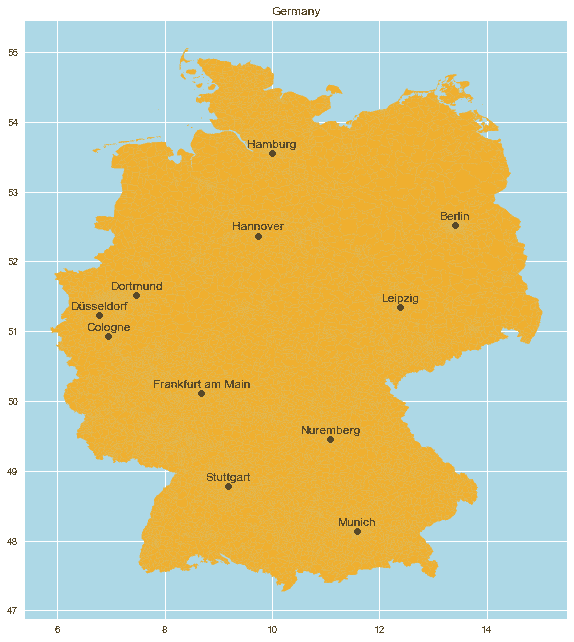
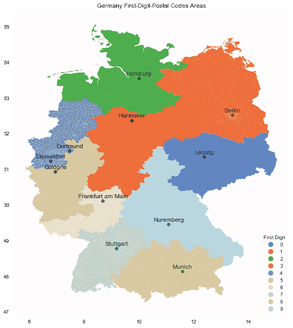
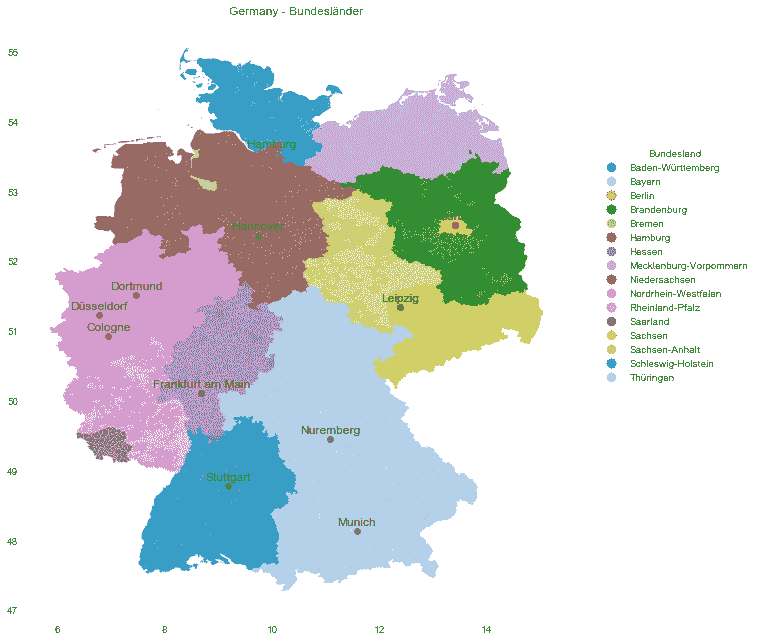
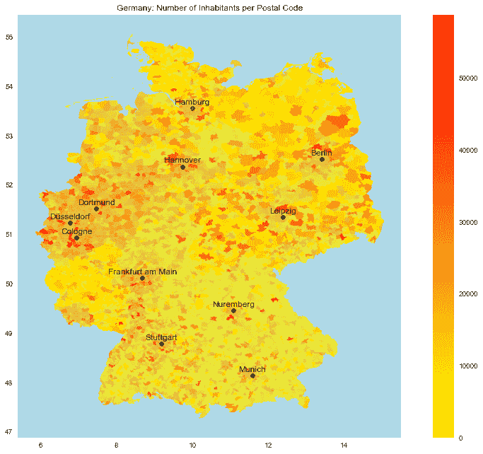
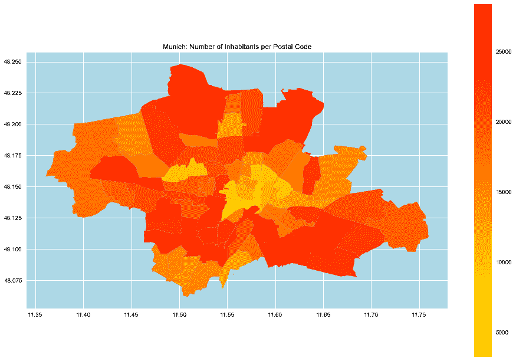
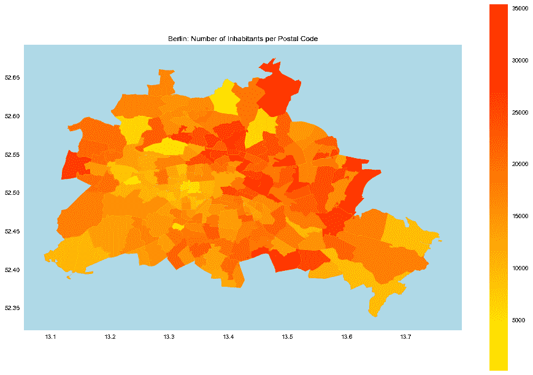
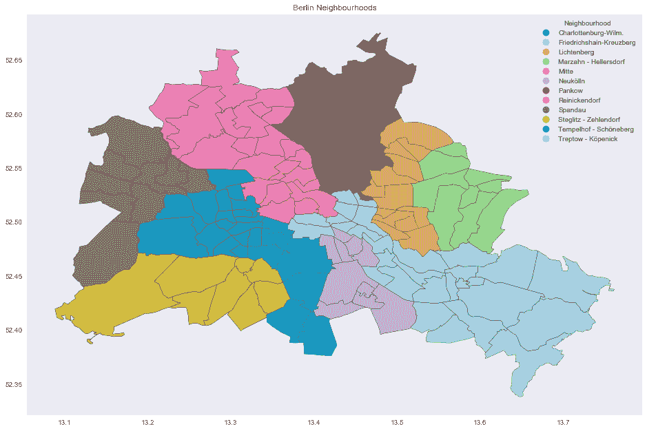
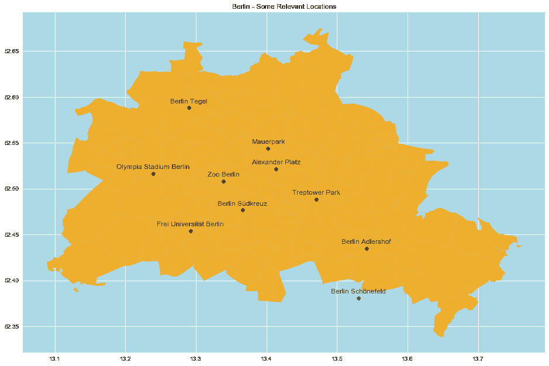
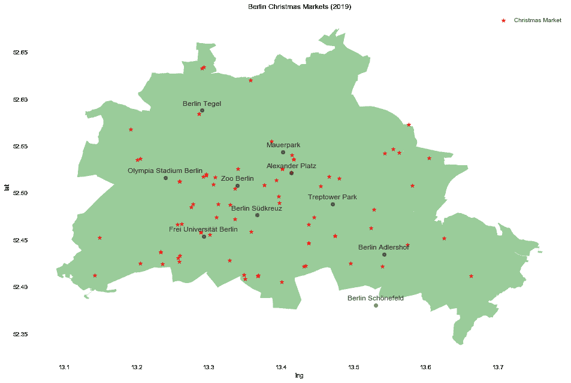

# 开放数据的地理可视化

> 原文：[`www.kdnuggets.com/2020/01/open-data-germany-maps-viz.html`](https://www.kdnuggets.com/2020/01/open-data-germany-maps-viz.html)

评论

**由 [Dr. Juan Camilo Orduz](https://juanitorduz.github.io/)，数学家与数据科学家**

在这篇文章中，我想展示如何使用公开（开放）数据在 Python 中创建地理可视化。地图是处理地理定位数据时传达和比较信息的绝佳方式。有许多框架可以绘制地图，这里我重点介绍 [matplotlib](https://matplotlib.org/) 和 [geopandas](http://geopandas.org/)（并简要介绍 [mplleaflet](https://github.com/jwass/mplleaflet)）。

**参考：** 一个非常好的 matplotlib 介绍是来自 [Python 数据科学手册](https://jakevdp.github.io/PythonDataScienceHandbook/) 的 [Matplotlib 可视化](https://jakevdp.github.io/PythonDataScienceHandbook/04.00-introduction-to-matplotlib.html) 章节，由 [Jake VanderPlas](https://jakevdp.github.io/pages/about.html) 撰写。

**备注：** 当我完成写这本笔记本时，我发现 R 语言中有类似的分析 [在这里](https://www.r-bloggers.com/case-study-mapping-german-zip-codes-in-r/)。请查看一下！

### 准备笔记本

```py
import geopandas as gpd
import pandas as pd
import numpy as np
import matplotlib.pyplot as plt
plt.style.use('seaborn')

%matplotlib inline
```

### 获取德国数据

本文的主要数据来源是 [www.suche-postleitzahl.org/downloads](https://www.suche-postleitzahl.org/downloads)。我们在这里下载了三个数据集：

+   `plz-gebiete.shp`：包含德国邮政编码多边形的 shapefile。

+   `zuordnung_plz_ort.csv`：邮政编码到城市和联邦州的映射。

+   `plz_einwohner.csv`：人口分配到每个邮政编码区域。

### 德国地图

我们首先生成一个包含最重要城市的德国地图。

```py
# Make sure you read postal codes as strings, otherwise 
# the postal code 01110 will be parsed as the number 1110\. 
plz_shape_df = gpd.read_file('../Data/plz-gebiete.shp', dtype={'plz': str})

plz_shape_df.head()
```

|  | plz | note | geometry |
| --- | --- | --- | --- |
| 0 | 52538 | 52538 Gangelt, Selfkant | POLYGON ((5.86632 51.05110, 5.86692 51.05124, … |
| 1 | 47559 | 47559 Kranenburg | POLYGON ((5.94504 51.82354, 5.94580 51.82409, … |
| 2 | 52525 | 52525 Waldfeucht, Heinsberg | POLYGON ((5.96811 51.05556, 5.96951 51.05660, … |
| 3 | 52074 | 52074 亚琛 | POLYGON ((5.97486 50.79804, 5.97495 50.79809, … |
| 4 | 52531 | 52531 Übach-Palenberg | POLYGON ((6.01507 50.94788, 6.03854 50.93561, … |

`geometry` 列包含定义邮政编码形状的多边形。

我们可以使用 [geopandas 映射工具](http://geopandas.org/mapping.html) 来通过 `plot` 方法生成地图。

```py
plt.rcParams['figure.figsize'] = [16, 11]

# Get lat and lng of Germany's main cities. 
top_cities = {
    'Berlin': (13.404954, 52.520008), 
    'Cologne': (6.953101, 50.935173),
    'Düsseldorf': (6.782048, 51.227144),
    'Frankfurt am Main': (8.682127, 50.110924),
    'Hamburg': (9.993682, 53.551086),
    'Leipzig': (12.387772, 51.343479),
    'Munich': (11.576124, 48.137154),
    'Dortmund': (7.468554, 51.513400),
    'Stuttgart': (9.181332, 48.777128),
    'Nuremberg': (11.077438, 49.449820),
    'Hannover': (9.73322, 52.37052)
}

fig, ax = plt.subplots()

plz_shape_df.plot(ax=ax, color='orange', alpha=0.8)

# Plot cities. 
for c in top_cities.keys():
    # Plot city name.
    ax.text(
        x=top_cities[c][0], 
        # Add small shift to avoid overlap with point.
        y=top_cities[c][1] + 0.08, 
        s=c, 
        fontsize=12,
        ha='center', 
    )
    # Plot city location centroid.
    ax.plot(
        top_cities[c][0], 
        top_cities[c][1], 
        marker='o',
        c='black', 
        alpha=0.5
    )

ax.set(
    title='Germany', 
    aspect=1.3, 
    facecolor='lightblue'
);
```



### 首位数字邮政编码区域

接下来，让我们绘制不同地区对应于每个邮政编码的第一个数字。

```py
# Create feature.
plz_shape_df = plz_shape_df \
    .assign(first_dig_plz = lambda x: x['plz'].str.slice(start=0, stop=1))
```

```py
fig, ax = plt.subplots()

plz_shape_df.plot(
    ax=ax, 
    column='first_dig_plz', 
    categorical=True, 
    legend=True, 
    legend_kwds={'title':'First Digit', 'loc':'lower right'},
    cmap='tab20',
    alpha=0.9
)

for c in top_cities.keys():

    ax.text(
        x=top_cities[c][0], 
        y=top_cities[c][1] + 0.08, 
        s=c, 
        fontsize=12,
        ha='center', 
    )

    ax.plot(
        top_cities[c][0], 
        top_cities[c][1], 
        marker='o',
        c='black', 
        alpha=0.5
    )

ax.set(
    title='Germany First-Digit-Postal Codes Areas', 
    aspect=1.3,
    facecolor='white'
);
```



### 联邦州地图

现在让我们将每个邮政编码映射到相应的区域：

```py
plz_region_df = pd.read_csv(
    '../Data/zuordnung_plz_ort.csv', 
    sep=',', 
    dtype={'plz': str}
)

plz_region_df.drop('osm_id', axis=1, inplace=True)

plz_region_df.head()
```

|  | ort | plz | bundesland |
| --- | --- | --- | --- |
| 0 | Aach | 78267 | 巴登-符腾堡 |
| 1 | Aach | 54298 | 莱茵兰-普法尔茨 |
| 2 | 亚琛 | 52062 | 北莱茵-威斯特法伦 |
| 3 | 亚琛 | 52064 | 北莱茵-威斯特法伦 |
| 4 | 亚琛 | 52066 | 北莱茵-威斯特法伦 |

```py
# Merge data.
germany_df = pd.merge(
    left=plz_shape_df, 
    right=plz_region_df, 
    on='plz',
    how='inner'
)

germany_df.drop(['note'], axis=1, inplace=True)

germany_df.head()
```

|  | plz | 几何 | first_dig_plz | 城市 | 联邦州 |
| --- | --- | --- | --- | --- | --- |
| 0 | 52538 | POLYGON ((5.86632 51.05110, 5.86692 51.05124, … | 5 | 甘根特 | 北莱茵-威斯特法伦 |
| 1 | 52538 | POLYGON ((5.86632 51.05110, 5.86692 51.05124, … | 5 | 塞尔夫坎特 | 北莱茵-威斯特法伦 |
| 2 | 47559 | POLYGON ((5.94504 51.82354, 5.94580 51.82409, … | 4 | 克拉能堡 | 北莱茵-威斯特法伦 |
| 3 | 52525 | POLYGON ((5.96811 51.05556, 5.96951 51.05660, … | 5 | 海因斯贝格 | 北莱茵-威斯特法伦 |
| 4 | 52525 | POLYGON ((5.96811 51.05556, 5.96951 51.05660, … | 5 | 瓦尔德费赫特 | 北莱茵-威斯特法伦 |

生成联邦州地图：

```py
fig, ax = plt.subplots()

germany_df.plot(
    ax=ax, 
    column='bundesland', 
    categorical=True, 
    legend=True, 
    legend_kwds={'title':'Bundesland', 'bbox_to_anchor': (1.35, 0.8)},
    cmap='tab20',
    alpha=0.9
)

for c in top_cities.keys():

    ax.text(
        x=top_cities[c][0], 
        y=top_cities[c][1] + 0.08, 
        s=c, 
        fontsize=12,
        ha='center', 
    )

    ax.plot(
        top_cities[c][0], 
        top_cities[c][1], 
        marker='o',
        c='black', 
        alpha=0.5
    )

ax.set(
    title='Germany - Bundesländer', 
    aspect=1.3, 
    facecolor='white'
);
```



### 居民数量

现在我们将包括每个邮政编码的居民数量：

```py
plz_einwohner_df = pd.read_csv(
    '../Data/plz_einwohner.csv', 
    sep=',', 
    dtype={'plz': str, 'einwohner': int}
)

plz_einwohner_df.head()
```

|  | plz | 居民数 |
| --- | --- | --- |
| 0 | 01067 | 11957 |
| 1 | 01069 | 25491 |
| 2 | 01097 | 14811 |
| 3 | 01099 | 28021 |
| 4 | 01108 | 5876 |

```py
# Merge data.
germany_df = pd.merge(
    left=germany_df, 
    right=plz_einwohner_df, 
    on='plz',
    how='left'
)

germany_df.head()
```

|  | plz | 几何 | first_dig_plz | 城市 | 联邦州 | 居民数 |
| --- | --- | --- | --- | --- | --- | --- |
| 0 | 52538 | POLYGON ((5.86632 51.05110, 5.86692 51.05124, … | 5 | 甘根特 | 北莱茵-威斯特法伦 | 21390 |
| 1 | 52538 | POLYGON ((5.86632 51.05110, 5.86692 51.05124, … | 5 | 塞尔夫坎特 | 北莱茵-威斯特法伦 | 21390 |
| 2 | 47559 | POLYGON ((5.94504 51.82354, 5.94580 51.82409, … | 4 | 克拉能堡 | 北莱茵-威斯特法伦 | 10220 |
| 3 | 52525 | POLYGON ((5.96811 51.05556, 5.96951 51.05660, … | 5 | 海因斯贝格 | 北莱茵-威斯特法伦 | 49737 |
| 4 | 52525 | POLYGON ((5.96811 51.05556, 5.96951 51.05660, … | 5 | 瓦尔德费赫特 | 北莱茵-威斯特法伦 | 49737 |

生成地图：

```py
fig, ax = plt.subplots()

germany_df.plot(
    ax=ax, 
    column='einwohner', 
    categorical=False, 
    legend=True, 
    cmap='autumn_r',
    alpha=0.8
)

for c in top_cities.keys():

    ax.text(
        x=top_cities[c][0], 
        y=top_cities[c][1] + 0.08, 
        s=c, 
        fontsize=12,
        ha='center', 
    )

    ax.plot(
        top_cities[c][0], 
        top_cities[c][1], 
        marker='o',
        c='black', 
        alpha=0.5
    )

ax.set(
    title='Germany: Number of Inhabitants per Postal Code', 
    aspect=1.3, 
    facecolor='lightblue'
);
```



### 城市地图

我们现在可以使用 `ort` 特征筛选城市。

+   慕尼黑

```py
munich_df = germany_df.query('ort == "München"')

fig, ax = plt.subplots()

munich_df.plot(
    ax=ax, 
    column='einwohner', 
    categorical=False, 
    legend=True, 
    cmap='autumn_r',
)

ax.set(
    title='Munich: Number of Inhabitants per Postal Code', 
    aspect=1.3, 
    facecolor='lightblue'
);
```



+   柏林

```py
berlin_df = germany_df.query('ort == "Berlin"')

fig, ax = plt.subplots()

berlin_df.plot(
    ax=ax, 
    column='einwohner', 
    categorical=False, 
    legend=True, 
    cmap='autumn_r',
)

ax.set(
    title='Berlin: Number of Inhabitants per Postal Code', 
    aspect=1.3,
    facecolor='lightblue'
);
```



### 柏林

我们可以使用门户网站 [`www.statistik-berlin-brandenburg.de`](https://www.statistik-berlin-brandenburg.de/) 获取柏林的官方邮政编码与区域映射信息，详见 [这里](https://www.statistik-berlin-brandenburg.de/produkte/verzeichnisse/ZuordnungderBezirkezuPostleitzahlen.xls)。经过一些格式化处理（非结构化原始数据）：

```py
berlin_plz_area_df = pd.read_excel(
    '../Data/ZuordnungderBezirkezuPostleitzahlen.xls', 
    sheet_name='plz_bez_tidy',
    dtype={'plz': str}
)

berlin_plz_area_df.head()
```

|  | plz | 区域 |
| --- | --- | --- |
| 0 | 10115 | 中心 |
| 1 | 10117 | 中心 |
| 2 | 10119 | 中心 |
| 3 | 10178 | 中心 |
| 4 | 10179 | 中心 |

但请注意，这张地图不是一对一的，即一个邮政编码可以对应多个区域：

```py
berlin_plz_area_df \
    [berlin_plz_area_df['plz'].duplicated(keep=False)] \
    .sort_values('plz')
```

|  | plz | 区域 |
| --- | --- | --- |
| 2 | 10119 | 中心 |
| 41 | 10119 | 帕克诺 |
| 4 | 10179 | 中心 |
| 26 | 10179 | 弗里德里希斯海因-克罗伊茨贝格 |
| 42 | 10247 | 帕克诺 |
| … | … | … |
| 133 | 14197 | 施特格利茨-泽尔多夫 |
| 95 | 14197 | 夏洛滕堡-威尔默斯多夫 |
| 165 | 14197 | 恩赫尔霍夫-舍讷贝格 |
| 134 | 14199 | 施特格利茨-泽尔多夫 |
| 96 | 14199 | 夏洛滕堡-威尔默斯多夫 |

99 行 × 2 列

因此，我们需要更改邮政编码分组变量。

### 柏林社区

幸运的是，网站[`insideairbnb.com/get-the-data.html`](http://insideairbnb.com/get-the-data.html)，包含了许多城市的 AirBnB 数据（这绝对值得研究！），有一个方便的数据集`neighbourhoods.geojson`，它将柏林的区域映射到*邻里*：

```py
berlin_neighbourhoods_df = gpd.read_file('../Data/neighbourhoods.geojson')

berlin_neighbourhoods_df = berlin_neighbourhoods_df \
    [~ berlin_neighbourhoods_df['neighbourhood_group'].isnull()]

berlin_neighbourhoods_df.head()
```

|  | 邻里 | 邻里组 | 几何 |
| --- | --- | --- | --- |
| 0 | Blankenfelde/Niederschönhausen | Pankow | MULTIPOLYGON (((13.41191 52.61487, 13.41183 52… |
| 1 | Helmholtzplatz | Pankow | MULTIPOLYGON (((13.41405 52.54929, 13.41422 52… |
| 2 | Wiesbadener Straße | Charlottenburg-Wilm. | MULTIPOLYGON (((13.30748 52.46788, 13.30743 52… |
| 3 | Schmöckwitz/Karolinenhof/Rauchfangswerder | Treptow - Köpenick | MULTIPOLYGON (((13.70973 52.39630, 13.70926 52… |
| 4 | Müggelheim | Treptow - Köpenick | MULTIPOLYGON (((13.73762 52.40850, 13.73773 52… |

```py
fig, ax = plt.subplots()

berlin_df.plot(
    ax=ax, 
    alpha=0.2
)

berlin_neighbourhoods_df.plot(
    ax=ax, 
    column='neighbourhood_group',
    categorical=True, 
    legend=True, 
    legend_kwds={'title': 'Neighbourhood', 'loc': 'upper right'},
    cmap='tab20', 
    edgecolor='black'
)

ax.set(
    title='Berlin Neighbourhoods', 
    aspect=1.3
);
```

这里的划分对应于`Neighbourhood`⊂⊂`Neighbourhood Group`。

### 柏林精选地点

有时候，将著名地点包含在地图上是很有用的，以便用户可以识别它们并理解距离和比例。实现这一点的一种方法是手动输入每个点的纬度和经度（如上所述）。当然，这可能耗时且容易出错。正如预期的那样，有一个可以自动获取这种数据的库，即[geopy](https://github.com/geopy/geopy)。

这是一个简单的例子：

```py
from geopy import Nominatim

locator = Nominatim(user_agent='myGeocoder')

location = locator.geocode('Humboldt Universität zu Berlin')

print(location)
```

柏林洪堡大学，Dorotheenstraße，Spandauer Vorstadt，Mitte，柏林，10117，德国

让我们编写一个函数来获取纬度和经度坐标：

```py
def lat_lng_from_string_loc(x):

    locator = Nominatim(user_agent='myGeocoder')

    location = locator.geocode(x)

    if location is None:
        None
    else:
        return location.longitude, location.latitude
```

```py
# Define some well-known Berlin locations.
berlin_locations = [
    'Alexander Platz', 
    'Zoo Berlin', 
    'Berlin Tegel', 
    'Berlin Schönefeld',
    'Berlin Adlershof',
    'Olympia Stadium Berlin',
    'Berlin Südkreuz', 
    'Frei Universität Berlin',
    'Mauerpark', 
    'Treptower Park',
]

# Get geodata.
berlin_locations_geo = {
    x: lat_lng_from_string_loc(x) 
    for x in berlin_locations 
}

# Remove None.
berlin_locations_geo = {
    k: v 
    for k, v in berlin_locations_geo.items()
    if v is not None
}
```

让我们查看结果地图：

```py
berlin_df = germany_df.query('ort == "Berlin"')

fig, ax = plt.subplots()

berlin_df.plot(
    ax=ax, 
    color='orange', 
    alpha=0.8
)

for c in berlin_locations_geo.keys():

    ax.text(
        x=berlin_locations_geo[c][0], 
        y=berlin_locations_geo[c][1] + 0.005, 
        s=c, 
        fontsize=12,
        ha='center', 
    )

    ax.plot(
        berlin_locations_geo[c][0], 
        berlin_locations_geo[c][1], 
        marker='o',
        c='black', 
        alpha=0.5
    )

ax.set(
    title='Berlin - Some Relevant Locations', 
    aspect=1.3,
    facecolor='lightblue'
);
```



### 圣诞市场

让我们通过包含其他类型的信息来丰富地图。有关柏林公开数据的绝佳资源是[柏林开放数据](https://daten.berlin.de/)。在许多有趣的数据集中，我找到了一份关于城市周边圣诞市场的数据（这些市场真的很有趣！）[在这里](https://daten.berlin.de/datensaetze/berliner-weihnachtsm%C3%A4rkte-2019)。你可以通过公共 API 访问这些数据。让我们使用`requests`模块来完成这项任务：

```py
import requests

# GET request.
response = requests.get(
    'https://www.berlin.de/sen/web/service/maerkte-feste/weihnachtsmaerkte/index.php/index/all.json?q='
)

response_json = response.json()
```

转换为 pandas 数据框。

```py
berlin_maerkte_raw_df = pd.DataFrame(response_json['index'])
```

我们没有邮政编码功能，但我们可以通过从`plz_ort`列中提取来创建一个。

```py
berlin_maerkte_df = berlin_maerkte_raw_df[['name', 'bezirk', 'plz_ort', 'lat', 'lng']]

berlin_maerkte_df = berlin_maerkte_df \
    .query('lat != ""') \
    .assign(plz = lambda x: x['plz_ort'].str.split(' ').apply(lambda x: x[0]).astype(str)) \
    .drop('plz_ort', axis=1)

# Convert to float.
berlin_maerkte_df['lat'] = berlin_maerkte_df['lat'].str.replace(',', '.').astype(float)
berlin_maerkte_df['lng'] = berlin_maerkte_df['lng'].str.replace(',', '.').astype(float)

berlin_maerkte_df.head()
```

|  | 名称 | 区域 | 纬度 | 经度 | 邮政编码 |
| --- | --- | --- | --- | --- | --- |
| 0 | Charlottenburg 宫前的圣诞市场 | Charlottenburg-Wilmersdorf | 52.519951 | 13.295946 | 14059 |
| 1 |

1.  Gedächtniskirche 圣诞市场

| Charlottenburg-Wilmersdorf | 52.504886 | 13.335511 | 10789 |
| --- | --- | --- | --- |
| 2 | Wilmersdorf 步行区的圣诞市场 | Charlottenburg-Wilmersdorf | 52.509313 | 13.305994 | 10627 |
| 3 | 圣诞市场在西区 | Charlottenburg-Wilmersdorf | 52.512538 | 13.259213 | 14052 |
| 4 | Johannisstraße 的柏林-Grunewald 圣诞市场 | Charlottenburg-Wilmersdorf | 52.488350 | 13.277250 | 14193 |

让我们绘制圣诞市场的位置：

```py
fig, ax = plt.subplots()

berlin_df.plot(ax=ax, color= 'green', alpha=0.4)

for c in berlin_locations_geo.keys():

    ax.text(
        x=berlin_locations_geo[c][0], 
        y=berlin_locations_geo[c][1] + 0.005, 
        s=c, 
        fontsize=12,
        ha='center', 
    )

    ax.plot(
        berlin_locations_geo[c][0], 
        berlin_locations_geo[c][1], 
        marker='o',
        c='black', 
        alpha=0.5
    )

berlin_maerkte_df.plot(
    kind='scatter', 
    x='lng', 
    y='lat', 
    c='r', 
    marker='*',
    s=50,
    label='Christmas Market',  
    ax=ax
)

ax.set(
    title='Berlin Christmas Markets (2019)', 
    aspect=1.3, 
    facecolor='white'
);
```



### 互动地图

我们可以使用 [mplleaflet](https://github.com/jwass/mplleaflet) 库，它*将 matplotlib 图表转换为包含可平移、可缩放的 Leaflet 地图的网页*。

+   柏林邻里

```py
import mplleaflet

fig, ax = plt.subplots()

berlin_df.plot(
    ax=ax, 
    alpha=0.2
)

berlin_neighbourhoods_df.plot(
    ax=ax, 
    column='neighbourhood_group',
    categorical=True, 
    cmap='tab20',
)

mplleaflet.display(fig=fig)
```

+   圣诞市场

```py
fig, ax = plt.subplots()

berlin_df.plot(ax=ax, color= 'green', alpha=0.4)

berlin_maerkte_df.plot(
    kind='scatter', 
    x='lng', 
    y='lat', 
    c='r', 
    marker='*',
    s=30,
    ax=ax
)

mplleaflet.display(fig=fig)
```

我希望这些数据源和代码片段能作为探索使用 Python 进行地理数据分析和可视化的起点。

**简介： [胡安·卡米洛·奥尔杜斯博士](https://juanitorduz.github.io/)** ([@juanitorduz](https://twitter.com/juanitorduz)) 是一位总部位于柏林的数学家和数据科学家。

[原文](https://juanitorduz.github.io/germany_plots/)。经许可转载。

**相关：**

+   每位数据科学家都应阅读的 6 本关于开放数据的书籍

+   数据可视化的八个经典例子

+   元数据丰富化对实现开放数据集的价值至关重要

* * *

## 我们的前三大课程推荐

 1\. [Google 网络安全证书](https://www.kdnuggets.com/google-cybersecurity) - 快速进入网络安全职业道路。

 2\. [Google 数据分析专业证书](https://www.kdnuggets.com/google-data-analytics) - 提升您的数据分析技能

 3\. [Google IT 支持专业证书](https://www.kdnuggets.com/google-itsupport) - 支持您的组织进行 IT

* * *

### 更多相关话题

+   [开放助手：探索开放和协作的可能性…](https://www.kdnuggets.com/2023/04/open-assistant-explore-possibilities-open-collaborative-chatbot-development.html)

+   [介绍 MetaGPT 的数据解释器：SOTA 开源 LLM 基于…](https://www.kdnuggets.com/metagpt-data-interpreter-open-source-llm-based-data-solutions)

+   [使用开源工具生成合成时间序列数据](https://www.kdnuggets.com/2022/06/generate-synthetic-timeseries-data-opensource-tools.html)

+   [2023 年十大开源数据科学工具比较概述](https://www.kdnuggets.com/a-comparative-overview-of-the-top-10-open-source-data-science-tools-in-2023)

+   [开放数据及其必要性](https://www.kdnuggets.com/2022/03/open-data-necessary.html)

+   [开源工具在加速数据科学进步中的作用](https://www.kdnuggets.com/2023/05/role-open-source-tools-accelerating-data-science-progress.html)
