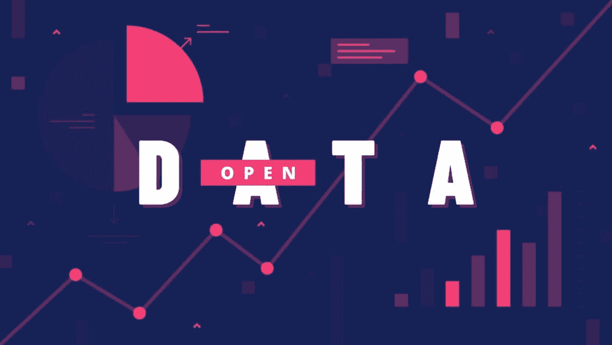
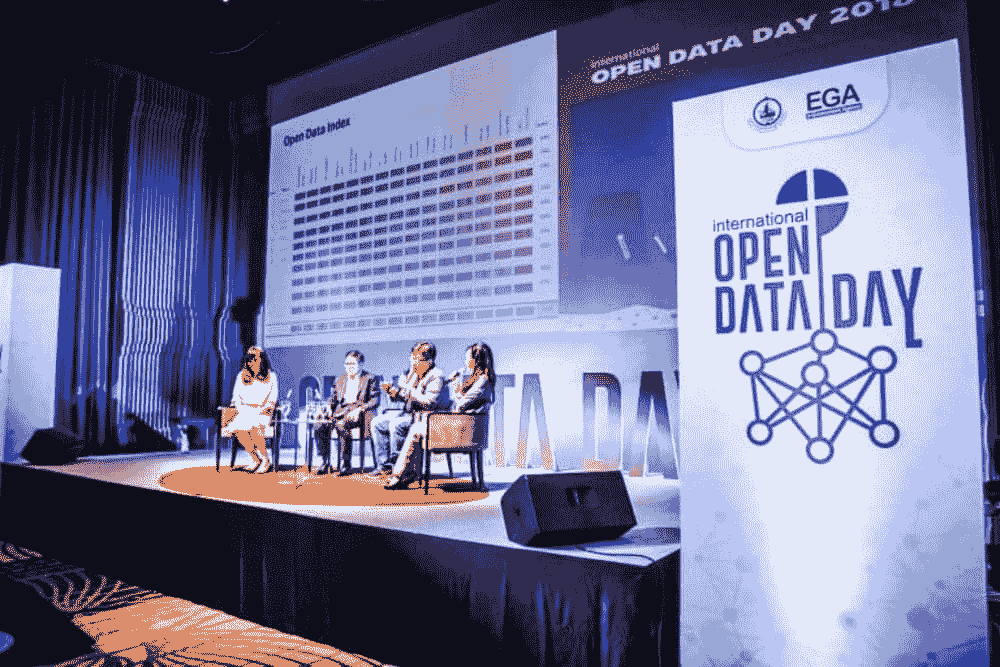
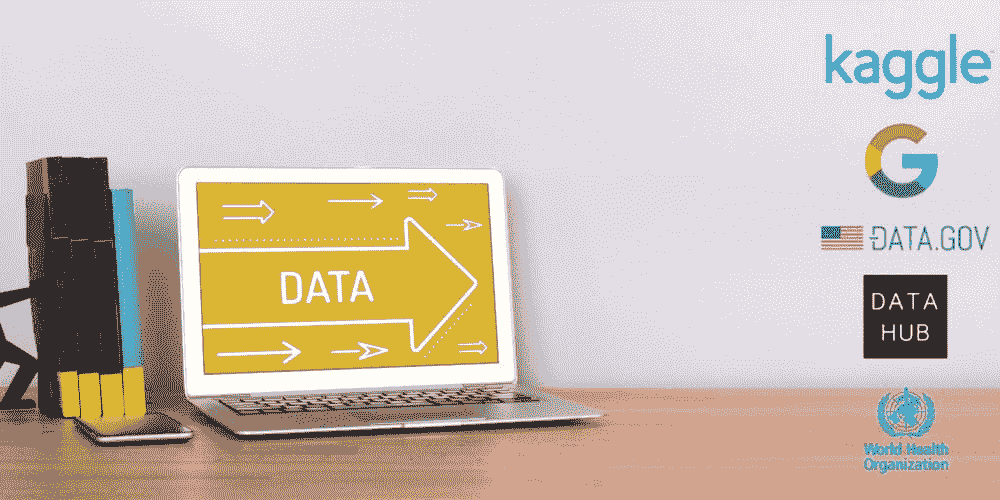

# 开放数据及其必要性

> 原文：[`www.kdnuggets.com/2022/03/open-data-necessary.html`](https://www.kdnuggets.com/2022/03/open-data-necessary.html)

图片作者

# 什么是开放数据？

开放数据是指任何人都可以用于任何目的的数据。它允许个人或公司使用、重用和重新分发数据而没有法律问题。数据受作者署名或相似共享许可 - [opendatahandbook](https://opendatahandbook.org/guide/en/what-is-open-data/)。

* * *

## 我们的前三个课程推荐

 1\. [谷歌网络安全证书](https://www.kdnuggets.com/google-cybersecurity) - 快速进入网络安全职业生涯。

 2\. [谷歌数据分析专业证书](https://www.kdnuggets.com/google-data-analytics) - 提升你的数据分析技能

 3\. [谷歌 IT 支持专业证书](https://www.kdnuggets.com/google-itsupport) - 支持你的组织 IT 需求

* * *

为了更好地理解，让我们深入探讨这些功能。

+   **开放访问和可用性：** 数据必须是完整的，并且可以通过互联网轻松下载。数据还应该以方便和修改过的形式提供。

+   **开放再利用：** 数据必须在允许最终用户重新使用和重新分发的许可证下，这还包括混合多个数据集。

+   **普遍参与：** 每个人都可以使用、重用和重新分发数据，不受任何研究领域、个人或团体的歧视。

为了推动开放数据的使用，全球数据社区每年庆祝 [国际开放数据日](https://en.wikipedia.org/wiki/International_Open_Data_Day)。在 3 月 6 日，全球各地的各种组织会举办讲座、研讨会、演示、黑客马拉松，并宣布开放数据发布。

图片来源于 [it24hrs](https://www.it24hrs.com/wp-content/uploads/2018/03/open-data-day-1-768x512.jpg)

# 为什么重要

如果你想知道为什么开放数据如此必要，简单的答案是，它加速了创新，减少了偏见，改善了质量，并降低了数据收集的成本。为了更好地理解，我们将详细学习开放数据的优势。

## 互操作性

互操作性意味着不同组织或系统能够协同工作。在我们的案例中，结合多个数据，使用类似数据处理复杂问题，并允许不同组件协同工作。互操作性对于解决复杂问题至关重要，它支持各种组织发现改进现有系统和开发新产品与服务的新方法。

## 经济成本

当数据被公开分享时，我们在收集新数据集上节省了大量资源。我们不仅节省了成本，还节省了收集全新数据集所需的时间和人力资源。开放数据还可以帮助公司将资源转移到新产品的研发中。

## 数据质量

当数据被多个方使用和重复使用时，发现并纠正错误的机会就会增加。随着时间的推移，数据的集体使用将提高对数据源的信心，这将帮助我们避免不确定性和偏见。

## 验证

研究出版物中提供的解决方案或方法论应当是可重复和可验证的。这只有在数据与研究解决方案一起共享时才有可能。验证将提高研究的质量并加速创新。它还帮助我们避免机器学习模型中的偏见，从而创建面向共同利益的包容性数据应用。

图片由作者提供

# 如何找到开放数据

世界正朝着开放数据政策迈进，许多组织和公司正在分享数据。通过简单的谷歌搜索，任何人都可以在特定领域找到多个数据集。此外，还有一些专业平台提供对数据集的公共访问。

## Kaggle

[Kaggle](https://www.kaggle.com/datasets)是一个社区驱动的平台，数据科学家们在这里分享数据、研究、代码，并参与数据竞赛。如果你在寻找数据集，Kaggle 应该是你的首选目的地，因为你可以通过简单的搜索找到各种开放源代码的数据集。

## 谷歌数据集搜索

[谷歌数据集搜索](https://datasetsearch.research.google.com/)使用谷歌搜索引擎，但专门用于数据。通过简单的搜索，你可以从各种来源找到任何类型的数据。例如，如果你喜欢某个数据集并想了解更多，它将提供 GitHub、Kaggle 和其他各种平台的链接以供查看和下载。

## Data.Gov

美国政府在 2015 年公开了所有数据。这些数据收集包括了 200,000 个数据集，涵盖从气候变化到犯罪的各个领域。该平台用户友好，数据集以常见文件格式提供。你会惊讶于从[Data.Gov](https://data.gov/)获取的最详细人口统计数据集中学到的东西。

## Datahub.io

[Datahub](https://datahub.io/)包含了各种高质量数据集的集合，按不同类别组织。你可以找到有关气候变化、娱乐、教育、医疗保健等的数据。该平台关注于像股市数据、房产价格、通货膨胀和物流等数据集。

## 全球健康观察数据仓库

[全球健康观察数据存储库](https://apps.who.int/gho/data/node.main.HWF) 包含全球健康相关的统计数据。 该数据集涵盖了从疟疾到 HIV/AIDS、抗菌素耐药性和疫苗接种率的所有健康问题。 对于在医疗行业工作的数据科学家来说，这个存储库是一个宝贵的资源，因为这些统计数据可以帮助他们开发前沿的 AI 解决方案。

**如果你在寻找一些稀有的数据集，查看** [**G2 提供的 50 个最佳开放数据源**](https://learn.g2.com/open-data-sources) **。**

**[Abid Ali Awan](https://www.polywork.com/kingabzpro)** ([@1abidaliawan](https://twitter.com/1abidaliawan)) 是一位认证的数据科学专业人士，喜欢构建机器学习模型。 目前，他专注于内容创作和撰写关于机器学习和数据科学技术的技术博客。 Abid 拥有技术管理硕士学位和电信工程学士学位。他的愿景是利用图神经网络为那些面临心理健康问题的学生开发 AI 产品。

### 相关主题

+   [开放助手：探索开放和协作的可能性…](https://www.kdnuggets.com/2023/04/open-assistant-explore-possibilities-open-collaborative-chatbot-development.html)

+   [8 个 ChatGPT 和 Bard 的开源替代品](https://www.kdnuggets.com/2023/04/8-opensource-alternative-chatgpt-bard.html)

+   [AI 和开源软件：天生一对？](https://www.kdnuggets.com/ai-and-open-source-software-separated-at-birth)

+   [生成 AI 游乐场：Camel-5b 和 Open LLaMA 3B 的 LLMs](https://www.kdnuggets.com/2024/02/intel-generative-ai-playground-llms-with-camel-5b-and-open-llama-3b)

+   [数据科学家如何赢得 CFO 的青睐（以及你为何需要它）](https://www.kdnuggets.com/2021/12/data-scientists-get-ear-cfos-want.html)

+   [一个关于合成数据的社区已经成立，为什么我们需要它](https://www.kdnuggets.com/2022/04/community-synthetic-data-need.html)
