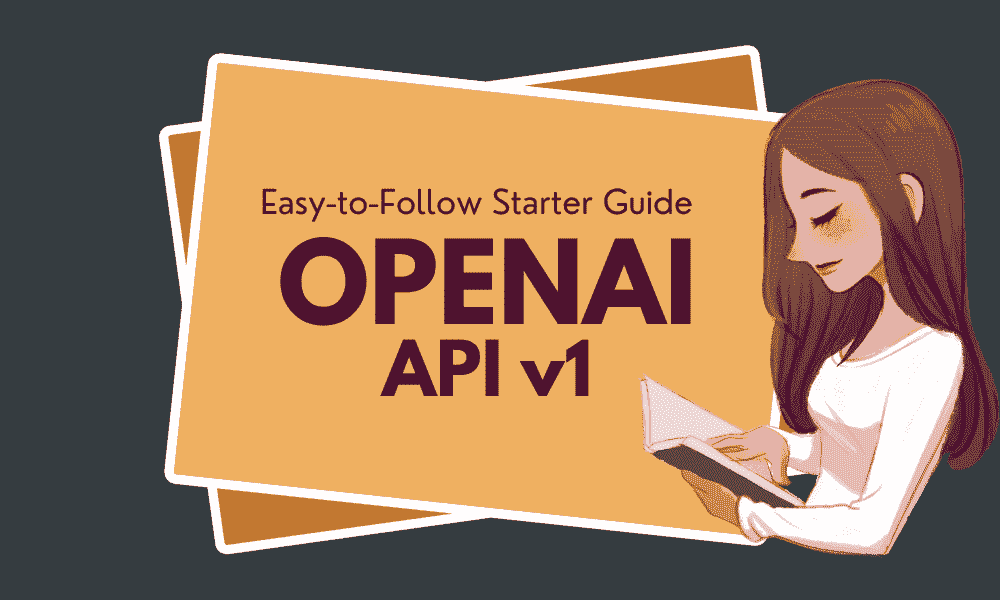
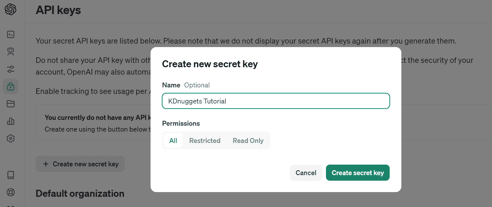
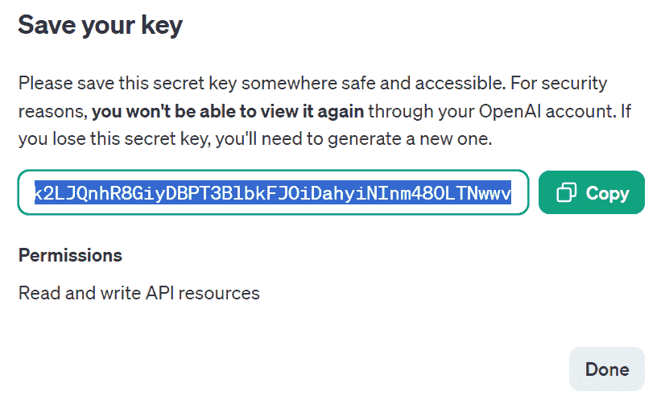
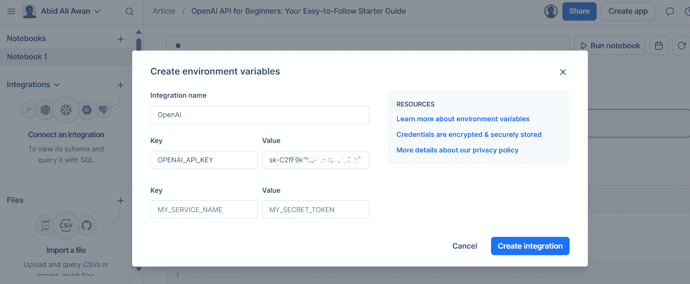
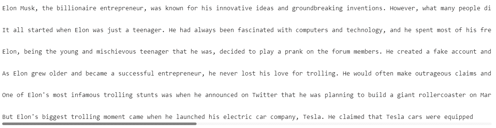
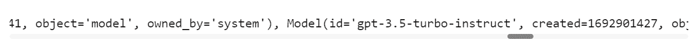

# OpenAI API 初学者指南：您的易于跟随的入门指南

> 原文：[`www.kdnuggets.com/openai-api-for-beginners-your-easy-to-follow-starter-guide`](https://www.kdnuggets.com/openai-api-for-beginners-your-easy-to-follow-starter-guide)



图片来源：作者

在本教程中，我们将学习如何设置和使用 OpenAI API 以适应各种用例。教程设计为易于跟随，即使对于那些对 Python 编程知识有限的人也是如此。我们将探讨任何人如何生成响应并访问高质量的大型语言模型。

* * *

## 我们的前三大课程推荐

 1\. [谷歌网络安全证书](https://www.kdnuggets.com/google-cybersecurity) - 快速进入网络安全职业轨道

 2\. [谷歌数据分析专业证书](https://www.kdnuggets.com/google-data-analytics) - 提升您的数据分析能力

 3\. [谷歌 IT 支持专业证书](https://www.kdnuggets.com/google-itsupport) - 支持您的组织 IT

* * *

# 什么是 OpenAI API？

[OpenAI API](https://platform.openai.com/docs/api-reference) 使开发者能够轻松访问由 OpenAI 开发的各种 AI 模型。它提供了一个用户友好的界面，帮助开发者将由最先进的 OpenAI 模型驱动的智能功能融入到他们的应用程序中。该 API 可以用于多种用途，包括文本生成、多轮对话、嵌入、转录、翻译、文本转语音、图像理解和图像生成。此外，API 兼容 curl、Python 和 Node.js。

# 入门指南

要开始使用 OpenAI API，您首先需要在 openai.com 上创建一个帐户。以前，每个用户都会获得免费的信用，但现在新用户需要购买信用。

要购买信用，请转到“Settings”，然后是“Billing”，最后点击“Add Payment Details”。输入您的借记卡或信用卡信息，并确保禁用自动充值。充值 10 美元后，您可以使用它一年。


通过导航到“API keys”并选择“Create new secret key”来创建 API 密钥。给它命名，然后点击“Create secret key”。



复制 API 并在本地机器上创建一个环境变量。



我使用 Deepnote 作为我的 IDE。创建环境变量很简单。只需转到“集成”，选择“创建环境变量”，为密钥提供名称和值，然后创建集成。



接下来，我们将使用 pip 安装 OpenAI Python 包。

```py
%pip install --upgrade openai
```

我们现在将创建一个可以全球访问各种模型的客户端。

如果你已经设置了名为"OPENAI_API_KEY"的环境变量，你就不需要向 OpenAI 客户端提供 API 密钥。

```py
from openai import OpenAI

client = OpenAI()
```

请注意，只有当你的环境变量名称不同于默认名称时，才应提供 API 密钥。

```py
import os
from openai import OpenAI

client = OpenAI(
  api_key=os.environ.get("SECRET_KEY"),
 )
```

# 文本生成

我们将使用传统功能生成响应。完成函数需要模型名称、提示和其他参数来生成回复。

```py
completion = client.completions.create(
    model="gpt-3.5-turbo-instruct",
    prompt="Write a short story about Elon Musk being the biggest troll.",
    max_tokens=300,
    temperature=0.7,
)
print(completion.choices[0].text)
```

GPT3.5 模型生成了关于埃隆·马斯克的惊人故事。



我们还可以通过提供额外的参数`stream`来流式传输我们的响应。

不同于等待完整的响应，流式特性使得输出在生成后立即进行处理。这种方法通过逐个返回语言模型的输出，帮助减少感知延迟，而不是一次性返回所有输出。

```py
stream = client.completions.create(
    model="gpt-3.5-turbo-instruct",
    prompt="Write a Python code for accessing the REST API securely.",
    max_tokens=300,
    temperature=0.7,
    stream = True
)
for chunk in stream:
        print(chunk.choices[0].text, end="")
```


# 聊天

该模型使用了 API 聊天完成。在生成响应之前，让我们探索可用模型。

你可以查看所有可用模型的列表，或阅读官方文档中的[模型](https://platform.openai.com/docs/models/models)页面。

```py
print(client.models.list())
```



我们将使用最新版本的 GPT-3.5，并提供系统提示和用户消息的字典列表。确保遵循相同的消息模式。

```py
completion = client.chat.completions.create(
    model="gpt-3.5-turbo-1106",
    messages=[
        {
            "role": "system",
            "content": "You are an experienced data scientist, adept at presenting complex data concepts with creativity.",
        },
        {
            "role": "user",
            "content": "What is Feature Engineering, and what are some common methods?",
        },
    ],
)

print(completion.choices[0].message.content) 
```

如我们所见，我们生成了与传统 API 相似的结果。那么，为什么要使用这个 API？接下来，我们将学习为什么聊天完成 API 更灵活且更易于使用。

```py
Feature engineering is the process of selecting, creating, or transforming features (variables) in a dataset to improve the performance of machine learning models. It involves identifying the most relevant and informative features and preparing them for model training. Effective feature engineering can significantly enhance the predictive power of a model and its ability to generalize to new data.

Some common methods of feature engineering include:

1\. Imputation: Handling missing values in features by filling them in with meaningful values such as the mean, median, or mode of the feature.

2\. One-Hot Encoding: Converting categorical variables into binary vectors to represent different categories as individual features.

3\. Normalization/Standardization: Scaling numerical features to bring t.........
```

我们现在将学习如何与 AI 模型进行多轮对话。为此，我们将把助手的回应添加到先前的对话中，并在相同的消息格式中包含新的提示。之后，我们将向聊天完成函数提供字典列表。

```py
chat=[
    {"role": "system", "content": "You are an experienced data scientist, adept at presenting complex data concepts with creativity."},
    {"role": "user", "content": "What is Feature Engineering, and what are some common methods?"}
  ]
chat.append({"role": "assistant", "content": str(completion.choices[0].message.content)})
chat.append({"role": "user", "content": "Can you summarize it, please?"})

completion = client.chat.completions.create(
  model="gpt-3.5-turbo-1106",
  messages=chat
)

print(completion.choices[0].message.content)
```

模型已经理解了上下文并为我们总结了特征工程。

```py
Feature engineering involves selecting, creating, or transforming features in a dataset to enhance the performance of machine learning models. Common methods include handling missing values, converting categorical variables, scaling numerical features, creating new features using interactions and polynomials, selecting important features, extracting time-series and textual features, aggregating information, and reducing feature dimensionality. These techniques aim to improve the model's predictive power by refining and enriching the input features.
```

# 嵌入

要开发高级应用程序，我们需要将文本转换为嵌入。这些嵌入用于相似性搜索、语义搜索和推荐引擎。我们可以通过提供 API 文本和模型名称来生成嵌入。就是这么简单。

```py
text = "Data Engineering is a rapidly growing field that focuses on the collection, storage, processing, and analysis of large volumes of structured and unstructured data. It involves various tasks such as data extraction, transformation, loading (ETL), data modeling, database design, and optimization to ensure that data is accessible, accurate, and relevant for decision-making purposes."

DE_embeddings = client.embeddings.create(input=text, model="text-embedding-3-small")
print(chat_embeddings.data[0].embedding)
```

```py
[0.0016297283582389355, 0.0013418874004855752, 0.04802832752466202, -0.041273657232522964, 0.02150309458374977, 0.004967313259840012,.......]
```

# 音频

现在，我们可以将文本转换为语音，将语音转换为文本，并通过音频 API 进行翻译。

## 文字转录

我们将使用[Wi-Fi 7 Will Change Everything](https://www.youtube.com/watch?v=JqQAFodjYBk) YouTube 视频，并将其转换为 mp3 格式。之后，我们将打开文件，并将其提供给音频转录 API。

```py
audio_file= open("Data/techlinked.mp3", "rb")
transcript = client.audio.transcriptions.create(
  model="whisper-1",
  file=audio_file
)
print(transcript.text)
```

Whisper 模型非常出色。它可以完美地转录音频内容。

```py
The Consumer Electronics Show has officially begun in Las Vegas and we'll be bringing you all the highlights from right here in our regular studio where it's safe and clean and not a desert. I hate sand. The Wi-Fi Alliance announced that they have officially confirmed the Wi-Fi 7 standard and they've already started to certify devices to ensure they work together. Unlike me and Selena, that was never gonna last. The new standard will have twice the channel bandwidth of Wi-Fi 5, 6, and 6E, making it better for, surprise,......
```

## 翻译

我们还可以将英文音频转录成另一种语言。在我们的例子中，我们将其转换为乌尔都语。我们只需添加一个名为`language`的参数，并提供 ISO 语言代码“ur”。

```py
translations = client.audio.transcriptions.create(
    model="whisper-1",
    response_format="text",
    language="ur",
    file=audio_file,
)

print(translations)
```

对于非拉丁语语言的翻译不完美，但对于最小可行产品来说已经足够用了。

```py
کنسومر ایلیکٹرانک شاہی نے لاس بیگیس میں شامل شروع کیا ہے اور ہم آپ کو جمہوری بہترین چیزیں اپنے ریگلر سٹوڈیو میں یہاں جارہے ہیں جہاں یہ آمید ہے اور خوبصورت ہے اور دنیا نہیں ہے مجھے سانڈ بھولتا ہے وائ فائی آلائنٹس نے اعلان کیا کہ انہوں نے وائ فائی سیبن سٹانڈرڈ کو شامل شروع کیا اور انہوں ن........ 
```

## 文本转语音

为了将文本转换为自然的语音，我们将使用语音 API，并提供模型名称、配音演员名称和输入文本。接下来，我们将把音频文件保存到我们的“Data”文件夹中。

```py
response = client.audio.speech.create(
  model="tts-1",
  voice="alloy",
  input= '''I see skies of blue and clouds of white
            The bright blessed days, the dark sacred nights
            And I think to myself
            What a wonderful world
         '''
)

response.stream_to_file("Data/song.mp3")
```

要在 Deepnote Notebook 中收听音频文件，我们将使用 IPython Audio 函数。

```py
from IPython.display import Audio
Audio("Data/song.mp3")
```


# 视觉

OpenAI API 通过聊天完成函数为用户提供了对多模态模型的访问。为了理解图像，我们可以使用最新的 GPT-4 视觉模型。

在消息参数中，我们提供了一个关于图像和图像 URL 提问的提示。图像来源于[Pixabay](https://www.pexels.com/photo/man-carrying-yoke-with-rice-grains-235731/)。请确保遵循相同的消息格式，以避免任何错误。

```py
response = client.chat.completions.create(
    model="gpt-4-vision-preview",
    messages=[
        {
            "role": "user",
            "content": [
                {
                    "type": "text",
                    "text": "Could you please identify this image's contents and provide its location?",
                },
                {
                    "type": "image_url",
                    "image_url": {
                        "url": "https://images.pexels.com/photos/235731/pexels-photo-235731.jpeg?auto=compress&cs=tinysrgb&w=1260&h=750&dpr=2",
                    },
                },
            ],
        }
    ],
    max_tokens=300,
)

print(response.choices[0].message.content)
```

输出内容完美地解释了图像。

```py
This is an image of a person carrying a large number of rice seedlings on a carrying pole. The individual is wearing a conical hat, commonly used in many parts of Asia as protection from the sun and rain, and is walking through what appears to be a flooded field or a wet area with lush vegetation in the background. The sunlight filtering through the trees creates a serene and somewhat ethereal atmosphere.

It's difficult to determine the exact location from the image alone, but this type of scene is typically found in rural areas of Southeast Asian countries like Vietnam, Thailand, Cambodia, or the Philippines, where rice farming is a crucial part of the agricultural industry and landscape.
```

我们也可以加载本地图像文件，并将其提供给聊天完成 API。为此，我们首先需要从 pexels.com 下载图像，下载地址为[Manjeet Singh Yadav](https://www.pexels.com/photo/woman-in-white-and-yellow-dress-with-scarf-1162983/)。

```py
!curl -o /work/Data/indian.jpg "https://images.pexels.com/photos/1162983/pexels-photo-1162983.jpeg?auto=compress&cs=tinysrgb&w=1260&h=750&dpr=2"
```

然后，我们将加载图像并将其编码为 base64 格式。

```py
import base64

def encode_image(image_path):
  with open(image_path, "rb") as image_file:
    return base64.b64encode(image_file.read()).decode('utf-8')

image_path = "Data/indian.jpg"

# generating the base64 string
base64_image = encode_image(image_path)
```

我们将提供元数据和图像的 base64 字符串，而不是提供图像 URL。

```py
response = client.chat.completions.create(
    model="gpt-4-vision-preview",
    messages=[
        {
            "role": "user",
            "content": [
                {
                    "type": "text",
                    "text": "Could you please identify this image's contents.",
                },
                {
                    "type": "image_url",
                    "image_url": {
                        "url": f"data:image/jpeg;base64,{base64_image}"
                    },
                },
            ],
        }
    ],
    max_tokens=100,
)

print(response.choices[0].message.content)
```

模型成功地分析了图像，并提供了详细的解释。

```py
The image shows a woman dressed in traditional Indian attire, specifically a classical Indian saree with gold and white colors, which is commonly associated with the Indian state of Kerala, known as the Kasavu saree. She is adorned with various pieces of traditional Indian jewelry including a maang tikka (a piece of jewelry on her forehead), earrings, nose ring, a choker, and other necklaces, as well as bangles on her wrists.

The woman's hairstyle features jasmine flowers arranged in
```

# 图像生成

我们还可以使用 DALLE-3 模型生成图像。我们只需提供模型名称、提示、尺寸、质量和图像数量给图像 API。

```py
response = client.images.generate(
  model="dall-e-3",
  prompt="a young woman sitting on the edge of a mountain",
  size="1024x1024",
  quality="standard",
  n=1,
)

image_url = response.data[0].url
```

生成的图像保存在网上，你可以下载以便本地查看。为此，我们将使用`request`函数下载图像，提供图像 URL 和你想保存的本地目录。之后，我们将使用 Pillow 库的 Image 函数打开并显示图像。

```py
import urllib.request

from PIL import Image

urllib.request.urlretrieve(image_url, '/work/Data/woman.jpg')

img = Image.open('/work/Data/woman.jpg')

img.show()
```

我们获得了一张高质量的生成图像。简直太惊艳了！


如果你在运行任何 OpenAI Python API 时遇到困难，欢迎查看我在 [Deepnote](https://deepnote.com/workspace/abid-5efa63e7-7029-4c3e-996f-40e8f1acba6f/project/OpenAI-API-for-Beginners-Your-Easy-to-Follow-Starter-Guide-9cef53b4-f44b-4d76-a6db-ace4702d282f/notebook/Notebook%201-e4ce532b1e97425ba1e69a4d3de695c2) 上的项目。

# 结论

我已经尝试使用 OpenAPI 一段时间了，我们最终只用了 0.22 美元的信用额度，这让我觉得非常实惠。通过我的指南，即使是初学者也可以开始构建自己的 AI 应用程序。这是一个简单的过程——你无需训练自己的模型或部署它。你可以通过 API 访问最先进的模型，且每次新版本发布时都在不断改进。


在本指南中，我们介绍了如何设置 OpenAI Python API 并生成简单的文本响应。我们还学习了多轮对话、嵌入、转录、翻译、文本转语音、视觉和图像生成 API。

如果你希望我使用这些 API 构建一个高级 AI 应用，请告知我。

感谢阅读。

[](https://www.polywork.com/kingabzpro)****[Abid Ali Awan](https://www.polywork.com/kingabzpro)**** ([@1abidaliawan](https://www.linkedin.com/in/1abidaliawan)) 是一位认证的数据科学专家，喜欢构建机器学习模型。目前，他专注于内容创作和撰写关于机器学习和数据科学技术的技术博客。Abid 拥有技术管理硕士学位和电信工程学士学位。他的愿景是利用图神经网络为面临心理健康问题的学生构建 AI 产品。

### 更多相关主题

+   [免费 ChatGPT 课程：使用 OpenAI API 编码 5 个项目](https://www.kdnuggets.com/2023/05/free-chatgpt-course-openai-api-code-5-projects.html)

+   [OpenAI 的 Whisper API 用于转录和翻译](https://www.kdnuggets.com/2023/06/openai-whisper-api-transcription-translation.html)

+   [使用 Python 探索 OpenAI API](https://www.kdnuggets.com/exploring-the-openai-api-with-python)

+   [AI 和机器学习的数据结构入门指南](https://www.kdnuggets.com/guide-data-structures-ai-and-machine-learning)

+   [为你的 AI 之旅注入动力！加入 Uplimit 的免费 AI 构建课程…](https://www.kdnuggets.com/2024/01/uplimit-supercharge-your-ai-journey-openai-course)

+   [关注数据科学、机器学习与 AI 的最佳 Instagram 账号](https://www.kdnuggets.com/2022/08/best-instagram-accounts-follow-data-science-machine-learning-ai.html)
