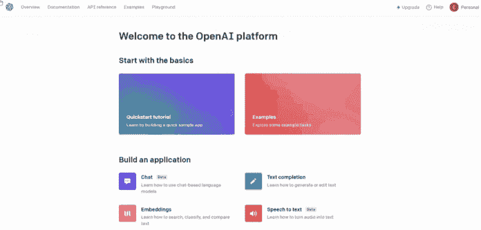

# OpenAI 的 Whisper API 用于转录和翻译

> 原文：[`www.kdnuggets.com/2023/06/openai-whisper-api-transcription-translation.html`](https://www.kdnuggets.com/2023/06/openai-whisper-api-transcription-translation.html)


插图由作者提供 | 来源：[flaticon](https://www.flaticon.com/premium-icon/programmer_3270999?related_id=3270999&origin=search)

你积累了大量录音，但没有精力开始听和转录它们？当我还是学生时，我记得我每天都要与录制的课程斗争，听了几个小时，大部分时间都被转录占用了。而且，这不是我的母语，我不得不将每一句话拖到 Google 翻译中以转换成意大利语。

* * *

## 我们的三大课程推荐

 1\. [Google 网络安全证书](https://www.kdnuggets.com/google-cybersecurity) - 快速进入网络安全职业生涯。

 2\. [Google 数据分析专业证书](https://www.kdnuggets.com/google-data-analytics) - 提升你的数据分析技能

 3\. [Google IT 支持专业证书](https://www.kdnuggets.com/google-itsupport) - 支持你的组织的 IT 工作

* * *

现在，人工转录和翻译已成为过去。著名的 ChatGPT 研究公司 OpenAI 推出了用于语音转文字的 Whisper API！只需几行 Python 代码，你就可以调用这个强大的语音识别模型，将思想从脑海中释放出来，专注于其他活动，比如数据科学项目的实践和提升你的作品集。让我们开始吧！

# Whisper 是什么？

Whisper 是一个基于神经网络的模型，由 OpenAI 开发，用于解决语音转文字任务。它属于 GPT-3 家族，并因其将音频高精度转录为文本的能力而变得非常受欢迎。

它不仅限于处理英语，还扩展到 50 多种语言。如果你想了解你的语言是否包括在内，请查看[这里](https://help.openai.com/en/articles/7031512-whisper-api-faq)。此外，它还可以将任何语言的音频翻译成英语。

像其他 OpenAI 产品一样，有一个 API 可以访问这些语音识别服务，允许开发者和数据科学家将 Whisper 集成到他们的平台和应用中。

# 如何访问 Whisper API？



GIF 由作者提供

在深入之前，你需要几个步骤来获取 Whisper API 的访问权限。首先，登录到[OpenAI API 网站](https://beta.openai.com/signup/)。如果你还没有账户，你需要创建一个。登录后，点击你的用户名并选择“查看 API 密钥”选项。然后，点击“创建新 API 密钥”按钮，并将新创建的 API 密钥复制到你的 Python 代码中。

# 使用 Whisper API 进行转录

首先，让我们下载 Kevin Stratvert 的 YouTube 视频，他是一位非常受欢迎的 YouTuber，帮助来自世界各地的学生掌握技术并通过学习工具提升技能，如 Power BI、视频编辑和 AI 产品。例如，假设我们想转录视频“3 个令人惊叹的 AI 工具”。

我们可以直接使用 pytube 库下载这个视频。要安装它，你需要以下命令行：

```py
pip install pytube3
pip install openai 
```

我们还需要安装 openai 库，因为在教程后续部分会用到它。一旦所有 Python 库安装完毕，我们只需将视频的 URL 传递给 YouTube 对象。然后，我们获取最高分辨率的视频流，接着下载视频。

```py
from pytube import YouTube

video_url = "https://www.youtube.com/watch?v=v6OB80Vt1Dk&t=1s&ab_channel=KevinStratvert"

yt = YouTube(video_url)
stream = yt.streams.get_highest_resolution()
stream.download()
```

文件下载完成后，是时候开始有趣的部分了！

```py
import openai

API_KEY = 'your_api_key'
model_id = 'whisper-1'
language = "en"
audio_file_path = 'audio/5_tools_audio.mp4'
audio_file = open(audio_file_path, 'rb')
```

在设置好参数并打开音频文件后，我们可以转录音频并将其保存为 Txt 文件。

```py
response = openai.Audio.transcribe(
    api_key=API_KEY,
    model=model_id,
    file=audio_file,
    language='en'
)
transcription_text = response.text
print(transcription_text)
```

**输出：**

```py
Hi everyone, Kevin here. Today, we're going to look at five different tools that leverage artificial intelligence in some truly incredible ways. Here for instance, I can change my voice in real time. I can also highlight an area of a photo and I can make that just automatically disappear. Uh, where'd my son go? I can also give the computer instructions, like, I don't know, write a song for the Kevin cookie company....
```

正如预期的那样，输出非常准确。甚至连标点符号也非常精确，我非常印象深刻！

# 使用 Whisper API 进行翻译

这次，我们将把意大利语的音频翻译成英语。和之前一样，我们下载音频文件。在我的示例中，我使用了[这个 YouTube 视频](https://www.youtube.com/watch?v=FX3wCf8FKRc&list=PLa-sizbCyh931pBRl4IOxiHXDIvjSzDh0&index=6&ab_channel=PieroSavastano)，这是意大利知名 YouTuber Piero Savastano 的视频，他以非常简单有趣的方式教授机器学习。你只需复制之前的代码，并仅更改 URL。一旦下载完成，我们像以前一样打开音频文件：

```py
audio_file_path = 'audio/ml_in_python.mp4'
audio_file = open(audio_file_path, 'rb')
```

然后，我们可以从意大利语开始生成英语翻译。

```py
response = openai.Audio.translate(
    api_key=API_KEY,
    model=model_id,
    file=audio_file
)
translation_text = response.text
print(translation_text)
```

**输出：**

```py
We also see some graphs in a statistical style, so we should also understand how to read them. One is the box plot, which allows to see the distribution in terms of median, first quarter and third quarter. Now I'm going to tell you what it means. We always take the data from the data frame. X is the season. On Y we put the count of the bikes that are rented. And then I want to distinguish these box plots based on whether it is a holiday day or not. This graph comes out. How do you read this? Here on the X there is the season, coded in numerical terms. In blue we have the non-holiday days, in orange the holidays. And here is the count of the bikes. What are these rectangles? Take this box here. I'm turning it around with the mouse....
```

# 最终想法

就这样！我希望这个教程能帮助你开始使用 Whisper API。在这个案例研究中，它应用于 YouTube 视频，但你也可以尝试播客、Zoom 会议和会议。我发现转录和翻译后的结果非常令人印象深刻！这个 AI 工具现在确实帮助了很多人。唯一的限制是只能翻译成英语文本，而不能反向翻译，但我相信 OpenAI 很快会提供。感谢阅读！祝你有美好的一天！

# 资源

+   [Whisper API 的语音转文字指南](https://platform.openai.com/docs/guides/speech-to-text)

+   [使用 OpenAI Whisper API 的入门教程 | YouTube 视频](https://www.youtube.com/watch?v=BkcSJol59Rg&ab_channel=JieJenn)

**[尤金尼亚·安奈罗](https://www.linkedin.com/in/eugenia-anello/)** 目前是意大利帕多瓦大学信息工程系的研究员。她的研究项目集中于持续学习与异常检测的结合。

### 更多相关主题

+   [OpenAI 的新 ChatGPT 和 Whisper API](https://www.kdnuggets.com/2023/03/new-chatgpt-whisper-apis-openai.html)

+   [OpenAI API 初学者指南：易于跟随的入门指南](https://www.kdnuggets.com/openai-api-for-beginners-your-easy-to-follow-starter-guide)

+   [使用 Python 探索 OpenAI API](https://www.kdnuggets.com/exploring-the-openai-api-with-python)

+   [免费 ChatGPT 课程：使用 OpenAI API 编码 5 个项目](https://www.kdnuggets.com/2023/05/free-chatgpt-course-openai-api-code-5-projects.html)

+   [使用噪声标注数据微调 OpenAI 语言模型](https://www.kdnuggets.com/2023/04/finetuning-openai-language-models-noisily-labeled-data.html)

+   [使用 OpenAI GPT 模型的最佳实践](https://www.kdnuggets.com/2023/08/best-practices-openai-gpt-model.html)
