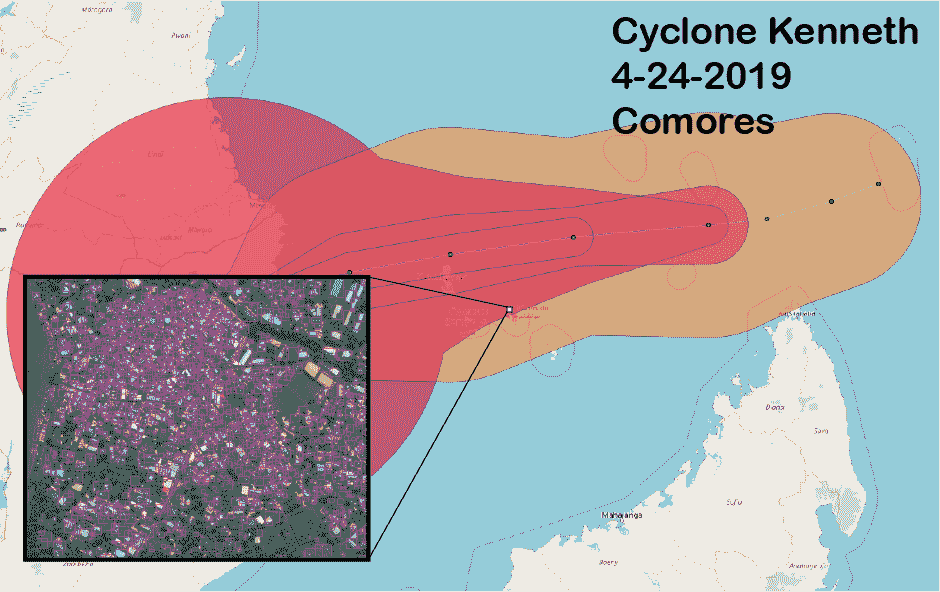
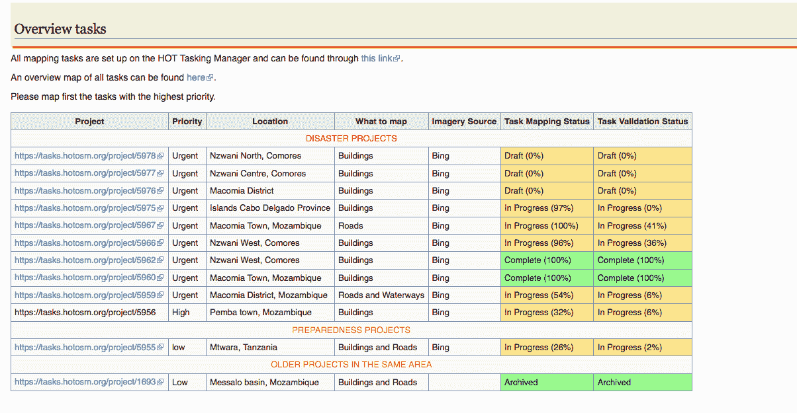

# OpenStreetMap 数据到 ML 训练标签用于目标检测

> 原文：[`www.kdnuggets.com/2019/09/openstreetmap-data-ml-training-labels-object-detection.html`](https://www.kdnuggets.com/2019/09/openstreetmap-data-ml-training-labels-object-detection.html)

comments

**作者 [Shay Strong](https://www.linkedin.com/in/shay-strong/)，EagleView 数据科学与机器学习总监**

我想创建一个无缝的教程，将 OpenStreetMap (OSM) 矢量数据转换为适用于机器学习 (ML) 模型的格式。特别是，我非常感兴趣于为灾难救援应用程序创建一个紧凑、干净的流程，其中我们可以使用像 OSM 中众包的建筑多边形来训练一个监督目标检测器，以发现未映射位置中的建筑物。

构建基础深度学习目标检测器的配方包括两个组成部分：（1）训练数据（栅格图像 + 矢量标签对）和（2）模型框架。深度学习模型本身将是一个单次检测器 (SSD) 目标检测器。我们将使用 OSM 多边形作为标签数据的基础，并使用 Digital Globe 影像作为栅格数据。我们不会在这里详细讲解 SSD，因为有很多现成的资源可供参考。我们将在 [AWS Sagemaker](https://aws.amazon.com/sagemaker/) 中运行目标检测器。当前文章仅关注训练数据生成。我会在后续文章中讨论模型训练。

我应该指出，这个教程可以在这个 [Github repo](https://github.com/shaystrong/sagely) 中找到，所以如果你想深入了解，可以跳过这篇文章。尽管这是即将到来的 [UW Geohackweek](https://geohackweek.github.io/) 的一部分正在进行中的工作。我预计将把这个教程与 [HOT-OSM](https://www.hotosm.org/) 相关任务结合使用——这些任务可能会有作为特定项目的一部分的众包矢量数据。为了建立一个演示，我们将使用一个最近的 HOT OSM 任务区域，该区域在 2019 年被气旋肯尼思影响，即科摩罗的 Nzwani。

2019 年 4 月底的气旋肯尼思路径。来自 [`wiki.openstreetmap.org/wiki/2019_Cyclone_Kenneth`](https://wiki.openstreetmap.org/wiki/2019_Cyclone_Kenneth) 的 HOT-OSM 任务数据。

OSM 矢量数据是免费的。我们所需的影像通常不是。欢迎来到 GIS 的世界。不过，[Digital Globe has Open Data](https://www.digitalglobe.com/ecosystem/open-data) 提供了许多这些自然灾害区域的影像。因此，我们可以获取这些数据用于这个应用（稍后再讲）。

我决定使用 [OSMNX](https://automating-gis-processes.github.io/2017/lessons/L7/retrieve-osm-data.html) Python 库来与 OSM 进行接口（否则可能会有些令人望而却步）。根据 HOT-OSM 任务，科摩罗的恩茨瓦尼被标记为“紧急”地点（见上表）。所以我将从那里开始，因为似乎有大量的训练数据可用。

(左) OSM 的节点与边的‘DiGraph’。(右) 恩茨瓦尼的陆地与叠加的道路和建筑物。

如果你检查建筑物的长度（返回的一个 geopandas 数据框），你会看到大量的特征。我们将这些用作我们对象检测器的训练数据。

让我们获取一些 DG 图像。为了创建一个对象检测器，我们将模仿 [VOC Pascal 训练数据格式](http://host.robots.ox.ac.uk/pascal/VOC/)，我们需要一对对图像（jpegs）和矢量（xml）标签。xml 文件有特定的格式。你可以在这个（导航困难的）[网站](http://host.robots.ox.ac.uk/pascal/VOC/)上阅读相关信息。

我更倾向于直接从 Digital Globe Open Data 网站获取数据，但遗憾的是，目前似乎没有覆盖该事件后该区域的图像。我真的想将这个位置作为重点考虑，考虑到我们发现的建筑物数量和这个任务的相关性。所以，我将单独下载必要的图像，并为此演示提供一个小的子集。你可以在 [GitHub 仓库](https://github.com/shaystrong/sagely)中找到一个示例 GeoTIFF。

让我稍微离题谈谈 [DG Open Data 网站](https://www.digitalglobe.com/ecosystem/open-data)。这个网站相当难以搜索，尽管提供了大量及时和相关的免费图像用于自然灾害影响区域，但作为个人用户，几乎不可能以地理空间的方式有效搜索。归根结底，很难确定哪个图像可能最佳地包含我感兴趣区域的大量建筑物。我的典型流程是点击网站上的一些缩略图，找到一个有显著城市化增长的区域。城市区域必须有建筑物！我在查看缩略图中的模式 20 分钟后有些放弃了（实际上是 45 分钟，因为我对模式匹配有些强迫症）。假设 DG Open Data 未来某个时刻有这张图像，随后的步骤对于你下载的任何 GeoTIFF 仍将保持一致。

如果你直接从 DG Open Data 网站获取图像，它们实际上是 Cloud Optimized GeoTIFF (COG) 格式，这样可以非常方便地创建虚拟栅格 (vrt)。这样做的好处是，我们可以创建一个轻量级的文件，该文件可以在本地 QGIS 窗口中加载，而无需下载整个 tif 文件。我们可以剪裁、子集化等，最终得到我们想要的图像，而不是多余的区域。

一旦你拥有了 GeoTIFF，我们将使用 GDAL 将其转换为 [MBtile](https://github.com/mapbox/mbtiles-spec) 格式，然后将其解包到 x/y/z slippymap (TMS) 目录结构中。MBtiles 对我们非常有利，因为它们是 256x256 的图像切片 (png)，适合用于深度学习模型训练格式。

你可能会注意到生成的图像是以嵌套文件结构保存的。我们需要将它们“扁平化”，使所有图像都位于一个目录中。你不能只是将它们复制到一个目录中，因为 .png 文件名不是唯一的。我们还会将它们从 png 转换为 jpeg。我们将它们放入一个没有实际意义的 VOC 风格文件夹中，以区分它与合法的 VOC 数据集 VOC1900。

太棒了。图像处理完成了！

接下来，我们将对建筑物进行缓冲处理，扩展到最近的矩形。这就是目标检测器所需的。

现在我们已经将建筑物表示为轴对齐的边界框，我们将使用我新的最爱工具 [Supermercado](https://github.com/mapbox/supermercado)。我们将前往“超市”以识别所有与建筑边界框重叠的 TMS 瓦片。我们将 TMS 瓦片 ID 映射到建筑边界框本身，然后将建筑边界框（以地理空间纬度/经度格式表示）转换为 slippymap 瓦片参考框架。现在，我们将拥有一个与我们在同一网格上解包的图像一致的 TMS 瓦片网格上的建筑边界框。

最后，我们要清理 xml 标签和图像，以确保去除多余的矢量标签。我们只需要一对相同的图像和注释。

现在你应该有一个干净且准备好的 VOC 风格图像和标签目录，准备进行训练。

```py
VOC1900/
        │___ Annotations/*xml
        |___ JPEGImages/*jpeg
```

接下来将是实际的训练过程。敬请关注。

**个人简介： [Shay Strong](https://www.linkedin.com/in/shay-strong/)** 是 EagleView 的数据科学与机器学习总监，对地理空间机器学习和遥感感兴趣。

原始内容。经许可转载。

**相关内容：**

+   2019 年目标检测指南

+   使用 Tensorflow 目标检测和 OpenCV 分析足球比赛

+   在航空图像中使用 RetinaNet 进行行人检测

* * *

## 我们的前 3 名课程推荐

 1\. [Google 网络安全证书](https://www.kdnuggets.com/google-cybersecurity) - 快速通道进入网络安全职业。

 2\. [Google 数据分析专业证书](https://www.kdnuggets.com/google-data-analytics) - 提升你的数据分析能力

 3\. [Google IT 支持专业证书](https://www.kdnuggets.com/google-itsupport) - 支持你所在组织的 IT

* * *

### 更多相关主题

+   [处理文本数据中的噪声标签](https://www.kdnuggets.com/2023/04/dealing-noisy-labels-text-data.html)

+   [KDnuggets™ 新闻 22:n09，3 月 2 日：讲述一个伟大的数据故事：A…](https://www.kdnuggets.com/2022/n09.html)

+   [SQL 与对象关系映射（ORM）的区别是什么？](https://www.kdnuggets.com/2022/02/difference-sql-object-relational-mapping-orm.html)

+   [数据科学中异常检测技术的初学者指南](https://www.kdnuggets.com/2023/05/beginner-guide-anomaly-detection-techniques-data-science.html)

+   [KDnuggets 新闻，8 月 17 日：如何执行运动检测…](https://www.kdnuggets.com/2022/n33.html)

+   [功能数据中的密度核深度用于异常值检测](https://www.kdnuggets.com/density-kernel-depth-for-outlier-detection-in-functional-data)
