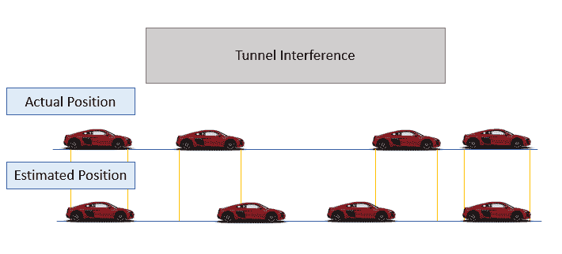
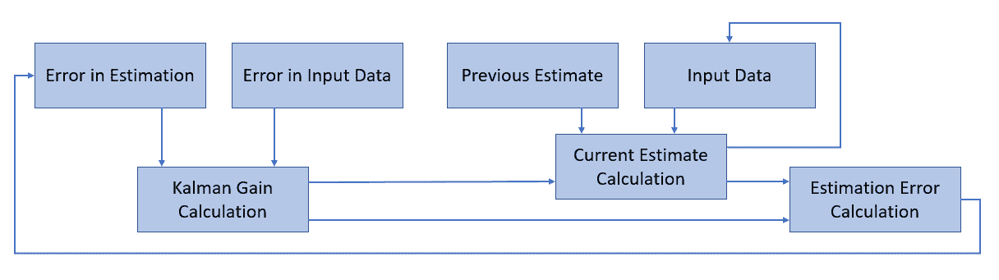
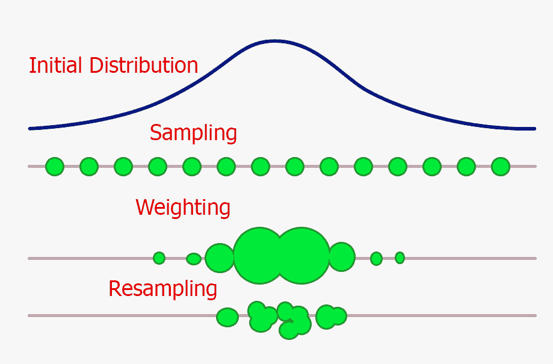

# 最优估计算法：卡尔曼滤波器和粒子滤波器

> 原文：[`www.kdnuggets.com/2020/02/optimal-estimation-algorithms-kalman-particle-filters.html`](https://www.kdnuggets.com/2020/02/optimal-estimation-algorithms-kalman-particle-filters.html)

评论

照片由[Daniel Jerez](https://unsplash.com/@danieljerez?utm_source=medium&utm_medium=referral)拍摄，来源于[Unsplash](https://unsplash.com/?utm_source=medium&utm_medium=referral)

### 最优估计算法

* * *

## 我们的前三个课程推荐

 1\. [Google 网络安全证书](https://www.kdnuggets.com/google-cybersecurity) - 快速进入网络安全职业生涯。

 2\. [Google 数据分析专业证书](https://www.kdnuggets.com/google-data-analytics) - 提升你的数据分析技能

 3\. [Google IT 支持专业证书](https://www.kdnuggets.com/google-itsupport) - 支持你的组织的 IT 需求

* * *

最优估计算法在我们日常生活中扮演着非常重要的角色。今天，我将通过一些实际的例子向你介绍两种算法（卡尔曼滤波器和粒子滤波器）。

让我们设想一下我们正在驾驶一辆无人驾驶汽车，我们即将进入一个长隧道。在这个例子中，我们的汽车利用不同的传感器，如 GPS 估计、加速度计和摄像头，以便跟踪它在地图上的位置以及与其他车辆或行人的互动。然而，当在隧道中旅行时（特别是非常长的隧道），我们的 GPS 信号因干扰而变弱。因此，我们的汽车可能更难以估计其位置。我们可以做些什么来解决这个问题呢？

一个简单的解决方案是将我们的加速度计传感器数据与弱 GPS 信号结合使用。事实上，通过对加速度进行双重积分，我们可以计算出汽车的位置。然而，这种简单的测量会包含一些漂移，因此不完全准确，因为我们的测量误差会随时间传播（见图 1）。为了解决这个问题，我们可以使用卡尔曼滤波器或粒子滤波器。

图 1：自主汽车在时间上的位置估计

### 卡尔曼滤波器

卡尔曼滤波器在机器人技术（例如[SLAM 系统](https://ieeexplore.ieee.org/document/8321612)）和强化学习中有广泛应用。卡尔曼滤波器可以用于机器人技术中以追踪环境中一群机器人的运动，也可以在强化学习中用于追踪不同的软件代理。

> 卡尔曼滤波器是一个迭代的数学过程，使用一组方程和连续的数据输入，以估计物体的真实位置、速度等，当测量值包含不确定性或误差时。[1]

因此，卡尔曼滤波器可以简单地与机器学习模型进行比较。它们接受一些输入数据，执行一些计算以进行估计，计算其估计误差，并迭代地重复这一过程，以减少最终损失。卡尔曼滤波器执行的迭代过程可以总结为三个主要步骤：

1.  **卡尔曼增益计算**：通过使用输入数据和估计中的误差来计算。

1.  **当前估计计算**：通过使用原始输入数据、我们的前一估计和卡尔曼增益来计算。

1.  **估计误差计算**：最终通过使用卡尔曼增益和我们的当前估计来计算。

这一过程在图 2 中简要总结。

图 2：卡尔曼滤波器工作流程（改编自[1]）

存在不同种类的卡尔曼滤波器，示例包括：线性卡尔曼滤波器、扩展卡尔曼滤波器和无迹卡尔曼滤波器。如果你对卡尔曼滤波器的详细数学解释感兴趣，[这个](http://web.mit.edu/kirtley/kirtley/binlustuff/literature/control/Kalman%20filter.pdf)由 MIT 的 Tony Lacey 提供的教程是一个很好的起点[2]。

卡尔曼滤波器的主要问题之一是它们只能用于建模可以用高斯噪声描述的情况。然而，许多非高斯过程可以用高斯术语进行近似，或者通过某种变换（例如对数变换、平方根变换等）转换为高斯分布。

为了克服这种限制，可以使用一种替代方法：粒子滤波器。

### 粒子滤波器

粒子滤波器可以用于解决非高斯噪声问题，但通常比卡尔曼滤波器计算上更为昂贵。这是因为粒子滤波器使用模拟方法而不是解析方程来解决估计任务。

粒子滤波器通常用于：

+   金融市场分析（尤其是[随机过程分析](https://towardsdatascience.com/stochastic-processes-analysis-f0a116999e4)）

+   强化学习

+   机器人定位（例如直接全局策略搜索）

粒子滤波器基于[蒙特卡罗方法](https://en.wikipedia.org/wiki/Monte_Carlo_method)，通过将原始数据离散化为粒子（每个粒子代表不同的状态）来处理非高斯问题。粒子数量越多，我们的粒子滤波器能够处理的分布类型就越广泛。

像卡尔曼滤波器一样，粒子滤波器也利用迭代过程来生成其估计。每次迭代可以分解为三个主要步骤 [3]：

1.  从原始分布中提取多个样本（***粒子***）。

1.  按重要性对所有采样粒子进行加权（粒子落在特定区间的数量越多，其概率密度越高）。

1.  通过用更可能的粒子替换更不可能的粒子来进行重采样（类似于进化算法，只有最适合的元素才能存活）。

该过程总结在图 3 中。从下图可以看到，在这个例子中，我们的粒子滤波器在一次迭代后能够了解我们的对象更可能处于哪个范围。通过反复进行这一过程，我们的滤波器将能够进一步缩小其分散范围。

图 3：单粒子滤波器迭代

如果你有兴趣在 Python 中实现最优估计算法，[FilterPy](https://filterpy.readthedocs.io/en/latest/) 或 [Pyro](http://docs.pyro.ai/en/stable/) 库是两个很好的解决方案。特别是，Pyro 是 Uber 开发的通用概率编程语言，可用于各种贝叶斯分析，使用 PyTorch 作为后端。

*希望你喜欢这篇文章，谢谢阅读！*

### 联系方式

如果你想获取我最新的文章和项目，请[关注我在 Medium](https://medium.com/@pierpaoloippolito28?source=post_page---------------------------)并订阅我的[邮件列表](http://eepurl.com/gwO-Dr?source=post_page---------------------------)。以下是我的一些联系信息：

+   [Linkedin](https://uk.linkedin.com/in/pier-paolo-ippolito-202917146?source=post_page---------------------------)

+   [个人博客](https://pierpaolo28.github.io/blog/?source=post_page---------------------------)

+   [个人网站](https://pierpaolo28.github.io/?source=post_page---------------------------)

+   [Medium 个人资料](https://towardsdatascience.com/@pierpaoloippolito28?source=post_page---------------------------)

+   [GitHub](https://github.com/pierpaolo28?source=post_page---------------------------)

+   [Kaggle](https://www.kaggle.com/pierpaolo28?source=post_page---------------------------)

### 参考书目

[1] 特殊主题 — 卡尔曼滤波器 (2 of 55) 简单示例的流程图 (单一测量值)，Michel van Biezen。访问链接：[`www.youtube.com/watch?v=CaCcOwJPytQ`](https://www.youtube.com/watch?v=CaCcOwJPytQ)

[2] 第十一章：教程：卡尔曼滤波器，Tony Lacey。访问链接：[`web.mit.edu/kirtley/kirtley/binlustuff/literature/control/Kalman%20filter.pdf`](http://web.mit.edu/kirtley/kirtley/binlustuff/literature/control/Kalman%20filter.pdf)

[3] 粒子滤波器和蒙特卡罗定位简介，Cyrill Stachniss。访问链接：[`ais.informatik.uni-freiburg.de/teaching/ws12/mapping/pdf/slam09-particle-filter-4.pdf`](http://ais.informatik.uni-freiburg.de/teaching/ws12/mapping/pdf/slam09-particle-filter-4.pdf)

**个人简介：[Pier Paolo Ippolito](https://www.linkedin.com/in/pierpaolo28/)** 是数据科学家和南安普顿大学人工智能硕士毕业生。他对人工智能进展和机器学习应用（如金融和医学）有浓厚兴趣。通过 [Linkedin](https://www.linkedin.com/in/pierpaolo28/) 与他联系。

[原文](https://towardsdatascience.com/optimal-estimation-algorithms-kalman-and-particle-filters-be62dcb5e83)。经许可转载。

**相关：**

+   物联网的数据科学：传感器融合与卡尔曼滤波器，第一部分

+   如何优化你的 Jupyter Notebook

+   GPU 加速的数据分析与机器学习

### 更多相关内容

+   [卡尔曼滤波器简介](https://www.kdnuggets.com/2022/12/brief-introduction-kalman-filters.html)

+   [广义和可扩展的最优稀疏决策树(GOSDT)](https://www.kdnuggets.com/2023/02/generalized-scalable-optimal-sparse-decision-treesgosdt.html)

+   [用 Pandas fillna() 填充缺失数据的最佳方式](https://www.kdnuggets.com/2023/02/optimal-way-input-missing-data-pandas-fillna.html)

+   [强化学习：教计算机做出最优决策](https://www.kdnuggets.com/2023/07/reinforcement-learning-teaching-computers-make-optimal-decisions.html)

+   [通过基础和现代方法解决计算机科学问题…](https://www.kdnuggets.com/2023/11/packt-tackle-computer-science-problems-fundamental-modern-algorithms-machine-learning)

+   [机器学习算法 - 什么、为什么以及如何？](https://www.kdnuggets.com/2022/09/machine-learning-algorithms.html)
