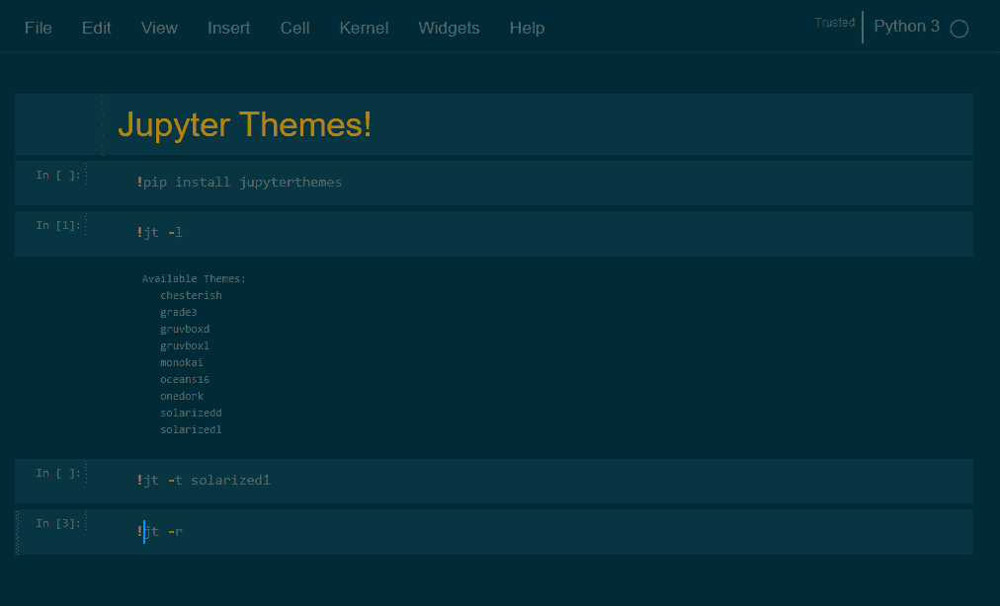
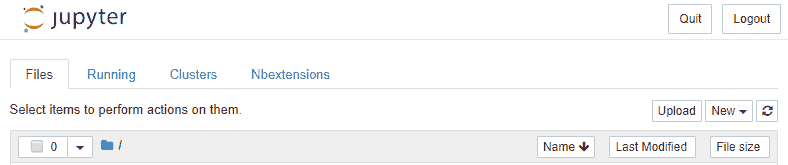
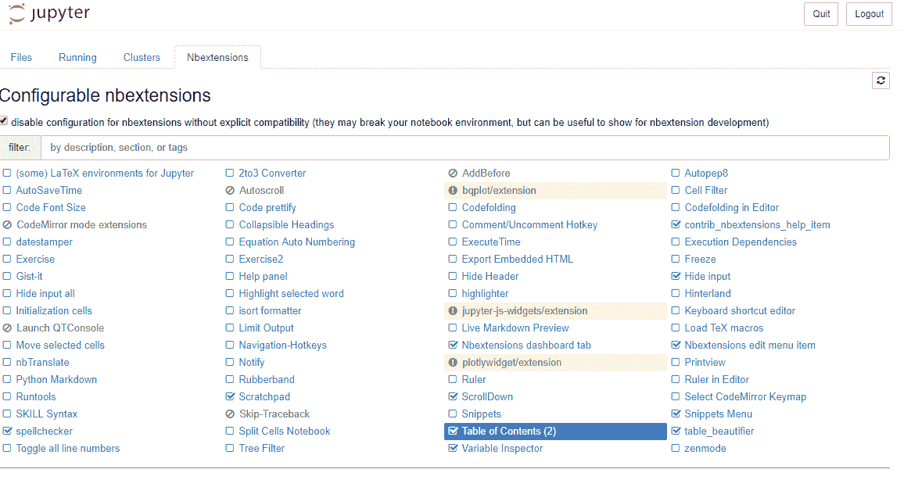
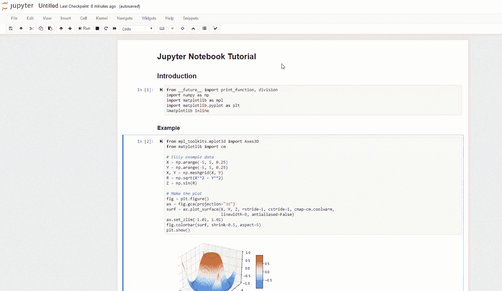
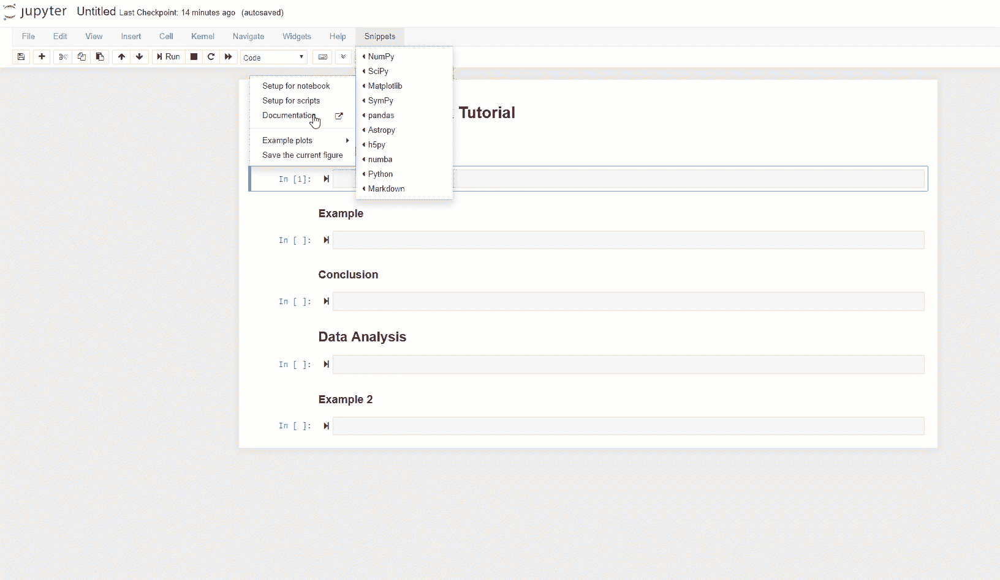
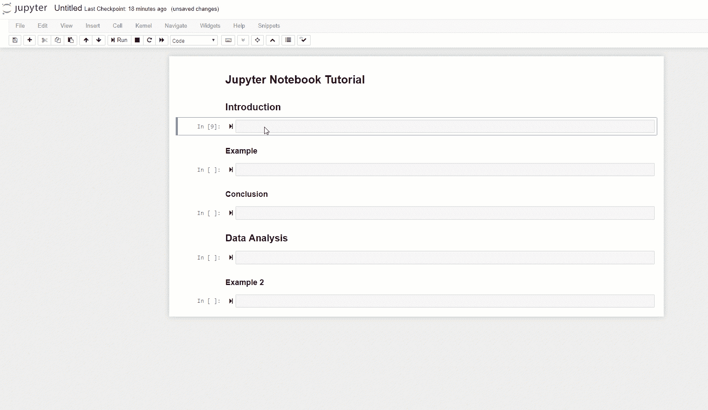
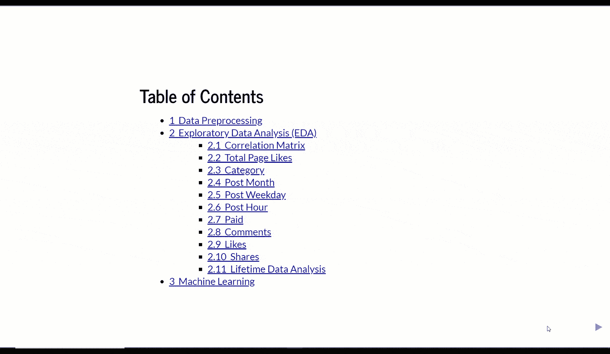

# 如何优化你的 Jupyter Notebook

> 原文：[`www.kdnuggets.com/2020/01/optimize-jupyter-notebook.html`](https://www.kdnuggets.com/2020/01/optimize-jupyter-notebook.html)

评论

**由 [Pier Paolo Ippolito](https://www.linkedin.com/in/pierpaolo28/) 提供，南安普顿大学**


（来源: [`gdcoder.com/how-to-create-and-add-a-conda-environment-as-jupyter-kernel/`](https://gdcoder.com/how-to-create-and-add-a-conda-environment-as-jupyter-kernel/))

* * *

## 我们的前三大课程推荐

 1\. [Google 网络安全证书](https://www.kdnuggets.com/google-cybersecurity) - 快速进入网络安全职业生涯。

 2\. [Google 数据分析专业证书](https://www.kdnuggets.com/google-data-analytics) - 提升你的数据分析技能

 3\. [Google IT 支持专业证书](https://www.kdnuggets.com/google-itsupport) - 支持你的组织进行 IT 工作

* * *

### 介绍

Jupyter Notebook 现在可能是解决 Python 中机器学习/数据科学任务最常用的环境。

Jupyter Notebook 是一种客户端-服务器应用程序，用于在浏览器中运行 notebook 文档。Notebook 文档是能够包含代码和丰富文本元素（如段落、方程式等）的文档。

在这篇文章中，我将向你展示一些简单的技巧，帮助你提升 Jupyter Notebook 的使用体验。我们将从有用的快捷键开始，最后加入主题、自动生成的目录等内容。

### 快捷键

快捷键可以显著加快编写代码的速度。现在，我将向你介绍一些我发现的在 Jupyter 中最有用的快捷键。

与 Jupyter Notebook 互动的方式有两种：命令模式和编辑模式。一些快捷键只在一种模式下有效，而其他快捷键在两种模式下都适用。

一些在两种模式中都适用的快捷键包括：

+   **Ctrl + Enter**: 运行所有选定的单元格

+   **Shift + Enter**: 运行当前单元格并移动到下一个单元格

+   **Ctrl + s**: 保存 notebook

为了进入 Jupyter 命令模式，我们需要按 Esc 然后执行以下任一命令：

+   **H**: 显示 Jupyter Notebook 中所有可用的快捷键

+   **Shift + 上/下箭头**: 同时选择多个 notebook 单元格（选择多个单元格后按回车将使所有单元格运行！）

+   **A**: 在上方插入一个新单元格

+   **B**: 在下方插入一个新单元格

+   **X**: 剪切选定的单元格

+   **Z**: 撤销单元格的删除

+   **Y**: 将单元格类型更改为代码

+   **M**: 将单元格类型更改为 Markdown

+   **Space**: 向下滚动 notebook

+   **Shift + 空格**: 向上滚动 notebook

为了进入 Jupyter 编辑模式，我们需要按 Enter，然后依次执行以下任一命令：

+   **Tab**：代码竞赛建议

+   **Ctrl + ]**：增加代码缩进

+   **Ctrl + **：减少代码缩进

+   **Ctrl + z**：撤销

+   **Ctrl + y**：重做

+   **Ctrl + a**：全选

+   **Ctrl + Home**：将光标移动到单元格开头

+   **Ctrl + End**：将光标移动到单元格的末尾

+   **Ctrl + Left**：将光标向左移动一个单词

+   **Ctrl + Right**：将光标向右移动一个单词

### Shell 命令和包安装

很少有用户知道这一点，但实际上可以通过在单元格开头添加感叹号来在 Jupyter notebook 单元格中运行 shell 命令。例如，运行一个包含 **!ls** 的单元格将返回当前工作目录中的所有项目。运行一个包含 **!pwd** 的单元格则会打印出当前目录的文件路径。

相同的技巧也可以用于在 Jupyter notebook 中安装 Python 包。

```py
!pip install numpy
```

### Jupyter 主题

如果你对改变 Jupyter notebook 的外观感兴趣，可以安装一个包含不同主题的包。默认的 Jupyter 主题如图 1 所示。在图 2 中你将看到我们如何能够个性化它的外观。

![图图 1：默认 Jupyter Notebook 主题我们可以直接在 notebook 中使用我在上一节中展示的技巧来安装我们的包：```py!pip install jupyterthemes```我们可以运行以下命令来列出所有可用主题的名称：```py!jt -l# Cell output:# Available Themes: #   chesterish#   grade3#   gruvboxd#   gruvboxl#   monokai#   oceans16#   onedork#   solarizedd#   solarizedl```最后，我们可以使用以下命令选择一个主题（在这个例子中我决定使用 solarized1 主题）：```py!jt -t solarizedl```一旦我们运行了这个命令并刷新了页面，我们的 notebook 应该会像图 2 中的那样。

图 2：Solarized1 notebook 主题

如果你想随时恢复到原始的 Jupyter notebook 主题，只需运行以下命令并刷新页面即可。

```py
!jt -r
```

### Jupyter Notebook 扩展

Notebook 扩展可以用来增强用户体验，并提供各种个性化技巧。

在这个例子中，我将使用 *nbextensions* 库来安装所有必要的控件（这次我建议你先通过终端安装包，然后再打开 Jupyter notebook）。这个库利用不同的 Javascript 模型来丰富 notebook 的前端。

```py
! pip install jupyter_contrib_nbextensions
! jupyter contrib nbextension install --system
```

一旦 *nbextensions* 被安装，你会注意到在 Jupyter notebook 主页上多了一个额外的标签（图 3）。



图 3：将 *nbextensions* 添加到 Jupyter notebook

通过点击 Nbextensions 标签，我们将看到可用的控件列表。在我的案例中，我决定启用图 4 中显示的控件。



图 4：*nbextensions 控件选项*

我的一些最喜欢的扩展是：

**1. 目录**

自动从 markdown 标题生成目录（图 5）。



图 5：目录

**2\. 代码片段**

加载常用库和创建样本图的代码示例，你可以将其作为数据分析的起点（图 6）。



图 6：代码片段

**3\. Hinterland**

Jupyter 笔记本的代码自动补全（图 7）。



图 7：代码自动补全

*nbextensions* 库提供了许多其他扩展，因此我鼓励你尝试和测试其他对你可能感兴趣的扩展！

### Markdown 选项

默认情况下，Jupyter 笔记本单元格中的最后输出是唯一打印的内容。如果我们想要自动打印所有命令而不使用 *print()*，可以在笔记本开始时添加以下代码行。

```py
from IPython.core.interactiveshell import InteractiveShell
InteractiveShell.ast_node_interactivity = "all"
```

此外，可以通过将文本包围在美元符号（$）之间来在 Markdown 单元格中编写 LaTex。

### 笔记本幻灯片

通过进入 **视图 -> 单元格工具栏 -> 幻灯片** 并选择笔记本中每个单元格的幻灯片配置，可以创建 Jupyter 笔记本的幻灯片演示。

最后，通过进入终端并输入以下命令，将创建幻灯片放映。

```py
pip install jupyter_contrib_nbextensions

# and successively:

jupyter nbconvert my_notebook_name.ipynb --to slides --post serve
```



### 魔法命令

魔法命令是可以用来执行特定操作的指令。举例来说：内联绘图、打印单元格的执行时间、打印运行单元格的内存消耗等。

以单个 *%* 开头的魔法命令只应用于单元格中的一行（命令所在的行）。而以两个 *%%* 开头的魔法命令则应用于整个单元格。

可以使用以下命令打印出所有可用的魔法命令：

```py
%lsmagic
```

### 联系信息

如果你想保持对我最新文章和项目的更新， [关注我](https://medium.com/@pierpaoloippolito28?source=post_page---------------------------) 并订阅我的 [邮件列表](http://eepurl.com/gwO-Dr?source=post_page---------------------------)。以下是我的一些联系方式：

+   [Linkedin](https://uk.linkedin.com/in/pier-paolo-ippolito-202917146?source=post_page---------------------------)

+   [个人博客](https://pierpaolo28.github.io/blog/?source=post_page---------------------------)

+   [个人网站](https://pierpaolo28.github.io/?source=post_page---------------------------)

+   [Medium 个人资料](https://towardsdatascience.com/@pierpaoloippolito28?source=post_page---------------------------)

+   [GitHub](https://github.com/pierpaolo28?source=post_page---------------------------)

+   [Kaggle](https://www.kaggle.com/pierpaolo28?source=post_page---------------------------)

**简介：[Pier Paolo Ippolito](https://www.linkedin.com/in/pierpaolo28/)** 是南安普顿大学人工智能硕士课程的最后一年学生。他是一名 AI 爱好者、数据科学家和 RPA 开发者。

[原文](https://www.freecodecamp.org/news/optimize-your-jupyter-notebook/)。经授权转载。

**相关内容：**

+   笔记本反模式

+   GPU 加速的数据分析与机器学习

+   利用机器学习理解癌症

### 了解更多此主题

+   [成为优秀数据科学家需要掌握的 5 项关键技能](https://www.kdnuggets.com/2021/12/5-key-skills-needed-become-great-data-scientist.html)

+   [每个初学者数据科学家都应掌握的 6 种预测模型](https://www.kdnuggets.com/2021/12/6-predictive-models-every-beginner-data-scientist-master.html)

+   [2021 年最佳 ETL 工具](https://www.kdnuggets.com/2021/12/mozart-best-etl-tools-2021.html)

+   [如何在 Jupyter Notebook 中设置 Julia](https://www.kdnuggets.com/2022/11/setup-julia-jupyter-notebook.html)

+   [数据科学家必知的 10 个 Jupyter Notebook 小贴士](https://www.kdnuggets.com/2023/06/10-jupyter-notebook-tips-tricks-data-scientists.html)

+   [金融中的 Python：在 Jupyter Notebook 中进行实时数据流处理](https://www.kdnuggets.com/python-in-finance-real-time-data-streaming-within-jupyter-notebook)
