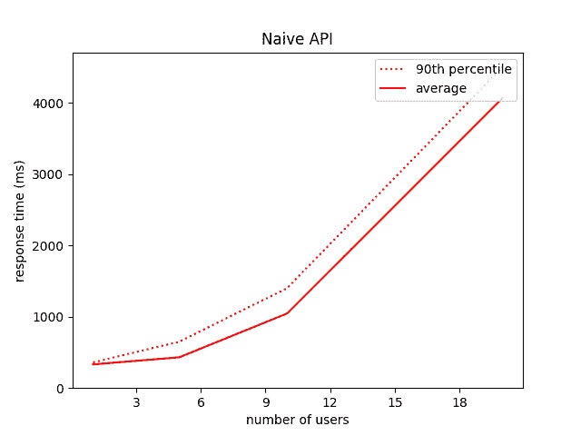
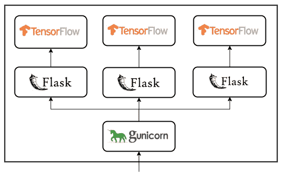
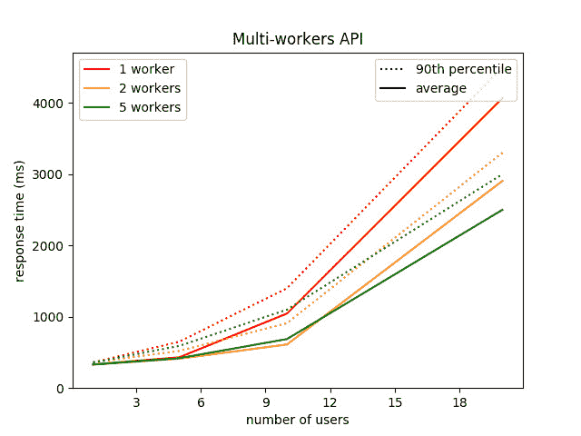
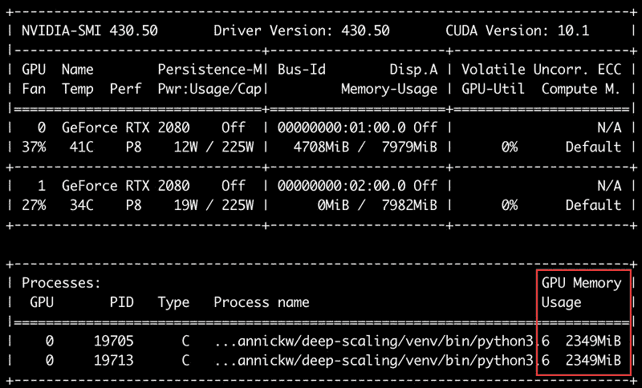
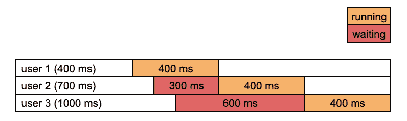
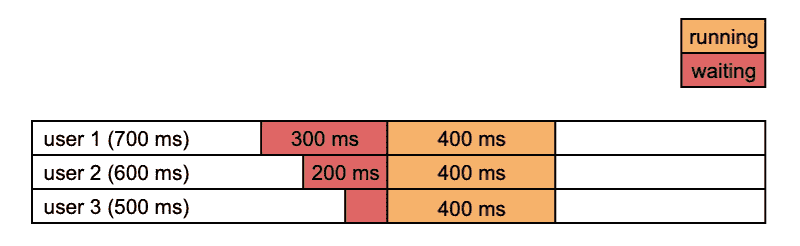
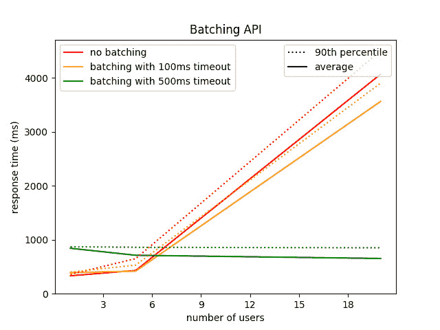
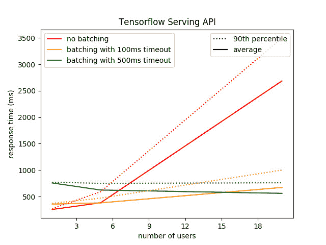

# 优化生产环境中机器学习 API 的响应时间

> 原文：[`www.kdnuggets.com/2020/05/optimize-response-time-machine-learning-api-production.html`](https://www.kdnuggets.com/2020/05/optimize-response-time-machine-learning-api-production.html)

评论

**由 [Yannick Wolf](https://www.linkedin.com/in/yannick-wolff-457616124/)，Sicara 领先数据科学家**

本文展示了如何通过构建更智能的 API 服务深度学习模型来最小化响应时间。

* * *

## 我们的前三大课程推荐

 1\. [Google 网络安全证书](https://www.kdnuggets.com/google-cybersecurity) - 快速进入网络安全职业道路。

 2\. [Google 数据分析专业证书](https://www.kdnuggets.com/google-data-analytics) - 提升你的数据分析技能

 3\. [Google IT 支持专业证书](https://www.kdnuggets.com/google-itsupport) - 支持你的组织的 IT

* * *

<picture></picture>

你的团队努力为特定任务（比如：通过计算机视觉检测商店中的购买产品）构建了一个深度学习模型。很好。

然后你开发并部署了一个集成此模型的 API（让我们继续这个例子：自助结账机会调用这个 API）。太棒了！

新产品运行良好，你感觉所有工作都已完成。

但由于经理决定安装更多自助结账机（我真的很喜欢这个例子），用户开始抱怨每次扫描商品时都会出现巨大的延迟。

你可以做什么？购买速度快十倍且昂贵十倍的 GPU？让数据科学家尝试在不降低准确性的情况下减少模型的深度？

更便宜、更简单的解决方案存在，如本文所示。

### 一个基础的 API 和一个大型虚拟模型

首先，我们需要一个具有长推理时间的模型。以下是我如何使用 [TensorFlow 2](https://www.tensorflow.org/)'s Keras API 来实现这一点（如果你不熟悉这个深度学习框架，可以跳过这段代码）：

在我的 [GeForce RTX 2080](https://www.nvidia.com/fr-fr/geforce/graphics-cards/rtx-2080/) GPU 上测试模型时，我测得推理时间为 303 毫秒。这就是我们可以称之为大模型的情况。

现在，我们需要一个非常简单的 API 来服务我们的模型，仅一个路由来请求预测。Python 中一个非常标准的 API 框架是 [Flask](https://www.palletsprojects.com/p/flask/)。这是我选择的框架，还有一个叫做 [Gunicorn](https://gunicorn.org/) 的 [WSGI HTTP 服务器](https://www.fullstackpython.com/wsgi-servers.html)。

我们独特的路径解析请求中的输入，调用实例化的模型，并将输出发送回用户。

我们可以使用以下命令运行我们的深度学习 API：

```py
gunicorn wsgi:app
```

好的，现在我可以向我的 API 发送一些随机数字，它会用其他随机数字回应我。问题是：有多快？

### 让我们对我们的 API 进行负载测试

我们确实想了解我们的 API 响应有多快，特别是当每秒请求数量增加时。这样的负载测试可以使用 [Locust](https://locust.io/) Python 库进行。

这个库与一个 locustfile.py 一起工作，指示要模拟的行为：

Locust 模拟多个用户同时执行不同的任务。在我们的案例中，我们只想定义一个任务，即使用随机输入调用 /predict 路由。

我们还可以参数化`wait_time`，这是一个模拟用户在接收到 API 响应后等待的时间，然后再发送下一个请求。为了模拟自助结账的用例，我将这个时间设置为 1 到 3 秒之间的随机值。

用户数量通过 Locust 的仪表盘选择，所有统计数据都会实时显示。可以通过调用以下命令来运行此仪表盘：

```py
locust --host=[`localhost:8000`](http://localhost:8000/) # host of the API you want to load test
```

Locust 仪表盘

那么，当我们增加用户数量时，我们天真的 API 会有什么反应呢？正如我们所预期的，反应非常糟糕：

+   使用 1 个用户时，我测量的平均响应时间是 332 ms（略高于之前测量的孤立推理时间，没什么惊讶的）

+   使用 5 个用户时，这个平均时间稍微增加了一点：431 ms

+   使用 20 个用户时，它达到了 4.1 秒（比 1 个用户时多了 12 倍以上）

<picture></picture>

当我们考虑到 API 是如何处理请求的，这些结果并不那么令人惊讶。默认情况下，Gunicorn 启动 2 个进程：一个主进程监听传入的请求，将它们存储在一个 [FIFO](https://en.wikipedia.org/wiki/FIFO_and_LIFO_accounting#FIFO) 队列中，并将它们依次发送到一个工作进程，每次工作进程可用时。后者会运行您的代码来计算每个请求的响应。

由于工作进程是单线程的，请求是逐一处理的。如果 5 个请求同时到达，第 5 个请求将在 5 x 300 ms = 1500 ms 后收到响应，这解释了 20 个用户时高的平均响应时间。

### 越多越快

幸运的是，Gunicorn 提供了两种通过增加以下内容来扩展 API 的方法：

+   处理请求的线程数量

+   工作进程的数量

多线程选项可能不是对我们帮助最大的一种，因为 TensorFlow 不允许一个线程访问在另一个线程中初始化的会话图。

另一方面，设置大于 1 的工作进程数量将创建多个进程，每个工作进程都初始化整个 Flask 应用程序。每个进程都会实例化自己的 TensorFlow 会话和模型。

<picture></picture>

让我们通过运行以下命令来尝试这种方法：

```py
gunicorn wsgi:app --workers=5
```

这是我们在多工人 API 中获得的新性能：

<picture></picture>

你可以看到，使用 5 个工人而不是 1 个工人对响应时间的影响是巨大的：20 个用户的 4.1 秒平均时间几乎减少了一半。减少了两倍，而不是预期的五倍，因为请求之间的等待时间——如果模拟用户在收到响应后立即重新请求 API，响应时间将减少五倍。

你可能会想知道为什么我止步于 5 个工人：为什么不设置 20 个工人，以便能够处理 20 个用户在同一时间请求 API 的情况？原因是每个工人是一个独立的进程，在 GPU 内存中实例化其自己的模型版本。

因此，20 名工人仅仅在初始化权重时就会消耗 20 倍模型的大小，推理计算则需要更多的内存。对于一个 2GiB 的模型和一个 8GiB 的 GPU 来说，我们的资源有些有限。



每个工人消耗 2349MiB 的 GPU 内存

通过调整分配给每个工人的内存，可以最大化运行工人的数量，使用 TensorFlow 参数（TensorFlow 1.x 中的 per_process_gpu_memory_fraction 和 TensorFlow 2.x 中的 memory_limit——我只测试过第一个），将其设置为不会因内存不足错误而导致预测失败的最小值。

正如库所警告的那样，减少可用内存可能会通过禁用优化理论上增加推理时间。然而，我个人并没有注意到任何显著变化。

无论如何，这样做并不能让我们运行 20 个工人，即使使用我们的 2 个 GPU。那么，买 2 个更多的 GPU？别慌，你还有其他的解决方案。

### 欲速则不达

现在让我们回到单工人的情况。如果你考虑到当两个或更多请求几乎同时到达此 API 时发生的情况，会发现有一些优化不到位的地方：



3 个请求间隔 100 毫秒到达，平均响应时间为 1433 毫秒

API 将 3 个输入逐个通过模型。然而，由于深度学习模型的数学运算特性，大多数模型可以同时处理多个输入而不会增加推理时间——这就是我们所说的批处理，也就是我们在训练阶段通常做的。

那么，为什么不将这 3 个输入批量处理呢？这将意味着在接收到第一个请求后，API 会稍等片刻，以接收接下来的 2 个请求，然后一次性处理所有请求。这会增加第一个请求的响应时间，但在平均上会减少。



如果 API 在处理批量请求之前等待 300 毫秒，我们得到的平均响应时间是 600 毫秒

在实践中，我们不知道未来请求何时到达，而且决定等待潜在下一个请求的时间有点复杂。一条相当合理的规则是触发处理排队请求的时间是：

+   如果排队请求的数量达到最大值，通常对应于 GPU 内存限制或最大用户数（如果已知）

或者

+   如果队列中最旧的请求比超时时间值还要久。这一值需要通过经验调优以最小化平均响应时间。

这里有一种实现这种行为的方法，仍然使用 Gunicorn - Flask - TensorFlow 堆栈，使用 Python 队列和专门处理批量请求的线程。

这个新 API 必须以与我们希望能够处理的批处理请求最大数量相同的线程数运行：

```py
gunicorn wsgi:app --threads=20
```

以下是我在对超时时间值进行快速微调后的非常满意的结果：

<picture></picture>

如你所见，当仅模拟 1 个用户时，这个新 API 设置的超时时间为 500 毫秒，会使响应时间增加 500 毫秒（超时时间值），当然是无用的。但对于 20 个用户，平均响应时间减少了 6 倍。

注意，为了获得更好的结果，这种批处理技术可以与上述的多工人技术并行使用。

### 难道我们没有重新发明轮子吗？

作为开发人员，从头开始编写一些可能已经由现有工具实现的东西是一种隐秘的快乐，这也是我们在这篇文章中一直做的事情。

确实存在一个用于在 API 中服务 TensorFlow 模型的工具。它由 TensorFlow 开发，名为... [TensorFlow Serving](https://www.tensorflow.org/tfx/guide/serving)。

它不仅允许为模型启动一个预测 API，而无需编写模型以外的任何其他代码，而且还提供了几种你可能会觉得有趣的优化，例如并行处理和请求批处理！

要使用 TF Serving 服务一个模型，你需要做的第一件事是将其导出到磁盘（使用 TensorFlow 格式，而不是 Keras 格式），可以使用以下代码实现：

然后，启动一个服务 API 的最简单方法之一是使用 TF Serving [docker 镜像](https://www.tensorflow.org/tfx/serving/docker)。

下面的命令将启动一个预测 API，你可以通过请求此端点来测试：[`localhost:8501/v1/models/my_model:predict`](http://localhost:8501/v1/models/my_model:predict)

```py
docker run -p 8501:8501 \
--mount type=bind,source=/path/to/my_model/,target=/models/my_model \
-e MODEL_NAME=my_model -it tensorflow/serving
```

注意，它默认不使用 GPU。你可以在 [此文档](https://www.tensorflow.org/tfx/serving/docker#serving_with_docker_using_your_gpu) 中找到如何使其工作。

关于批处理呢？你需要编写这样的批处理配置文件：

```py
max_batch_size { value: 20 }
batch_timeout_micros { value: 500000 }
max_enqueued_batches { value: 100 }
num_batch_threads { value: 8 }
```

特别包括了我们自定义实现中使用的 2 个参数：max_batch_size 和 batch_timeout_micros 参数。后者是我们称之为超时的参数，必须以微秒为单位给出。

最后，运行启用了批处理的 TF Serving 的命令是：

```py
docker run -p 8501:8501 \
--mount type=bind,source=/path/to/my_model/,target=/models/my_model \
--mount type=bind,source=/path/to/batching.cfg,target=/batching.cfg \
-e MODEL_NAME=my_model -it tensorflow/serving \
--enable_batching --batching_parameters_file=/batching.cfg
```

我进行了测试，感谢一些黑魔法，我得到了比自定义批处理 API 更好的结果：

<picture></picture>

我希望你能利用本文中提出的不同技巧来提升你自己的机器学习 API。我没有探索的很多领域，尤其是模型本身的优化（而不是 API），如[模型剪枝](https://towardsdatascience.com/pruning-deep-neural-network-56cae1ec5505)或[后训练量化](https://www.tensorflow.org/model_optimization/guide/quantization)。

**简历：[Yannick Wolf](https://www.linkedin.com/in/yannick-wolff-457616124/)** 是 Sicara 的首席数据科学家。

[原文](https://www.sicara.ai/blog/optimize-response-time-api)。经许可转载。

**相关：**

+   机器学习部署的软件接口

+   TensorFlow 2.0 教程：优化训练时间性能

+   如何在 3 个简单步骤中对任何 Python 脚本进行超参数调优

### 更多相关主题

+   [优化和管理机器学习生命周期的十大 MLOps 工具](https://www.kdnuggets.com/2022/10/top-10-mlops-tools-optimize-manage-machine-learning-lifecycle.html)

+   [将机器学习模型部署到云中的生产环境](https://www.kdnuggets.com/deploying-your-ml-model-to-production-in-the-cloud)

+   [如何优化 SQL 查询以加快数据检索速度](https://www.kdnuggets.com/2023/06/optimize-sql-queries-faster-data-retrieval.html)

+   [如何优化 Dockerfile 指令以加快构建时间](https://www.kdnuggets.com/how-to-optimize-dockerfile-instructions-for-faster-build-times)

+   [将机器学习算法完整端到端地部署到……](https://www.kdnuggets.com/2021/12/deployment-machine-learning-algorithm-live-production-environment.html)

+   [将机器学习从概念验证到生产化的操作化](https://www.kdnuggets.com/2022/05/operationalizing-machine-learning-poc-production.html)
