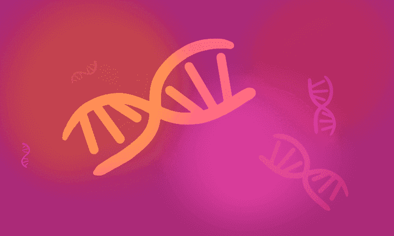
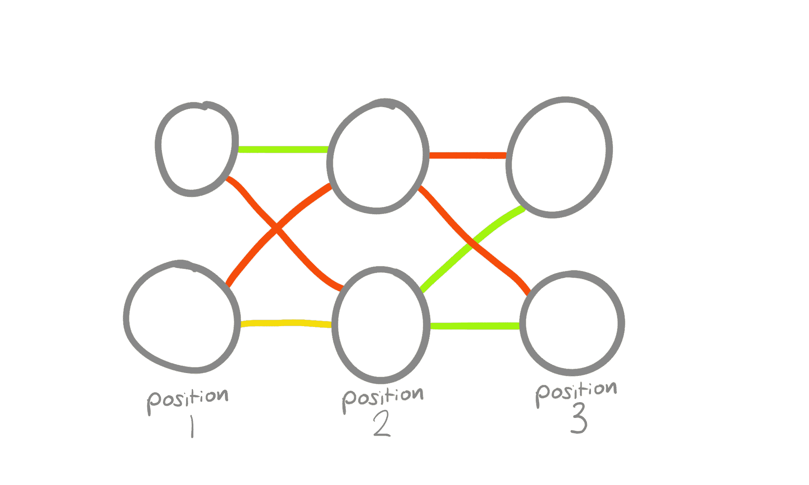
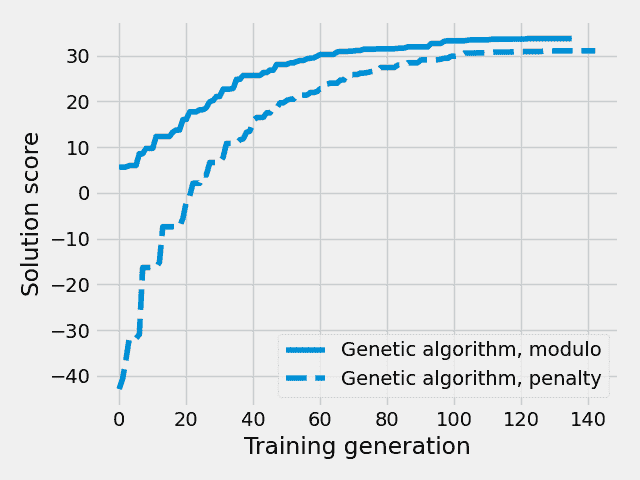
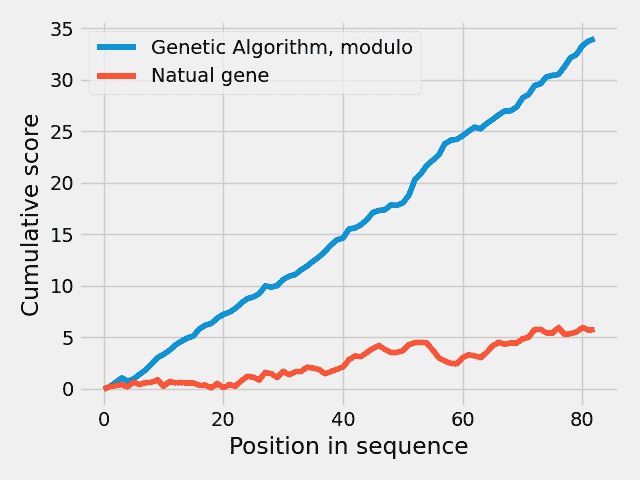

# 使用遗传算法优化基因

> 原文：[`www.kdnuggets.com/2022/04/optimizing-genes-genetic-algorithm.html`](https://www.kdnuggets.com/2022/04/optimizing-genes-genetic-algorithm.html)

# **介绍**

* * *

## 我们的前三个课程推荐

 1\. [谷歌网络安全证书](https://www.kdnuggets.com/google-cybersecurity) - 快速进入网络安全职业轨道

 2\. [谷歌数据分析专业证书](https://www.kdnuggets.com/google-data-analytics) - 提升您的数据分析能力

 3\. [谷歌 IT 支持专业证书](https://www.kdnuggets.com/google-itsupport) - 支持您的组织 IT 部门

* * *

遗传算法可以是解决优化问题的好方法，因为它们可以可靠地找到一个好的解决方案，即使在具有许多局部最优解的复杂适应度景观中。我正在使用这种技术来优化 DNA 序列，以准确生产大量有用的蛋白质。在这里，我们将查看实现遗传算法的关键步骤，而不是深入探讨其背后的理论，但在其他地方有许多更详细的描述，例如 这里 和 [这里](https://towardsdatascience.com/introduction-to-genetic-algorithms-including-example-code-e396e98d8bf3)。

简单来说，遗传算法模拟一个种群，其中每个个体都是一个可能的“解决方案”，并让适者生存发挥作用。困难的部分，就像数据科学和机器学习中的许多问题一样，是如何为计算机构建问题。我们将看到如何通过更好地构建问题来改善您的解决方案。

**所有代码均可在** [`github.com/DAWells/codon_path`](https://github.com/DAWells/codon_path) 获取

# **问题**

DNA 代码用于氨基酸，蛋白质的构建块。三个位于一起的 DNA 字母（A、T、G 或 C）编码一个氨基酸，称为*密码子*。几个不同的密码子可以编码相同的氨基酸。例如，CAA 和 CAG 都编码氨基酸谷氨酰胺。给定一个已知的蛋白质，我们想要编码的序列应该是简单的。实际上，当蛋白质合成时，前一个密码子可能会影响添加下一个氨基酸的时间，可能需要更长时间或出现错误。尽管几个密码子可以完成相同的工作，但并非所有的配对都能很好地配合在一起。我的目标是优先使用这些配对良好的密码子。

那么，为什么这很重要？通过这种方式优化基因可以让你获得更多你想要的蛋白质。你可能需要一种蛋白质来催化化学反应，或者生产治疗药物。为什么这很困难？每个密码子是两个对中的一部分，这意味着你不能单独选择最佳对。相反，你必须同时考虑所有对。在下面的例子中，每个位置有两个密码子的选择，邻近密码子的配合效果由连接它们的颜色（绿色>黄色>红色）表示。一个好的密码子对可能会让你陷入下一个坏对，如下所示。

# **解决方案**

遗传算法所需的第一件事是一个评分函数，一种衡量可能解决方案适应性的方式。这用于决定哪些解决方案可以“繁殖”。决定如何计算这个数字是任何优化问题的关键步骤，因为它必须在这个值中捕捉问题的所有复杂性。幸运的是，Coleman 等人（2008）为所有 3,721 对可能的密码子对计算了一个评分，我们使用这个评分作为在蛋白质合成过程中对一对密码子效果的衡量。因此，对于任何 DNA 序列，我可以将序列中每对连续密码子的值加起来，并计算一个分数；分数越高，解决方案对我的问题越好。

接下来，我们需要为遗传算法框定问题，即在算法优化过程中，每个可能的解决方案将采取何种形式？最明显的密码子表示方式是一个向量，其中每个元素是一个密码子，用 1-61 的数字表示（对应 61 个密码子中的每一个）。但这对于我们的算法来说自由度过大，因为它可以替换成产生错误氨基酸的密码子。

更好的表述是每个元素表示一个编码正确氨基酸的密码子。确定什么是“正确氨基酸”可以抽象到评分函数中，这意味着我们的遗传算法不会破坏任何东西。任何单一氨基酸可以由多达 6 种不同的密码子编码，因此我们的解决方案向量包含范围为 0-5 的整数值，编码 6 种密码子，并且长度与我们优化的氨基酸序列相同（或 DNA 基因长度的三分之一）。

另一个关键好处是将我们的解决方案向量从 1-6 而非 1-61，这大大减少了问题空间。如果 L 是我们向量的长度，那么要探索的可能解决方案数量是 6L 而非 61L。较小的问题空间意味着更快的答案，这在遗传算法中尤为重要。尽管它们能找到好的解决方案，但速度较慢。如果我没有重新格式化为较小的问题空间，我就没有时间优化基因。

使用 0-5 表示密码子存在一个问题，并不是所有氨基酸都有 6 个密码子，例如赖氨酸只有 2 个。遗传算法可能会使用第 5 个赖氨酸密码子（实际上不存在）；那怎么办？你可以让评分函数在每次使用无效密码子时扣分，并希望这能促使你找到好的有效解决方案，但这并没有高效利用我们的问题空间。任何包含无效密码子的解决方案都绝对不是最佳解决方案。这意味着我们在 6L 空间中尝试的许多解决方案（尽管仍然很多）都是浪费的努力。

与其使用惩罚，更好的解决方案是使用模除余数。每当遗传算法请求一个不在真实密码子列表中的密码子时，我将其循环回列表的开头。因此，如果它请求第 5 个密码子而列表中只有 3 个，它将回到开始处并计算剩余的 2 个。这意味着遗传算法探索的任何解决方案都有可能是最佳解决方案。因此，我们应该能更快地得到更好的答案。在下面的图中，我们可以看到惩罚算法总是落后于模除算法，并且需要 30 代才能达到相同的起点。

幸运的是，这使我得到了一个非常好的解决方案，比自然发生的基因要好得多。下面我绘制了自然基因和优化基因在长度上的累积适应度；好的密码子对增加适应度，差的对减少适应度。自然基因的累积得分通常是增加的，因为好的密码子对通常是优选的，但差别不大。而在我们优化的基因中，斜率要陡得多且始终为正，表明密码子对的利用要好得多。总体而言，我们优化的基因比自然基因好 6 倍。

# **结论**

为了最大限度地发挥你的遗传算法的效果，你需要将问题框架设计得尽可能小且高效地探索问题空间。你还需要一个准确捕捉你试图实现目标本质的适应度函数。数据科学中很大一部分就是将现实世界问题转化为数字，以便计算机可以帮助你。通过实践，你可以用多种方式来框定同一个问题。希望这篇文章展示了如何通过恰当框定同一问题来获得更好的答案。

## **参考文献**

Coleman, J. R., Papamichail, D., Skiena, S., Futcher, B., Wimmer, E., & Mueller, S. (2008). 通过基因组规模的密码子对偏好变化进行病毒减毒。科学，320(5884)，1784–1787。https://doi.org/10.1126/science.1155761

**[David Wells](https://dawells.github.io/)** 是一位生物信息学家，他将机器学习应用于基因组学以开发疫苗。

### 更多关于此主题

+   [遗传算法关键术语解析](https://www.kdnuggets.com/2018/04/genetic-algorithm-key-terms-explained.html)

+   [Python 中的遗传编程：背包问题](https://www.kdnuggets.com/2023/01/knapsack-problem-genetic-programming-python.html)

+   [理解和实现 Python 中的遗传算法](https://www.kdnuggets.com/understanding-and-implementing-genetic-algorithms-in-python)

+   [优化 Python 代码性能：深入探讨 Python 性能分析工具](https://www.kdnuggets.com/2023/02/optimizing-python-code-performance-deep-dive-python-profilers.html)

+   [优化数据存储：探索 SQL 中的数据类型和规范化](https://www.kdnuggets.com/optimizing-data-storage-exploring-data-types-and-normalization-in-sql)

+   [优化数据分析：在 Databricks 中集成 GitHub Copilot](https://www.kdnuggets.com/optimizing-data-analytics-integrating-github-copilot-in-databricks)
