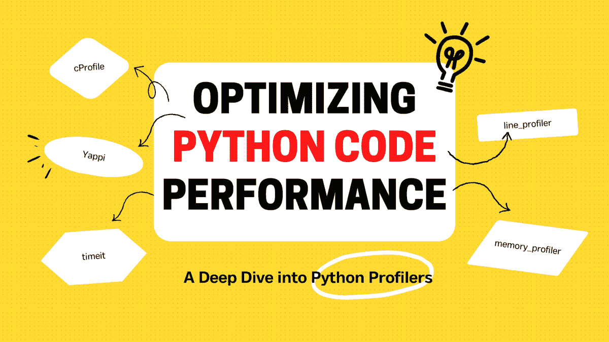

# 优化 Python 代码性能：深入了解 Python 性能分析工具

> 原文：[`www.kdnuggets.com/2023/02/optimizing-python-code-performance-deep-dive-python-profilers.html`](https://www.kdnuggets.com/2023/02/optimizing-python-code-performance-deep-dive-python-profilers.html)



图片由作者提供

# 介绍

* * *

## 我们的三大课程推荐

 1\. [Google 网络安全证书](https://www.kdnuggets.com/google-cybersecurity) - 快速进入网络安全职业轨道。

 2\. [Google 数据分析专业证书](https://www.kdnuggets.com/google-data-analytics) - 提升你的数据分析技能

 3\. [Google IT 支持专业证书](https://www.kdnuggets.com/google-itsupport) - 支持你的组织 IT 需求

* * *

尽管 Python 是最广泛使用的编程语言之一，但在处理大数据集时，它往往会遭遇较差的执行时间。性能分析是动态监控代码性能并识别缺陷的方法之一。这些缺陷可能表示存在错误或编写不当的代码，这些代码消耗了大量的系统资源。使用性能分析工具可以提供程序的详细统计信息，你可以利用这些信息来优化代码以提高性能。让我们来看看一些 Python 性能分析工具及其示例。

# 1\. cProfile

cProfile 是 Python 内置的性能分析工具，它跟踪程序中的每个函数调用。它提供了有关函数被调用频率及其平均执行时间的详细信息。由于它是标准 Python 库的一部分，因此我们不需要显式安装。然而，它不适合用于实时数据分析，因为它会捕捉每一个函数调用，并默认生成大量统计信息。

## 示例

```py
import cProfile

def sum_():
    total_sum = 0
    # sum of numbers till 10000
    for i in range(0,10001):
        total_sum += i 
    return total_sum

cProfile.run('sum_()')
```

**输出**

```py
4 function calls in 0.002 seconds
Ordered by: standard name
```

| ncalls | tottime | percall | cumtime | percall | percall 文件名:行号(函数) |
| --- | --- | --- | --- | --- | --- |
| 1 | 0.000 | 0.000 | 0.002 | 0.002 | <string>:1(<module>) |
| 1 | 0.002 | 0.002 | 0.002 | 0.002 | cprofile.py:3(sum_) |
| 1 | 0.000 | 0.000 | 0.002 | 0.002 | {built-in method builtins.exec} |
| 1 | 0.000 | 0.000 | 0.000 | 0.000 | {method 'disable' of '_lsprof.Profiler' objects} |

从输出中可以看出，cProfile 模块提供了大量关于函数性能的信息。

+   ncalls =  函数被调用的次数

+   tottime =  函数中花费的总时间

+   percall = 每次调用中花费的总时间

+   cumtime =  在此函数及所有子函数中花费的累计时间

+   percall = 每次调用中花费的累计时间。

# 2\. 行分析器

Line Profiler 是一个强大的 Python 模块，可逐行分析代码性能。有时，代码中的热点可能只是单行，直接从源代码中定位并不容易。Line Profiler 对于识别每行执行所花费的时间以及需要特别关注的优化区域非常有价值。然而，它不包含在标准 Python 库中，需要使用以下命令进行安装：

```py
pip install line_profiler
```

## 示例

```py
from line_profiler import LineProfiler
def sum_arrays():
    # creating large arrays
    arr1 = [3] * (5 ** 10)
    arr2 = [4] * (3 ** 11)
    return arr1 + arr2

lp = LineProfiler()
lp.add_function(sum_arrays)
lp.run('sum_arrays()')
lp.print_stats()
```

**输出**

```py
Timer unit: 1e-07 s
Total time: 0.0562143 s
File: e:\KDnuggets\Python_Profilers\lineprofiler.py
Function: sum_arrays at line 2
```

| 行号 | 点击次数 | 时间 | 每次点击 | % 时间 | 行内容 |
| --- | --- | --- | --- | --- | --- |
| 2 | | | | | def sum_arrays(): |
| 3 | | | | | # 创建大型数组 |
| 4 | 1 | 168563.0 | 168563.0 | 30.0 | arr1 = [1] * (10 ** 6) |
| 5 | 1 | 3583.0 | 3583.0 | 0.6 | arr2 = [2] * (2 * 10 ** 7) |
| 6 | 1 | 389997.0 | 389997.0 | 69.4 | return arr1 + arr2 |

+   行号 = 代码文件中的行号

+   点击次数 = 执行的次数

+   时间 = 执行该行所花费的总时间

+   每次点击 = 每次点击的平均时间

+   % 时间 = 相对于函数总时间的每行时间占比

+   行内容 = 实际源代码

# 3\. 内存分析器

内存分析器是一个 Python 分析器，跟踪代码的内存分配。它还可以生成火焰图，以帮助分析内存使用情况并识别代码中的内存泄漏。它还可以帮助识别导致大量分配的热点区域，因为 Python 应用程序通常容易出现内存管理问题。内存分析器逐行分析内存消耗的统计信息，需要使用以下命令进行安装：

```py
pip install memory_profiler
```

## 示例

```py
import memory_profiler
import random

def avg_marks():
    # Genrating Random marks for 50 students for each section
    sec_a = random.sample(range(0, 100), 50)
    sec_b = random.sample(range(0, 100), 50)

    # combined average marks of two sections
    avg_a = sum(sec_a) / len(sec_a)
    avg_b =  sum(sec_b) / len(sec_b)
    combined_avg = (avg_a + avg_b)/2
    return combined_avg

memory_profiler.profile(avg_marks)()
```

**输出**

```py
Filename: e:\KDnuggets\Python_Profilers\memoryprofiler.py
```

| 行号 | 内存使用 | 增量 | 出现次数 | 行内容 |
| --- | --- | --- | --- | --- |
| 4 | 21.7 MiB | 21.7 MiB | 1 | def avg_marks(): |
| 5 | | | | # 为每个部分生成 50 个随机分数 |
| 6 | 21.8 MiB | 0.0 MiB | 1 | sec_a = random.sample(range(0, 100), 50) |
| 7 | 21.8 MiB | 0.0 MiB | 1 | sec_b = random.sample(range(0, 100), 50) |
| 8 | | | | |
| 9 | | | | # 两个部分的综合平均分 |
| 10 | 21.8 MiB | 0.0 MiB | 1 | avg_a = sum(sec_a) / len(sec_a) |
| 11 | 21.8 MiB | 0.0 MiB | 1 | avg_b = sum(sec_b) / len(sec_b) |
| 12 | 21.8 MiB | 0.0 MiB | 1 | combined_avg = (avg_a + avg_b)/2 |
| 13 | 21.8 MiB | 0.0 MiB | 1 | return combined_avg |

+   行号 = 代码文件中的行号

+   内存使用 = Python 解释器的内存使用情况

+   增量 = 当前行与上一行的内存消耗差

+   出现次数 = 代码行执行的次数

+   行内容 = 实际源代码

# 4\. Timeit

Timeit 是一个内置的 Python 库，专门用于评估小代码片段的性能。它是一个强大的工具，可以帮助你识别和优化代码中的性能瓶颈，使你的代码更快、更高效。虽然可以使用 timeit 模块比较算法的不同实现，但缺点是只能分析代码块的单独行。

## 示例

```py
import timeit
code_to_test = """
# creating large arrays
arr1 = [3] * (5 ** 10)
arr2 = [4] * (3 ** 11)
arr1 + arr2
"""
elapsed_time = timeit.timeit(code_to_test, number=10)
print(f'Elapsed time: {elapsed_time}')
```

**输出**

```py
Elapsed time: 1.3809973997995257
```

它的使用限制在于只评估较小的代码片段。需要注意的是，它每次运行代码片段时显示的时间不同。这是因为你的计算机上可能运行着其他进程，资源分配可能在不同的运行中有所变化，使得控制所有变量并实现相同的处理时间变得困难。

# 5\. Yappi

Yappi 是一个 Python 性能分析器，允许你轻松识别性能瓶颈。它用 C 语言编写，是最有效的分析器之一。它拥有一个可定制的 API，允许你仅分析代码中需要关注的特定部分，从而对分析过程有更多控制。它能够分析并发协程，提供对代码运行情况的深入理解。

## 示例

```py
import yappi
def sum_arrays():
     # creating large arrays
    arr1 = [3] * (5 ** 10)
    arr2 = [4] * (3 ** 11)
    return arr1 + arr2

with yappi.run(builtins=True):
    final_arr = sum_arrays()

print("\n--------- Function Stats -----------")
yappi.get_func_stats().print_all()

print("\n--------- Thread Stats -----------")
yappi.get_thread_stats().print_all()

print("\nYappi Backend Types: ",yappi.BACKEND_TYPES)
print("Yappi Clock Types: ", yappi.CLOCK_TYPES)
```

> **注意：** 使用以下命令安装 yappi: `pip install yappi`

**输出**

```py
--------- Function Stats -----------

Clock type: CPU
Ordered by: totaltime, desc
```

| name | ncall | tsub | ttot | tavg |
| --- | --- | --- | --- | --- |
| ..lers\yappiProfiler.py:4 sum_arrays | 1 | 0.109375 | 0.109375 | 0.109375 |
| builtins. next | 1 | 0.000000 | 0.000000 | 0.000000 |
| .. _GeneratorContextManager.__exit__ | 1 | 0.000000 | 0.000000 | 0.000000 |

--------- 线程统计 ---------

| name | id | tid | ttot | scnt |
| --- | --- | --- | --- | --- |
| _MainThread | 0 | 15148 | 0.187500 | 1 |

```py
Yappi Backend Types:  {'NATIVE_THREAD': 0, 'GREENLET': 1}
Yappi Clock Types:  {'WALL': 0, 'CPU': 1}
```

记得为内置模块起不同的名称。否则，导入将导入你的模块（即你的 Python 文件），而不是实际的内置模块。

# 结论

通过使用这些分析工具，开发者可以识别代码中的瓶颈，并决定哪种实现方式最佳。使用合适的工具和一点技巧，任何人都能将他们的 Python 代码性能提升到新的高度。所以，准备好优化你的 Python 性能，看看它如何腾飞到新高度吧！

我很高兴你决定阅读这篇文章，希望它对你是一次有价值的体验。

**[Kanwal Mehreen](https://www.linkedin.com/in/kanwal-mehreen1)** 是一位有志的软件开发者，对数据科学和人工智能在医学中的应用充满兴趣。Kanwal 被选为 2022 年亚太地区的 Google Generation Scholar。Kanwal 喜欢通过撰写关于热门话题的文章来分享技术知识，并热衷于改善女性在科技行业中的代表性。

### 更多相关内容

+   [深入探讨 GPT 模型：演变与性能比较](https://www.kdnuggets.com/2023/05/deep-dive-gpt-models.html)

+   [优化您的 LLM 以提高性能和可扩展性](https://www.kdnuggets.com/optimizing-your-llm-for-performance-and-scalability)

+   [使用大型语言模型优化性能和成本的策略](https://www.kdnuggets.com/strategies-for-optimizing-performance-and-costs-when-using-large-language-models-in-the-cloud)

+   [揭开神经魔法的面纱：深入探讨激活函数](https://www.kdnuggets.com/unveiling-neural-magic-a-dive-into-activation-functions)

+   [深入了解 Kaggle 的 2023 年 AI 报告——了解最新动态](https://www.kdnuggets.com/dive-into-the-future-with-kaggle-ai-report-2023-see-what-hot)

+   [使用遗传算法优化基因](https://www.kdnuggets.com/2022/04/optimizing-genes-genetic-algorithm.html)
