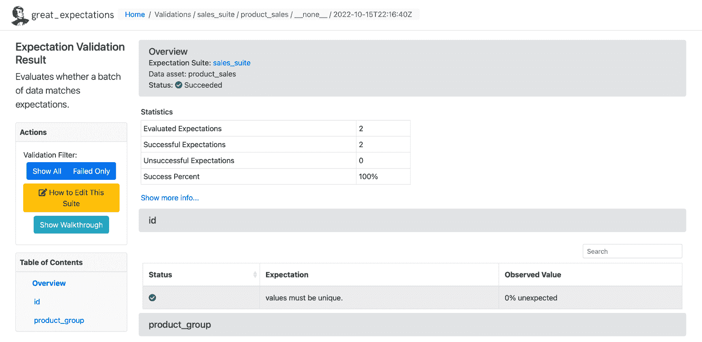
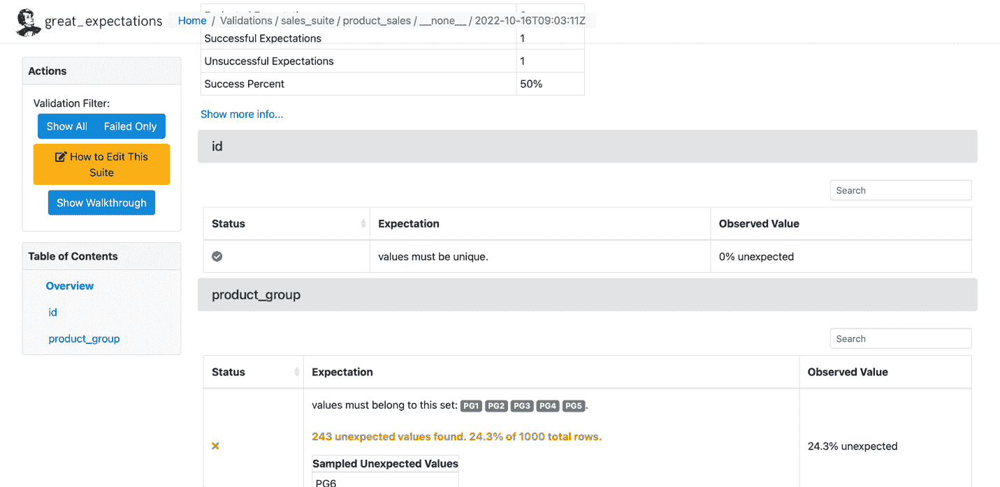

# 使用 Great Expectations 解决您的数据质量问题

> 原文：[`www.kdnuggets.com/2023/01/overcome-data-quality-issues-great-expectations.html`](https://www.kdnuggets.com/2023/01/overcome-data-quality-issues-great-expectations.html)

Gartner, Inc. 估计，[不良数据的成本](https://www.forbes.com/sites/forbestechcouncil/2022/08/08/no-more-garbage-in-garbage-out-taking-control-of-your-data-quality/?sh=7d64e8561e95) 每年给组织带来的平均损失为 1290 万美元。

我们每天处理 PB 级的数据，大规模的数据量中常常会出现数据质量问题。不良数据会给组织带来金钱、声誉和时间上的损失。因此，持续监控和验证数据质量非常重要。

* * *

## 我们的三大课程推荐

 1. [Google 网络安全证书](https://www.kdnuggets.com/google-cybersecurity) - 加速您的网络安全职业生涯。

 2. [Google 数据分析专业证书](https://www.kdnuggets.com/google-data-analytics) - 提升您的数据分析技能

 3. [Google IT 支持专业证书](https://www.kdnuggets.com/google-itsupport) - 支持您组织的 IT

* * *

# 什么是不良数据？

不良数据包括不准确的信息、缺失的数据、错误的信息、不符合规范的数据和重复的数据。不良数据会导致错误的数据分析，从而导致不良决策和无效的策略。

**Experian 数据质量发现，平均公司因数据不足而损失了 12%的收入。除了金钱，公司还会遭受浪费时间的损失。**

在处理数据之前识别异常将帮助组织更好地洞察客户行为并减少成本。

Great Expectations 库帮助组织通过 200 多种现成规则来验证和确认数据中的异常。

# 什么是 Great Expectations（GE）？

Great Expectations 是一个开源的 Python 库，帮助我们验证数据。[Great expectations](https://greatexpectations.io/) 提供了一组方法或函数来[帮助数据工程师](https://www.anblicks.com/insights/data-sheets/cloud-data-engineering/) 快速验证给定的数据集。

在这篇文章中，我们将探讨如何通过 Great Expectations 库进行数据验证的步骤。

# Great Expectations 如何工作

GE 就像是数据的单元测试。GE 提供了称为 Expectations 的断言，用来对测试数据应用一些规则。例如，保险单文件中的政策 ID/号码不应该为空。要设置和执行 GE，必须按照以下步骤进行。尽管有多种方法可以使用 GE（例如通过其 CLI），我将在本文中解释编程方式的设置。本文解释的所有源代码均可在这个 [GitHub 仓库](https://github.com/saisyam/great-expectations-sample) 中找到。

## 第一步：设置数据配置

GE 有一个存储的概念。存储就是它可以在磁盘上存储期望（规则/断言）、运行详情、检查点详情、验证结果和数据文档（验证结果的静态 HTML 版本）的物理位置。[点击这里](https://docs.greatexpectations.io/docs/terms/store/) 了解更多关于存储的信息。

GE 支持多种存储后端。本文中，我们使用文件存储后端和默认设置。GE 还支持其他存储后端，如 AWS（亚马逊 Web 服务）S3、Azure Blob、PostgreSQL 等。请参阅 [了解更多关于后端的信息](https://docs.greatexpectations.io/docs/guides/setup/setup_overview)。下面的代码片段展示了一个非常简单的数据配置：

```py
STORE_FOLDER = "/Users/saisyam/work/github/great-expectations-sample/ge_data"
#Setup data config
data_context_config = DataContextConfig(
    datasources = {},
    store_backend_defaults = FilesystemStoreBackendDefaults(root_directory=STORE_FOLDER)
)

context = BaseDataContext(project_config = data_context_config)
```

上述配置使用了默认的文件存储后端。GE 将自动创建运行期望所需的文件夹。我们将在下一步中添加数据源。

## 第二步：设置数据源配置

GE 支持三种类型的数据源：

1.  Pandas

1.  Spark

1.  SQLAlchemy

数据源配置告诉 GE 使用特定的执行引擎来处理提供的数据集。例如，如果你将数据源配置为使用 Pandas 执行引擎，你需要提供一个 Pandas 数据框给 GE 以运行期望。下面是一个使用 Pandas 作为数据源的示例：

```py
datasource_config = {
    "name": "sales_datasource",
    "class_name": "Datasource",
    "module_name": "great_expectations.datasource",
    "execution_engine": {
        "module_name": "great_expectations.execution_engine",
        "class_name": "PandasExecutionEngine",
    },
    "data_connectors": {
        "default_runtime_data_connector_name": {
            "class_name": "RuntimeDataConnector",
            "module_name": "great_expectations.datasource.data_connector",
            "batch_identifiers": ["default_identifier_name"],
        },
    },
}
context.add_datasource(**datasource_config)
```

请参阅 [这份文档](https://docs.greatexpectations.io/docs/guides/connecting_to_your_data/connect_to_data_overview) 以获取有关数据源的更多信息。

## 第三步：创建期望套件并添加期望

这一步是关键部分。在这一步中，我们将创建一个套件并向套件中添加期望。你可以将套件视为一组将作为批次运行的期望。在这里创建的期望是为了验证一个示例销售报告。你可以下载 [sales.csv](https://github.com/saisyam/great-expectations-sample/blob/master/sales.csv) 文件。

下面的代码片段展示了如何创建一个套件并添加期望。我们将向套件中添加两个期望。

```py
# Create expectations suite and add expectations
suite = context.create_expectation_suite(expectation_suite_name="sales_suite", overwrite_existing=True)

expectation_config_1 = ExpectationConfiguration(
    expectation_type="expect_column_values_to_be_in_set",
    kwargs={
        "column": "product_group",
        "value_set": ["PG1", "PG2", "PG3", "PG4", "PG5", "PG6"]
    }
) 
suite.add_expectation(expectation_configuration=expectation_config_1)

expectation_config_2 = ExpectationConfiguration(
    expectation_type="expect_column_values_to_be_unique",
    kwargs={
        "column": "id"
    }
) 
suite.add_expectation(expectation_configuration=expectation_config_2)
context.save_expectation_suite(suite, "sales_suite")
```

第一个期望 “expect_column_values_to_be_in_set” 检查列（product_group）值是否等于给定 value_set 中的任何值。第二个期望检查 “id” 列的值是否唯一。

一旦期望被添加并保存后，我们现在可以在数据集上运行这些期望，这将在第四步中进行。

## 第四步：加载并验证数据

在这一步骤中，我们将 CSV 文件加载到 pandas.DataFrame 中，并创建一个检查点以运行我们之前创建的期望。

```py
# load and validate data
df = pd.read_csv("./sales.csv")

batch_request = RuntimeBatchRequest(
    datasource_name="sales_datasource",
    data_connector_name="default_runtime_data_connector_name",
    data_asset_name="product_sales",
    runtime_parameters={"batch_data":df},
    batch_identifiers={"default_identifier_name":"default_identifier"}
)

checkpoint_config = {
    "name": "product_sales_checkpoint",
    "config_version": 1,
    "class_name":"SimpleCheckpoint",
    "expectation_suite_name": "sales_suite"
}
context.add_checkpoint(**checkpoint_config)
results = context.run_checkpoint(
    checkpoint_name="product_sales_checkpoint",
    validations=[
        {"batch_request": batch_request}
    ]
) 
```

我们为数据创建了一个批量请求，提供数据源名称，这将告诉 GE 使用特定的执行引擎，在我们的例子中是 Pandas。我们创建一个检查点配置，然后将批量请求与检查点进行验证。如果期望适用于单个检查点中的批量数据，您可以添加多个批量请求。`run_checkpoint`方法以 JSON 格式返回结果，可以用于进一步处理或分析。

## 结果

一旦我们在数据集上运行了期望，GE 会创建一个静态 HTML 仪表板，显示检查点的结果。结果包括评估期望的数量、成功的期望、不成功的期望和成功百分比。任何与给定期望不匹配的记录将在页面上突出显示。以下是成功执行的示例：



来源：伟大期望

以下是一个失败期望的示例：



来源：伟大期望

# 结论

我们已通过四个步骤设置了 GE，并成功在给定数据集上运行了期望。GE 具有更高级的功能，如编写自定义期望，我们将在未来的文章中介绍。许多组织广泛使用 GE 来定制客户需求并编写自定义期望。

**[Saisyam Dampuri](https://www.linkedin.com/in/saisyam/)** 拥有超过 18 年的软件开发经验，热衷于探索新技术和工具。他目前在美国德克萨斯州 Anblicks 担任高级云架构师。在不编程的时候，他会忙于摄影、烹饪和旅行。

### 更多相关内容

+   [数据质量维度：用伟大期望确保数据质量](https://www.kdnuggets.com/2023/03/data-quality-dimensions-assuring-data-quality-great-expectations.html)

+   [10 个最常见的数据质量问题及其解决方法](https://www.kdnuggets.com/2022/11/10-common-data-quality-issues-fix.html)

+   [数据科学职业：7 个期望与现实](https://www.kdnuggets.com/2022/06/data-science-career-7-expectations-reality.html)

+   [数据科学：现实与期望](https://www.kdnuggets.com/2022/03/data-science-reality-expectations.html)

+   [分类准确性相关的关键问题](https://www.kdnuggets.com/2023/03/key-issues-associated-classification-accuracy.html)

+   [如何使用合成数据克服机器学习模型训练的数据短缺](https://www.kdnuggets.com/2022/03/synthetic-data-overcome-data-shortages-machine-learning-model-training.html)
