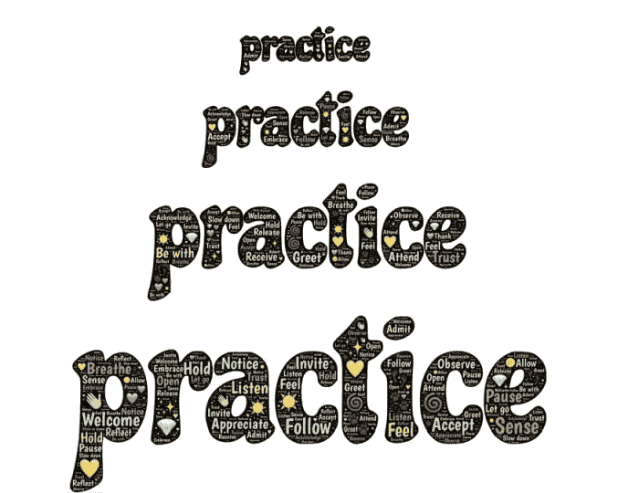

# 如何克服对数学的恐惧，并学习数据科学所需的数学

> 原文：[`www.kdnuggets.com/2021/03/overcome-fear-learn-math-data-science.html`](https://www.kdnuggets.com/2021/03/overcome-fear-learn-math-data-science.html)

编辑器提供的图像

有一件事你需要首先关注：**数据科学所需的数学量。**使用这些文章作为参考，了解你需要学习什么：

+   [一篇很好的博客文章](https://www.sharpsightlabs.com/blog/math-for-data-science/)来自 Sharp Sight Labs 的[Josh Ebner](https://twitter.com/Josh_Ebner)。他解释了初级数据科学家与高级数据科学家之间的区别，*数据科学基础技能所需的数学*，数据科学理论与实践之间的区别等。

+   [一篇博客文章](https://tdhopper.com/blog/how-i-became-a-data-scientist/)来自[Tim Hopper](https://twitter.com/tdhopper)。他曾是数学专业学生，并在成为数据科学家之前是数学博士生一年。这里是[他关于数据科学所需数学量的 YouTube 演讲](https://youtu.be/Q_UrZ4pmKmI)。

+   [Rebecca Vickery](https://medium.com/u/8b7aca3e5b1c?source=post_page-----d7cef46745f4--------------------------------)有一个[数据科学所需学习的数学主题列表](https://medium.com/vickdata/maths-and-statistics-a-complete-roadmap-for-learning-data-science-part-3-e1ec585195cf)。这是我用作参考的内容。

* * *

## 我们的前三个课程推荐

 1\. [谷歌网络安全证书](https://www.kdnuggets.com/google-cybersecurity) - 快速进入网络安全职业轨道。

 2\. [谷歌数据分析专业证书](https://www.kdnuggets.com/google-data-analytics) - 提升您的数据分析技能

 3\. [谷歌 IT 支持专业证书](https://www.kdnuggets.com/google-itsupport) - 支持您的组织的 IT

* * *

根据上述内容，这里是我学习数学的方式：

# 第一步：一种新的学习方法

学习统计学非常令人困惑。我无法将不同部分的主题联系起来。我参加了宾州州立大学的 STAT100 在线课程（一周），但仍然记不住任何东西。

然后是概率。我花了数天数夜和周末试图掌握贝叶斯定理，但它就像一个我永远无法解开的谜。我问自己：

> *在我个人生活中，我在过去几个月是如何娱乐自己的？我从哪里找到了快乐？*

我喜欢观看 [纸牌屋](https://en.wikipedia.org/wiki/House_of_Cards_(American_TV_series))、[金装律师](https://en.wikipedia.org/wiki/Suits_(American_TV_series))、[攻壳机动队](https://en.wikipedia.org/wiki/Ghost_in_the_Shell)、[亿万](https://en.wikipedia.org/wiki/Billions_(TV_series)) 和 [星球大战](https://en.wikipedia.org/wiki/Star_Wars)。我曾 [沉迷观看](https://en.wikipedia.org/wiki/Binge-watching) 了这些剧集的许多季节/卷。我决定在一整周内沉迷于概率学习：从周一到周日。我制定了一个新计划：

> 我不会阅读数学教科书*。*我也不会参加任何 MOOC*。原因是：这两者都源于为研究生学习（3+ 年）设计的学术标准。学术界的人已经是这些学科的专家，他们已经教授了这些内容多年，因此，关于这些内容的 MOOC/书籍至少是一个或两个学期的长度。那么，对于一个对这些学科一无所知且没有一两个学期时间学习的人来说呢？*

**我如何学习**

1.  如果我在一个地方没有理解某个内容，我就会离开，转到另一个地方。与其在同一篇文章、博客或视频上花费几个小时，不如专注于当前主题的学习，这样我能更灵活。我使用了一个又一个资源，直到我理解了概念。

1.  我练习了问题。我们不能通过阅读和理解来学习数学。我们需要将其应用到问题中。[mathsisfun.com](https://www.mathsisfun.com/) 提供了带有答案的问题列表。

# 第 2 步：沉迷于*

我最终沉迷于学习、阅读和练习了许多概念：

1.  Eddie Woo 的离散随机变量。[总共 3 个视频](https://youtu.be/a9vcTvaBqfs)（包括期望值）

1.  来自 [Eddie Woo](https://youtu.be/JVbbRCVBVRI) 的排列与组合

1.  来自 [Mario’s Math Tutoring](https://youtu.be/TBnPkKxXPu8) 的排列与组合

1.  来自 [Math is fun](https://www.mathsisfun.com/data/bayes-theorem.html) 的贝叶斯定理

1.  来自 [Investopedia](https://www.investopedia.com/terms/c/conditional_probability.asp) 的条件概率、贝叶斯定理等内容

1.  来自 [zedstatistics](https://www.youtube.com/channel/UC6AVa0vSrCpuskzGDDKz_EQ) 的概率分布（以梯度形式解释）

1.  来自 [Explained by Michael](https://youtu.be/jDycsIub4ZE) 的概率密度函数（以代数和图形形式解释）

1.  来自 [Explained by Michael](https://youtu.be/FhZdVPX1rf0) 的累积分布函数

1.  来自 [Jason Gibson](https://youtu.be/UnzbuqgU2LE) 和 [mathtutordvd.com](https://www.mathtutordvd.com/) 的离散概率分布（这是关于离散概率分布的最佳视频）

1.  一篇优秀的 [StackExchange 文章](https://math.stackexchange.com/questions/495313/probability-mass-function-and-probability-density-function) 关于 PDF 与 PMF

1.  来自我上面提到的 StackExchange 帖子的数学洞察链接[关于 PDF 的想法](https://mathinsight.org/probability_density_function_idea)

1.  MIT OCW 的[PDF 讲座](https://youtu.be/mHfn_7ym6to)（它在 StackExchange 帖子中提到）

现在我可以用费曼技巧解释关于 PDF 的一切 :-)

我不是唯一一个理解这个学习原则的人。[Ken Jee](https://medium.com/u/6ee1f7466557?source=post_page-----d7cef46745f4--------------------------------)在他的 YouTube 视频中提出了一个类似的计划。

*Ken Jee 在[YouTube](https://youtu.be/41Clrh6nv1s)上的内容。*

# 第 3 步：统计学和线性回归

最后，我狂看了[统计学基础](https://www.youtube.com/playlist?list=PLblh5JKOoLUK0FLuzwntyYI10UQFUhsY9)，由 StatQuest 的[Josh Starmer](https://medium.com/u/6648478c1752?source=post_page-----d7cef46745f4--------------------------------)主讲。

他现在正在观看的[线性回归和线性模型播放列表](https://www.youtube.com/playlist?list=PLblh5JKOoLUIzaEkCLIUxQFjPIlapw8nU)。这位讲解者非常擅长解释内容。他不浪费时间，直奔主题，确保在继续之前进行复习，而且几乎没有代码。他追求清晰和基础，这才是学习任何东西的核心。Josh 的对数和线性回归介绍是我迄今为止见过的最佳。而且你一定会喜欢他的 BAMs、tiny bam 和 triple BAMs :-)

# 第 4 步：线性代数

我推荐你从这些地方学习线性代数，而不是使用传统的学习方法（拿起一本书，花几个月时间）。你可以在一周内完成。他们有你进行数据科学所需的所有线性代数：

1.  来自[Ritchie Ng](https://www.ritchieng.com/linear-algebra-machine-learning/)的线性代数

1.  来自[Dive Into Deep Learning](https://d2l.ai/chapter_preliminaries/linear-algebra.html)的线性代数

1.  来自[Pablo Caceres](https://pabloinsente.github.io/intro-linear-algebra)的线性代数（最全面。我做了 70%的内容，因为我想学习某些主题。它包含了很多理论，我认为它包含了足够的内容，即使是深度学习也需要了解）

1.  来自[Deep Learning Book](https://www.deeplearningbook.org/contents/linear_algebra.html)的线性代数

# 第 5 步：克服对数学的恐惧

许多学习者对数学感到恐惧。这种数学恐惧让我们无法理解和掌握我们需要学习的任何主题。我们认为自己没有数学头脑。**像乔治·坎托尔那样成为天才，创造数学实体，并能够理解和使用数学作为解决问题的工具或模型，这两者是截然不同的。前者是宇宙（或上帝）赐予的礼物，而后者是一种技能。**此外，我们既不是天才，也不是哈佛或牛津的优秀毕业生。我们无法改变这一限制，但我们可以改变**态度**和**能力**，将数学作为技能来掌握。查看这些视频来改变你对数学的信念：

**列表 A：**

你喜欢的任何来自[数学巫师](https://www.youtube.com/user/themathsorcerer)的视频（我已经看了 30 多个）。从这些视频开始：

1.  [三条自学数学的技巧](https://youtu.be/_-GQ_T_0dgU)

1.  [6 个鲜为人知的理由](https://youtu.be/AxDpc1lIzRo)为什么自学是数学成功的关键

1.  [为什么有些人学数学这么快](https://www.youtube.com/watch?v=qVm98V3Tjyw)

1.  [如何克服数学失败](https://youtu.be/2fCysjMGhZg)

**列表 B：**

1.  [学习数学需要什么？生活需要什么？](https://youtu.be/VHK5x3ev-oI) | Miroslav Lovric

1.  [任何人都可以成为数学达人](https://youtu.be/M7febmLhS6E)一旦他们知道最佳学习技巧 | Po-Shen Loh

1.  [如何成为数学高手](https://youtu.be/3icoSeGqQtY)，以及学习的其他惊人事实 | Jo Boaler

1.  [我们教育系统的有趣故事](https://youtu.be/Fw1Fc_y_2Ek) | Adhitya Iyer

最后一部视频是关于印度教育系统如何运作的。我在这里学习过，所以我有点偏见把它包括在内。顺便说一句，这是一个有趣的视频。

**列表 C：**

选择一个你一直想学的数学主题，去[数学很有趣](https://www.mathsisfun.com/)阅读并完成所有练习。通过这样做，你会立刻减少一半的恐惧。解释已经简单到让你看穿数学，无论你的年龄或背景如何。

### 第 6 步：如何不忘记你所学的内容

当你通过阅读、观看和解决问题来学习上述内容时，你很快会在一周左右的时间内忘记 80-90%的内容。让学习持久的唯一方法是：**在你的工作中每天使用它。**

成为数据科学家的自学诅咒是你不能使用你所学到的一切。因此，这里有一种不同的方法：

+   一旦你学会了一个主题，接下来使用[费曼技巧](https://duckduckgo.com/?q=feynman+technique&t=newext&atb=v1-1&ia=web)

+   将主题的标题放在一个列表上

+   在一周结束时，检查你的列表，并使用费曼技巧来解释列表上的所有主题

*图片由 [John Hain](https://pixabay.com/users/johnhain-352999/?utm_source=link-attribution&utm_medium=referral&utm_campaign=image&utm_content=615644) 提供，来源于 [Pixabay](https://pixabay.com/?utm_source=link-attribution&utm_medium=referral&utm_campaign=image&utm_content=615644)。*

**这种方法的好处**

这种**Binge-* + 费曼技巧**的方法有几个好处：

+   你节省了很多时间，因为你不需要阅读整本书或进行大规模在线课程，这些都需要几个月的时间。

+   你只学习你需要的内容。数据科学不是数学。不要忘记业务价值、作品集准备、利益相关者和使用数据讲故事。这些比“全面学习数学”更重要。

+   你的重点仍然放在实际工作上。

+   你学习如何解释。这是在工作场所中能够有效表达观点的一个非常有用的技能，同时尊重周围的每个人。它在面试中也很有帮助。

+   既然你已经掌握了某些数学主题的基本思想，你可以在就业后深入探索和学习。

**[Arnuld](https://www.linkedin.com/in/arnuld-on-data/)** 是一位具有 5 年经验的工业软件开发人员，擅长 C、C++、Linux 和 UNIX。在转型进入数据科学并作为数据科学内容撰稿人工作了一年后，他目前担任自由职业数据科学家。

### 更多相关主题

+   [无需担心，AI 编码来帮助你！](https://www.kdnuggets.com/2023/03/manning-fear-not-ai-coding-help-you.html)

+   [如何利用合成数据克服机器学习中的数据短缺问题](https://www.kdnuggets.com/2022/03/synthetic-data-overcome-data-shortages-machine-learning-model-training.html)

+   [利用伟大的期望克服数据质量问题](https://www.kdnuggets.com/2023/01/overcome-data-quality-issues-great-expectations.html)

+   [5 门免费 MIT 课程，帮助你学习数据科学数学](https://www.kdnuggets.com/5-free-mit-courses-to-learn-math-for-data-science)

+   [KDnuggets™ 新闻 22:n07，2 月 16 日：如何为机器学习学习数学](https://www.kdnuggets.com/2022/n07.html)

+   [如何为机器学习学习数学](https://www.kdnuggets.com/2022/02/learn-math-machine-learning.html)
