# 克服实际场景中的数据不平衡挑战

> 原文：[`www.kdnuggets.com/2023/07/overcoming-imbalanced-data-challenges-realworld-scenarios.html`](https://www.kdnuggets.com/2023/07/overcoming-imbalanced-data-challenges-realworld-scenarios.html)

[对流行 NLP 架构的性能进行基准测试](https://medium.com/toloka/choosing-the-best-architecture-for-your-text-classification-task-aee30ecc7870)是建立对可用选项的理解的重要步骤，尤其是在处理文本分类任务时。在这里，我们将深入探讨与分类相关的最常见挑战之一——数据不平衡。如果你曾经将机器学习应用于实际的分类数据集，你可能对此已经很熟悉了。

# 理解数据分类中的不平衡

* * *

## 我们的前三名课程推荐

 1\. [谷歌网络安全证书](https://www.kdnuggets.com/google-cybersecurity) - 快速入门网络安全职业。

 2\. [谷歌数据分析专业证书](https://www.kdnuggets.com/google-data-analytics) - 提升你的数据分析技能

 3\. [谷歌 IT 支持专业证书](https://www.kdnuggets.com/google-itsupport) - 支持你的组织的 IT 需求

* * *

在数据分类中，我们通常关心的是数据点在各个类别中的分布。一个平衡的数据集在所有类别中大致有相同数量的点，这使得处理起来更容易。然而，实际世界中的数据集往往是不平衡的。

数据不平衡可能会导致问题，因为模型可能会学习将所有内容标记为最频繁的类别，从而忽略实际输入。如果主导类别过于普遍，模型在对少数类别进行误分类时不会受到太大惩罚，这种情况可能会发生。此外，代表性不足的类别可能没有足够的数据让模型学习到有意义的模式。

不平衡是需要纠正的问题吗？不平衡是数据的一种特征，一个好的问题是我们是否真的想对其采取措施。有一些技巧可以让模型的训练过程更容易。我们可能会选择操控训练过程或数据本身，以便让模型知道哪些类别对我们特别重要，但这应该由业务需求或领域知识来证明。此外，我们将更详细地讨论这些技巧和操控。

为了说明不同技术处理数据不平衡的效果，我们将使用 [sms-spam 数据集](https://huggingface.co/datasets/sms_spam)，该数据集包含 747 条垃圾短信和 4827 条正常短信。尽管只有两个类别，为了更好地进行泛化，我们将把任务视为多类别分类问题。我们将使用一个 roberta-base 模型。

请记住，这些技术在其他数据上可能会产生不同的结果。必须在特定的数据集上测试它们。

在没有任何调整的情况下训练分类模型，我们得到以下分类报告：

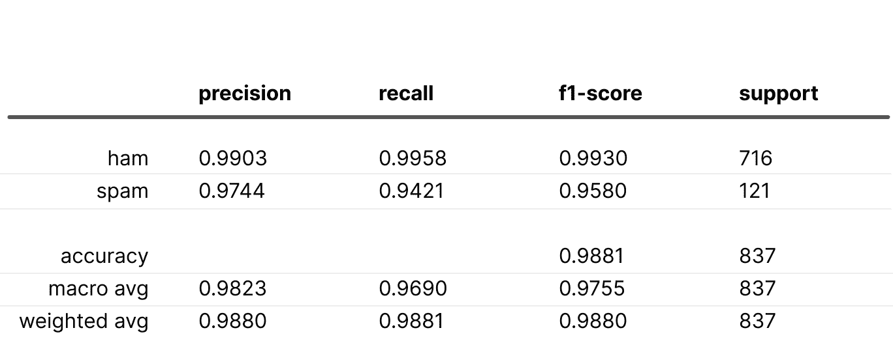

# “安全”技巧

## 偏差初始化

我们的第一个技巧是让模型从一开始就了解数据分布。我们可以通过相应地初始化最终分类层的偏差来传播这一知识。这个技巧由 Andrej Karpathy 在他的[神经网络训练配方](http://karpathy.github.io/2019/04/25/recipe/#2-set-up-the-end-to-end-trainingevaluation-skeleton--get-dumb-baselines:~:text=Huber%20losses%2C%20etc.-,init%20well.,-Initialize%20the%20final)中分享，有助于模型以知情的视角开始。在我们的多类分类情况下，我们使用 softmax 作为最终激活函数，我们希望模型在初始化时的输出能反映数据分布。为此，我们解决以下问题：

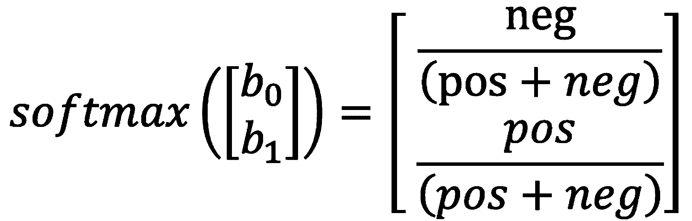

提醒一下，

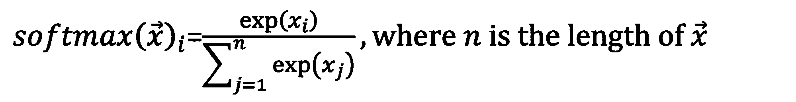

然后，

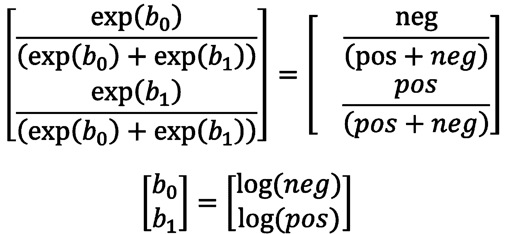

这里 b0 和 b1 分别是负类和正类的偏差，neg 和 pos 分别是负类和正类的元素数量。

通过这种初始化，所有指标都显著改善！

在贝叶斯术语中，这意味着手动设置先验，并允许模型在训练过程中学习后验。

## 下采样和上权重/上采样和下权重

这些技术也有效地解决了类别不平衡问题。它们有类似的概念但执行方式不同。下采样和上权重涉及减少主导类别的大小以平衡分布，同时在训练过程中给该类别的样本赋予更大的权重。上权重确保输出概率仍能代表观察到的数据分布。相反，上采样和下权重则涉及增加代表性不足类别的大小，并按比例减少它们的权重。

下采样和上权重结果：

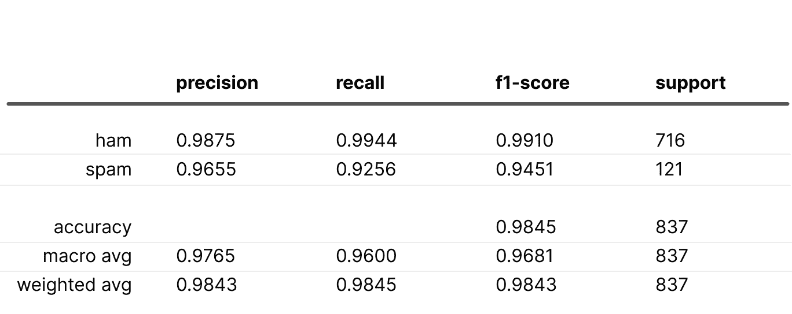

上采样和下权重结果：

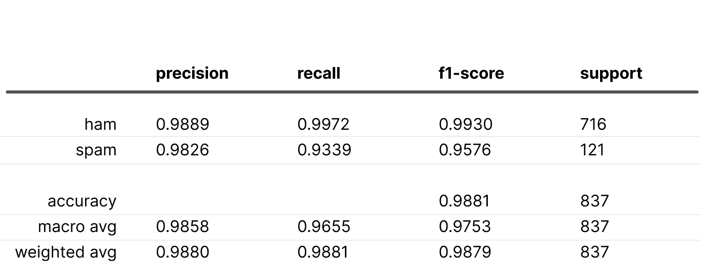

在这两种情况下，“spam”的召回率下降，可能是因为“ham”的权重是“spam”权重的两倍。

## 焦点损失

[焦点损失](https://arxiv.org/abs/1708.02002)，作者称之为“动态缩放交叉熵损失”，旨在解决数据不平衡的训练问题。它仅适用于二分类情况，幸运的是，我们的问题涉及的仅是两个类别。请查看下面的公式：

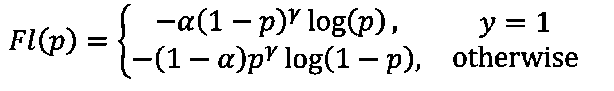

在公式中，p 是真实类别的概率，ɑ 是加权因子，???? 控制我们根据置信度（概率）惩罚损失的程度。

设计确保了概率较低的样本会获得指数级更大的权重，推动模型学习更具挑战性的示例。alpha 参数允许对类别示例进行不同的加权。

通过调整 alpha 和 gamma 的组合，你可以找到最佳配置。为了消除显式的类别偏好，将 alpha 设置为 0.5；然而，作者注意到这一平衡因子带来了轻微的改进。

这是我们使用焦点损失获得的最佳结果：

所有指标都优于基线，但这需要一些参数调整。请记住，它可能并不总是这样顺利地运行。

# “非安全”技巧

存在一些已知的方法，故意改变输出概率分布，以使代表性不足的类别获得优势。通过使用这些技术，我们明确地向模型发出信号，某些类别至关重要，不应被忽视。这通常是由业务需求驱动的，例如检测金融欺诈或攻击性评论，这比错误标记良好示例更为重要。在目标是提高特定类别的召回率时，即使需要牺牲其他指标，也应应用这些技术。

## 权重调整

权重调整涉及为不同类别的样本分配独特的损失权重。这是一种有效且灵活的方法，因为它允许你向模型指示每个类别的重要性。以下是单个训练示例的多类别加权交叉熵损失公式：

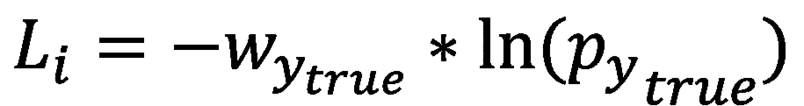

,

其中 pytrue 代表真实类别的概率，wytrue 是该类别的权重。

确定权重的一个好的默认方法是逆类别频率：

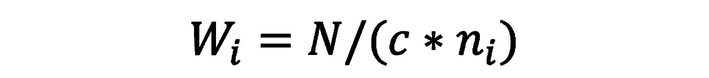

其中 N 是数据集的总项数，c 是类别数，ni 是第 i 类的元素数量。

权重计算如下：{'ham': 0.576, 'spam': 3.784}

以下是使用这些权重获得的指标：

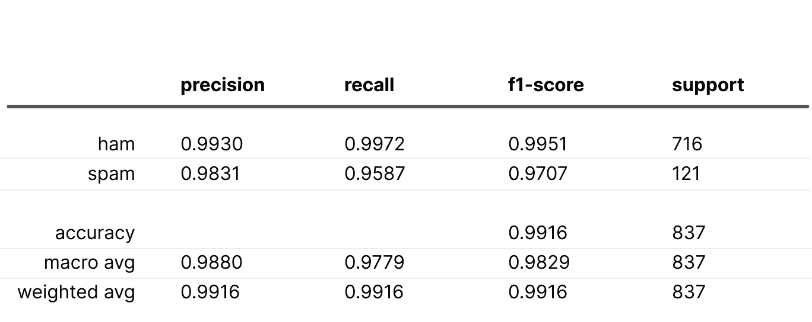

指标超越了基线场景。虽然这种情况可能发生，但并不总是如此。

但是，如果避免从特定类别中漏掉正例至关重要，请考虑增加类别权重，这可能会提高类别的召回率。让我们尝试权重{"ham": 0.576, "spam": 10.0}来查看结果。

结果如下：

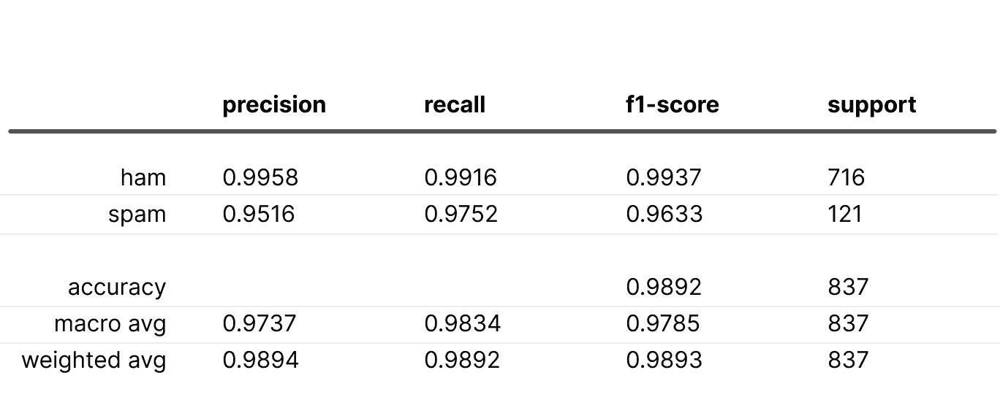

正如预期的那样，“垃圾邮件”的召回率增加了，但精确率下降了。与使用逆类频率权重相比，F1 分数变差了。这表明基本损失加权的潜力。即使对于平衡的数据，加权也可能有利于召回关键类别。

## 上采样和下采样。

虽然与前面讨论的方法类似，但它们不包括加权步骤。下采样可能导致数据丢失，而上采样则可能导致对上采样类别的过拟合。尽管它们可以提供帮助，但加权通常是更高效、更透明的选项。

# 比较概率

我们将使用一个明显看起来像垃圾邮件的例子来评估各种模型版本的信心：“*请致电索取您的奖品！*”请查看下表以获取结果。

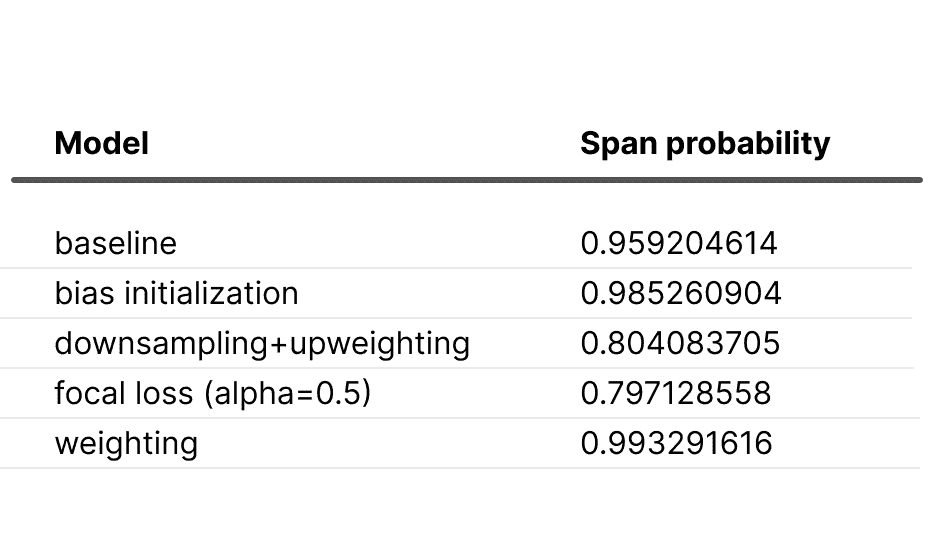

正如预期的那样，加权模型显示出过度自信，而“下采样 + 上加权”模型则表现出不足自信（由于上加权的“正常邮件”），与基线相比。值得注意的是，偏差初始化增加和焦点损失减少了模型在“垃圾邮件”类别中的信心。

# 摘要

总之，在必要时解决数据不平衡是可能的。请记住，一些技术会故意改变分布，仅在需要时应用。数据不平衡是一个特征，而不是一个错误！

尽管我们讨论了概率，但最终的性能指标是对业务最重要的。如果离线测试显示模型带来了价值，请继续在生产环境中测试它。

在我的实验中，我使用了[Toloka ML](https://tolokamodels.tech)平台。它提供了一系列现成的模型，可以为机器学习项目提供良好的开端。

总的来说，考虑数据分布对于训练机器学习模型至关重要。训练数据必须代表现实世界的分布，以使模型有效。如果数据本质上是不平衡的，模型应考虑这一点以在现实场景中表现良好。

**[谢尔盖·彼得罗夫](https://www.linkedin.com/in/sergei-petrov-12589210b/)** 是一名数据科学家，专注于各种深度学习应用。他的兴趣在于构建高效且可扩展的机器学习解决方案，这些解决方案对企业和社会都大有裨益。

### 更多相关主题

+   [克服多语言语音技术中的障碍：前 5 大挑战及创新解决方案](https://www.kdnuggets.com/2023/08/overcoming-barriers-multilingual-voice-technology-top-5-challenges-innovative-solutions.html)

+   [SQL 的 Group By 和 Partition By 场景：何时以及如何结合数据…](https://www.kdnuggets.com/sql-group-by-and-partition-by-scenarios-when-and-how-to-combine-data-in-data-science)

+   [探索小数据场景中迁移学习的潜力](https://www.kdnuggets.com/exploring-the-potential-of-transfer-learning-in-small-data-scenarios)

+   [KDnuggets 新闻，8 月 31 日：完整的数据科学学习路线图…](https://www.kdnuggets.com/2022/n35.html)

+   [处理不平衡数据的 7 种技术](https://www.kdnuggets.com/2017/06/7-techniques-handle-imbalanced-data.html)

+   [在类不平衡数据集中进行无监督的解缠表示学习…](https://www.kdnuggets.com/2023/01/unsupervised-disentangled-representation-learning-class-imbalanced-dataset-elastic-infogan.html)
