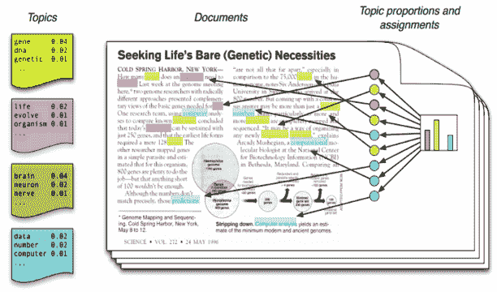
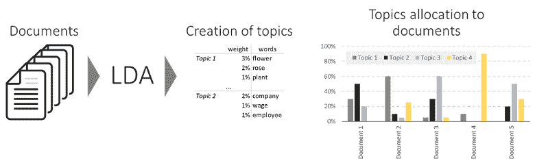
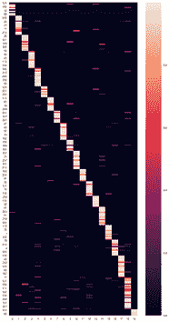
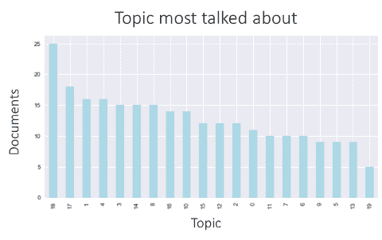

# Python 中基于潜在狄利克雷分配的主题提取概述

> 原文：[`www.kdnuggets.com/2019/09/overview-topics-extraction-python-latent-dirichlet-allocation.html`](https://www.kdnuggets.com/2019/09/overview-topics-extraction-python-latent-dirichlet-allocation.html)

comments

**作者：[Félix Revert](https://towardsdatascience.com/@FelixRvrt)，DataRobot 和 Velocity**

自然语言处理中的一个反复出现的主题是通过主题提取来理解大量文本数据。无论是分析用户的在线评论、产品描述，还是搜索框中输入的文本，理解关键主题总是非常有用的。

 文献中常用的图示来解释 LDA

在介绍 LDA 方法之前，我想提醒你，通常避免重复发明轮子并选择快速解决方案是最佳的开始。许多提供商提供了很棒的主题提取 API（且在一定调用次数内是免费的）：[Google](https://cloud.google.com/natural-language/)、[Microsoft](https://docs.microsoft.com/en-us/azure/cognitive-services/text-analytics/how-tos/text-analytics-how-to-entity-linking)、[MeaningCloud](https://www.meaningcloud.com/developer/topics-extraction)… 我试过这三者，它们都非常有效。

但是，如果你的数据非常具体，且没有通用的主题可以代表它，那么你将需要采用更个性化的方法。本文关注其中的一种方法：**LDA**。

### 理解 LDA

**直观理解**

LDA（*潜在狄利克雷分配*）是一个无监督的机器学习模型，它以文档作为输入，并以主题作为输出。该模型还会说明每个文档涉及每个主题的百分比。

一个主题被表示为一个加权的词列表。下面是一个主题的示例：

> flower * 0,2 | rose * 0,15 | plant * 0,09 |…

 LDA 输入/输出工作流的示意图

该模型有三个主要参数：

+   主题的数量

+   每个主题的单词数量

+   每个文档的主题数量

实际上，最后两个参数在算法中的设计并不完全是这样，但我更倾向于使用这些简化的版本，因为它们更容易理解。

**实现**

*[专门的 Jupyter 笔记本在文末分享]*

在这个例子中，我使用了从 BBC 网站获取的文章数据集。

要在 Python 中实现 LDA，我使用了*gensim*包。

LDA 的简单实现，我们要求模型创建 20 个主题

之前展示的参数是：

1.  主题的数量等于**num_topics**

1.  *[每个主题的]* 单词分布由**eta**处理

1.  *[每个文档的]* 主题分布由**alpha**处理

要打印发现的主题，可以使用以下代码：

```py
0: 0.024*"base" + 0.018*"data" + 0.015*"security" + 0.015*"show" + 0.015*"plan" + 0.011*"part" + 0.010*"activity" + 0.010*"road" + 0.008*"afghanistan" + 0.008*"track" + 0.007*"former" + 0.007*"add" + 0.007*"around_world" + 0.007*"university" + 0.007*"building" + 0.006*"mobile_phone" + 0.006*"point" + 0.006*"new" + 0.006*"exercise" + 0.006*"open"1: 0.014*"woman" + 0.010*"child" + 0.010*"tunnel" + 0.007*"law" + 0.007*"customer" + 0.007*"continue" + 0.006*"india" + 0.006*"hospital" + 0.006*"live" + 0.006*"public" + 0.006*"video" + 0.005*"couple" + 0.005*"place" + 0.005*"people" + 0.005*"another" + 0.005*"case" + 0.005*"government" + 0.005*"health" + 0.005*"part" + 0.005*"underground"2: 0.011*"government" + 0.008*"become" + 0.008*"call" + 0.007*"report" + 0.007*"northern_mali" + 0.007*"group" + 0.007*"ansar_dine" + 0.007*"tuareg" + 0.007*"could" + 0.007*"us" + 0.006*"journalist" + 0.006*"really" + 0.006*"story" + 0.006*"post" + 0.006*"islamist" + 0.005*"data" + 0.005*"news" + 0.005*"new" + 0.005*"local" + 0.005*"part"
```

*[显示前 3 个主题及其前 20 个最相关的词]* 主题 0 似乎与军事和战争有关。

关于印度健康的主题 1，涉及女性和儿童。

关于北马里的伊斯兰主义者的主题 2。

要打印文档涉及的主题百分比，请执行以下操作：

```py
[(14, 0.9983065953654187)]
```

第一个文档关于主题 14 的比例为 99.8%。

对于未见过的文档进行主题预测也是可行的，如下所示：

```py
[(1, 0.5173717951813482), (3, 0.43977106196150995)]
```

这份新文档讨论了 52%的主题 1，和 44%的主题 3。注意有 4%无法标记为现有主题。

**探索**

有一种很好的方式可以使用*pyLDAvis*包可视化你构建的 LDA 模型：

pyLDAvis 的输出

这种可视化方法允许你在两个降维的维度上比较主题，并观察主题中词汇的分布。

另一个很好的可视化方法是按照主要主题以对角格式显示所有文档。

文档中主题的比例可视化 *(文档为行，主题为列)* 主题 18 是文档中最主要的主题：25 个文档主要讨论它。

### 如何成功实现 LDA

LDA 是一个复杂的算法，通常被认为难以微调和解释。确实，使用 LDA 获得相关结果需要对其工作原理有深入了解。

**数据清理**

使用 LDA 时你会遇到的一个常见问题是词汇出现在多个主题中。应对这种情况的一种方法是将这些词加入到停用词列表中。

另一个需要注意的是复数和单数形式。我建议进行词形还原——或者如果无法进行词形还原，则进行词干提取，但在主题中出现的词干不容易理解。

去除包含数字的词也会清理你的主题中的词。如果你认为年份（2006 年，1981 年）在你的主题中有意义，可以保留这些年份。

过滤出至少在 3 个（或更多）文档中出现的词是去除不相关稀有词的好方法。

**数据准备**

包括双词组和三词组，以获取更相关的信息。

另一个经典的准备步骤是仅使用名词和动词，使用[词性标注](https://en.wikipedia.org/wiki/Part-of-speech_tagging)（POS：词性）。

**微调**

+   主题数量：尝试几个不同的主题数量，以了解哪个数量是合理的。你实际上需要*查看*这些主题，才能知道你的模型是否合理。与 K-Means 相比，LDA 收敛且模型在数学层面上合理，但这并不意味着它在人的层面上也合理。

+   清理数据：添加在主题中出现过于频繁的停用词，并重新运行模型是一种常见步骤。仅保留名词和动词，去除文本中的模板，迭代测试不同的清理方法，将改善你的主题。准备花费一些时间在这里。

+   Alpha、Eta。如果你不懂技术细节，就忘了这些吧。否则，你可以调整 alpha 和 eta 来调整你的主题。从‘auto’开始，如果主题不相关，可以尝试其他值。我建议使用低值的 Alpha 和 Eta，以便每个文档中有较少的主题，每个主题中有较少的相关词汇。

+   增加 *passes* 的数量以获得更好的模型。3 到 4 次是一个不错的数字，但你可以尝试更多。

**评估结果**

+   你的主题是否可解释？

+   你的主题是否独特？（两个不同的主题是否有不同的词汇）

+   你的主题是否详尽？（这些主题是否很好地代表了你的所有文档？）

如果你的模型符合这 3 个标准，它看起来是一个好的模型 :)

### LDA 的主要优点

**速度快**

使用 *%time* 命令在 Jupyter 中验证它。模型通常运行很快。当然，这取决于你的数据。有几个因素可能会拖慢模型的速度：

+   长文档

+   大量文档

+   大的词汇表大小（尤其是当你使用大 n 的 n-gram 时）

**直观性**

将主题建模为加权的词汇列表是一种简单的近似方法，但如果你需要解释，它是非常直观的方法。没有嵌入或隐藏维度，只有加权的词袋。

**它可以预测新未见文档的主题**

一旦模型运行完成，它就可以为任何文档分配主题。当然，如果你的训练数据集是英语的，而你想预测中文文档的主题，这将不起作用。但如果新文档具有相同的结构，并且应该有更多或更少相同的主题，它将有效。

### LDA 的主要缺点

**大量微调**

如果 LDA 运行很快，但要得到好的结果却会遇到一些麻烦。这就是为什么提前了解如何微调它会真正帮助你。

**需要人工解释**

主题由机器发现。人类需要给它们标注，以便向非专家展示结果。

**你无法影响主题**

知道你的某些文档讨论了你熟悉的话题，但在 LDA 找到的主题中找不到它，肯定会让人感到沮丧。而且没有办法告诉模型某些词应该放在一起。你必须等待 LDA 给你想要的结果。

### 结论

LDA 仍然是我最喜欢的主题提取模型之一，我在许多项目中使用过它。然而，它需要一些练习才能掌握。这就是为什么我写了这篇文章，以便你可以轻松使用 LDA，跳过使用它的入门障碍。

代码： [`github.com/FelixChop/MediumArticles/blob/master/LDA-BBC.ipynb`](https://github.com/FelixChop/MediumArticles/blob/master/LDA-BBC.ipynb)

**个人简介：[Félix Revert](https://towardsdatascience.com/@FelixRvrt)** 是 DataRobot 和 Velocity 的客户数据科学家

[原文](https://towardsdatascience.com/the-complete-guide-for-topics-extraction-in-python-a6aaa6cedbbc)。已获得许可转载。

**相关：**

+   使用 LSA、PLSA、LDA 和 lda2Vec 进行主题建模

+   从 PDF 文档中解锁并提取数据

+   领域特定语言处理从非结构化数据中挖掘价值

* * *

## 我们的前三个课程推荐

 1\. [谷歌网络安全证书](https://www.kdnuggets.com/google-cybersecurity) - 快速进入网络安全职业生涯。

 2\. [谷歌数据分析专业证书](https://www.kdnuggets.com/google-data-analytics) - 提升你的数据分析能力

 3\. [谷歌 IT 支持专业证书](https://www.kdnuggets.com/google-itsupport) - 支持你的组织进行 IT 管理

* * *

### 更多相关主题

+   [创建一个 Web 应用程序以从音频中提取主题（使用 Python）](https://www.kdnuggets.com/2023/01/creating-web-application-extract-topics-audio-python.html)

+   [回归基础第 4 周：高级主题与部署](https://www.kdnuggets.com/back-to-basics-week-4-advanced-topics-and-deployment)

+   [文本总结方法：概述](https://www.kdnuggets.com/2019/01/approaches-text-summarization-overview.html)

+   [机器学习数据标注：市场概述、方法与工具](https://www.kdnuggets.com/2021/12/data-labeling-ml-overview-and-tools.html)

+   [逻辑回归概述](https://www.kdnuggets.com/2022/02/overview-logistic-regression.html)

+   [汞概述：创建数据科学投资组合及…](https://www.kdnuggets.com/2022/05/overview-mercury-creating-data-science-portfolio-notebook-based-webapps.html)
