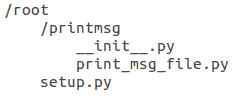
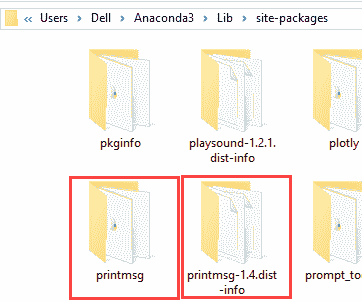
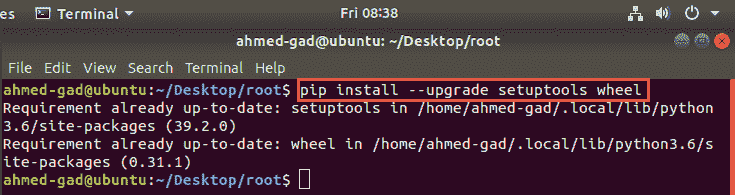
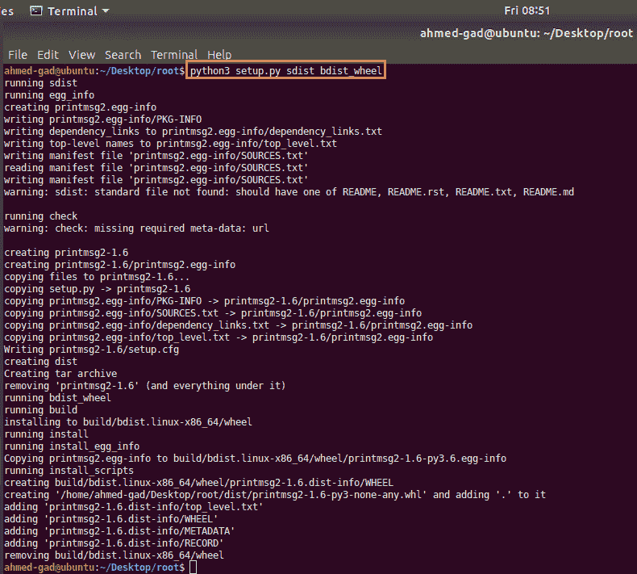
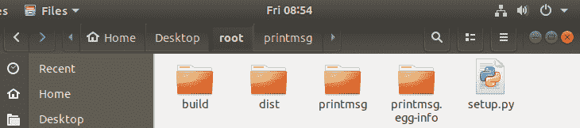
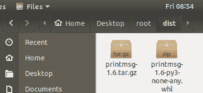
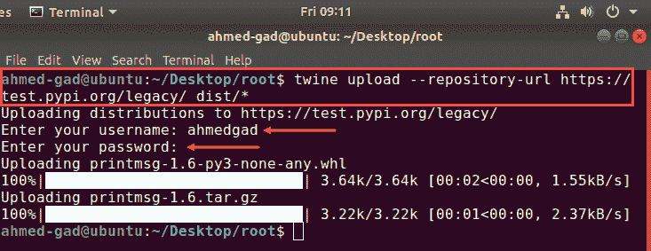
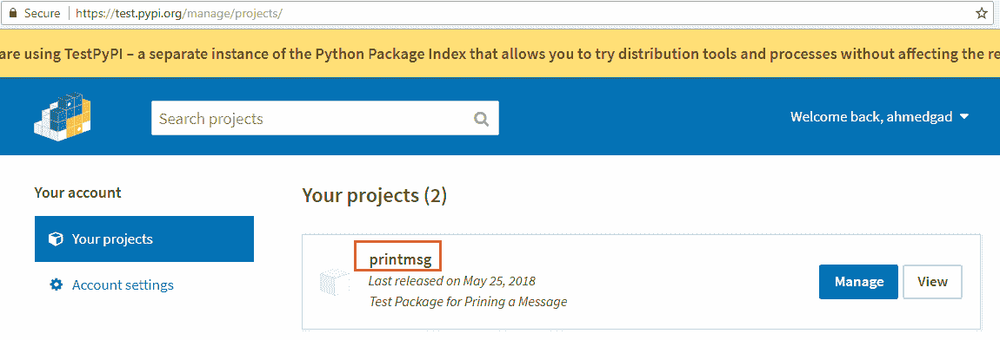

# 将你的 Python 项目打包并分发到 PyPI 以便通过 pip 安装

> 原文：[`www.kdnuggets.com/2018/06/packaging-distributing-python-project-pypi-pip.html/2`](https://www.kdnuggets.com/2018/06/packaging-distributing-python-project-pypi-pip.html/2)

 评论

### 5\. 准备包及其文件（__init__.py 和 setup.py）

第一步是结构化包及其文件。包的结构如图 7 所示。

**图 7**



目录的根目录包含了包的所有文件和目录。在根目录下，还有一个名为“**printmsg**”的目录，其中包含了实际的模块。该模块包含了我们的项目的 Python 代码，这些代码在安装后会被导入。

对于我们的简单示例，将使用所需的最小文件，即 **__init__.py** 和 **setup.py**，以及实际项目文件 **print_msg_file.py**。接下来是准备这些文件。

### 5.1 __init__.py

第一个需要准备的文件是 **__init__.py** 文件。这个文件的主要用途是允许 Python 将目录视为一个包。当包中有 **__init__.py** 文件时，包可以像普通库一样被导入，无论是通过哪个安装程序安装。即使文件为空，它的存在也足够。你可能会好奇为什么现在需要这个文件，而在第 3 步中手动安装库时不需要。答案是安装程序不会知道目录是一个包，如果没有 **__init__.py** 文件。因此，它不会提取库的 Python 文件（**print_msg_file.py**）。

在 Windows 上安装库时，使用 **__init__.py** 文件后，在 site-packages 目录中会生成两个文件夹（“**printmsg-1.4.dist-info**”和“**printmsg**”），如图 8 所示。“**printmsg**” 文件夹包含了待导入的 Python 文件。如果不使用 **__init__.py** 文件，那么将找不到“**printmsg**” 文件夹。结果，将无法使用 Python 代码，因为它将缺失。

**图 8**



除了告诉 Python 目录是一个 Python 包之外，**__init__.py** 文件是模块导入时第一个被加载的文件，因此可以进行初始化。

### 5.2 setup.py

在使用 **__init__.py** 文件将目录标记为包之后，接下来是添加有关包的更多详细信息。这就是 **setup.py** 文件的用途。**setup.py** 脚本提供了有关项目的详细信息，例如运行项目所需的依赖项。该脚本使用 **setuptools** 分发工具来构建分发文件，以便稍后上传到 PyPI。以下是用于分发项目的 setup.py 文件内容。

```py
import setuptools  

setuptools.setup(  
    name="printmsg",  
    version="1.6",  
    author="Ahmed Gad",  
    author_email="ahmed.f.gad@gmail.com",  
    description="Test Package for Printing a Message")

```

该文件包含多个字段，记录了如**name**（包名）、**version**（版本）、**author**（作者）、**author_email**（作者邮箱）、简短的**description**（描述）等细节，这些将在 PyPI 上显示，还有其他字段可以根据需要使用。

请注意，包名在当前有两个位置使用。一是模块目录，另一个是在 setup.py 文件中。它们必须相同吗？答案是否定的。每个名称有其自身的作用，但两者之间没有依赖关系。**setup.py**文件中使用的名称是安装包时使用的名称。目录的名称是导入模块时使用的名称。如果它们不同，则包将以一个名称安装，以另一个名称导入。为了避免混淆包用户，这两个名称之间应保持一致。

### 6\. 分发包

准备好包后，我们可以分发它。在实际分发之前，我们应该确保所需的依赖项已经存在。要分发项目，需要安装**setuptools**和**wheel**项目。**wheel**项目用于生成**wheel**分发格式。确保它们已安装并更新，如图 9 所示，根据此命令：

**ahmed-gad@ubuntu:~/Desktop/root $ pip install –upgrade setuptools wheel**

**Figure 9**



然后我们可以通过运行**setup.py**文件来分发包，如图 10 所示。打开终端后，将包的根目录设置为当前目录，然后执行**setup.py**文件。

**ahmed-gad@ubuntu:~/Desktop/root$ python3 setup.py sdist bdist_wheel**

**sdist**用于生成源代码分发格式，而**bdist_wheel**生成轮子构建分发格式。这两种分发格式都为不同用户的兼容性提供支持。

**Figure 10**



执行**setup.py**文件后，预期在包的根目录下会生成一些新目录。根目录中的文件和目录如图 11 所示。

**Figure 11**



最重要的文件夹是**dist**文件夹，因为它包含将上传到 PyPI 的发行文件。其内容如图 12 所示。它包含**.whl**文件，即构建分发文件，还有源代码分发**.tar.gz**文件。

**Figure 12**



准备好发行文件后，接下来是将它们上传到 PyPI。

### 7\. 将发行文件上传到测试 PyPI

有两个 Python 包仓库可供使用。其中一个用于测试和实验，即 Test PyPI (**test.pypi.org**)，另一个用于真实索引，即 PyPI (**pypi.org**)。它们的使用类似，但我们可以先使用 Test PyPI。

在上传到 Test PyPI 之前，你应该注册以获得用于上传包的用户名和密码。只需通过你的有效电子邮件地址注册，确认邮件将被发送以激活你的账户。注册链接是[`test.pypi.org/account/register/`](https://test.pypi.org/account/register/)。

注册完成后，我们可以使用**twine**工具将包分发上传到 Test PyPI。你应该确保按照以下命令安装和升级：

**ahmed-gad@ubuntu:~/Desktop/root $ pip install –upgrade twine**

一旦安装完成，你可以将包上传到 Test PyPI。打开终端，确保你当前在包的根目录，然后发出以下命令：

**ahmed-gad@ubuntu:~/Desktop/root $ twine upload --repository-url https://test.pypi.org/legacy/ dist/***

系统会要求你输入 Test PyPI 的用户名和密码。一旦验证成功，上传将开始。结果如图 13 所示。

**图 13**



成功上传文件后，你可以打开 Test PyPI 的个人资料查看你上传的项目。图 14 显示了**printmsg**项目成功上线。请注意，**setup.py**文件中的描述字段值现在已出现在仓库中。

**图 14**



### 8. 从 Test PyPI 安装分发包

到这一步，你已成功打包和分发你的 Python 项目。现在任何连接到互联网的用户都可以下载它。要使用 pip 安装该项目，只需发出以下命令。结果如图 15 所示。

**ahmed-gad@ubuntu:~/Desktop/root $ pip install --index-url https://test.pypi.org/simple/ printmsg**

**图 15**


### 9. 导入和使用已安装的包

安装项目后，它可以被导入。之前输入的以下两行现在可以执行。不同之处在于使用从 Test PyPI 安装的包，而不是手动安装的包。结果与图 4 所示相同。

```py
import printmsg.print_msg_file  

printmsg.print_msg_file.print_msg_func() 

```

### 10. 使用 PyPI 代替 Test PyPI

如果你决定将项目放入真实的 PyPI，你只需重复之前的步骤，稍作修改。首先，你需要在[`pypi.org/`](https://pypi.org/)注册并获取用户名和密码。我不想说你必须**再次**注册，因为 Test PyPI 的注册与 PyPI 的注册不同。

第一个变化是不使用**--repository-url**选项与**twine**，因为 PyPI 是上传包的默认仓库。因此，所需的命令如下：

**ahmed-gad@ubuntu:~/Desktop/root $ twine upload dist/***

类似地，第二个更改是出于相同原因省略**--index-url**选项和**pip**（PyPI 是安装包时的默认仓库）。

**ahmed-gad@ubuntu:~/Desktop/root $ pip install printmsg**

**简介：[Ahmed Gad](https://www.linkedin.com/in/ahmedfgad/)** 于 2015 年 7 月获得埃及门努非亚大学计算机与信息学院信息技术学士学位，成绩优异并获得荣誉。由于在学院中排名第一，他被推荐在 2015 年在一家埃及机构担任助教，并在 2016 年继续在学院担任助教和研究员。他目前的研究兴趣包括深度学习、机器学习、人工智能、数字信号处理和计算机视觉。

[原文](https://www.linkedin.com/pulse/packaging-distributing-your-python-project-pypi-installation-gad/)。经许可转载。

**相关：**

+   构建基于 HTTP 的 ConvNet 应用程序的完整指南，使用 TensorFlow 和 Flask RESTful Python API

+   使用 NumPy 从零开始构建卷积神经网络

+   遗传算法优化简介

* * *

## 我们的前三名课程推荐

 1\. [谷歌网络安全证书](https://www.kdnuggets.com/google-cybersecurity) - 快速进入网络安全职业

 2\. [谷歌数据分析专业证书](https://www.kdnuggets.com/google-data-analytics) - 提升您的数据分析技能

 3\. [谷歌 IT 支持专业证书](https://www.kdnuggets.com/google-itsupport) - 支持您的组织 IT

* * *

### 更多相关主题

+   [Pip Install YOU：创建您的 Python 库的初学者指南](https://www.kdnuggets.com/pip-install-you-a-beginners-guide-to-creating-your-python-library)

+   [忘掉 PIP、Conda 和 requirements.txt！改用 Poetry 并……](https://www.kdnuggets.com/2023/07/forget-pip-conda-requirementstxt-poetry-instead-thank-later.html)

+   [使用 Poetry 与 Conda 和 Pip 管理 Python 依赖项](https://www.kdnuggets.com/managing-python-dependencies-with-poetry-vs-conda-pip)

+   [如何为您的数据项目创建抽样计划](https://www.kdnuggets.com/2022/11/create-sampling-plan-data-project.html)

+   [使用 Prefect 在 Python 中编排数据科学项目](https://www.kdnuggets.com/2022/02/orchestrate-data-science-project-python-prefect.html)

+   [免费 Python 项目编码课程](https://www.kdnuggets.com/2022/08/free-python-project-coding-course.html)
