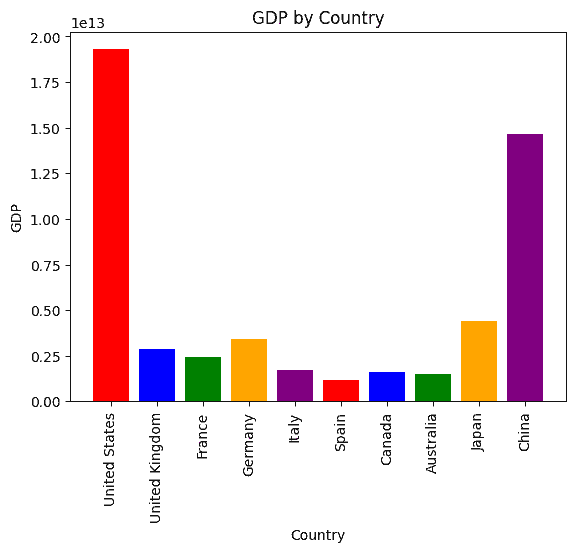

# Pandas AI：生成型 AI Python 库

> 原文：[`www.kdnuggets.com/2023/05/pandas-ai-generative-ai-python-library.html`](https://www.kdnuggets.com/2023/05/pandas-ai-generative-ai-python-library.html)


图片由编辑提供

[Python Pandas](https://pandas.pydata.org/)是一个开源工具包，为数据科学家和分析师提供了使用 Python 编程语言进行数据操作和分析的能力。Pandas 库在机器学习和深度学习的预处理阶段非常受欢迎。但现在你可以用它做更多的事情……

新的数据科学库 - [Pandas AI](https://github.com/gventuri/pandas-ai)即将推出。一个将生成型人工智能功能集成到 Pandas 中的 Python 库，使数据框能够进行对话。

# 什么是 Pandas AI？

让数据框能够对话是什么意思？

这正如它所说的那样 - 你可以与你的数据集对话。是的，你没听错，你可以与数据交谈并获得快速回应。作为数据科学家或分析师，你将不再需要盯着数据集看，反复浏览行列几个小时。Pandas AI 不会替代 Pandas，它只是给了它一个巨大的推动！

数据科学家和分析师花费大量时间清洗数据以进行分析阶段。他们现在将能够将数据分析提升到一个新的水平。数据专业人员寻找不同的方法和流程，以减少数据准备的时间，而现在他们可以使用 Pandas AI 实现这一目标。

PandasAI 与 Pandas 一起使用，而不是替代 Pandas。与其自己浏览并回答有关数据集的问题，不如向 PandasAI 提问，它将以 Pandas DataFrames 的形式返回答案。

话虽如此，这是否意味着人们不再需要精通 Python 才能使用诸如 Pandas 库这样的工具进行数据分析？

借助[OpenAI API](https://openai.com/blog/openai-api)，Pandas AI 旨在实现与你的机器进行对话的目标，以输出你想要的结果，而不是你自己编程任务。机器将以它们的语言 - 机器可解释代码（DataFrame） - 输出结果。

# 我如何使用 Pandas AI？

## 使用 pip 安装 Pandas AI

```py
pip install pandasai
```

## 使用 OpenAI 导入 PandasAI

为了使用新的 Pandas AI 库，你需要一个 OpenAI 密钥。一旦你开始使用你的笔记本，你需要导入以下内容：

```py
import pandas as pd
from pandasai import PandasAI
from pandasai.llm.openai import OpenAI

llm = OpenAI(api_token=your_API_key)
```

如果你没有唯一的 OpenAI API 密钥，你可以在[OpenAI 平台](https://platform.openai.com/)上创建一个帐户，并在[这里](https://platform.openai.com/account/api-keys)创建一个 API 密钥。你将获得一个 5 美元的积分，可以用于探索和实验 API。

一旦你准备好，你就可以开始使用 Pandas AI 了。

## 在你的数据框上运行模型

首先，你需要将你的 OpenAI 模型运行到 Pandas AI 上：

```py
pandas_ai = PandasAI(openAImodel)
```

然后你需要在数据框上运行模型，该数据框包含两个参数：你正在处理的数据框和你想要提问的问题：

```py
pandas_ai.run(df, prompt='the question you would like to ask?')
```

例如，你可能在浏览数据集时对某列值大于 5 的行感兴趣。你可以通过使用 Pandas AI 来实现：

```py
import pandas as pd
from pandasai import PandasAI

# Sample DataFrame
df = pd.DataFrame({
    "country": ["United States", "United Kingdom", "France", "Germany", "Italy", "Spain", "Canada", "Australia", "Japan", "China"],
    "gdp": [19294482071552, 2891615567872, 2411255037952, 3435817336832, 1745433788416, 1181205135360, 1607402389504, 1490967855104, 4380756541440, 14631844184064],
    "happiness_index": [6.94, 7.16, 6.66, 7.07, 6.38, 6.4, 7.23, 7.22, 5.87, 5.12]
})

# Instantiate a LLM
from pandasai.llm.openai import OpenAI
llm = OpenAI()

pandas_ai = PandasAI(llm)
pandas_ai.run(df, prompt='Which are the 5 happiest countries?')
```

它将返回一个 DataFrame 输出：

```py
6            Canada
7         Australia
1    United Kingdom
3           Germany
0     United States
Name: country, dtype: object
```

它还具有执行更复杂查询的能力，如数学计算和数据可视化。

数据可视化示例：

```py
pandas_ai.run(
    df,
    "Plot the histogram of countries showing for each the gpd, using different colors for each bar",
)
```

数据可视化输出：



图片由[PandasAI](https://github.com/gventuri/pandas-ai)提供

Pandas AI 非常新，团队仍在寻找改进库的方法。截至 5 月 10 日，他们的待办事项清单中还有以下内容：

+   添加对更多 LLMs 的支持

+   使 PandasAI 能够通过 CLI 访问

+   为 PandasAI 创建一个 Web 界面

+   添加单元测试

欢迎提出建议和贡献。如果你有兴趣为 Pandas AI 的成长做出贡献，请参考[贡献指南](https://github.com/gventuri/pandas-ai/blob/main/CONTRIBUTING.md)。

如果你想查看使用 Pandas AI 的演示，查看这个视频：

# 总结一下

虽然 Pandas AI 并不取代 Pandas，但它是提升工作流程的好工具。尽管你可以向 Pandas AI 提问你的数据集，你仍需精通编程，以便在库出现错误时进行修正和指导。

如果你有机会使用 Pandas AI，欢迎在下方评论告诉我们你的看法！

**[Nisha Arya](https://www.linkedin.com/in/nisha-arya-ahmed/)** 是一名数据科学家，自由技术写作人员和 KDnuggets 的社区经理。她特别关注提供数据科学职业建议、教程和理论知识。她还希望探索人工智能如何有助于人类寿命的不同方式。她是一个热衷学习的人，寻求拓宽她的技术知识和写作技能，同时帮助指导他人。

* * *

## 我们的前三个课程推荐

 1\. [Google 网络安全证书](https://www.kdnuggets.com/google-cybersecurity) - 快速进入网络安全职业。

 2\. [Google 数据分析专业证书](https://www.kdnuggets.com/google-data-analytics) - 提升你的数据分析技能

 3\. [Google IT 支持专业证书](https://www.kdnuggets.com/google-itsupport) - 支持你的组织在 IT 方面

* * *

### 更多相关话题

+   [像专业人士一样测试：Python 的 Mock 库逐步指南](https://www.kdnuggets.com/testing-like-a-pro-a-step-by-step-guide-to-pythons-mock-library)

+   [MarshMallow：最甜美的数据序列化和…Python 库](https://www.kdnuggets.com/marshmallow-the-sweetest-python-library-for-data-serialization-and-validation)

+   [Pip 安装 YOU：创建你的 Python 库的初学者指南](https://www.kdnuggets.com/pip-install-you-a-beginners-guide-to-creating-your-python-library)

+   [使用 Datawig，这个 AWS 深度学习库用于缺失值插补](https://www.kdnuggets.com/2021/12/datawig-aws-deep-learning-library-missing-value-imputation.html)

+   [skops：提升生产环境中 Scikit-learn 的新库](https://www.kdnuggets.com/2023/02/skops-new-library-improve-scikitlearn-production.html)

+   [介绍自然语言处理测试库](https://www.kdnuggets.com/2023/04/introducing-testing-library-natural-language-processing.html)
