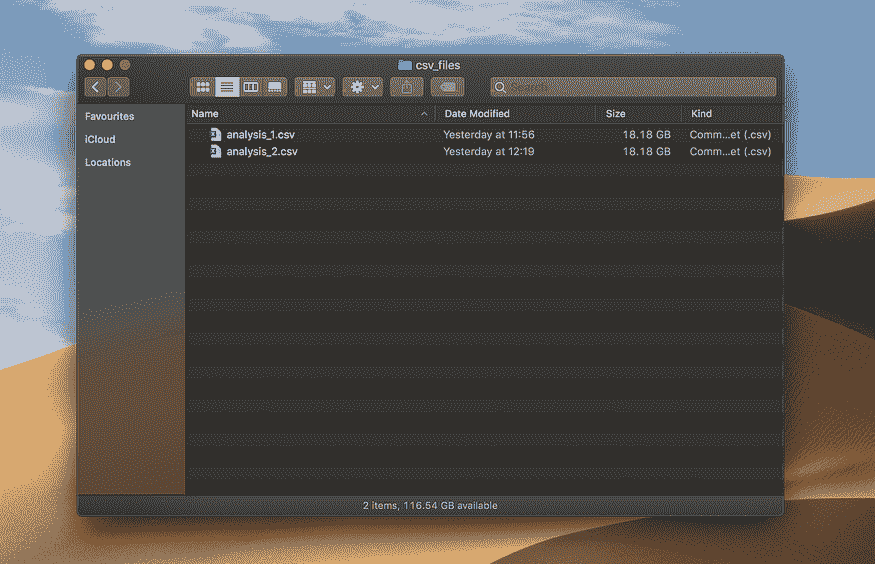
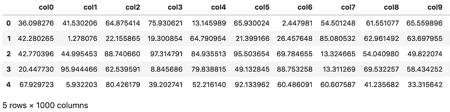
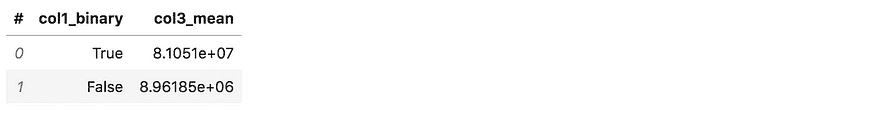
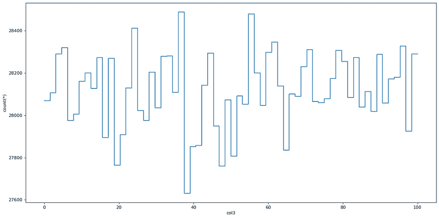
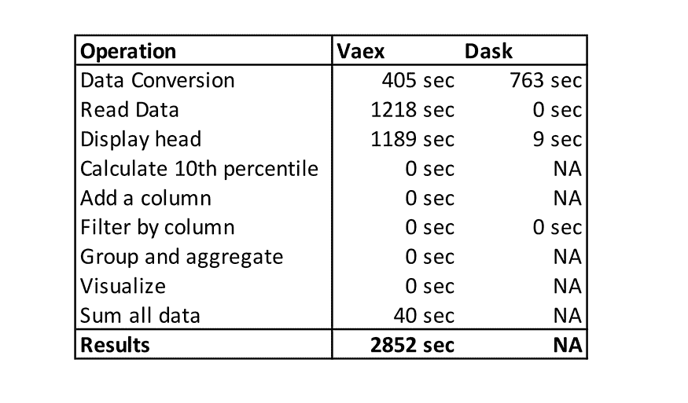

# 你还在用 Pandas 处理大数据吗？这里有两个更好的选择

> 原文：[`www.kdnuggets.com/2021/03/pandas-big-data-better-options.html`](https://www.kdnuggets.com/2021/03/pandas-big-data-better-options.html)

评论

**作者 [Roman Orac](https://www.linkedin.com/in/romanorac/)，数据科学家**。


* * *

## 我们的三大课程推荐

 1\. [谷歌网络安全证书](https://www.kdnuggets.com/google-cybersecurity) - 快速进入网络安全职业生涯。

 2\. [谷歌数据分析专业证书](https://www.kdnuggets.com/google-data-analytics) - 提升你的数据分析能力

 3\. [谷歌 IT 支持专业证书](https://www.kdnuggets.com/google-itsupport) - 支持你的组织 IT

* * *

*照片由 [NASA](https://unsplash.com/@nasa?utm_source=medium&utm_medium=referral) 提供，来自 [Unsplash](https://unsplash.com/?utm_source=medium&utm_medium=referral)。*

我最近写了两篇关于用 [Dask](https://towardsdatascience.com/are-you-still-using-pandas-for-big-data-12788018ba1a) 和 [Vaex](https://towardsdatascience.com/how-to-process-a-dataframe-with-billions-of-rows-in-seconds-c8212580f447) 处理大数据的入门文章——这些库用于处理超出内存的数据集。在写作过程中，我心里产生了一个问题：

***这些库真的能处理超出内存的数据集吗，还是仅仅是销售口号？***

这让我产生了用 Dask 和 Vaex 进行实际实验的兴趣，尝试处理一个超出内存的数据集。数据集大到连 Pandas 都无法打开。

### 我所说的大数据是什么意思？


*照片由 [ev](https://unsplash.com/@ev?utm_source=medium&utm_medium=referral) 提供，来自 [Unsplash](https://unsplash.com/?utm_source=medium&utm_medium=referral)。*

大数据是一个松散定义的术语，其定义如同 Google 上的点击次数一样多。在本文中，我用这个术语来描述一个如此庞大的数据集，以至于我们需要专业的软件来处理它。这里的“大”指的是“超出单台机器的主内存”。

*维基百科定义：*

> *大数据是一个领域，处理分析、系统性提取信息或以其他方式处理数据集的方法，这些数据集太大或复杂，传统的数据处理应用程序软件无法处理。*

### Dask 和 Vaex 是什么？


*照片由 [JESHOOTS.COM](https://unsplash.com/@jeshoots?utm_source=medium&utm_medium=referral) 提供，来自 [Unsplash](https://unsplash.com/?utm_source=medium&utm_medium=referral)。*

**Dask** 提供了先进的并行处理分析能力，使你喜爱的工具在规模上表现优异。这包括 numpy、pandas 和 sklearn。它是开源的，并且免费提供。它使用现有的 Python API 和数据结构，方便你在 Dask 驱动的等效工具之间切换。

**Vaex** 是一个高性能的 Python 库，用于懒加载的 Out-of-Core DataFrames（类似于 Pandas），用于可视化和探索大型表格数据集。它可以每秒计算超过十亿行的基本统计数据。它支持多种可视化，允许对大数据进行交互式探索。

Dask 和 Vaex Dataframes 与 Pandas Dataframes 并不完全兼容，但一些最常见的“数据整理”操作都被这两种工具所支持。Dask 更专注于将代码扩展到计算集群，而 Vaex 则使在单台机器上处理大型数据集变得更加容易。

### 实验


*由[Louis Reed](https://unsplash.com/@_louisreed?utm_source=medium&utm_medium=referral)拍摄，发布在[Unsplash](https://unsplash.com/?utm_source=medium&utm_medium=referral)上的照片。*

我生成了两个包含 100 万行和 1000 列的 CSV 文件。每个文件的大小为 18.18 GB，两个文件合计 36.36 GB。文件中包含从 0 到 100 的均匀分布的随机数。



*两个包含随机数据的 CSV 文件。作者拍摄的照片。*

```py
import pandas as pd
import numpy as np
from os import path
n_rows = 1_000_000
n_cols = 1000
for i in range(1, 3):
    filename = 'analysis_%d.csv' % i
    file_path = path.join('csv_files', filename)
    df = pd.DataFrame(np.random.uniform(0, 100, size=(n_rows, n_cols)), columns=['col%d' % i for i in range(n_cols)])
    print('Saving', file_path)
    df.to_csv(file_path, index=False)
df.head()

```



*文件头。作者拍摄的照片。*

实验在一台具有 32 GB 主内存的 MacBook Pro 上运行——真是一个强大的机器。在测试 pandas Dataframe 的极限时，我惊讶地发现，在这样的机器上遇到内存错误是相当有挑战性的！

当内存接近其容量时，macOS 会开始将数据从主内存转储到 SSD 上。pandas Dataframe 的上限是机器上 100 GB 的自由磁盘空间。

> 当你的 Mac 需要内存时，它会将当前未使用的内容推送到交换文件中进行临时存储。当再次需要访问时，它会从交换文件中读取数据并恢复到内存中。

我花了一些时间思考如何解决这个问题，以确保实验的公平性。我想到的第一个想法是禁用交换空间，这样每个库只有主内存可用——在 macOS 上实现这一点真是困难重重。经过几个小时的努力，我无法禁用交换空间。

第二个想法是使用暴力破解的方法。我将 SSD 填满了它的全部容量，以至于操作系统无法使用交换空间，因为设备上没有剩余空间。


*实验期间的“磁盘几乎已满”通知。作者拍摄的照片。*

这有效！pandas 无法读取两个 18 GB 的文件，Jupyter 内核崩溃了。

如果我再次进行这个实验，我会创建一个内存较少的虚拟机。这样，更容易展示这些工具的限制。

Dask 或 Vaex 能否帮助我们处理这些大文件？哪个更快？让我们来找出答案。

### Vaex 与 Dask


*照片由 [Frida Bredesen](https://unsplash.com/@fridooh?utm_source=medium&utm_medium=referral) 在 [Unsplash](https://www.kdnuggets.com/2021/02/data-science-learning-roadmap-2021.html)提供。*

在设计实验时，我考虑了进行数据分析时的基本操作，如分组、过滤和数据可视化。我提出了以下操作：

+   计算一列的第 10 分位数，

+   添加新列，

+   按列过滤，

+   按列分组并聚合，

+   可视化一列。

上述所有操作都使用单列进行计算，例如：

```py
# filtering with a single column
df[df.col2 > 10]

```

因此我对尝试一个需要处理所有数据的操作产生了兴趣：

+   计算所有列的总和。

通过将计算分解成更小的块可以实现这一点。例如，单独读取每一列并计算总和，最后一步计算整体总和。这类计算问题被称为 [Embarrassingly parallel](https://en.wikipedia.org/wiki/Embarrassingly_parallel) —— 不需要费力将问题分解成独立任务。

### Vaex


*照片由 [Photos by Lanty](https://unsplash.com/@photos_by_lanty?utm_source=medium&utm_medium=referral) 在 [Unsplash](https://unsplash.com/?utm_source=medium&utm_medium=referral)提供。*

让我们从 Vaex 开始。实验设计遵循了每个工具的最佳实践——这就是使用 Vaex 的二进制格式 HDF5。因此，我们需要将 CSV 文件转换为 HDF5 格式（层次数据格式第 5 版）。

```py
import glob
import vaex
csv_files = glob.glob('csv_files/*.csv')
for i, csv_file in enumerate(csv_files, 1):
    for j, dv in enumerate(vaex.from_csv(csv_file, chunk_size=5_000_000), 1):
        print('Exporting %d %s to hdf5 part %d' % (i, csv_file, j))
        dv.export_hdf5(f'hdf5_files/analysis_{i:02}_{j:02}.hdf5')

```

Vaex 需要 405 秒将两个 CSV 文件（36.36 GB）转换为两个 HDF5 文件（总共 16 GB）。从文本到二进制格式的转换减少了文件大小。

**使用 Vaex 打开 HDF5 数据集：**

```py
dv = vaex.open('hdf5_files/*.hdf5')

```

Vaex 读取 HDF5 文件花费了 1218 秒。我原本期望它更快，因为 Vaex 声称可以瞬间打开二进制格式的文件。

*[来自 Vaex 文档](https://vaex.readthedocs.io/en/latest/example_io.html#Binary-file-formats):*

> *打开此类数据是瞬时的，无论磁盘上的文件大小如何：Vaex 只会将数据映射到内存中，而不是读取到内存中。这是处理比可用 RAM 更大的数据集的最佳方式。*

**使用 Vaex 显示表头：**

```py
dv.head()

```

Vaex 显示表头花费了 1189 秒。我不确定为什么显示每列的前 5 行需要这么长时间。

**使用 Vaex 计算第 10 分位数：**

注意，Vaex 具有 percentile_approx 函数，用于计算分位数的近似值。

```py
quantile = dv.percentile_approx('col1', 10)

```

Vaex 计算 col1 列第 10 分位数的近似值花费了 0 秒。

**使用 Vaex 添加新列：**

```py
dv[‘col1_binary’] = dv.col1 > dv.percentile_approx(‘col1’, 10)

```

Vaex 有一个虚拟列的概念，它将表达式存储为列。它不占用任何内存，并在需要时动态计算。虚拟列与普通列一样对待。正如预期的那样，Vaex 执行上述命令所需的时间为 0 秒。

**使用 Vaex 过滤数据：**

Vaex 有一个 [选择](https://vaex.readthedocs.io/en/latest/tutorial.html#Selections-and-filtering) 的概念，我没有使用，因为 Dask 不支持选择，这会使实验不公平。下面的过滤器类似于用 pandas 进行的过滤，只不过 Vaex 不会复制数据。

```py
dv = dv[dv.col2 > 10]

```

Vaex 执行上述过滤器所需的时间为 0 秒。

**使用 Vaex 进行数据分组和聚合：**

下面的命令与 pandas 稍有不同，因为它结合了分组和聚合。该命令按 col1_binary 对数据进行分组，并计算 col3 的均值：

```py
group_res = dv.groupby(by=dv.col1_binary, agg={'col3_mean': vaex.agg.mean('col3')})

```



*使用 Vaex 计算均值。照片由作者拍摄。*

Vaex 执行上述命令所需的时间为 0 秒。

**可视化直方图：**

使用更大数据集进行可视化是有问题的，因为传统的数据分析工具未针对处理这些数据集进行优化。让我们尝试用 Vaex 制作 col3 的直方图。

```py
plot = dv.plot1d(dv.col3, what='count(*)', limits=[0, 100])

```



*使用 Vaex 可视化数据。照片由作者拍摄。*

Vaex 显示图表所需的时间为 0 秒，这速度令人惊讶。

**计算所有列的总和**

在一次处理单列时，内存不是问题。让我们尝试用 Vaex 计算数据集中所有数字的总和。

```py
suma = np.sum(dv.sum(dv.column_names))

```

Vaex 需要 40 秒计算所有列的总和。

### Dask


*照片由 [Kelly Sikkema](https://unsplash.com/@kellysikkema?utm_source=medium&utm_medium=referral) 贡献，来源于 [Unsplash](https://unsplash.com/?utm_source=medium&utm_medium=referral)。*

现在，让我们用 Dask 重复以上操作。Jupyter 内核在运行 Dask 命令之前已重新启动。

我们将 CSV 文件转换为 HDF5，以使实验公平，而不是直接使用 Dask 的 read_csv 函数读取 CSV 文件。

```py
import dask.dataframe as dd
ds = dd.read_csv('csv_files/*.csv')
ds.to_hdf('hdf5_files_dask/analysis_01_01.hdf5', key='table')

```

Dask 需要 763 秒进行转换。如果你知道更快的转换方法，请在评论中告诉我。我尝试读取用 Vaex 转换的 HDF5 文件但没有成功。

*[Dask 的最佳实践](https://docs.dask.org/en/latest/dataframe-best-practices.html#store-data-in-apache-parquet-format):*

> *HDF5 是 Pandas 用户在高性能需求下的热门选择。我们鼓励 Dask DataFrame 用户使用 Parquet 存储和加载数据。*

**用 Dask 打开 HDF5 数据集：**

```py
import dask.dataframe as dd

ds = dd.read_csv('csv_files/*.csv')

```

Dask 需要 0 秒打开 HDF5 文件。这是因为我没有明确运行计算命令，这实际上会读取文件。

**用 Dask 显示头部：**

```py
ds.head()

```

Dask 需要 9 秒钟输出文件的前 5 行。

**使用 Dask 计算第 10 个分位数：**

Dask 有一个分位数函数，它计算实际分位数，而不是近似值。

```py
quantile = ds.col1.quantile(0.1).compute()

```

Dask 无法计算分位数，因为 Jupyter Kernel 崩溃了。

**使用 Dask 定义新列：**

下面的函数使用分位数函数定义一个新的二进制列。Dask 无法计算，因为它使用了分位数。

```py
ds['col1_binary'] = ds.col1 > ds.col1.quantile(0.1)

```

**使用 Dask 过滤数据：**

```py
ds = ds[(ds.col2 > 10)]

```

上面的命令执行了 0 秒，因为 Dask 使用延迟执行范式。

**使用 Dask 对数据进行分组和聚合：**

```py
group_res = ds.groupby('col1_binary').col3.mean().compute()

```

Dask 无法对数据进行分组和聚合。

**可视化 col3 的直方图：**

```py
plot = ds.col3.compute().plot.hist(bins=64, ylim=(13900, 14400))

```

Dask 无法可视化数据。

**计算所有列的总和：**

```py
suma = ds.sum().sum().compute()

```

Dask 无法对所有数据进行求和。

### 结果

下表显示了 Vaex 与 Dask 实验的执行时间。NA 表示该工具无法处理数据，Jupyter Kernel 崩溃。



*实验中的执行时间总结。照片由作者提供。*

### 结论


*照片由 [Joshua Golde](https://unsplash.com/@joshgmit?utm_source=medium&utm_medium=referral) 提供，来自 [Unsplash](https://unsplash.com/?utm_source=medium&utm_medium=referral)。*

Vaex 需要将 CSV 转换为 HDF5 格式，这对我来说没问题，因为你可以去吃午餐，回来时数据就会被转换。我也理解，在恶劣条件下（如实验中）主内存不足或没有主内存的情况下，读取数据将需要更长时间。

我不明白的是 Vaex 显示文件头部所需的时间（前 5 行需要 1189 秒！）。Vaex 中的其他操作经过了大量优化，使我们能够对大于主内存的数据集进行交互式数据分析。

我有点预期 Dask 会出现问题，因为它更优化用于计算集群而非单台机器。Dask 建立在 pandas 之上，这意味着在 pandas 中缓慢的操作在 Dask 中仍然缓慢。

实验的赢家已经明确。Vaex 能够处理大于主内存的文件，而 Dask 不能。这个实验是具体的，因为我是在单台机器上测试性能，而不是计算集群。

[原文](https://towardsdatascience.com/are-you-still-using-pandas-to-process-big-data-in-2021-850ab26ad919)。经许可转载。

**相关：**

+   [用 Dask 进行全流程数据科学的 Pandas 升级版](https://www.kdnuggets.com/2020/11/pandas-steroids-dask-python-data-science.html)

+   [为何及如何在大数据中使用 Dask](https://www.kdnuggets.com/2020/04/dask-big-data.html)

+   [告别大数据。你好，大规模数据！](https://www.kdnuggets.com/2020/10/sqream-massive-data.html)

### 更多相关内容

+   [使用管道编写干净的 Python 代码](https://www.kdnuggets.com/2021/12/write-clean-python-code-pipes.html)

+   [建立一个强大的数据团队](https://www.kdnuggets.com/2021/12/build-solid-data-team.html)

+   [2021 年最佳 ETL 工具](https://www.kdnuggets.com/2021/12/mozart-best-etl-tools-2021.html)

+   [文本分类任务的最佳架构：基准测试…](https://www.kdnuggets.com/2023/04/best-architecture-text-classification-task-benchmarking-options.html)

+   [成为优秀数据科学家所需的 5 项关键技能](https://www.kdnuggets.com/2021/12/5-key-skills-needed-become-great-data-scientist.html)

+   [每个初学者数据科学家都应掌握的 6 种预测模型](https://www.kdnuggets.com/2021/12/6-predictive-models-every-beginner-data-scientist-master.html)
