# Pandas DataFrame 索引

> 原文：[`www.kdnuggets.com/2019/04/pandas-dataframe-indexing.html`](https://www.kdnuggets.com/2019/04/pandas-dataframe-indexing.html)

 评论

### 使用 `loc[]` 按标签选择行和列。

### 使用 `iloc[]` 按位置选择行和列。

### 明确指定行和列，即使是使用“:”

* * *

## 我们的前 3 个课程推荐

 1\. [Google 网络安全证书](https://www.kdnuggets.com/google-cybersecurity) - 快速进入网络安全职业生涯。

 2\. [Google 数据分析专业证书](https://www.kdnuggets.com/google-data-analytics) - 提升你的数据分析技能

 3\. [Google IT 支持专业证书](https://www.kdnuggets.com/google-itsupport) - 支持你组织的 IT

* * *

[要观看视频、获取幻灯片和代码，请查看课程。它是免费的（$ 和 CC0）。](https://end-to-end-machine-learning.teachable.com/courses/516023/lectures/9460205)

### 长版：为不喜欢记忆的人的 Pandas DataFrame 索引

有很多方法可以从 DataFrame 中提取元素、行和列。（如果你有兴趣，可以查看 Ted Petrou 的 [7(!)-部分系列](https://medium.com/dunder-data/selecting-subsets-of-data-in-pandas-6fcd0170be9c) 关于 pandas 索引。）一些索引方法看起来非常相似，但行为却非常不同。本文的目标是确定一种简单易懂并且结果可靠的 DataFrame 数据提取策略。只是提醒一下——这些仅仅是我个人的想法，并不保证权威或准确。

首先，我们使用维基百科上关于世界最高山峰的数据创建一个小数据框。对于每座山，我们都有其名称、高度（以米为单位）、首次登顶的年份以及所属的山脉。如果这是你第一次接触 pandas DataFrame，那么每座山及其相关信息就是一行，每条信息，例如名称或高度，是一列。

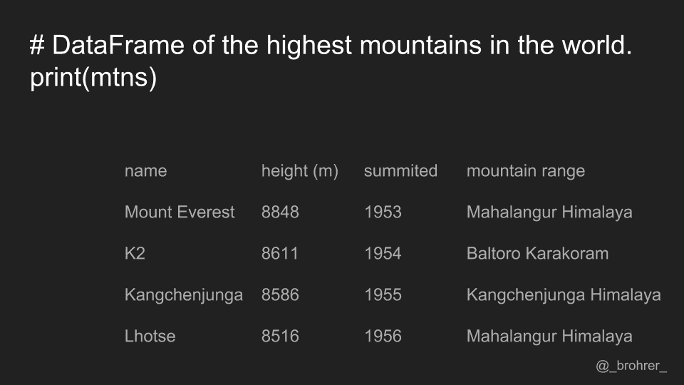

每一列都有一个名称，也称为标签。我们列的标签是 'name'、'height (m)'、'summitted' 和 'mountain range'。在 pandas 数据框中，每一行也有一个名称。默认情况下，这个标签就是行号。然而，你可以将其中一列设置为 DataFrame 的索引，这意味着它的值将用作行标签。我们将列 'name' 设置为我们的索引。

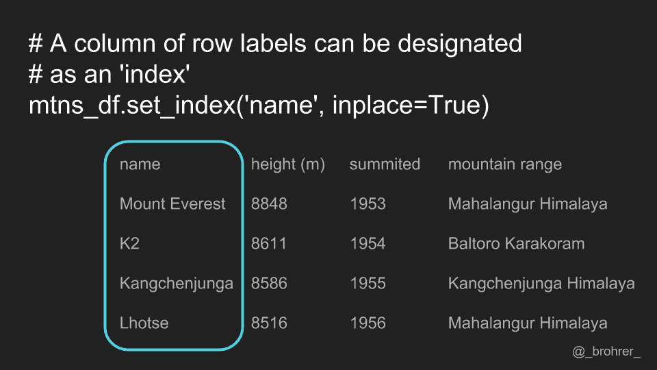

从 DataFrame 中挑选一个列进行操作是常见的操作。要通过标签选择列，我们使用 `.loc[]` 函数。为了使我们的命令易于解释，我们可以始终包括我们感兴趣的行索引和列索引。在这种情况下，我们对所有行感兴趣。为了表示这一点，我们使用冒号。然后，为了指示我们感兴趣的列，我们添加它的标签。命令 `mountains.loc[:, 'summitted']` 获取的是 'summitted' 列。

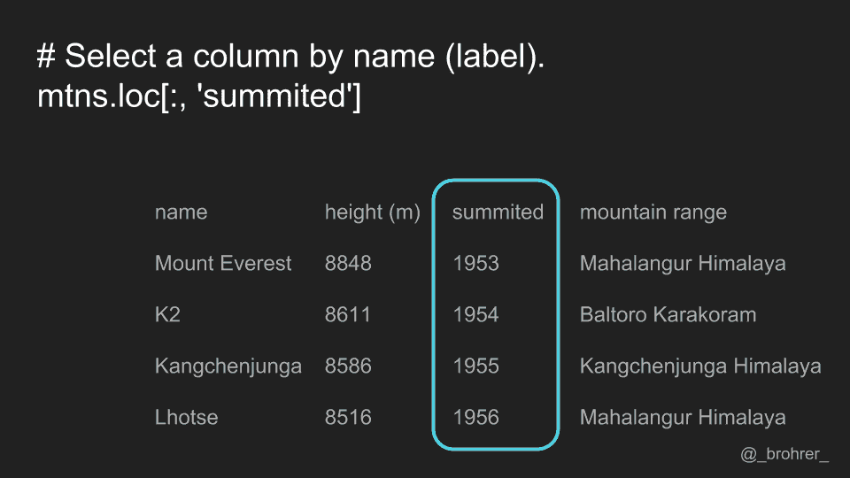

值得注意的是，这个命令返回的是 Series，这是 pandas 用来表示列的数据结构。如果我们只想要 'summitted' 列中的数字数组，而不是 Series，那么我们在命令末尾添加 `.values`。这会返回一个包含 [1953, 1954, 1955, 和 1956] 的 numpy 数组。

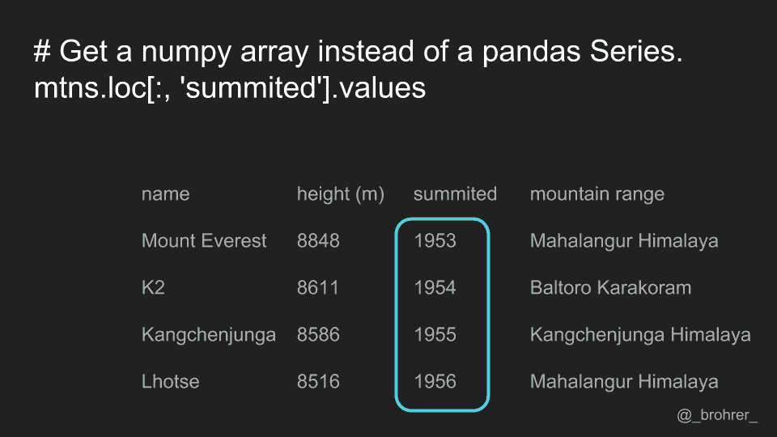

如果我们只想获取单行，则再次使用 `.loc[]` 函数，这次指定行标签，并在列位置放置冒号。

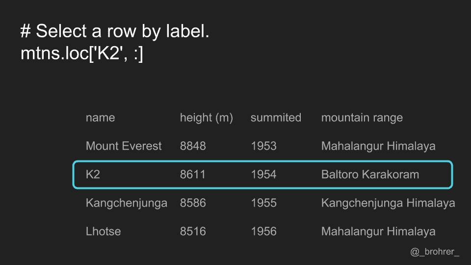

如果我们只想要一个单一值，比如 K2 被征服的年份，那么我们可以同时指定行和列的标签。行标签总是先于列标签。

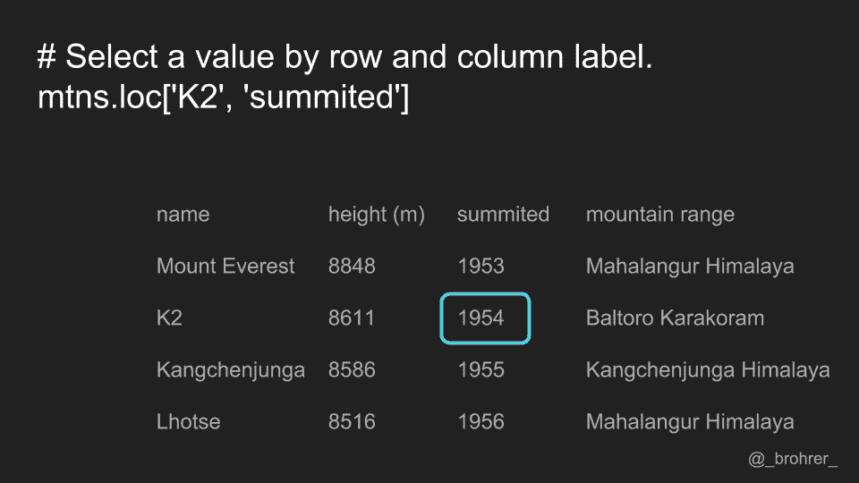

虽然你可以只使用一个参数来调用 `.loc[]` 函数，但如果你总是同时指定行和列，即使是用冒号，这样会更容易解释。

使用这种方法，我们不必仅限于单行或单列。在这里，在行位置，我们传递一个标签列表。这会返回一组行，而不是仅仅一行。

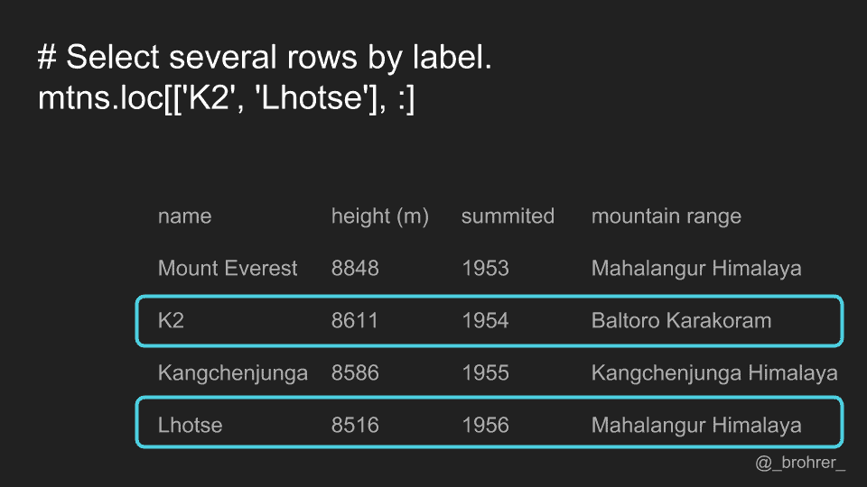

我们还可以通过指定起始列和结束列，并在其间放置冒号，来获取列的子集。在这种情况下，'height': 'summitted' 会给我们起点 'height' 和终点 'summitted' 之间（包括这两者）的所有列。请注意，这与 numpy 中的数字索引不同，在 numpy 中，端点是被省略的。此外，由于我们已经将名称列指定为索引，它也会在我们返回的数据框中出现。

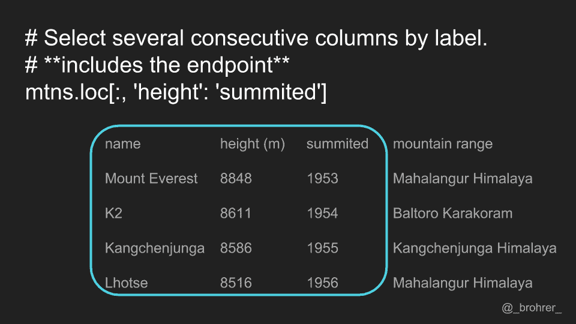

此外，我们可以选择满足某个条件的行或列。在这种情况下，我们想要找到 'summitted' 列中值大于 1954 的行。在行位置，我们可以放置任何布尔表达式，该表达式的值数量与行数相同。如果我们愿意，也可以对列做同样的操作。

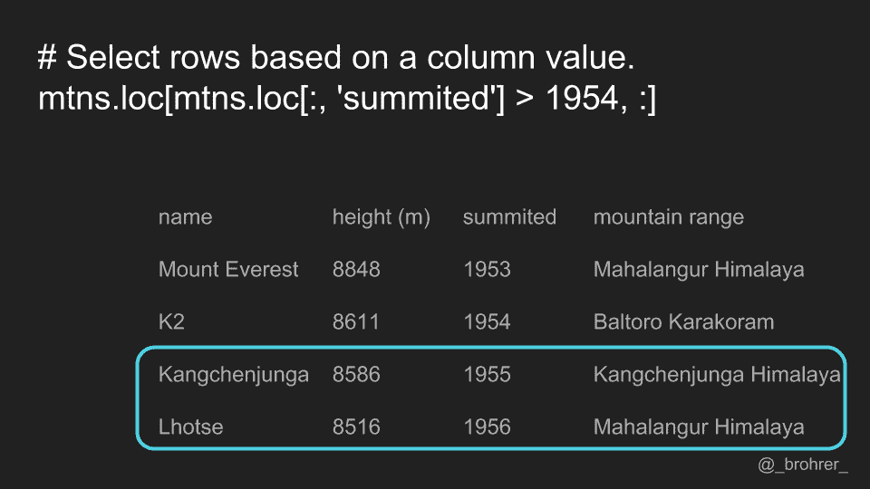

作为基于标签选择行和列的替代方法，我们也可以通过行和列的编号来选择它们。列的排序以及位置取决于数据框的初始化方式。索引列，即我们的“名称”列，不计入其中。

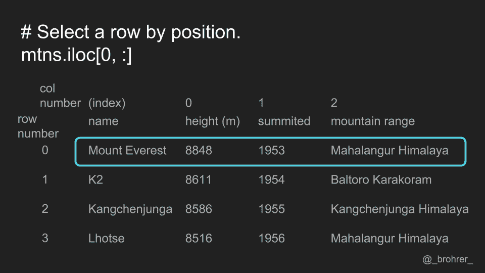

要通过位置选择数据，我们使用 .iloc[] 函数。再次，第一参数用于行，第二参数用于列。要选择零行中的所有列，我们写 .iloc[0, ;]

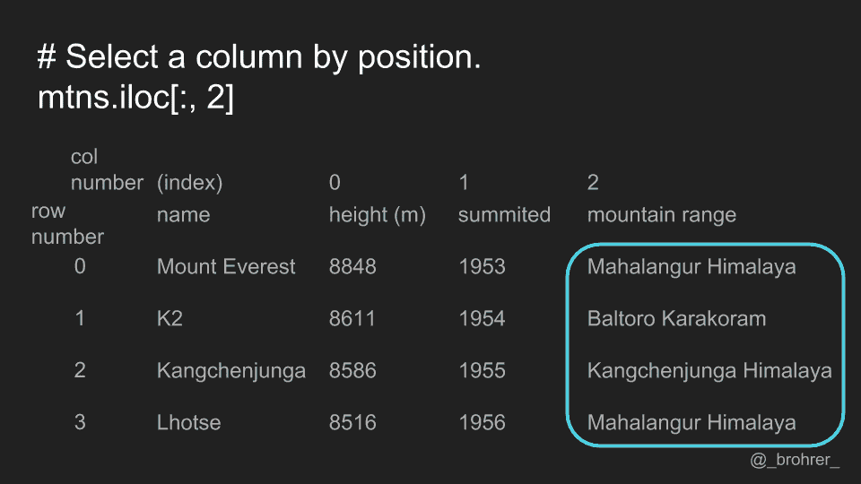

同样，我们可以通过位置选择列，将所需的列号放入 .iloc[] 函数的列位置中。

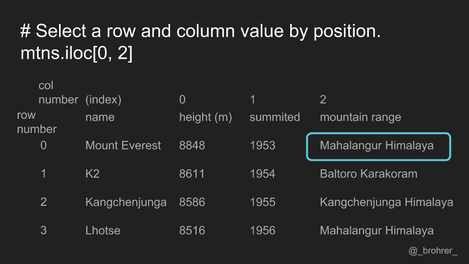

我们可以通过指定行和列的位置来提取单个值。

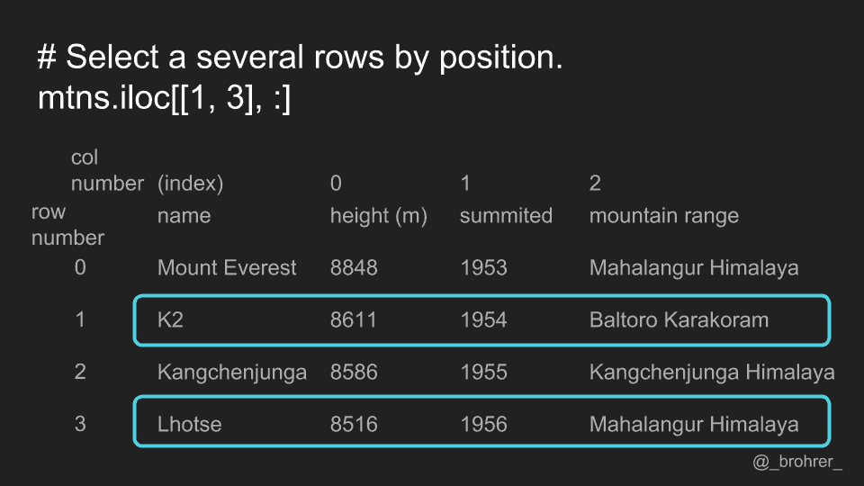

如果我们想挑选特定的行和/或列，可以传递位置列表。

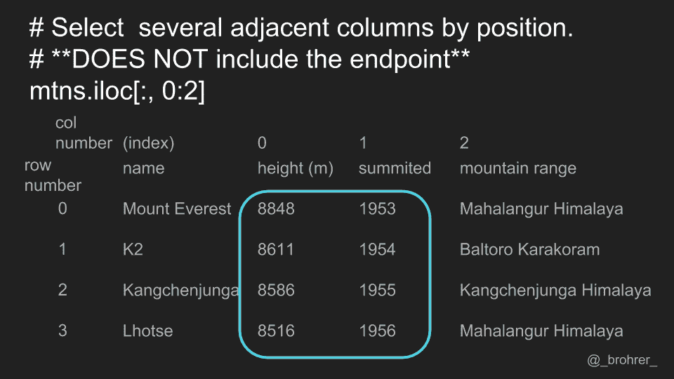

我们还可以使用冒号范围操作符通过位置获取一组连续的行或列。注意，与使用标签的 .loc[] 函数不同，使用位置的 .iloc[] 函数不包括端点。在这种情况下，它仅返回列零和一，而不返回列二。

所有这些可以总结如下。

1.  使用 .loc[] 进行基于标签的索引

1.  使用 .iloc[] 进行基于位置的索引，并且

1.  明确指定行和列，即使使用冒号也是如此。

这一组指南将为你提供一致且易于解读的方式，从 pandas DataFrame 中提取所需的数据。

祝你数据处理顺利！查看我的 [端到端机器学习课程](https://end-to-end-machine-learning.teachable.com/) 获取更多数据处理技巧和机器学习教程。

[原文](https://brohrer.github.io/dataframe_indexing.html)。已获授权转载。

**相关：**

+   [与 Pandas 一起使用 Excel](https://www.kdnuggets.com/2018/01/using-excel-pandas.html)

+   [Pandas 备忘单：Python 中的数据科学与数据处理](https://www.kdnuggets.com/2017/01/pandas-cheat-sheet.html)

+   [Python 中的数据整理](https://www.kdnuggets.com/2017/01/tidying-data-python.html)

### 更多相关主题

+   [停止学习数据科学，寻找目的，再以目的…](https://www.kdnuggets.com/2021/12/stop-learning-data-science-find-purpose.html)

+   [学习数据科学的顶级统计资源](https://www.kdnuggets.com/2021/12/springboard-top-resources-learn-data-science-statistics.html)

+   [成功数据科学家的 5 个特征](https://www.kdnuggets.com/2021/12/5-characteristics-successful-data-scientist.html)

+   [什么使得 Python 成为初创企业的理想编程语言](https://www.kdnuggets.com/2021/12/makes-python-ideal-programming-language-startups.html)

+   [每个数据科学家都应该知道的三个 R 库（即使你使用 Python）](https://www.kdnuggets.com/2021/12/three-r-libraries-every-data-scientist-know-even-python.html)

+   [成为优秀数据科学家所需的 5 个关键技能](https://www.kdnuggets.com/2021/12/5-key-skills-needed-become-great-data-scientist.html)
