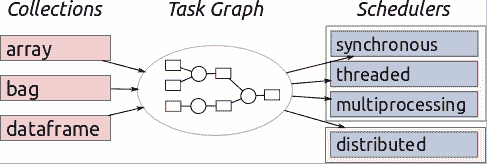

# 强化学习中的 Pandas：使用 Dask 进行端到端数据科学

> 原文：[`www.kdnuggets.com/2020/11/pandas-steroids-dask-python-data-science.html`](https://www.kdnuggets.com/2020/11/pandas-steroids-dask-python-data-science.html)

评论

**由 [Ravi Shankar](https://www.linkedin.com/in/ravi-shankar-83863441/)，数据科学家**

Dask - 拥有超级能力的 pandas

* * *

## 我们的三大推荐课程

 1\. [Google 网络安全证书](https://www.kdnuggets.com/google-cybersecurity) - 快速进入网络安全职业生涯。

 2\. [Google 数据分析专业证书](https://www.kdnuggets.com/google-data-analytics) - 提升你的数据分析技能

 3\. [Google IT 支持专业证书](https://www.kdnuggets.com/google-itsupport) - 支持组织的 IT 工作

* * *

正如俗话所说，数据科学家花费 90% 的时间在清理数据上，10% 的时间抱怨数据。他们的抱怨可能涉及数据大小、数据分布不准确、空值、数据随机性、数据捕捉中的系统性错误、训练集和测试集之间的差异等等。

一个常见的瓶颈主题是数据大小的庞大，数据无法适配内存或处理时间过长（以分钟为单位），导致内在模式分析难以进行。数据科学家本质上是好奇的，他们希望识别和解释那些通常在表面拖拽观察中隐藏的模式。他们需要戴上多顶帽子，通过反复的折磨（即多次迭代）让数据“坦白”。

在探索性数据分析中，他们戴上了多种帽子，从包含 6 列的纽约出租车费用数据集([`www.kaggle.com/c/new-york-city-taxi-fare-prediction`](https://www.kaggle.com/c/new-york-city-taxi-fare-prediction)) - ID、费用、旅行时间、乘客和位置，他们的问题可能包括：

> 1.  费用年复一年地变化情况如何？
> 1.  
> 1.  年复一年，旅行次数是否增加了？
> 1.  
> 1.  人们更喜欢单独旅行还是有同行？
> 1.  
> 1.  随着人们变得更加懒惰，小距离的骑行是否增加了？
> 1.  
> 1.  人们希望在一天中的什么时间和一周中的哪几天旅行？
> 1.  
> 1.  最近城市中是否出现了新的热点区域，除了常规的机场接送？
> 1.  
> 1.  人们是否在进行更多的城际旅行？
> 1.  
> 1.  交通量是否增加，导致相同距离的费用/时间增加？
> 1.  
> 1.  是否存在接送点的集群或高流量区域？
> 1.  
> 1.  数据中是否存在异常值，如 0 距离和超过 $100 的费用等？
> 1.  
> 1.  需求是否在节假日季节变化，机场接送是否增加？
> 1.  
> 1.  是否有天气因素（如雨雪）与出租车需求的相关性？

即使回答了这些问题，仍然可能会出现多个子线程，例如我们能否预测新年受 Covid 影响的情况、年度纽约马拉松如何影响出租车需求、某个特定路线是否更容易有多个乘客（聚会中心）与单个乘客（机场到郊区）？

为了满足这些好奇心，时间至关重要。如果让数据科学家等待 5 分钟以上来读取一个 csv 文件（5500 万行）或进行列添加和后续聚合，那是犯罪行为。此外，由于大多数数据科学家是自学成才的，他们已经习惯了 pandas 数据框 API，不愿意用不同的 API，如 numba、Spark 或 datatable，重新开始学习过程。我曾尝试在 DPLYR（R）、Pandas（Python）和 pyspark（Spark）之间来回切换，这有点令人失望/不高效，因为需要一个统一的管道和代码语法。然而，对于好奇的人，我在这里写了一个 pyspark 入门指南：[`medium.com/@ravishankar_22148/billions-of-rows-milliseconds-of-time-pyspark-starter-guide-c1f984023bf2`](https://medium.com/@ravishankar_22148/billions-of-rows-milliseconds-of-time-pyspark-starter-guide-c1f984023bf2)

在后续部分，我尝试提供一个 Dask 的实用指南，尽量减少与我们钟爱的 Pandas 的架构差异：

### **1. 数据读取和分析**

Dask 与 Pandas 的速度对比

Dask 如何能够将数据处理速度提高 ~90 倍，即在 pandas 中从 1 秒以下到 91 秒。

*来源：*[*https://dask.org/*](https://dask.org/)

Dask 之所以如此受欢迎，是因为它使 Python 中的分析具有可扩展性，并且不一定需要在 SQL、Scala 和 Python 之间来回切换。它的神奇之处在于这个工具需要最小的代码更改。它将计算分解为 pandas 数据框，从而并行操作以实现快速计算。

*来源：*[*https://docs.dask.org/en/latest/*](https://docs.dask.org/en/latest/)

### **2. 数据聚合**

完全没有改变 Pandas API 的情况下，它能够在毫秒级别执行聚合和排序操作。请注意，**compute()** 函数在延迟计算结束时，将大数据的结果带到 Pandas 数据框中。

### **3. 机器学习**

下面的代码片段提供了使用 XGBoost 在 Dask 中进行特征工程和 ML 模型构建的工作示例

特征工程和 Dask 的 ML 模型

### **结论：**

Dask 是一个强大的工具，提供并行计算、大数据处理以及创建端到端的数据科学管道。它有一个陡峭的学习曲线，因为它的 API 与 pandas 几乎相似，而且可以轻松处理超出内存限制的计算（~10 倍 RAM）。

由于这是一个动态博客，我将继续编写 Dask 系列的后续部分，我们将通过并行处理来瞄准 Kaggle 排行榜。如果你在设置 Dask 或执行任何 Dask 操作时遇到问题，或者只是想聊聊，请在评论中告诉我。祝学习愉快!!!

资源：

1.  [`ml.dask.org/`](https://ml.dask.org/)

1.  [`dask.org/`](https://dask.org/)

1.  [`medium.com/@ravishankar_22148/billions-of-rows-milliseconds-of-time-pyspark-starter-guide-c1f984023bf2`](https://medium.com/@ravishankar_22148/billions-of-rows-milliseconds-of-time-pyspark-starter-guide-c1f984023bf2)

1.  [`towardsdatascience.com/how-i-learned-to-love-parallelized-applies-with-python-pandas-dask-and-numba-f06b0b367138`](https://towardsdatascience.com/how-i-learned-to-love-parallelized-applies-with-python-pandas-dask-and-numba-f06b0b367138)

1.  [`www.kaggle.com/yuliagm/how-to-work-with-big-datasets-on-16g-ram-dask`](https://www.kaggle.com/yuliagm/how-to-work-with-big-datasets-on-16g-ram-dask)

1.  [`medium.com/better-programming/what-is-dask-and-how-can-it-help-you-as-a-data-scientist-72adec7cec57`](https://medium.com/better-programming/what-is-dask-and-how-can-it-help-you-as-a-data-scientist-72adec7cec57)

**简历：[Ravi Shankar](https://www.linkedin.com/in/ravi-shankar-83863441/)** 是亚马逊定价部门的数据科学家-II。

[原文](https://medium.com/analytics-vidhya/pandas-on-steroids-dask-end-to-end-data-science-with-python-code-1845d3722c8a)。转载已获许可。

**相关：**

+   在 Dask 中进行机器学习

+   在云中使用 Dask 进行数据科学

+   为什么以及如何在大数据中使用 Dask

### 更多相关话题

+   [成为伟大数据科学家所需的 5 项关键技能](https://www.kdnuggets.com/2021/12/5-key-skills-needed-become-great-data-scientist.html)

+   [每个初学者数据科学家应该掌握的 6 种预测模型](https://www.kdnuggets.com/2021/12/6-predictive-models-every-beginner-data-scientist-master.html)

+   [2021 年最佳 ETL 工具](https://www.kdnuggets.com/2021/12/mozart-best-etl-tools-2021.html)

+   [停止学习数据科学以寻找目标，并通过寻找目标……](https://www.kdnuggets.com/2021/12/stop-learning-data-science-find-purpose.html)

+   [每位数据科学家都应了解的三个 R 库（即使你使用 Python）](https://www.kdnuggets.com/2021/12/three-r-libraries-every-data-scientist-know-even-python.html)

+   [使用管道编写干净的 Python 代码](https://www.kdnuggets.com/2021/12/write-clean-python-code-pipes.html)
