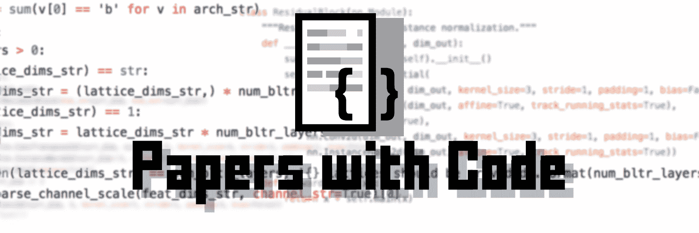
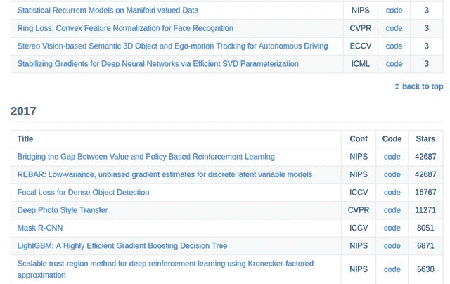

# 带代码的论文：机器学习的一个极好的 GitHub 资源

> 原文：[`www.kdnuggets.com/2018/12/papers-with-code-fantastic-github-resource-machine-learning.html`](https://www.kdnuggets.com/2018/12/papers-with-code-fantastic-github-resource-machine-learning.html)

 评论

寻找带代码的论文吗？

如果是这样，这个[GitHub 仓库](https://github.com/zziz/pwc)，准确地称为“带代码的论文”，由[Zaur Fataliyev](http://fataliyev.com/)创建，正是你所需要的。

> 带代码的论文。按星级排序。每周更新。

这可能很直接，但也相当准确。

基于首尔的机器学习工程师 Fataliyev，在贡献者的请求帮助下，整理了这一广泛的资源，并进一步描述了该仓库如下：

> 这项工作正在持续进展和更新。我们每天都在添加新的 PWC！在推特上关注我 [@fvzaur](https://twitter.com/fvzaur)
> 
> 使用[这个](https://github.com/zziz/pwc/issues/11)线程请求我们将你最喜欢的会议添加到我们的观察列表和 PWC 列表中。

除了按星级排序，论文还按年份排列，使得找到突出研究变得更加容易——当然，还有相应的代码。

如果这听起来对你感兴趣，务必查看一下这个仓库，并且向 Zaur 表示感谢，因为他为我们整理了这样一个有用的资源。

**相关**：

+   GitHub Python 数据科学亮点：AutoML、NLP、可视化、ML 工作流

+   前 10 大 Python 数据科学库

+   前 20 大 Python AI 和机器学习开源项目

* * *

## 我们的前三大课程推荐

 1\. [Google 网络安全证书](https://www.kdnuggets.com/google-cybersecurity) - 快速进入网络安全职业生涯。

 2\. [Google 数据分析专业证书](https://www.kdnuggets.com/google-data-analytics) - 提升你的数据分析水平

 3\. [Google IT 支持专业证书](https://www.kdnuggets.com/google-itsupport) - 支持你的组织 IT

* * *

### 了解更多相关信息

+   [成为优秀数据科学家所需的 5 项关键技能](https://www.kdnuggets.com/2021/12/5-key-skills-needed-become-great-data-scientist.html)

+   [每个初学者数据科学家应掌握的 6 种预测模型](https://www.kdnuggets.com/2021/12/6-predictive-models-every-beginner-data-scientist-master.html)

+   [2021 年最佳 ETL 工具](https://www.kdnuggets.com/2021/12/mozart-best-etl-tools-2021.html)

+   [使用管道编写干净的 Python 代码](https://www.kdnuggets.com/2021/12/write-clean-python-code-pipes.html)

+   [停止学习数据科学以寻找目标，并寻找目标以…](https://www.kdnuggets.com/2021/12/stop-learning-data-science-find-purpose.html)

+   [学习数据科学统计学的最佳资源](https://www.kdnuggets.com/2021/12/springboard-top-resources-learn-data-science-statistics.html)
