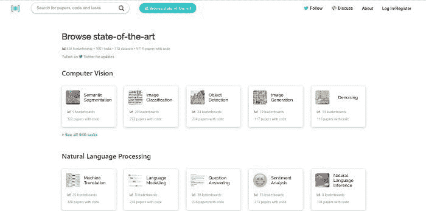

# 人工智能和机器学习领域的最新进展——代码论文亮点

> 原文：[`www.kdnuggets.com/2019/02/paperswithcode-ai-machine-learning-highlights.html`](https://www.kdnuggets.com/2019/02/paperswithcode-ai-machine-learning-highlights.html)

 评论

正如任何机器学习、人工智能或计算机科学爱好者所知，找到感兴趣主题的资源和论文可能是一项麻烦的工作。通常，你需要注册一个网站，有些甚至会收取订阅费用来阅读他人的研究成果。

这就是使* [Papers with code](https://paperswithcode.com/)*如此出色的原因；他们提供了大量免费的资源，涵盖了各种主题。他们的使命声明如下：

> *Papers With Code 的使命是创建一个免费的开放资源，提供机器学习论文、代码和评估表格。*
> 
> *我们相信，这最好是与社区共同完成并通过自动化实现的。*
> 
> *我们已经自动化了代码与论文的链接，现在正致力于自动化从论文中提取评估指标。*

在此基础上，他们有自己的[slack 频道](https://join.slack.com/t/paperswithcode/shared_invite/enQtNTI3NDE2NjQ0ODM0LTdmNzNjODkwOGY0MjU4YzgzNDZhNGM1YWIzYmZhNzk5MTFkYWU4YWNjN2JjZDhlNjJiYjFkYjYwNjkzYzdiZDk)，并允许用户下载所有帮助运行网站的数据。他们欢迎贡献，所以可以随时参与进来，继续壮大社区！

为了庆祝这一伟大资源，我们尝试总结了网站上我们最喜欢的 6 个主题（网站称之为“任务”）及其提供的一些论文：

### **语义分割**

语义分割的概念是识别和理解图像中的每一个像素。这是网站上内容最多的类别之一，共有 322 篇带代码的论文。其中最受欢迎的论文标题为*[带有 Atrous 可分离卷积的编码器-解码器用于语义图像分割](https://paperswithcode.com/paper/encoder-decoder-with-atrous-separable-co3)*。该论文旨在结合语义分割的两种方法的优势：空间金字塔池化模块和编码-解码结构。该论文附带了一个公开的 TensorFlow 模型实现。

其他顶级语义分割论文：

[MobileNetV2：倒置残差和线性瓶颈](https://paperswithcode.com/paper/mobilenetv2-inverted-residuals-and-line3)

[重新思考用于语义图像分割的 Atrous 卷积](https://paperswithcode.com/paper/rethinking-atrous-convolution-for-semant2)

[Mask R-CNN](https://paperswithcode.com/paper/mask-r-cnn)

[金字塔场景解析网络](https://paperswithcode.com/paper/pyramid-scene-parsing-network)

### **自然语言处理（NLP）**

自然语言处理是站点上最大的一类任务集合之一，涵盖了机器翻译、语言建模、情感分析、文本分类等多个子领域。在这些子领域中，问答系统是最受欢迎的类别之一，相关论文超过 200 篇。该领域排名最高的论文由 Jacob Devlin、Ming-Wei Chang、Kenton Lee 和 Kristina Toutanova 撰写，题为*[BERT：用于语言理解的深度双向变换器预训练](https://paperswithcode.com/paper/bert-pre-training-of-deep-bidirectional2)*。该论文介绍了一种新的语言表示模型，称为 BERT，代表**双向**编码器**表征**来自**变换器**。与近期的语言表示模型不同，BERT 旨在通过在所有层中共同考虑左右上下文来进行深度双向表示的预训练。

其他顶级 NLP 论文：

[探索语言建模的极限](https://paperswithcode.com/paper/exploring-the-limits-of-language-modelin2)

[基于交叉视角训练的半监督序列建模](https://paperswithcode.com/paper/semi-supervised-sequence-modeling-with-c3)

[活跃记忆能取代注意力机制吗？](https://paperswithcode.com/paper/can-active-memory-replace-attention)

[BERT：用于语言理解的深度双向变换器预训练](https://paperswithcode.com/paper/bert-pre-training-of-deep-bidirectional2)

### **迁移学习**

迁移学习是一种方法论，其中从一个任务上训练的模型的权重被提取并用于：

+   构建一个固定的特征提取器

+   作为权重初始化和/或微调

关于迁移学习，最受欢迎的论文是*[半监督知识迁移：从私有训练数据中学习](https://paperswithcode.com/paper/semi-supervised-knowledge-transfer-for-d2)*。这篇论文旨在解决一个影响使用私有数据的模型的问题，即模型可能会无意中和隐性地存储一些训练数据，因此对模型的后续仔细分析可能会揭示敏感信息。为了解决这个问题，论文展示了一种通用的提供敏感数据安全性的办法：教师集体的私有聚合（PATE）。这种方法以黑箱的方式结合了用不重叠的数据集训练的多个模型，例如来自不同用户子集的记录。该论文还包括一个指向 GitHub 仓库的链接，其中包含该项目的所有 TensorFlow 代码。

其他顶级迁移学习论文：

[大规模简单问答与记忆网络](https://paperswithcode.com/paper/large-scale-simple-question-answering-wi2)

[DeCAF：用于通用视觉识别的深度卷积激活特征](https://paperswithcode.com/paper/decaf-a-deep-convolutional-activation-f2)

[腾讯 ML-Images：一个用于视觉表示学习的大规模多标签图像数据库](https://paperswithcode.com/paper/tencent-ml-images-a-large-scale-multi-l2)

[卷积神经网络图像分类技巧集](https://paperswithcode.com/paper/bag-of-tricks-for-image-classification-w2)

### **多任务学习**

多任务学习旨在同时学习多个不同的任务，同时最大化一个或所有任务的性能。目前星标最多的论文是：*[DRAGNN：一个基于转换的动态连接神经网络框架](https://paperswithcode.com/paper/dragnn-a-transition-based-framework-for2)*。这项工作提出了一个紧凑的模块化框架，用于构建新型的递归神经网络架构。再次提醒，这篇论文还提供了一个完整的 TensorFlow 工作代码示例。

关于多任务学习的其他顶级论文：

[半监督序列建模与交叉视图训练](https://paperswithcode.com/paper/semi-supervised-sequence-modeling-with-c3)

[一个模型学习所有任务](https://paperswithcode.com/paper/one-model-to-learn-them-all)

[通过大规模多任务学习学习通用分布式句子表示](https://paperswithcode.com/paper/learning-general-purpose-distributed-sen3)

[用于从语义任务中学习嵌入的分层多任务方法](https://paperswithcode.com/paper/a-hierarchical-multi-task-approach-for-l2)

### **推荐系统**

推荐系统的目标是为用户生成推荐列表。该领域的一个热门论文是*【训练深度自编码器用于协同过滤](https://paperswithcode.com/paper/training-deep-autoencoders-for-collabora2)*，作者是 Oleksii Kuchaiev 和 Boris Ginsburg。这篇论文提出了一种新颖的模型用于推荐系统中的评分预测任务，该模型在时间切分的 Netflix 数据集上显著超越了以前的最先进模型。该模型基于 6 层的深度自编码器，并且是端到端训练的，没有任何逐层预训练。这是一个在 PyTorch 中进行的 NVIDIA 研究项目，所有使用的代码都可以公开使用。

关于推荐系统的其他顶级论文：

[fastFM：一个因式分解机库](https://paperswithcode.com/paper/fastfm-a-library-for-factorization-mach2)

[AutoInt：通过自注意力神经网络自动特征交互学习](https://paperswithcode.com/paper/autoint-automatic-feature-interaction-l2)

[基于产品的神经网络用于多字段类别数据的用户响应预测](https://paperswithcode.com/paper/product-based-neural-networks-for-user-r)

[DeepFM：一个端到端的广泛与深度学习框架用于 CTR 预测](https://paperswithcode.com/paper/deepfm-an-end-to-end-wide-deep-learni2)

当然，我们只是触及了*Papers with Code*提供的表面。我们希望你像我们一样喜欢这个网站！

**资源：**

+   [在线和基于网页的：分析、数据挖掘、数据科学、机器学习教育](https://www.kdnuggets.com/education/online.html)

+   [用于分析、数据科学、数据挖掘和机器学习的软件](https://www.kdnuggets.com/software/index.html)

**相关：**

+   [深度多任务学习——3 个经验教训](https://www.kdnuggets.com/2019/02/deep-multi-task-learning.html)

+   [人工智能如何帮助解决人类面临的一些重大挑战——以及我们可能失败的原因](https://www.kdnuggets.com/2019/02/ai-help-solve-humanity-challenges.html)

+   [人工智能和数据科学在 2018 年的进展及 2019 年的趋势](https://www.kdnuggets.com/2019/02/ai-data-science-advances-trends.html)

* * *

## 我们的三大课程推荐

 1\. [Google 网络安全证书](https://www.kdnuggets.com/google-cybersecurity) - 快速进入网络安全职业领域。

 2\. [Google 数据分析专业证书](https://www.kdnuggets.com/google-data-analytics) - 提升您的数据分析技能

 3\. [Google IT 支持专业证书](https://www.kdnuggets.com/google-itsupport) - 支持您所在组织的 IT 工作

* * *

### 相关主题更多信息

+   [最先进的深度学习技术在可解释预测和现时预测中的应用](https://www.kdnuggets.com/2021/12/sota-explainable-forecasting-and-nowcasting.html)

+   [PEFT 概述：最先进的参数高效微调](https://www.kdnuggets.com/overview-of-peft-stateoftheart-parameterefficient-finetuning)

+   [KDnuggets 新闻，4 月 27 日：论文与代码简介；…](https://www.kdnuggets.com/2022/n17.html)

+   [论文与代码简介](https://www.kdnuggets.com/2022/04/brief-introduction-papers-code.html)

+   [KDnuggets 新闻，11 月 2 日：数据科学的现状…](https://www.kdnuggets.com/2022/n43.html)

+   [数据科学职业的现状](https://www.kdnuggets.com/2022/10/current-state-data-science-careers.html)
