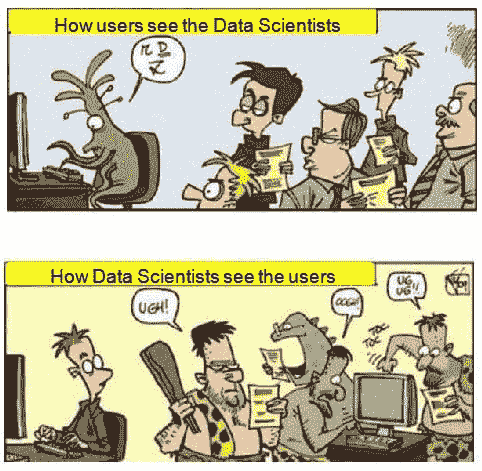

# 数据科学的悖论

> 原文：[`www.kdnuggets.com/2015/08/paradoxes-data-science.html`](https://www.kdnuggets.com/2015/08/paradoxes-data-science.html)

 评论

**由托马斯·鲍尔**，分析专业人士。

在当今的数据科学世界中存在许多悖论、讽刺和脱节：痛点、被忽视的事情、被掩盖的东西、被否认的东西，或者仅仅是口头上的承诺，而数据科学的强大势头仍在数字领域不断推进。例如，尽管 Hal Varian 广泛引用的观察是“未来 10 年最性感的工作将是统计学家”，但易于使用的点选式统计软件和分析工具的出现意味着实际上任何人都可以按下按钮得到答案。这是否像是把装满子弹的火箭筒交给一只大猩猩，让它出去玩得开心一样，这并不重要。未言明的现实是，统计分析已被贬低为一种次要的重要技能，与更紧迫的任务相比，这些任务需要真正管理数字信息流架构的技能。一个相关的假设是，任何具有计算机科学背景的人都具备必要的统计和分析技能，不管他们是否真正具备这些技能。

* * *

## 我们的前 3 名课程推荐

 1\. [Google 网络安全证书](https://www.kdnuggets.com/google-cybersecurity) - 快速进入网络安全职业轨道。

 2\. [Google 数据分析专业证书](https://www.kdnuggets.com/google-data-analytics) - 提升你的数据分析能力

 3\. [Google IT 支持专业证书](https://www.kdnuggets.com/google-itsupport) - 支持你的组织的 IT 需求

* * *

说时代具有颠覆性是一句陈词滥调，但正如麦克卢汉所指出的，文明正处于数字化、网络化变革的边缘，这一变革的重要性相当于古滕堡圣经的印刷。那一创新的影响花了几个世纪才在宗教和文化中逐渐显现，因为大规模生产的圣经传播到欧洲各地，减少了神职人员和天主教会的权威在与上帝关系中的调解作用，这在路德的理解中，印刷的圣经使每个人都成为了神学家，最终形成了新教改革。

在这个民主化的历史时刻，几乎没有人愿意给数字革命几百年的时间去展开。成千上万的声音在博客或 PLOS One 上涌现，每年出版数百万篇文章和书籍，共同传递着希望、炒作和虚伪的海啸。虚假药水供应商和大数据及数据科学的 PT Barnum 们与令人窒息的知识过剩一同涌现，且在混乱中没有明确的视线。以许多方式，**无知**已经成为我们时代的讽刺裁判——我们可以赞美愚蠢，但没有人愿意为此买单。

然而，穿越混乱的视线代理是可能的。其中一个代理是华尔街给予像谷歌、苹果、亚马逊和 FB 等实体的过高市场估值，与巨大的代理和媒体控股公司如 WPP、Publicis、Omnicom 和 Interpublic 形成对比——雅虎也可以被纳入这一组。无论现实与否，科技公司累积的市场总值大约是大型媒体公司估值的 20 倍（截至 2015 年 8 月 14 日星期五）。尽管这些差异看起来痛苦地明显，但背后的原因并不明确。

其中一个关键点是，科技实体是由技术精通的工程师和数学家创办和/或管理的，而那些最多只是半懂技术的控股公司则由传统的老派营销人员管理：那些凭借其卓越的沟通和人际交往能力上升到高层的高管们。

这强调了一个容易识别的界限，将技术精通、前瞻性的商业领域与不懂技术的传统主义者区分开来：传统主义者是那些被迎合的对象，是那些在面对即使是稍微具挑战性的演示时，眼神呆滞的技术文盲，要求信息被简化到可以立即理解和消化的水平。另一方面，这些人却完全能够流利地谈论数字时代，对这种不连续性视而不见，安慰自己任何有技术精通的下属都会因为“缺乏适配性”而被迫离开他们的组织。

这些传统主义者是巨大的惯性和趋同于“常识”做事方式和赚钱方式的源头：总是按照既定方式进行。他们围绕维护现状构建了商业模型：只需考虑从 Napster 开始到今天的音乐版权争夺战的证据。所有这些的讽刺和悖论在于，尽管许多人愿意将自己标榜为创新前卫者，但实际上却是老派或传统主义者。这就像行为经济学研究显示的 80%的人认为自己高于平均水平一样。如今每个人都是自封的前瞻性创新者，加入到最新“热点”中，以参与所有的兴奋、激动的热潮，使得区分优质内容和次要内容变得极其困难。

这对数据科学有重要影响，特别是在对预测分析、算法学习和人工智能的胃口、潜力和投资方面——这些高度技术化、最难理解的领域具有最显著的前景潜力。在数据科学家需求的所谓直观、创造性见解与能够使复杂想法“易于理解”的能力之间存在一种未被承认的分歧，这与推动不直观的黑箱算法答案的那些人形成对比。

不直观的技术精通者正在提供基础性的、算法驱动的创新，20 世纪科幻小说中的构想如无人驾驶汽车、虚拟现实、可穿戴技术、芯片上的研究实验室等正在变为现实。另一方面，媒体实体则保持犹豫和风险规避，远远落后于这些创新的潮流，以至于这个词几乎失去了意义。他们更倾向于“易于理解”的事物，这些事物已经广泛被认可，争议较少，例如在医疗保健领域，使用 CMS 批准的方法如医疗保险的 CDPS 进行慢性病费用分析和控制，而不是利用专注于快速高效、机器学习方法的动态诊断和治疗的新兴学术研究。毕竟，CDPS 方式是“经过验证”的，而另一种方法几乎没有真实依据，只是“凭空捏造”（这是数据科学分歧前线的直接引语）。

所有这些中的另一个巨大脱节是所谓的人才争夺战，即公司正在争夺技能资源短缺的神话。这个“短缺”人才的一个显著方面是许多数据科学职位描述的惊人不切实际，几乎是妄想。如果 HR 成本是公司损益表上的最大项目，在错误地尝试最小化这些成本时，公司寻找的候选人更像是史蒂夫·乔布斯——即使是初级职位——以便将计算机科学、IT 和实际分析等一系列技能浓缩到一个人身上，同时代表公司参加行业会议、推动创新、战略规划、团队领导、产品开发和客户管理。找到一个具备所有这些技能的资源并不容易，但有深口袋的公司愿意等待，像煮海一样等待完美的雇佣——那只传说中的紫色松鼠。

话虽如此，现实是人才洪流——花 2 秒钟在 Google Trends 上查看，几年来“数据科学家”关键词的指数增长便能提供有力证据。这意味着竞争并不是为了人才本身，而是为了优秀、富有创意、便宜的人才——愿意接受生存工资的员工。这里的重点是“便宜”，因为许多初创公司的薪资规模——即使对于高度技能的高级数据科学资源——不仅是生存水平，而且低得让人感觉对这个职业的蔑视。从 Y2K 以来，利用离岸资源的举措是这种制度化蔑视的另一个表现，伪装成成本节约。

这种变化使得对规范数据科学薪酬的预期被重新设置到了一个极低的基准：既然可以从次大陆以巨大的折扣获得“相同的东西”，为何还要为北美人才支付更高的薪水？这些是无情的、以 MBA 驱动的财务决策，像大多数削减成本的措施一样，影响了公司资产负债表的单变量维度。其他不易量化的指标，如交付工作的质量、开发的创新或获得的答案，可能在过程中受到阻碍，但由于不易量化，因此变得不重要。

理解这一点的一个方式是将其视为一种虚假的二分法，这种二分法源自制造业，将服务分为事实上的白领与蓝领技能集，以及相应的薪酬（性别也是这种划分中的一个隐含因素）。由于每个人都使用某种计算机，因此这种划分不仅由平台（例如，移动设备或平板电脑与固定工作站）定义，还由日常使用的软件定义。任何编写代码的人，按定义都是蓝领工人——程序员——在组织中具有二级或三级的商品化地位，他们只是按照白领思考者和战略家的创意、战术大纲来操作——并因此获得相应的报酬。

**相关：**

+   我爱数据和分析的 10 个原因

+   数据科学的历史信息图：5 条脉络

+   我被分析机器人取代了

+   采访：迈克尔·布罗迪谈行业经验、知识发现与未来趋势

### 相关主题

+   [5 个数据科学家应该了解的统计悖论](https://www.kdnuggets.com/2023/02/5-statistical-paradoxes-data-scientists-know.html)

+   [停止学习数据科学以寻找目的，寻找目的…](https://www.kdnuggets.com/2021/12/stop-learning-data-science-find-purpose.html)

+   [数据科学入门：你需要知道的 10 项基本技能…](https://www.kdnuggets.com/2020/10/data-science-minimum-10-essential-skills.html)

+   [KDnuggets™ 新闻 22:n06, 2 月 9 日：数据科学编程…](https://www.kdnuggets.com/2022/n06.html)

+   [数据科学定义幽默：奇特名言集…](https://www.kdnuggets.com/2022/02/data-science-definition-humor.html)

+   [5 个数据科学项目，学习 5 项关键的数据科学技能](https://www.kdnuggets.com/2022/03/5-data-science-projects-learn-5-critical-data-science-skills.html)
