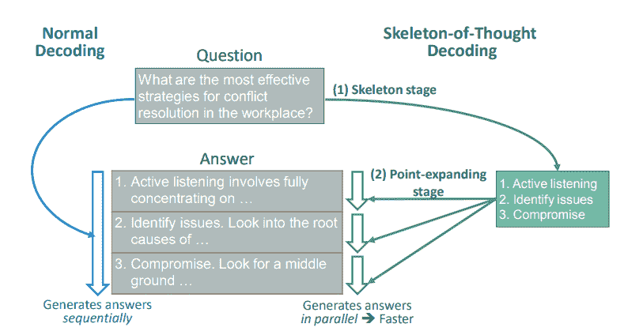
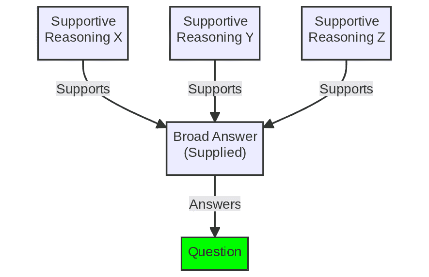

# 提示工程中的并行处理：Skeleton-of-Thought 技术

> 原文：[`www.kdnuggets.com/parallel-processing-in-prompt-engineering-the-skeleton-of-thought-technique`](https://www.kdnuggets.com/parallel-processing-in-prompt-engineering-the-skeleton-of-thought-technique)

图片由作者使用 Midjourney 创建

# 主要要点

+   **Skeleton-of-Thought**（SoT）是一种创新的提示工程技术，旨在最小化大型语言模型（LLMs）的生成延迟，提高其效率。

+   通过创建答案的骨架并平行地详细阐述每个要点，SoT 模拟人类思维，促进更可靠和准确的 AI 响应。

+   在项目中实施 SoT 可以显著加快问题解决和答案生成，特别是在需要 AI 结构化和高效输出的场景中。

* * *

## 我们的前三大课程推荐

 1\. [谷歌网络安全证书](https://www.kdnuggets.com/google-cybersecurity) - 快速进入网络安全职业生涯。

 2\. [谷歌数据分析专业证书](https://www.kdnuggets.com/google-data-analytics) - 提升你的数据分析技能。

 3\. [谷歌 IT 支持专业证书](https://www.kdnuggets.com/google-itsupport) - 支持你所在组织的 IT。

* * *

> SoT 是数据中心优化的初步尝试，揭示了推动 LLMs 更像人类思考的潜力，以提高答案质量。

# 简介

提示工程是利用生成 AI 潜力的起点。通过设计有效的提示和提示编写方法，我们可以引导 AI 理解用户的意图并有效地应对这些意图。在这个领域，一种值得注意的技术是 [Chain-of-Thought](https://www.kdnuggets.com/2023/07/power-chain-thought-prompting-large-language-models.html)（CoT）方法，它指示生成 AI 模型在处理任务或回应查询时逐步阐明其逻辑。在 CoT 的基础上，出现了一种新的有前景的技术 [Skeleton-of-Thought](https://arxiv.org/abs/2307.15337)（SoT），旨在改进 AI 处理和输出信息的方式，从而促进更可靠和准确的响应。

# 理解 Skeleton-of-Thought

思维骨架的起源来自于减少大型语言模型（LLMs）固有生成延迟的努力。与顺序解码方法不同，SoT 通过首先生成答案的骨架，然后平行填充细节来模拟人类思维，从而显著加快推理过程。与 CoT（链式思维）相比，SoT 不仅鼓励结构化的响应，还有效组织生成过程，以提高生成文本系统的性能。

**图 1**：思维骨架过程（来源：[思维骨架：大型语言模型可以进行并行解码](https://arxiv.org/abs/2307.15337)）

# 实施思维骨架

如上所述，实施 SoT（思维骨架）涉及引导 LLM（大型语言模型）创建问题解决或答案生成过程的骨架，然后对每一点进行平行详细阐述。这种方法在需要 AI 高效且结构化输出的场景中尤其有用。例如，在处理大规模数据集或回答复杂查询时，SoT 可以显著加快响应时间，提供一个简化的工作流程。通过将 SoT 融入现有的提示工程策略，提示工程师可以更有效、可靠和快速地利用生成文本的潜力。

也许展示 SoT 的最佳方式是通过示例提示。

## 示例 1

+   **问题**：描述光合作用的过程。

+   **骨架**：光合作用发生在植物中，涉及将光能转化为化学能，生成葡萄糖和氧气。

+   **要点扩展**：详细阐述光的吸收、叶绿素的作用、卡尔文循环和氧气释放。

## 示例 2

+   **问题**：解释大萧条的原因。

+   **骨架**：大萧条是由于股市崩盘、银行倒闭和消费者支出减少引起的。

+   **要点扩展**：深入探讨“黑色星期二”、1933 年的银行危机以及减少购买力的影响。

这些示例展示了 SoT 提示如何促进结构化的、逐步的回答复杂问题的方法。它还展示了工作流程：提出问题或定义目标，给 LLM 一个广泛或全面的答案作为阐述支持性推理的基础，然后明确地呈现这些支持性推理问题并特意提示其进行操作。

**图 2**：思维骨架简化过程（作者图片）

虽然 SoT 提供了一种结构化的问题解决方法，但它可能并不适用于所有场景。识别合适的应用案例和理解其实现是重要的。此外，从顺序处理到并行处理的过渡可能需要系统设计的调整或额外的资源。然而，克服这些障碍可以揭示 SoT 在提升生成文本任务的效率和可靠性方面的潜力。

# 结论

SoT 技术在 CoT 方法的基础上，提供了一种新的提示工程方法。它不仅加速了生成过程，还促进了结构化和可靠的输出。通过在项目中探索和整合 SoT，实践者可以显著提升生成文本的性能和可用性，推动更高效和更具洞察力的解决方案。

[**马修·梅奥**](https://www.linkedin.com/in/mattmayo13/) ([**@mattmayo13**](https://twitter.com/mattmayo13)) 拥有计算机科学硕士学位和数据挖掘研究生文凭。作为 KDnuggets 的总编辑，马修的目标是让复杂的数据科学概念变得易于理解。他的专业兴趣包括自然语言处理、机器学习算法和探索新兴的人工智能。他致力于在数据科学社区中普及知识。马修从 6 岁起便开始编程。

### 了解更多信息

+   [Python 中的大文件并行处理](https://www.kdnuggets.com/2022/07/parallel-processing-large-file-python.html)

+   [KDnuggets 新闻，7 月 20 日：机器学习算法解释…](https://www.kdnuggets.com/2022/n29.html)

+   [自动化思维链：人工智能如何自我提示进行推理](https://www.kdnuggets.com/2023/07/automating-chain-of-thought-ai-prompt-itself-reason.html)

+   [提示工程的艺术：解码 ChatGPT](https://www.kdnuggets.com/2023/06/art-prompt-engineering-decoding-chatgpt.html)

+   [一些提升我们 LLM 模型的强大提示工程技巧](https://www.kdnuggets.com/some-kick-ass-prompt-engineering-techniques-to-boost-our-llm-models)

+   [为什么提示工程是个潮流](https://www.kdnuggets.com/why-prompt-engineering-is-a-fad)
